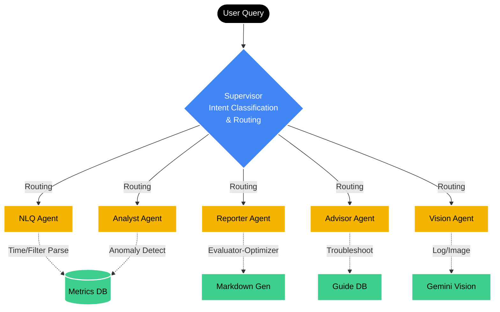

# OpenManager AI v8

> **AI-Native Server Monitoring Platform**
> 자연어로 대화하며 서버를 모니터링하는 차세대 운영 플랫폼

       

---

<div align="center">
  
  <br/>
  <i>Real-time Server Monitoring Dashboard</i>
</div>


## Overview

OpenManager AI는 **AI 어시스턴트**가 내장된 서버 모니터링 플랫폼입니다.

기존 대시보드에서 그래프를 읽고 해석하는 대신, **"서버 상태 어때?"** 라고 물어보면 AI가 분석하고 답변합니다.

### Key Features

| Feature | Description |
|---------|-------------|
| **AI Chat** | 자연어로 서버 상태 질의, 장애 원인 분석 |
| **Smart Dashboard** | 실시간 서버 메트릭 시각화 |
| **Auto Report** | 장애 발생 시 자동 보고서 생성 |

### Technical Highlights

이 프로젝트는 단순한 모니터링 대시보드를 넘어, **Multi-Agent Orchestration**과 **Real-time Data Streaming**을 결합한 기술적 챌린지를 해결했습니다.

- **🤖 Multi-Agent Orchestrator**: 사용자 의도를 파악(Intent Classification)하고, NLQ(Natural Language Query)를 SQL/PromQL로 변환하거나 진단 에이전트를 호출하는 지능형 라우팅 시스템 구현.
- **⚡ Hybrid Compute Architecture**: UI 렌더링은 **Vercel Edge Network**에서 처리하고, 무거운 AI 연산과 데이터 분석은 **Google Cloud Run**의 컨테이너 환경에서 처리하여 Latency와 비용 최적화.
- **🔄 Zero-Latency Feedback**: AI 응답 생성 중에도 Tool 실행 상태(Server Check, DB Query 등)를 실시간 스트리밍으로 UI에 노출하여 UX 대기 시간 경험을 최소화.

## AI Assistant

7개의 실행 에이전트가 협업하여 복잡한 질문도 처리합니다. **Vercel AI SDK v6**의 네이티브 멀티-에이전트 패턴으로 구현되었습니다.
집계 기준: 실행 에이전트 7개(NLQ/Analyst/Reporter/Advisor/Vision/Evaluator/Optimizer) + Orchestrator 1개(코디네이터).

```
💬 "서버 상태 어때?"
   → Orchestrator가 질문 분석 후 적절한 에이전트 선택

📊 "CPU 사용량 높은 서버 찾아줘"
   → NLQ Agent가 메트릭 조회 후 결과 반환

🔍 "왜 서버가 느려졌어?"
   → Analyst Agent가 이상 탐지 및 원인 분석

📋 "장애 보고서 만들어줘"
   → Reporter Agent가 마크다운 보고서 생성
```

### Agent Architecture (AI SDK v6)



📡 **Resumable Stream v2**: 새로고침해도 스트림 유지 (Redis 기반)

---

## Server Monitoring

### Dashboard

실시간 서버 상태를 한눈에 파악할 수 있는 대시보드를 제공합니다.

- **Server Cards**: 각 서버의 CPU, Memory, Disk 사용량 시각화
- **Health Status**: Normal / Warning / Critical 상태 표시
- **Real-time Updates**: WebSocket 기반 실시간 메트릭 갱신
- **Interactive Charts**: 시간대별 트렌드 그래프

### Metrics

| Metric | Description |
|--------|-------------|
| CPU Usage | 프로세서 사용률 (%) |
| Memory | 메모리 사용량 (GB / %) |
| Disk | 디스크 사용량 및 I/O |
| Network | 네트워크 트래픽 (In/Out) |
| Response Time | 서버 응답 시간 (ms) |

---

## Architecture



### 🔭 Observability Context: Sentry vs OpenTelemetry (OTel)
프로젝트 내에서 사용되는 두 가지 모니터링 도구는 **완전히 다른 목적**을 가집니다. 이를 혼동하지 않는 것이 중요합니다.

1. **Sentry (개발 및 시스템 운영용)**
   - **목적**: OpenManager AI **플랫폼 자체의 안정성**을 위한 도구입니다.
   - **역할**: 코드 레벨의 에러, 프론트엔드/백엔드 크래시, 그리고 Vercel 및 Cloud Run에서 발생하는 예기치 못한 시스템 예외를 추적합니다.

2. **OpenTelemetry (프로덕트 핵심 비즈니스 도메인)**
   - **목적**: OpenManager AI의 **본질적인 기능(서버 모니터링)을 제공하기 위한 데이터 파이프라인**입니다.
   - **역할**: 사용자가 모니터링하고자 하는 대상 서버들(Target Servers)로부터 실시간 메트릭(CPU, Memory, Disk 등)을 수집(Ingestion)하여 AI Engine이 이를 분석할 수 있도록 제공합니다. 즉, 개발용이 아닌 **실제 고객에게 제공되는 서비스 로직의 일부**입니다.

### Deployment

| Service | Platform | Region |
|---------|----------|--------|
| Frontend | Vercel | Global Edge |
| AI Engine | Google Cloud Run | asia-northeast1 |
| Database | Supabase | ap-northeast-1 |
| Cache | Upstash Redis | ap-northeast-1 |

### Runtime Tuning

Job Queue SSE 폴링은 Redis 명령어 예산 보호를 위해 기본값을 아래로 사용합니다.

- `AI_JOB_STREAM_POLL_INTERVAL_MS=200`
- `AI_JOB_STREAM_QUEUED_POLL_INTERVAL_MS=1000`

---

## Tech Stack

| Layer | Technology |
|-------|------------|
| **Runtime** | Node.js 24 |
| **Frontend** | Next.js 16, React 19, TypeScript |
| **UI** | Tailwind CSS, Radix UI, Lucide Icons |
| **State** | Zustand, TanStack Query |
| **AI** | Vercel AI SDK v6 (Native Multi-Agent, UIMessageStream), Gemini Flash |
| **Database** | Supabase (PostgreSQL + pgvector) |
| **Cache** | Upstash Redis |

---

## Demo

**Live**: [openmanager-ai.vercel.app](https://openmanager-ai.vercel.app)

### Sample Queries

```
"현재 서버 상태 요약해줘"
"CPU 80% 넘는 서버 있어?"
"최근 1시간 동안 이상 징후 있었어?"
"web-server-01 성능 분석해줘"
"장애 보고서 만들어줘"
```

---

## Engineering Philosophy

**"From Dashboard to Dialogue"**
기존의 Ops 도구들이 "데이터를 보여주는 것"에 집중했다면, OpenManager AI는 "데이터를 이해하고 설명하는 것"에 초점을 맞춥니다.

1. **Context-Aware**: 단순 메트릭 수치가 아닌, 서버의 과거 맥락과 연관성을 함께 분석합니다.
2. **Action-Oriented**: 문제 확인에서 그치지 않고, 구체적인 해결책(Shell Command, Config 수정안)을 제안합니다.
3. **Minimal Friction**: 복잡한 쿼리 언어(PromQL, SQL) 없이 자연어만으로 인프라를 제어합니다.

---

## Development Story

> **"Zero to Production with Vibe Coding"**

이 프로젝트는 **Claude Code**를 메인 개발 도구로 사용하여 **처음부터 끝까지** 구축한 Full-Stack AI Platform입니다.

### What We Built

| Layer | Implementation |
|-------|----------------|
| **Frontend** | Next.js 16 + React 19 Dashboard |
| **Backend** | Google Cloud Run AI Engine |
| **Database** | Supabase PostgreSQL + pgvector |
| **Cache** | Upstash Redis |
| **AI System** | 7 실행 에이전트 + Orchestrator 코디네이터 |

### Development Approach

- **Vibe Coding**: Claude Code를 활용한 대화형 개발
- **Multi-LLM Review**: Codex + Gemini 2-AI 코드 리뷰 로테이션
- **DevTools Integration**: 개발 생산성 향상을 위해 8개의 MCP 서버(Context7, Stitch, Supabase 등)를 Claude Code 개발 환경에 연동하여 활용
- **Hybrid Architecture**: Vercel Edge + Cloud Run Heavy Lifting

**결과**: 약 **155,000 Lines of Code** (수동 카운트 + 빈 줄 제거 순수 측정 기준)
- Frontend (`src/`): ~108,000 LOC
- Backend (`cloud-run/`): ~34,000 LOC
- Tests & Scripts: ~13,000 LOC

---

## License

This project is licensed under the **GNU General Public License v3.0** - see the [LICENSE](LICENSE) file for details.

---

<div align="center">
  <sub>Built with Vibe Coding</sub>
  <br/>
  <sub>v8.7.0</sub>
</div>
