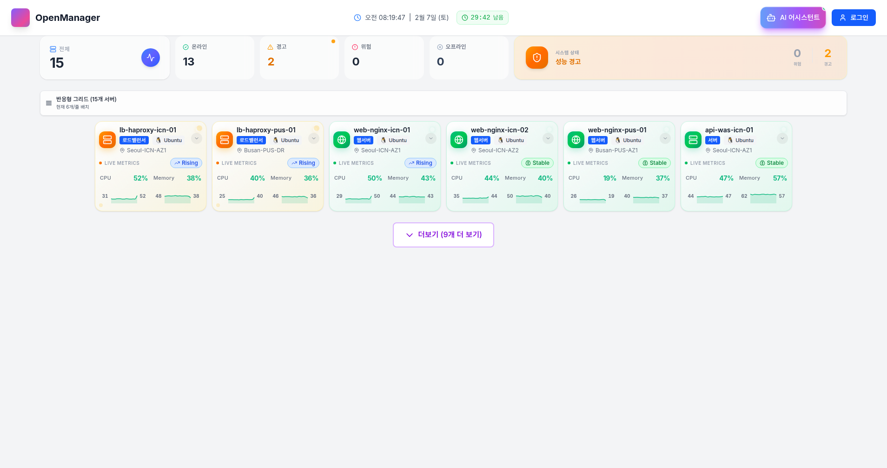
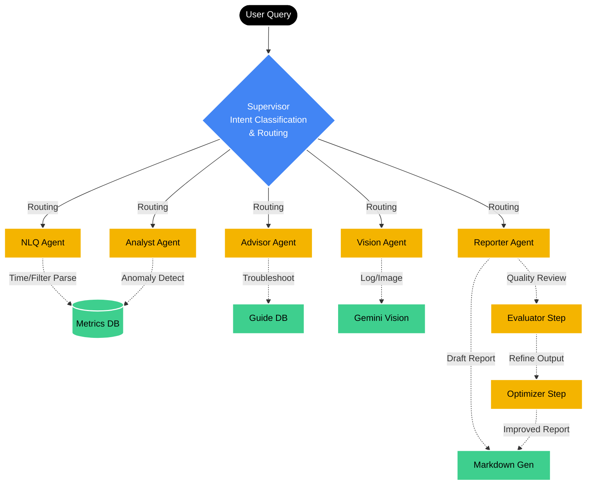
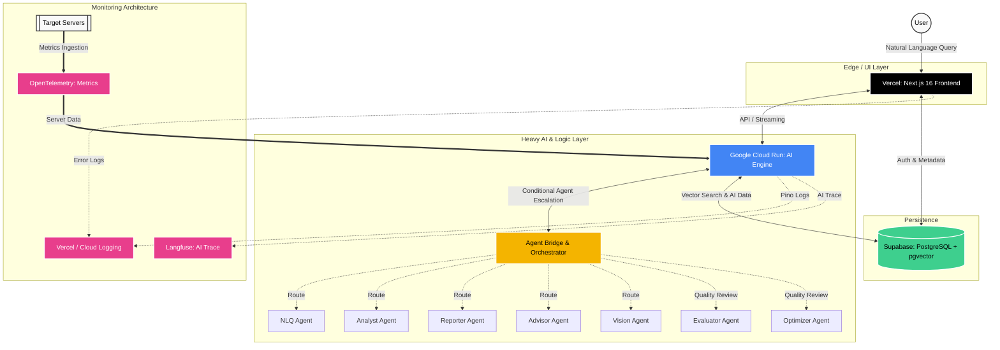

<!-- markdownlint-disable MD033 -->

# OpenManager AI v8

> **AI-Native Server Monitoring Platform**
> 자연어로 대화하며 서버를 모니터링하는 차세대 운영 플랫폼

       

---

<div align="center">
  
  <br/>
  <i>Real-time Server Monitoring Dashboard</i>
</div>

> **Latest QA Snapshot (June 5, 2026 — v8.12.94)**
> Targeted release-facing QA: QA-20260605-0660 | 상태 SSOT: `reports/qa/QA_STATUS.md`
> Production: [openmanager-ai.vercel.app](https://openmanager-ai.vercel.app)

## Overview

OpenManager AI는 운영자가 **그래프를 읽는 시간**을 줄이고, 서버 상태를 **질문 -> 분석 -> 조치안** 흐름으로 바꾸기 위해 만든 AI 기반 서버 모니터링 플랫폼입니다.

기존 대시보드처럼 CPU, 메모리, 디스크 차트를 직접 해석하는 대신, 사용자는 **"서버 상태 어때?"**, **"왜 느려졌어?"**, **"지금 무엇을 먼저 조치해야 해?"** 같은 질문을 던지고, 시스템은 현재 메트릭과 맥락을 바탕으로 답변합니다.

포트폴리오 관점에서 이 프로젝트는 단순 UI 데모가 아니라, **Next.js + Cloud Run + 서버 모니터링 도메인 특화 AI runtime + 에이전트 협업 개발**을 실제 배포·CI/CD 흐름으로 묶은 결과물입니다.

### Positioning

OpenManager AI의 범용 분류는 **운영 의사결정 AI 어시스턴트**입니다. 영문 공개 문맥에서는 **Operational Decision Support AI Assistant**가 가장 안전합니다. 서버 모니터링은 이 구조가 적용된 도메인이므로, 필요할 때만 **Server Monitoring / Observability AI Assistant**로 좁혀 설명합니다.

구현 관점에서는 **tool-augmented LLM application with a deterministic decision layer**입니다. 이 프로젝트는 완전 자율 AIOps/SRE 자동화가 아닙니다. 실제 서버 변경 권한, 승인 워크플로, 롤백, 감사 체계가 없는 상태에서 자동 조치를 흉내 내는 대신, deterministic fact engine이 운영 수치와 판정을 계산하고 LLM agent가 설명, 보고서, 조치안 초안을 작성하며 최종 실행은 운영자가 판단하는 구조로 설계했습니다.

### Key Features

| Feature | Description |
|---------|-------------|
| **AI Chat** | 자연어로 서버 상태 질의, 장애 원인 분석 |
| **Smart Dashboard** | 실시간 서버 메트릭 시각화 |
| **Auto Report** | 장애 발생 시 자동 보고서 생성 |

### Technical Highlights

이 프로젝트의 핵심은 "AI를 붙인 대시보드"가 아니라, **운영 데이터를 자연어 인터페이스와 실행 가능한 결과로 연결하는 흐름**을 구현한 점입니다.

- **🤖 Deterministic-first Supervisor**: 사용자 의도를 파악하고, 단순 메트릭 조회·ranking·server snapshot은 결정론적/단일 경로에 남기며, RCA·report·advisor·vision처럼 필요한 경우에만 전문 에이전트로 escalation.
- **🛡️ Runtime Guardrails**: 결정론적 라우팅, 출력 가드, provider fallback, quota-aware routing으로 LLM 응답의 변동성과 무료 티어 한도를 제어합니다.
- **⚡ Hybrid Compute Architecture**: UI 렌더링은 **Vercel Edge Network**에서 처리하고, 무거운 AI 연산과 데이터 분석은 **Google Cloud Run**의 컨테이너 환경에서 처리하여 Latency와 비용 최적화.
- **🔄 Zero-Latency Feedback**: AI 응답 생성 중에도 Tool 실행 상태(Server Check, DB Query 등)를 실시간 스트리밍으로 UI에 노출하여 UX 대기 시간 경험을 최소화.

## AI Assistant

기본 경로는 결정론적 데이터/도구 결과와 single-agent 응답을 우선 사용하고, 복잡한 요청은 5개 라우팅 에이전트로 escalation합니다. **Vercel AI SDK v6**의 stream/tool calling 계층 위에 구현되어 있습니다.
집계 기준: 라우팅 에이전트 5개(NLQ/Analyst/Reporter/Advisor/Vision) + Evaluator/Optimizer는 Reporter 파이프라인 내부 품질 도구 + Orchestrator 1개(코디네이터).

### Runtime Guardrails

AI 어시스턴트는 모델 응답만 그대로 노출하지 않고, 런타임 레이어에서 라우팅·출력 형식·provider 상태를 제어합니다.

| 역할 | 목적 | 관련 소스 코드 |
| :--- | :--- | :--- |
| **Context** | 도메인 지침과 툴 스키마 바인딩 | [assistant-runtime-host.ts](cloud-run/ai-engine/src/services/ai-sdk/assistant-runtime-host.ts) |
| **Output guard** | 스트림 출력과 비정상 도구 호출 필터링 | [supervisor-stream-text-guard.ts](cloud-run/ai-engine/src/services/ai-sdk/supervisor-stream-text-guard.ts) |
| **Fallback** | provider fallback과 quota-aware routing | [model-provider.ts](cloud-run/ai-engine/src/services/ai-sdk/model-provider.ts) |

```
💬 "서버 상태 어때?"
   → Orchestrator가 질문 분석 후 적절한 에이전트 선택

📊 "CPU 사용량 높은 서버 찾아줘"
   → NLQ Agent가 메트릭 조회 후 결과 반환

🔍 "왜 서버가 느려졌어?"
   → Analyst Agent가 이상 탐지 및 원인 분석

📋 "장애 보고서 만들어줘"
   → Reporter Agent가 마크다운 보고서 생성
```

### Agent Architecture (AI SDK v6)


```mermaid
graph TD
    %% Theme
    classDef default fill:#f9f9f9,stroke:#333,stroke-width:1px,color:#000
    classDef input fill:#000,stroke:#fff,stroke-width:2px,color:#fff
    classDef supervisor fill:#4285F4,stroke:#fff,stroke-width:2px,color:#fff
    classDef agent fill:#F4B400,stroke:#fff,stroke-width:2px,color:#000
    classDef tools fill:#3ECF8E,stroke:#fff,stroke-width:2px,color:#000
    
    Q([User Query]):::input --> S
    
    S{Supervisor<br/>Intent Classification<br/>& Routing}:::supervisor
    
    S -->|Routing| A[NLQ Agent]:::agent
    S -->|Routing| B[Analyst Agent]:::agent
    S -->|Routing| C[Reporter Agent]:::agent
    S -->|Routing| D[Advisor Agent]:::agent
    S -->|Routing| E[Vision Agent]:::agent

    A -.->|Time/Filter Parse| DB[(Metrics DB)]:::tools
    B -.->|Anomaly Detect| DB
    C -.->|Draft Report| MD[Markdown Gen]:::tools
    D -.->|Troubleshoot| Docs[Guide DB]:::tools
    E -.->|Log/Image| Model[Gemini Vision]:::tools
    C -.->|Quality Review| F[Evaluator Step]:::agent
    F -.->|Refine Output| G[Optimizer Step]:::agent
    G -.->|Improved Report| MD
```

> Source of truth (2026-04-15): `cloud-run/ai-engine/src/services/ai-sdk/agents/config/agent-configs.ts` (5개 라우팅 AgentConfig + Evaluator/Optimizer pipeline config) + `cloud-run/ai-engine/src/services/ai-sdk/model-provider.ts` + `cloud-run/ai-engine/src/services/ai-sdk/agents/orchestrator-routing.ts`.

📡 **Resumable Stream v2**: 새로고침해도 스트림 유지 (Redis 기반)

---

## Server Monitoring

### Dashboard

실시간 서버 상태를 한눈에 파악할 수 있는 대시보드를 제공합니다.

- **Server Cards**: 각 서버의 CPU, Memory, Disk 사용량 시각화
- **Health Status**: Normal / Warning / Critical 상태 표시
- **Real-time Updates**: WebSocket 기반 실시간 메트릭 갱신
- **Interactive Charts**: 시간대별 트렌드 그래프

### Metrics

| Metric | Description |
|--------|-------------|
| CPU Usage | 프로세서 사용률 (%) |
| Memory | 메모리 사용량 (GB / %) |
| Disk | 디스크 사용량 및 I/O |
| Network | 네트워크 트래픽 (In/Out) |
| Response Time | 서버 응답 시간 (ms) |

---

## Architecture


```mermaid
graph TD
    %% 스타일 정의
    classDef client fill:#f9f9f9,stroke:#333,stroke-width:2px,color:#000
    classDef frontend fill:#000,stroke:#fff,stroke-width:2px,color:#fff
    classDef backend fill:#4285F4,stroke:#fff,stroke-width:2px,color:#fff
    classDef database fill:#3ECF8E,stroke:#fff,stroke-width:2px,color:#000
    classDef agents fill:#F4B400,stroke:#fff,stroke-width:2px,color:#000
    classDef monitoring fill:#e83e8c,stroke:#fff,stroke-width:2px,color:#fff

    User((User)):::client -->|Natural Language Query| Vercel

    subgraph Frontend [Edge / UI Layer]
        Vercel[Vercel: Next.js 16 Frontend]:::frontend
    end

    subgraph Backend [Heavy AI & Logic Layer]
        CR[Google Cloud Run: AI Engine]:::backend
        AB[Agent Bridge & Orchestrator]:::agents
        
        Vercel <-->|"API / Streaming"| CR
        CR <-->|Conditional Agent Escalation| AB

        AB -.->|Route| AgentNLQ["NLQ Agent"]
        AB -.->|Route| AgentAnalyst["Analyst Agent"]
        AB -.->|Route| AgentReporter["Reporter Agent"]
        AB -.->|Route| AgentAdvisor["Advisor Agent"]
        AB -.->|Route| AgentVision["Vision Agent"]
        AB -.->|Quality Review| AgentEvaluator["Evaluator Agent"]
        AB -.->|Quality Review| AgentOptimizer["Optimizer Agent"]
    end

    subgraph Data Layer [Persistence]
        Supabase[("Supabase: PostgreSQL + pgvector")]:::database
        Vercel <-->|Auth & Metadata| Supabase
        CR <-->|Vector Search & AI Data| Supabase
    end

    subgraph Observability [Monitoring Architecture]
        Langfuse["Langfuse: AI Trace"]:::monitoring
        Logs["Vercel / Cloud Logging"]:::monitoring
        OTel["OpenTelemetry: Metrics"]:::monitoring
        TargetServers[["Target Servers"]]:::client

        Vercel -.->|Error Logs| Logs
        CR -.->|Pino Logs| Logs
        CR -.->|AI Trace| Langfuse

        %% OTel은 프로덕트의 핵심 수집기
        TargetServers ==>|Metrics Ingestion| OTel
        OTel ==>|Server Data| CR
    end
```

> Source of truth (2026-03-03): `src/app/api/**/route.ts` (API routes 28), `cloud-run/ai-engine/src/server.ts` `app.route('/api/...')` (Cloud Run API mounts 9), `cloud-run/ai-engine/src/routes/*.ts` (route modules 10), `cloud-run/ai-engine/src/services/ai-sdk/agents/config/agent-configs.ts` (5 routing LLM agents + 2 internal deterministic pipeline configs).

### 🔭 Observability Context: Platform Logs vs OpenTelemetry (OTel)
프로젝트 내 관측 경로는 **플랫폼 자체의 에러 확인**과 **제품 도메인 데이터 파이프라인**으로 분리됩니다. 이를 혼동하지 않는 것이 중요합니다.

1. **Platform Logs / Langfuse (개발 및 시스템 운영용)**
   - **목적**: OpenManager AI **플랫폼 자체의 안정성**을 위한 도구입니다.
   - **역할**: Vercel Function Logs, Cloud Logging, Pino 구조화 로그, Langfuse AI trace로 코드 레벨 에러와 AI 실행 흐름을 확인합니다.
   - **Note**: Sentry SDK, tunnel route, source map upload 설정은 2026-05-07 cleanup에서 제거되었습니다.

2. **OpenTelemetry (프로덕트 핵심 비즈니스 도메인)**
   - **목적**: OpenManager AI의 **본질적인 기능(서버 모니터링)을 제공하기 위한 데이터 파이프라인**입니다.
   - **역할**: 사용자가 모니터링하고자 하는 대상 서버들(Target Servers)로부터 실시간 메트릭(CPU, Memory, Disk 등)을 수집(Ingestion)하여 AI Engine이 이를 분석할 수 있도록 제공합니다. 즉, 개발용이 아닌 **실제 고객에게 제공되는 서비스 로직의 일부**입니다.

### Deployment

| Service | Platform | Region |
|---------|----------|--------|
| Frontend | Vercel | Global Edge |
| AI Engine | Google Cloud Run | asia-northeast1 |
| Async Queue | Google Cloud Tasks | asia-northeast1 |
| Database | Supabase | ap-northeast-1 |
| Cache | Upstash Redis | ap-northeast-1 |

### Runtime Tuning

복합 질의 Job Queue는 Cloud Tasks가 Cloud Run worker 호출을 dispatch하고, Redis가 job 상태/진행률/결과를 저장합니다. Job Queue SSE 폴링은 Redis 명령어 예산 보호를 위해 기본값을 아래로 사용합니다.

- `AI_JOB_STREAM_POLL_INTERVAL_MS=1000`
- `AI_JOB_STREAM_QUEUED_POLL_INTERVAL_MS=2000`

---

## Tech Stack

| Layer | Technology |
|-------|------------|
| **Runtime** | Node.js 24 |
| **Frontend** | Next.js 16, React 19, TypeScript |
| **UI** | Tailwind CSS, Radix UI, Lucide Icons |
| **State** | Zustand, TanStack Query |
| **AI** | Vercel AI SDK v6 (UIMessageStream, tool calling, conditional multi-agent orchestration), Gemini Flash |
| **Database** | Supabase (PostgreSQL + pgvector) |
| **Cache** | Upstash Redis |
| **Async Jobs** | Google Cloud Tasks + Redis-backed Job State |

---

## Demo

**Live**: [openmanager-ai.vercel.app](https://openmanager-ai.vercel.app)

## Validation Evidence

As of **June 5, 2026 (v8.12.94)**, this project is backed by tracked QA runs, not screenshots alone.

- **QA SSOT**: [reports/qa/QA_STATUS.md](reports/qa/QA_STATUS.md)
- **Latest release-facing QA**: [QA-20260605-0660](reports/qa/runs/2026/qa-run-QA-20260605-0660.json) — v8.12.94 targeted production QA, verifies Artifact BFF LLM classifier activation, deterministic fallback behavior, and Vercel/Cloud Run production routing
- **CI pipeline**: GitLab CI validate(frontend+ai-engine) on self-hosted WSL2 runner, frontend deploy on shared runner via `vercel build --prod` + `vercel deploy --prebuilt --prod`

Portfolio evidence includes:

- real Vercel production Playwright browser checks
- tracked QA SSOT in-repo with cumulative run/check history
- GitLab CI pipeline passing on every merge to main

## Known Limitations

This project documents known non-blocking constraints explicitly instead of hiding them behind idealized screenshots.

- **Cloud Run cold start on AI paths**: the first AI request can be noticeably slower when the free-tier-oriented Cloud Run revision is cold. In the worst case, preset-question fallback can also feel delayed until the container is warm.
- **Production timing headers**: Vercel production does not expose `Server-Timing` consistently across all streaming and proxy paths. Operational latency evidence therefore uses `X-AI-Latency-Ms` and `X-AI-Processing-Ms` as the production SSOT.
- **Intentional portfolio scope cuts**: the repo does not currently optimize for secondary surfaces such as AI chat detail expand, analyst per-server drilldown, or automatic weekly false-positive/false-negative reporting.
- **Quality gate policy**: release confidence is based on targeted type/lint/test checks plus recorded production QA evidence, not on claiming an arbitrary unit-test count or a historical `tsc --noEmit zero error` tracker target.
- **AI evaluation automation**: 런타임 가드레일은 동작하지만, 라우팅 품질을 자동 채점하는 LLM-as-judge/evals 파이프라인은 아직 계획 단계입니다. 현재는 Langfuse trace와 recorded QA로 회귀를 판단합니다. 개선 계획은 [ai-assistant-improvement-plan-2026-06.md](reports/planning/ai-assistant-improvement-plan-2026-06.md)에 정리되어 있습니다.

The latest non-blocking limitations are tracked in [reports/qa/QA_STATUS.md](reports/qa/QA_STATUS.md) under `Wont-Fix Improvements`.

### Sample Queries

```
"현재 서버 상태 요약해줘"
"CPU 80% 넘는 서버 있어?"
"최근 1시간 동안 이상 징후 있었어?"
"web-server-01 성능 분석해줘"
"장애 보고서 만들어줘"
```

---

## Engineering Philosophy

**"From Dashboard to Dialogue"**
기존의 Ops 도구들이 "데이터를 보여주는 것"에 집중했다면, OpenManager AI는 "데이터를 이해하고 설명하는 것"에 초점을 맞춥니다.

1. **Context-Aware**: 단순 메트릭 수치가 아닌, 서버의 과거 맥락과 연관성을 함께 분석합니다.
2. **Action-Oriented**: 문제 확인에서 그치지 않고, 구체적인 해결책(Shell Command, Config 수정안)을 제안합니다.
3. **Minimal Friction**: 복잡한 쿼리 언어(PromQL, SQL) 없이 자연어만으로 인프라를 제어합니다.

---

## Development Story

> **"Zero to Production with Vibe Coding"**

이 프로젝트는 **Claude Code**를 메인 개발 도구로 사용하여 **처음부터 끝까지** 구축한 Full-Stack AI Platform입니다.

### What We Built

| Layer | Implementation |
|-------|----------------|
| **Frontend** | Next.js 16 + React 19 Dashboard |
| **Backend** | Google Cloud Run AI Engine |
| **Database** | Supabase PostgreSQL + pgvector |
| **Cache** | Upstash Redis |
| **AI System** | 7 실행 에이전트 + Orchestrator 코디네이터 |

### Development Approach

- **Vibe Coding**: Claude Code를 활용한 대화형 개발
- **Multi-LLM Review**: Codex + Gemini 2-AI 코드 리뷰 로테이션
- **DevTools Integration**: 개발 생산성 향상을 위해 8개의 MCP 서버(Context7, Stitch, Supabase 등)를 Claude Code 개발 환경에 연동하여 활용
- **Hybrid Architecture**: Vercel Edge + Cloud Run Heavy Lifting

**결과**: 약 **155,000 Lines of Code** (수동 카운트 + 빈 줄 제거 순수 측정 기준)
- Frontend (`src/`): ~108,000 LOC
- Backend (`cloud-run/`): ~34,000 LOC
- Tests & Scripts: ~13,000 LOC

---

## License

This project is licensed under the **GNU General Public License v3.0** - see the [LICENSE](LICENSE) file for details.

---

<div align="center">
  <sub>Built with Vibe Coding</sub>
  <br/>
  <sub>v8.12.94</sub>
</div>
