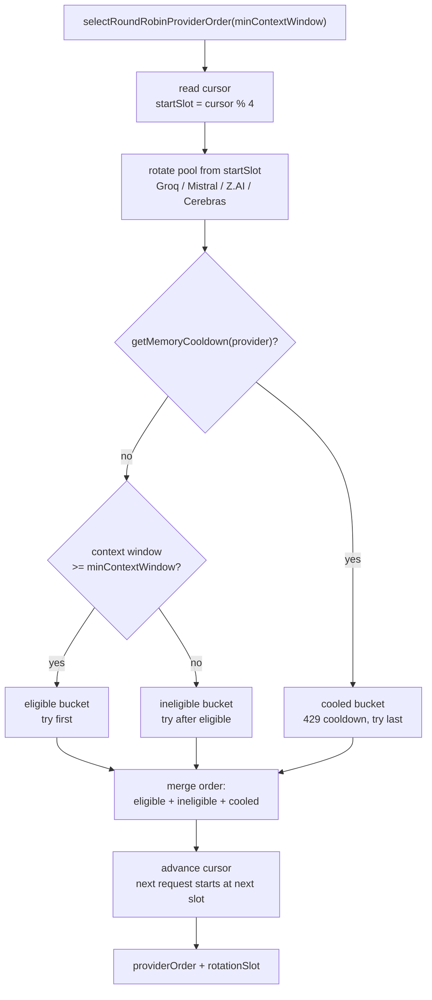

# ADR-006: LLM Provider Load Balancing 전략 — Round-Robin + Context Guard + 429 Cooldown

> Owner: platform-architecture
> Status: Active Canonical
> Doc type: Reference
> Last reviewed: 2026-05-16
> Canonical: docs/adr/adr-006-llm-provider-load-balancing.md
> Tags: adr,ai,provider,load-balancing,round-robin,free-tier,quota

## 상태

Accepted (2026-05-16 구현 완료)

## 배경

OpenManager AI는 Groq, Mistral, Z.AI, Cerebras 4개 무료 tier LLM provider를 운영합니다. 각 provider는 RPM/RPD 한도가 다르고 context window 크기도 상이합니다. 기존 구현은 에이전트별로 provider 순서를 코드에 고정("spider-web order")하는 방식이었는데, 다음 문제가 발생했습니다.

- 특정 provider가 429를 받으면 모든 에이전트의 2순위가 동일 provider로 몰림
- 에이전트/provider가 추가될 때마다 `agent-runtime-policy.ts` 여러 곳을 수동 수정 필요
- Cerebras `gpt-oss-120b` 전환으로 context window가 8K → 65K로 늘어나면서 고정 배치 근거가 무효화됨

## 검토한 전략 비교

| 전략 | rate limit 처리 | 복잡도 | 무료 tier 적합도 | 대표 구현 |
|------|----------------|--------|-----------------|---------|
| Simple Round-Robin | 없음 | 매우 낮음 | 나쁨 | 기본 프록시 |
| **Round-Robin + Context Guard + 429 Cooldown** (채택) | 사후 cooldown (90초) | 낮음 | 좋음 | Custom |
| Weighted Round-Robin | 정적 가중치, 실시간 반응 없음 | 낮음~중간 | 보통 | LiteLLM, Portkey |
| Usage-Based (TPM/RPM 추적) | 실시간 카운터, 임계 도달 시 cooldown | 중간 | 매우 좋음 | LiteLLM `usage-based-routing` |
| Circuit Breaker + Fallback 체인 | 연속 실패·P95 latency trip | 높음 | 매우 좋음 | Portkey, LiteLLM cooldowns |
| Semantic / Cost 기반 | 쿼리 복잡도별 모델 분류 | 높음 | 비용 최적 | 외부 LLM router 제품군 |

## 오픈소스 도입 검토 결과

### LiteLLM (Python, MIT)
- **장점**: usage-based routing, 429 cooldown, 100+ provider 지원. 현재 gap을 모두 커버.
- **단점**: Python 서비스라 Cloud Run에 별도 컨테이너 필요. 네트워크 hop 추가, cold start 1개 추가.
- **결론**: 기능은 최고지만 운영 복잡도 증가 대비 효익이 현재 트래픽(< 5 concurrent)에서 미미.

### Portkey AI Gateway (`@portkey-ai/gateway`, TypeScript, MIT)
- **장점**: TypeScript/Node.js 네이티브. npm 패키지로 Cloud Run AI Engine에 직접 통합 가능.
- **단점**: SaaS 대시보드와 설계가 얽혀 있어 self-hosted 시 일부 기능 제한. 문서가 SaaS 중심.
- **결론**: 스택 적합도는 높으나 기존 circuit breaker + quota-tracker가 이미 비슷한 역할 수행 중.

### 결론: 자체 구현
기존 인프라 (`retry-with-fallback.ts`, `quota-tracker.ts`, `quota-store-memory.ts`, circuit-breaker)가 이미 LiteLLM/Portkey 핵심 기능의 90%를 커버하고 있음. 외부 서비스 추가 없이 **Round-Robin cursor + 3-버킷 context guard + 기존 in-memory cooldown 재사용**으로 충분.

## 결정

아래 알고리즘을 `round-robin-provider-selector.ts`에 구현하고, 기존 per-agent hardcoded 순서를 대체한다.

```
selectRoundRobinProviderOrder(minContextWindow):
  시작 = cursor % 4
  cursor += 1

  for provider in ROTATION_POOL (cursor 위치부터 순환):
    if getMemoryCooldown(provider) != null:
      → cooled 버킷
    elif CONTEXT_WINDOW[provider] >= minContextWindow:
      → eligible 버킷
    else:
      → ineligible 버킷

  return [...eligible, ...ineligible, ...cooled]
```

**429 Cooldown 통합**:
기존 `retry-with-fallback.ts`가 429 감지 시 `markProviderQuotaCooldown(provider)`를 이미 호출하고, 이것이 `quota-store-memory.ts`의 `inMemoryCooldowns`에 90초 항목을 동기로 기록함. `selectRoundRobinProviderOrder`는 `getMemoryCooldown(provider)` 동기 조회로 이를 즉시 반영.

**Provider Attribution**:
`rotationSlot`을 반환해 `ProviderAttributionChip` (UI)에 어떤 provider가 응답했는지 표시.

### Round-Robin 3-버킷 흐름



## Context Window 기준 (2026-05-16)

| Provider | Context | min 16K eligible | min 32K eligible |
|----------|---------|-----------------|-----------------|
| Groq | 131K | ✅ | ✅ |
| Mistral | 32K | ✅ | ✅ (경계값 포함) |
| Z.AI | 128K | ✅ | ✅ |
| Cerebras (gpt-oss-120b) | 65K | ✅ | ✅ |

모든 에이전트(Supervisor 8K, Metrics Query 16K, Analyst/Reporter/Advisor 32K)에서 4개 모두 eligible.

## 트레이드오프

| 얻는 것 | 잃는 것 |
|---------|---------|
| 4개 provider에 RPD/RPM 자동 분산 | 에이전트별 "최적" provider를 우선배치하는 수동 최적화 포기 |
| provider 추가 시 `ROTATION_POOL`만 수정 | 동시 다중 요청 시 커서 경합 가능성 (현재 트래픽 수준 무시 가능) |
| UI attribution으로 사용자 투명성 확보 | Z.AI 실제 RPM 미검증 (보수적 5 RPM 가정 유지) |
| 기존 cooldown 인프라 재사용, 외부 의존성 없음 | 실시간 usage 카운터 기반 사전 차단 없음 (429 사후 cooldown만) |

## 남은 gap과 재검토 조건

| Gap | 우선도 | 재검토 조건 |
|-----|--------|------------|
| 실시간 RPM 카운터 사전 차단 | 낮음 | 일일 트래픽 > 1,000 req 시 LiteLLM 재검토 |
| Z.AI 실제 RPM 확인 | 중간 | 계정 헤더 smoke 후 `PROVIDER_CONTEXT_WINDOW` 수정 |
| 동시 요청 커서 mutex | 낮음 | 동시 사용자 > 10명 지속 시 |

## 구현 참조

- Round-Robin selector: `cloud-run/ai-engine/src/services/ai-sdk/agents/config/round-robin-provider-selector.ts`
- 429 cooldown 기록: `cloud-run/ai-engine/src/services/resilience/retry-with-fallback.ts` → `markProviderQuotaCooldown()`
- In-memory cooldown 저장: `cloud-run/ai-engine/src/services/resilience/quota-store-memory.ts` → `getMemoryCooldown()`
- Per-agent selectors: `cloud-run/ai-engine/src/services/ai-sdk/agents/config/agent-model-selectors.ts`
- Provider attribution UI: `src/components/ai/analysis-basis/ProviderAttributionChip.tsx`
- 관련 ADR: [ADR-005: Routing Pattern 전환](./adr-005-routing-pattern-over-orchestrator-worker.md)
