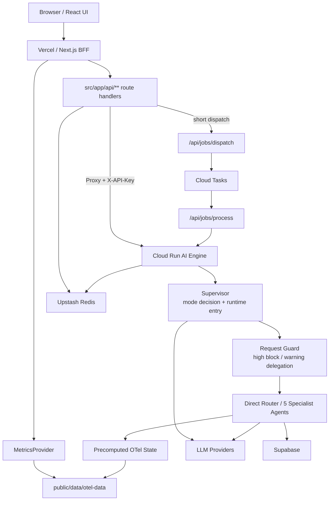

# 시스템 개요 아키텍처

> Browser, Vercel BFF, Cloud Run AI Engine, 외부 서비스 경계를 설명하는 구현 기준 아키텍처
> Owner: platform-architecture
> Status: Active
> Doc type: Reference
> Last reviewed: 2026-05-20
> Canonical: docs/architecture/01-system-overview.md
> Tags: architecture,system,hybrid,vercel,cloud-run

---

## 현재 구현 요약

OpenManager AI는 Vercel과 Cloud Run을 분리한 하이브리드 구조입니다.

- Browser는 Next.js App Router UI와 Vercel API route를 호출합니다.
- Vercel은 Frontend/BFF, 인증, rate limit, lightweight proxy, Dashboard data access를 담당합니다.
- Cloud Run `ai-engine`은 장시간 AI 실행, Supervisor, request guard, Direct Router, specialist agent workflow, job worker를 담당합니다.
- Redis(Upstash)는 AI 응답 캐시, rate limit, job state, provider quota 추적, 세션 메모리, Langfuse usage guard를 저장합니다. Vercel과 Cloud Run이 동일 인스턴스를 공유하며 키 prefix로 네임스페이스를 분리합니다.
- Cloud Tasks는 장시간 AI job을 Cloud Run worker로 전달하는 HTTP task queue입니다.
- Supabase는 Auth/RLS, RAG/knowledge DB, 일부 저장소 역할을 담당합니다.
- `public/data/otel-data`는 Dashboard와 AI grounding의 synthetic runtime SSOT입니다.

## 설계도

## 주요 코드 경계

| 경계 | 구현 위치 | 역할 |
|---|---|---|
| Next.js App Router | `src/app` | 페이지, API route, BFF |
| Dashboard data access | `src/services/metrics/MetricsProvider.ts` | OTel hourly dataset 로딩과 변환 |
| AI stream proxy | `src/app/api/ai/supervisor/stream/v2/route.ts` | Cloud Run UIMessageStream proxy |
| AI job queue | `src/app/api/ai/jobs/**`, `cloud-run/ai-engine/src/routes/jobs.ts` | Redis job state와 Cloud Tasks dispatch |
| Cloud Run AI entry | `cloud-run/ai-engine/src/routes/supervisor.ts` | Supervisor request 진입점 |
| Runtime data | `public/data/otel-data`, `cloud-run/ai-engine/src/data/precomputed-state.ts` | synthetic OTel data 소비 |

## 해야 하는 것

- API route 추가/삭제 시 [Architecture Design Index](../reference/architecture/README.md)와 [API Endpoints](../reference/api/endpoints.md)를 같이 확인합니다.
- Vercel에서 오래 걸리는 AI 실행을 직접 끝까지 처리하지 않고 Cloud Run streaming/direct 경계로 넘깁니다. async Job Queue(Cloud Tasks/Redis)는 유지 여부를 [Redis 정비 계획](../../reports/planning/redis-usage-cleanup-plan.md) R-0에서 결정합니다.
- BFF route는 인증, 입력 검증, proxy, contract preservation에 집중합니다.
- Cloud Run route는 AI 실행, job worker, deterministic fallback, provider gate를 책임집니다.
- 수치 변경은 `rg --files` 같은 실제 코드 기준으로 확인한 뒤 문서에 반영합니다.

## 하면 안 되는 것

- Vercel Function에 장시간 multi-agent 실행을 직접 넣지 않습니다.
- 기존 stream/job/artifact route를 우회하는 병렬 AI runtime을 새로 만들지 않습니다.
- GitHub public remote를 canonical branch처럼 사용하지 않습니다.
- Redis/Cloud Tasks/Supabase 사용 확대를 비용/쿼터 검토 없이 기본값으로 만들지 않습니다.
- route 수, 서버 수, provider 수 같은 수치를 추측으로 문서화하지 않습니다.

## 상세 문서

- [System Architecture](../reference/architecture/system/system-architecture-current.md)
- [Folder Structure](../reference/architecture/folder-structure.md)
- [Frontend/Backend AI Comparison](../reference/architecture/ai/frontend-backend-comparison.md)
- [Redis 사용 현황](../reference/architecture/infrastructure/redis-usage.md)
- [API Endpoints](../reference/api/endpoints.md)
