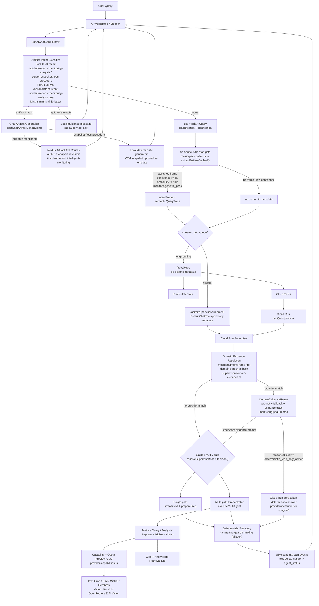

# Runtime 아키텍처

> AI Assistant의 stream/job route, Supervisor, Orchestrator, provider, deterministic recovery를 설명하는 구현 기준 아키텍처
> Owner: platform-architecture
> Status: Active Canonical
> Doc type: Reference
> Last reviewed: 2026-05-16
> Canonical: docs/architecture/02-runtime-architecture.md
> Tags: architecture,ai,runtime,supervisor,provider

---

## 현재 구현 요약

AI Runtime은 “deterministic/single 기본 + 조건부 multi-agent escalation” 구조입니다.

- 기본 채팅 경로는 `/api/ai/supervisor/stream/v2`입니다.
- 복합 질의는 `/api/ai/jobs`에서 Redis job state를 만들고 Cloud Tasks가 Cloud Run worker로 전달합니다.
- Cloud Run Supervisor는 `deterministic`, `single-agent`, `multi-agent` 실행 메타데이터를 보존하고, 실제 요청 모드는 `single`, `multi`, `auto`로 결정합니다.
- `useAIChatCore`는 Supervisor 호출 전에 artifact intent를 먼저 판별합니다. Local regex는 `incident-report`, `monitoring-analysis`, `server-snapshot`, `ops-procedure`를 처리하고, LLM classifier(`/api/ai/artifact-intent`, Mistral `ministral-3b-latest`)는 `incident-report`와 `monitoring-analysis`만 보강합니다.
- artifact/guidance로 판별된 요청은 chat artifact generation 또는 guidance message로 끝나며 Cloud Run Supervisor를 호출하지 않습니다.
- incident report와 monitoring analysis artifact는 Next.js BFF API route를 통해 실행되며, `/api/ai/artifact-intent`, `/api/ai/incident-report`, `/api/ai/intelligent-monitoring` POST는 auth와 `aiAnalysis` rate-limit를 적용합니다. Server snapshot과 ops procedure artifact는 브라우저에서 Cloud Run을 직접 우회하지 않고 로컬 deterministic generator와 OTel snapshot을 사용합니다.
- artifact가 아닌 metric/peak 계열 질의는 session-scoped `extractEntitiesCached()`가 `SemanticIntentFrame`을 만들 수 있으며, `confidence >= 80`, high ambiguity 아님, 현재는 `monitoring.metric_peak`일 때만 `intentFrame` metadata로 Cloud Run에 전달됩니다.
- Orchestrator는 intent, pre-filter, specialist handoff를 처리합니다.
- 단순 메트릭 조회, ranking, server snapshot은 deterministic/single 경로에 남기고, RCA/report/advisor/vision 요청에서 5개 routing LLM agent로 escalation합니다.
- Cloud Run domain evidence는 metadata intent frame을 우선 사용하고 domain parser fallback을 보조로 사용합니다. `metric_peak` evidence는 prompt/fallback/semantic trace를 제공하며, `responsePolicy=deterministic_read_only_advice`인 경우에만 Cloud Run 내부 LLM 호출 없이 바로 응답합니다. 이때 frontend artifact classifier나 entity extractor LLM이 선행됐을 수 있으므로 zero-token은 Cloud Run 실행 구간 기준입니다.
- formatting-only rewrite, top-N metric ranking, empty stream recovery는 deterministic guard/fallback으로 보강되어 있습니다.

## 설계도

### Mermaid



### ASCII

```text
User Query
  -> AI Workspace / Sidebar
  -> useAIChatCore submit
     +-- Artifact Intent Classifier
     |     - Tier1 local regex:
     |       incident-report, monitoring-analysis, server-snapshot, ops-procedure
     |     - Tier2 LLM /api/ai/artifact-intent:
     |       incident-report, monitoring-analysis only
     |     +-- artifact match  -> chat artifact generation
     |     |     +-- incident/monitoring -> Next.js artifact API routes
     |     |     |     auth + aiAnalysis rate-limit -> UI
     |     |     `-- snapshot/ops procedure -> local deterministic generators -> UI
     |     +-- guidance match  -> local guidance message -> UI
     |     `-- none            -> useHybridAIQuery
     |
     `-- useHybridAIQuery
           -> classification / clarification
           -> semantic extraction gate
              +-- accepted monitoring.metric_peak frame
              |     confidence >= 80 and ambiguity != high
              |     session-scoped extractEntitiesCached()
              |     -> intentFrame + semanticQueryTrace metadata
              `-- no accepted frame
                    -> no semantic metadata
           -> dispatch
              +-- stream -> /api/ai/supervisor/stream/v2
              `-- job    -> /api/ai/jobs -> Redis -> Cloud Tasks -> /api/jobs/process

Cloud Run Supervisor
  -> Domain Evidence Resolution
     +-- metadata intentFrame
     `-- monitoring domain parser fallback
  -> monitoring-peak-metric evidence provider
     +-- responsePolicy=deterministic_read_only_advice
     |     -> Cloud Run zero-token deterministic answer
     `-- otherwise
           -> evidence prompt enters single/multi path
  -> resolveSupervisorModeDecision()
     +-- single -> streamText + prepareStep
     `-- multi  -> Orchestrator -> Metrics Query / Analyst / Reporter / Advisor / Vision
  -> provider gate
     +-- text: Groq / Z.AI / Mistral / Cerebras
     `-- vision: Gemini / OpenRouter / Z.AI Vision
  -> deterministic recovery -> UIMessageStream -> UI
```

## 구현된 영역

| 영역 | 구현 내용 |
|---|---|
| Stream transport | AI SDK v6 `UIMessageStream`, `DefaultChatTransport`, resumable stream option |
| Job queue | Redis job store, Cloud Tasks dispatch, Cloud Run `/api/jobs/process` worker |
| Supervisor mode | explicit `multi`, gated `single`, complexity-based `auto` |
| Planner shadow | `plannerShadow.latencyMs`, mismatch reason, executionMode metadata |
| Provider gate | tool calling, structured output, context floor, quota policy 기반 provider skip/fallback |
| Deterministic recovery | metric ranking, formatting-only rewrite guard, stream error after recovery suppression |
| Retrieval | Knowledge Retrieval Lite, BM25 RPC + metadata boost, external embedding/rerank/web fallback 분리 |

## 해야 하는 것

- AI route, planner, provider, tool/result schema 변경 시 이 문서와 [AI Engine Architecture](../reference/architecture/ai/ai-engine-architecture.md)를 같이 갱신합니다.
- new route를 만들기 전에 기존 stream/job/artifact route 계약을 재사용할 수 있는지 먼저 확인합니다.
- LLM 호출을 늘리는 변경은 Free Tier, quota, latency, fallback path를 먼저 계산합니다.
- formatting-only rewrite, metric lookup, server snapshot처럼 deterministic으로 처리 가능한 요청은 LLM escalation을 줄입니다.
- AI 응답 품질 검증은 contract test, deterministic corpus, targeted QA evidence로 남깁니다.

## 하면 안 되는 것

- 기존 stream/job/artifact route를 우회하는 병렬 AI entrypoint를 새로 만들지 않습니다.
- formatting-only rewrite를 Reporter/job/artifact pipeline으로 과도하게 승격하지 않습니다.
- provider-native reasoning을 기본 UX 의미로 정의하지 않습니다. 현재 `thinking`은 app-level routing intensity입니다.
- CI/로컬 기본 gate에서 실제 LLM 호출을 수행하지 않습니다.
- tool result가 있는데 모델 stream이 빈 응답을 반환하는 경우를 사용자-facing 실패로 곧바로 확정하지 않습니다.

## 상세 문서

- [AI Engine Architecture](../reference/architecture/ai/ai-engine-architecture.md)
- [Frontend/Backend AI Comparison](../reference/architecture/ai/frontend-backend-comparison.md)
- [AI Assistant Initial Design Comparison](../archived/ai-assistant-initial-design-comparison.md) — historical comparison only
- [RAG Knowledge Engine](../reference/architecture/ai/rag-knowledge-engine.md)
- [AI Assistant Architecture Evolution Plan](../../reports/planning/archive/ai-assistant-architecture-evolution-plan.md)
