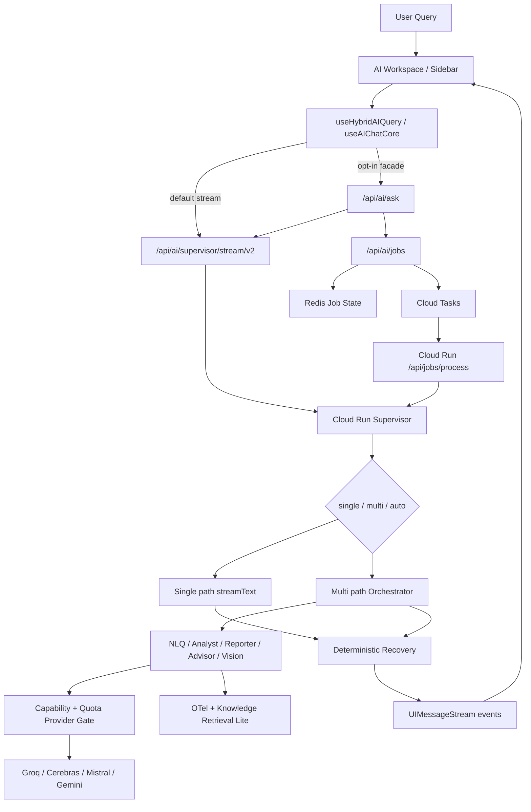

# Runtime 아키텍처

> AI Assistant의 stream/job/facade route, Supervisor, Orchestrator, provider, deterministic recovery를 설명하는 구현 기준 아키텍처
> Owner: platform-architecture
> Status: Active
> Doc type: Reference
> Last reviewed: 2026-05-05
> Canonical: docs/architecture/02-runtime-architecture.md
> Tags: architecture,ai,runtime,supervisor,provider

---

## 현재 구현 요약

AI Runtime은 “deterministic/single 기본 + 조건부 multi-agent escalation” 구조입니다.

- 기본 채팅 경로는 `/api/ai/supervisor/stream/v2`입니다.
- `NEXT_PUBLIC_AI_ASK_FACADE_ENABLED=true`일 때 `/api/ai/ask`가 wrapper-only facade로 기존 route를 감쌉니다.
- 복합 질의는 `/api/ai/jobs`에서 Redis job state를 만들고 Cloud Tasks가 Cloud Run worker로 전달합니다.
- Cloud Run Supervisor는 `deterministic`, `single-agent`, `multi-agent` 실행 메타데이터를 보존하고, 실제 요청 모드는 `single`, `multi`, `auto`로 결정합니다.
- Orchestrator는 intent, pre-filter, specialist handoff를 처리합니다.
- 단순 메트릭 조회, ranking, server snapshot은 deterministic/single 경로에 남기고, RCA/report/advisor/vision 요청에서 5개 routing LLM agent로 escalation합니다.
- formatting-only rewrite, top-N metric ranking, empty stream recovery는 deterministic guard/fallback으로 보강되어 있습니다.

## 설계도

## 구현된 영역

| 영역 | 구현 내용 |
|---|---|
| Stream transport | AI SDK v6 `UIMessageStream`, `DefaultChatTransport`, resumable stream option |
| Facade | `/api/ai/ask` wrapper-only facade, 기존 stream/job/artifact route 내부 위임 |
| Job queue | Redis job store, Cloud Tasks dispatch, Cloud Run `/api/jobs/process` worker |
| Supervisor mode | explicit `multi`, gated `single`, complexity-based `auto` |
| Planner shadow | `plannerShadow.latencyMs`, mismatch reason, executionMode metadata |
| Provider gate | tool calling, structured output, context floor, quota policy 기반 provider skip/fallback |
| Deterministic recovery | metric ranking, formatting-only rewrite guard, stream error after recovery suppression |
| Retrieval | Knowledge Retrieval Lite, BM25 RPC + metadata boost, external embedding/rerank/web fallback 분리 |

## 해야 하는 것

- AI route, planner, provider, tool/result schema 변경 시 이 문서와 [AI Engine Architecture](../reference/architecture/ai/ai-engine-architecture.md)를 같이 갱신합니다.
- new route를 만들기 전에 `/api/ai/ask` facade로 감쌀 수 있는지 먼저 확인합니다.
- LLM 호출을 늘리는 변경은 Free Tier, quota, latency, fallback path를 먼저 계산합니다.
- formatting-only rewrite, metric lookup, server snapshot처럼 deterministic으로 처리 가능한 요청은 LLM escalation을 줄입니다.
- AI 응답 품질 검증은 contract test, deterministic corpus, targeted QA evidence로 남깁니다.

## 하면 안 되는 것

- `/api/ai/ask` 안에 독립 planner나 독립 provider 호출을 새로 만들지 않습니다.
- formatting-only rewrite를 Reporter/job/artifact pipeline으로 과도하게 승격하지 않습니다.
- provider-native reasoning을 기본 UX 의미로 정의하지 않습니다. 현재 `thinking`은 app-level routing intensity입니다.
- CI/로컬 기본 gate에서 실제 LLM 호출을 수행하지 않습니다.
- tool result가 있는데 모델 stream이 빈 응답을 반환하는 경우를 사용자-facing 실패로 곧바로 확정하지 않습니다.

## 상세 문서

- [AI Engine Architecture](../reference/architecture/ai/ai-engine-architecture.md)
- [Frontend/Backend AI Comparison](../reference/architecture/ai/frontend-backend-comparison.md)
- [AI Assistant Initial Design Comparison](../reference/architecture/ai/ai-assistant-initial-design-comparison.md)
- [RAG Knowledge Engine](../reference/architecture/ai/rag-knowledge-engine.md)
- [AI Assistant Architecture Evolution Plan](../../reports/planning/archive/ai-assistant-architecture-evolution-plan.md)
