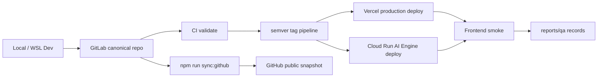

# 배포 아키텍처

> GitLab CI, Vercel/Cloud Run 배포 권위, Free Tier, QA 기록, 금지 사항을 설명하는 구현 기준 아키텍처
> Owner: platform-architecture
> Status: Active
> Doc type: Reference
> Last reviewed: 2026-05-07
> Canonical: docs/architecture/03-deployment-architecture.md
> Tags: architecture,deployment,operations,free-tier,qa

---

## 현재 구현 요약

운영 설계의 핵심은 비용 제약, 배포 권위, 검증 evidence를 분리해 관리하는 것입니다.

- canonical 개발 저장소와 production deploy 권위는 GitLab CI입니다.
- Vercel Git Integration은 비활성화되어 있고, Frontend production은 GitLab CI deploy job이 담당합니다.
- Cloud Run AI Engine은 1 vCPU / 512Mi 기준으로 운영합니다.
- Vercel Pro는 유일한 유료 예외지만, 기본 설계는 무료 티어 수준을 유지합니다.
- GitHub public remote는 frontend-only 공개 snapshot입니다. Cloud Run AI Engine, 내부 문서, 테스트, QA evidence, agent 설정, GitHub Actions는 공개 snapshot에 포함하지 않습니다.
- 최종 QA는 Vercel 실환경 + Playwright MCP가 기본이며 결과는 `reports/qa`에 기록합니다.

## 설계도

## 구현된 영역

| 영역 | 구현 내용 |
|---|---|
| GitLab authority | branch/main validate, semver tag deploy/smoke pipeline |
| Frontend deploy | GitLab CI에서 Vercel production deploy |
| AI Engine deploy | Cloud Run deploy script와 CI deploy job |
| Public snapshot | `npm run sync:github`로만 frontend-only GitHub public 동기화 |
| QA recording | `reports/qa/qa-tracker.json`, `npm run qa:record`, evidence audit |
| Cost guard | Cloud Run 1 vCPU/512Mi, Cloud Build 기본 머신, Vercel 사용량 확인 |
| Test strategy | local deterministic tests, contract tests, 실 LLM/외부 서비스 기본 금지 |

## 해야 하는 것

- push/fetch/rebase 전 `git remote -v`로 GitLab/GitHub 역할을 확인합니다.
- GitLab push 후 token이 있으면 pushed HEAD pipeline 상태를 확인하고 보고합니다.
- 배포 전 runner 상태와 환경변수 drift를 확인합니다.
- release/QA 후 `/api/health`, Cloud Run `/health`, Vercel usage, QA evidence를 확인합니다.
- AI/API 계약 변경 시 `npm run test:contract`와 관련 targeted tests를 함께 실행합니다.

## 하면 안 되는 것

- `git push origin` 또는 `git push github-public`로 공개 snapshot을 직접 밀지 않습니다.
- GitHub public remote를 기준 브랜치처럼 취급하지 않습니다.
- CI 실패를 무시하고 production deploy를 일반 경로처럼 진행하지 않습니다.
- Free Tier 문제를 고사양 Cloud Run, GPU, always-on warmup, Cloud Build custom machine으로 해결하지 않습니다.
- QA evidence 없이 “실환경에서 정상”이라고 보고하지 않습니다.
- secret을 코드, 문서, 스크립트에 하드코딩하지 않습니다.

## 상세 문서

- [Free Tier Optimization](../reference/architecture/infrastructure/free-tier-optimization.md)
- [Resilience](../reference/architecture/infrastructure/resilience.md)
- [Security](../reference/architecture/infrastructure/security.md)
- [AI Standards](../guides/ai/ai-standards.md)
- [Definition of Done](../reference/project/definition-of-done.md)
