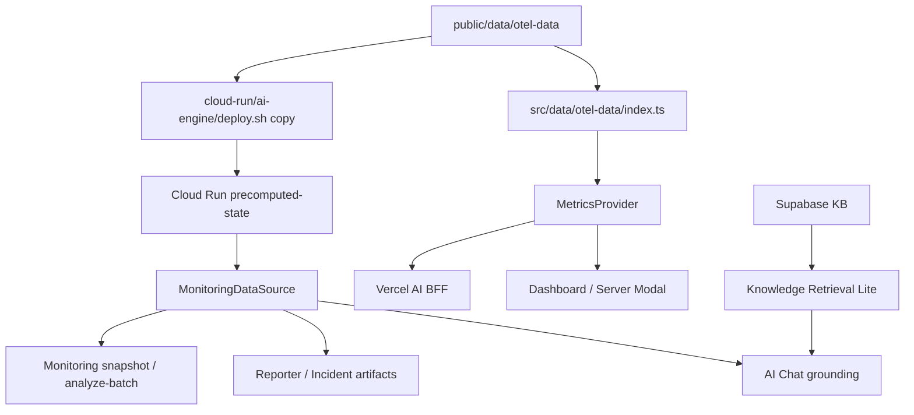

# 데이터 흐름 아키텍처

> synthetic OTel dataset, Dashboard/AI 소비 경로, MonitoringDataSource, RAG 경계를 설명하는 구현 기준 아키텍처
> Owner: platform-data
> Status: Active
> Doc type: Reference
> Last reviewed: 2026-05-06
> Canonical: docs/architecture/04-data-flow.md
> Tags: architecture,data,monitoring,otel,rag

---

## 현재 구현 요약

OpenManager의 운영 데이터는 실제 서버 scrape가 아니라 사전 생성된 synthetic OTel dataset입니다.

- 런타임 SSOT는 `public/data/otel-data`입니다.
- 데이터셋은 18대 서버, 24시간, 10분 간격, 144 슬롯 기준입니다.
- Dashboard는 `MetricsProvider`를 통해 hourly/resource/timeseries 데이터를 비동기 로딩합니다.
- Cloud Run AI Engine은 deploy 시 복사된 OTel data와 compatibility fallback을 읽습니다.
- AI Chat/Reporter/Analyst는 `MonitoringDataSource` 계약을 통해 snapshot/evidence refs를 소비합니다.
- Knowledge Retrieval Lite는 Supabase/RPC 기반 검색을 사용하되 외부 embedding/reranking/web fallback은 기본 retrieval path에 넣지 않습니다.

## 설계도

## 구현된 영역

| 영역 | 구현 내용 |
|---|---|
| OTel dataset | `resource-catalog.json`, `timeseries.json`, `hourly/hour-XX.json` |
| Dashboard data | `MetricsProvider.ensureDataLoaded()`, 서버 카드/모달/차트 소비 |
| Cloud Run data | `precomputed-state.ts`, `otel-data` 우선 + `otel-processed` compatibility fallback |
| Monitoring source | `replay-json` 기본, `live-otel`은 disabled skeleton |
| Error contract | deterministic monitoring routes의 source 오류에 `code`, `sourceMode`, `queryAsOf`, `requestId`, `recoverable` 포함 |
| Fact boundary | `MonitoringFactPack`이 metric severity를 deterministic rule로 계산 |
| RAG | Knowledge Retrieval Lite, BM25 RPC, metadata boost, recall guard |

## 해야 하는 것

- 메트릭/서버 인벤토리를 바꾸면 Dashboard와 AI 응답을 함께 검증합니다.
- `queryAsOf`와 10분 슬롯 경계를 유지해 같은 질문이 같은 데이터 시점을 참조하게 합니다.
- AI 설명은 deterministic fact pack을 근거로 삼고, LLM은 explanation/formatting에 제한합니다.
- retrieval 변경은 evidence refs, recall guard, insufficient evidence fallback을 같이 확인합니다.
- data script 변경 시 `npm run data:verify`와 관련 route 테스트를 함께 고려합니다.

## 하면 안 되는 것

- 실제 Prometheus/OTLP/Loki 수집을 기본 runtime path로 추가하지 않습니다.
- cron, background write, live backend, DB write를 비용/계약 검토 없이 기본값으로 만들지 않습니다.
- LLM이 metric severity를 독자적으로 판단하게 하지 않습니다.
- `public/data/otel-data`와 Cloud Run copy/fallback 경계를 서로 다르게 방치하지 않습니다.
- 서버 수나 topology를 제품 화면용 diagram과 문서에서 따로 관리하지 않습니다.

## 상세 문서

- [OTel Data Architecture](../reference/architecture/data/otel-data-architecture.md)
- [Data Architecture](../reference/architecture/data/data-architecture.md)
- [RAG Knowledge Engine](../reference/architecture/ai/rag-knowledge-engine.md)
- [Monitoring AI Data Source Plan](../../reports/planning/archive/monitoring-ai-data-source-plan.md)
