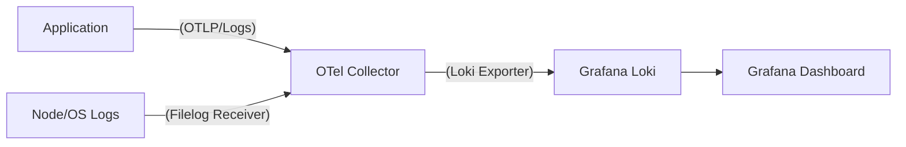

# OTel 기준 Loki 로그 운영 Best Practice 가이드

> Status: Historical
> Current canonical docs: `docs/README.md`, `docs/reference/README.md`
> Note: 본 문서는 작성 시점 기준 분석/리뷰 기록입니다.

> **작성일**: 2026-02-12
> **주제**: OpenTelemetry 환경에서 Loki 로그 시스템 구축 및 운영 전략
> **핵심**: **"OTel Collector를 사용하되, Loki의 Labeling 전략(Cardinality)을 준수하라"**

---

## 1. 아키텍처: Promtail vs OTel Collector

과거에는 Loki 짝꿍으로 `Promtail`을 썼지만, **OTel 생태계에서는 `OpenTelemetry Collector`가 표준 수집기**입니다.

### ✅ 권장 아키텍처 (The OTel Way)


1. **Unified Agent**: 서버에 `Promtail`, `Telegraf` 등을 따로 깔지 않고 **OTel Collector 하나만** 설치합니다.
2. **Processor 활용**: OTel의 강력한 Processor(k8s metadata 추가, 민감정보 마스킹, 샘플링)를 거친 후 Loki로 보냅니다.

---

## 2. 운영 핵심 원칙 (Operational Rules)

Loki를 운영할 때 가장 중요한 3가지 규칙입니다. 이를 지키지 않으면 Loki 성능이 급격히 저하되거나 검색이 불가능해집니다.

### 🛑 Rule 1: Labeling 전략 (Cardinality 주의)

Loki는 인덱싱 방식이 독특합니다. **Label(인덱스)**과 **Content(본문)**를 철저히 구분해야 합니다.

| 구분 | **Label (인덱스용)** | **Structured Metadata / Content** |
|---|---|---|
| **설명** | 검색 속도를 결정하는 키. 카디널리티(값의 종류)가 낮아야 함. | 실제 로그 내용 또는 검색 필터용 데이터. |
| **권장 항목** | `service.name`, `namespace`, `environment`, `level` | `trace_id`, `user_id`, `order_id`, `error_message` |
| **OTel 설정** | OTel Resource Attribute를 Loki Label로 변환 | OTel Log Body 또는 Attribute로 전송 |
| **❌ 절대 금지** | **Trace ID, User ID, IP 주소** (인덱스 폭발 원인) | - |

**OTel Collector 설정 예시:**
```yaml
exporters:
  loki:
    endpoint: "http://loki:3100/loki/api/v1/push"
    # OTel Resource 중 이 3가지만 Loki Label로 승격 (나머지는 본문에 포함)
    resource_to_telemetry_conversion:
      enabled: true
    data:
      labels: 
        attributes: ["service.name", "deployment.environment", "k8s.pod.name"]
```

### 🔗 Rule 2: Trace Correlation (로그-트레이스 연결)

**"Logs without Traces are just text."**
OTel을 쓰는 가장 큰 이유입니다. 로그에 반드시 `TraceId`와 `SpanId`가 포함되어야 합니다.

1. **Auto-Injection**: Java, Python, Node.js 등 OTel SDK는 자동으로 로그에 현재 `TraceId`를 주입합니다.
2. **Loki의 역할**: Grafana에서 "Log"를 보다가 버튼 하나로 관련 "Trace"로 점프할 수 있게 해줍니다.

**이상적인 로그 포맷 (Json):**
```json
{
  "timestamp": "2026-02-12T07:53:00Z",
  "level": "ERROR",
  "service": "checkout-service",
  "trace_id": "4bf92f3577b34da6a3ce929d0e0e4736",  <-- 핵심 Key
  "span_id": "00f067aa0ba902b7",
  "message": "Payment gateway timeout",
  "cart_id": "cart-12345"
}
```

### 📝 Rule 3: Structured Logging (JSON)

과거의 `syslog` 텍스트 방식(`Feb 12 07:53:00 server1 error: ...`)은 지양합니다.
OTel은 **Structured Log(JSON)**를 기본으로 처리하며, Loki도 LogQL을 통해 JSON 파싱에 최적화되어 있습니다.

---

## 3. VIBE 프로젝트 적용 제언

현재 VIBE는 `MetricsProvider`에서 로그를 시뮬레이션하고 있습니다. 이를 "OTel + Loki 운영" 관점에서 발전시키려면:

1. **로그 포맷 변경**:
    * 현재: 텍스트 포맷 (`[INFO] nginx: worker started`)
    * 제언: JSON 포맷으로 생성하고 `trace_id` 필드를 (가상으로라도) 추가.

2. **메타데이터 매핑**:
    * `src/data/hourly-data/*.json`의 `labels` 정보를 Loki Label로 간주.
    * `hostname`, `server_type`, `environment` -> **Loki Label** (Good)
    * `pid`, `error_code` -> **Log Content** (Good)

---

## 4. 요약

OTel 환경에서 Loki 운영의 정석은 다음과 같습니다.

1. **수집**: **OTel Collector**를 단일 에이전트로 사용한다.
2. **전송**: OTel의 `resource attributes` 중 **로우 카디널리티(서비스명, 환경)**만 Loki Label로 매핑한다.
3. **연결**: 모든 로그에 **Trace ID**를 심어 메트릭-로그-트레이스 3각 편대를 완성한다.
