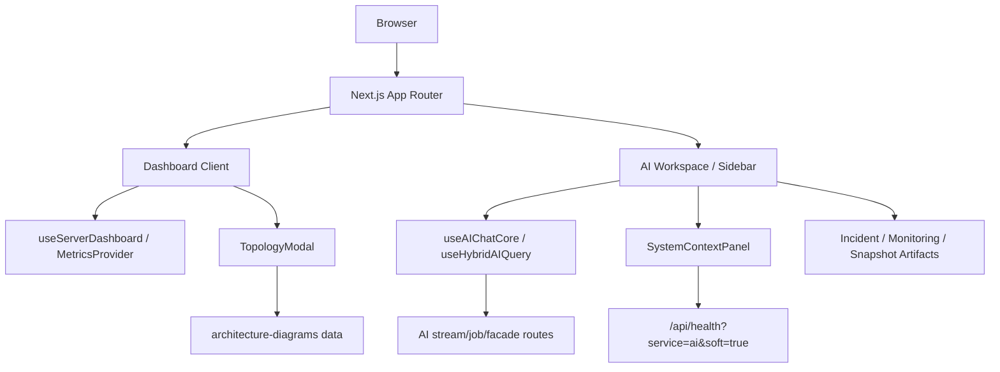

# 프론트엔드 경험 설계

> Dashboard, AI workspace, 상태/증거 UI, 화면용 설계도 데이터를 설명하는 구현 기준 설계
> Owner: frontend-platform
> Status: Active
> Doc type: Reference
> Last reviewed: 2026-05-09
> Canonical: docs/design/05-ui-design.md
> Tags: design,frontend,dashboard,ai-workspace,ui

---

## 현재 구현 요약

프론트엔드는 운영 도구 성격의 대시보드와 AI Assistant 모듈을 한 제품 안에 묶습니다. 단, core 서버 모니터링 surface와 AI 실행 surface는 분리해서 유지합니다.

- Dashboard는 18대 synthetic server 상태, 로그, 알림, topology를 표시합니다.
- AI workspace/sidebar는 stream, job, artifact, analysis basis, provider/model evidence를 표시합니다.
- `SystemContextPanel`과 관련 UI는 Cloud Run health, provider/model, warmup 상태를 관측 가능하게 합니다.
- 제품 화면에서 보이는 설계도는 `src/data/architecture-diagrams/*` TS 데이터로 관리됩니다.
- 완료된 assistant 응답은 typewriter 재생이 아니라 Markdown renderer 중심으로 표시합니다.

## Surface Boundary

OpenManager AI의 UI 포지션은 "AI가 모든 monitoring 화면을 대체하는 제품"이 아니라, 직접 만든 synthetic 서버 모니터링 제품에 AI Assistant / Agent 모듈을 추가한 구조입니다.

```text
Core Monitoring Surface
  ├─ Dashboard summary
  ├─ Server cards
  ├─ Server detail page
  ├─ Alerts / Logs
  └─ Topology

AI Module Surface
  ├─ Header AI Assistant toggle
  ├─ AISidebarV4
  └─ /dashboard/ai-assistant
```

Core monitoring surface는 AI 없이도 제품으로 읽혀야 합니다. 서버 카드, 서버 상세, 알림 row, 로그 row는 상세/로그/알림/토폴로지 탐색을 제공하되 per-entity AI 실행 CTA를 기본 노출하지 않습니다. AI 질의, Agent 실행, Reporter/Analyst 결과, evidence/artifact UX는 AI sidebar와 AI 전체 페이지에서 다룹니다.

현재 코드가 이 boundary와 다를 경우 파일 단위 revert가 아니라 [Dashboard AI Surface Boundary Plan](../../reports/planning/archive/dashboard-ai-surface-boundary-plan.md)의 선택적 복구 기준을 따릅니다. 서버 상세 페이지화, 상태 배지, sparkline은 보존하고, 서버 카드/상세/알림/overview의 per-entity AI CTA와 이를 보호하는 테스트 기대값만 제거/교체합니다.

## 설계도



## 구현된 영역

| 영역 | 구현 내용 |
|---|---|
| Dashboard | 서버 카드, 서버 상세, 로그/알림, topology modal, 24h 순환 데이터 표시 |
| AI Workspace | stream 응답, job SSE, artifact generation, analysis basis, provider/model 표시 |
| Health UX | Cloud Run cold-start soft degraded를 hard failure가 아니라 warming 상태로 표시 |
| Stream UX | warmup countdown, agent step event, resumable stream option |
| Evidence UI | 마지막 assistant 응답 provider/model, fact/evidence boundary 표시 |
| Product diagrams | `ai-assistant`, `cloud-platform`, `infrastructure-topology`, `tech-stack`, `vibe-coding` |

## 해야 하는 것

- 운영 도구 UI는 반복 사용과 스캔이 쉬운 밀도와 구조를 우선합니다.
- Dashboard와 AI가 같은 OTel/MonitoringFactPack 근거를 보도록 경계를 맞춥니다.
- AI 기능은 전역 AI Assistant 버튼, AI sidebar, `/dashboard/ai-assistant` 전체 페이지를 통해 실행합니다.
- 서버 카드의 sparkline과 서버 상세 페이지의 메트릭/로그/서비스 정보는 core monitoring UX로 유지합니다.
- 최근 변경을 되돌릴 때는 서버 상세 페이지 전환과 monitoring UX 개선을 보존하고, AI CTA surface drift만 분리해 제거합니다.
- 화면용 설계도 데이터가 실제 runtime 구조와 다르면 같은 작업에서 갱신합니다.
- 상태 UI는 hard failure, degraded, warming, recoverable을 구분해 표시합니다.
- AI 응답의 provider/model/evidence는 QA에서 관측 가능한 DOM 또는 metadata로 남깁니다.
- Stitch는 컴포넌트 1~2개 단위의 증분 시안 도구로만 사용하고, 코드와 이 설계 문서를 UI SSOT로 둡니다.

## 하면 안 되는 것

- 운영 대시보드를 마케팅 랜딩 페이지처럼 구성하지 않습니다.
- 서버 카드, 서버 상세 헤더, 알림 row에 per-entity AI 실행 버튼을 기본 기능처럼 흩뿌리지 않습니다.
- 실제 기능 설명을 과도한 인앱 안내 문구로 대체하지 않습니다.
- Cloud Run cold-start timeout을 즉시 치명적 장애로 캐시하지 않습니다.
- 화면용 설계도를 문서와 따로 방치하지 않습니다.
- 서버/metric 수치를 UI copy에 하드코딩한 뒤 데이터 문서와 따로 관리하지 않습니다.

## 상세 문서

- [Artifact System Design](06-artifact-system.md)
- [Folder Structure](../reference/architecture/folder-structure.md)
- [Component Dependency Map](../reference/architecture/system/component-dependency-map.md)
- [System Architecture](../reference/architecture/system/system-architecture-current.md)
- [Architecture Diagrams Data](../../src/data/architecture-diagrams.data.ts)
- [Stitch Guide](../development/stitch-guide.md)
- [AI Streaming UI Improvement Plan](../../reports/planning/archive/ai-streaming-ui-improvement-plan.md)
