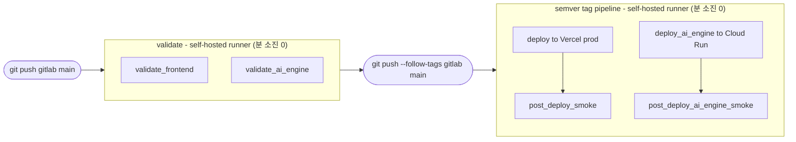

# CI/CD 파이프라인 & 의존성 관리

> GitLab canonical + GitLab CI main validate + semver tag deploy(frontend/ai-engine) + smoke 레퍼런스
> Owner: platform-devops
> Status: Active
> Doc type: How-to
> Last reviewed: 2026-05-07
> Canonical: docs/development/ci-cd.md
> Tags: ci,cd,gitlab,vercel,github-actions,automation

## 개요

현재 운영 기준은 **GitLab canonical repo + GitLab CI branch/main validate(frontend + ai-engine) + semver tag deploy(frontend + ai-engine) + post-deploy smoke + 로컬 Docker CI 보강 검증** 입니다. GitHub는 이제 **frontend-only public snapshot** 으로만 사용하며, CI/CD·배포·릴리즈 권위가 없습니다.

로컬 canonical repo에는 과거 GitHub Actions workflow 파일이 reference로 남아 있을 수 있지만, `npm run sync:github` 공개 스냅샷은 `.github/`, `docs/`, `tests/`, `scripts/`, `reports/`, `cloud-run/`을 제외합니다. 따라서 GitHub public repo는 Actions를 실행하는 delivery surface가 아니라, Vercel에 노출되는 Next.js frontend shell, 공개 정적 데이터, 최소 실행 설정만 보여주는 읽기/분석용 snapshot입니다.

이 문서는 CI/CD 토폴로지와 정책 배경을 설명하는 reference입니다. 실제 배포/롤백 절차를 따라야 할 때는 [Deployment Guide](../operations/deployment-guide.md)와 [Rollback Guide](../operations/rollback-guide.md)를 먼저 사용합니다.

배포 시작 시점의 runner 상태에 따라 자동 분기하려면 아래 명령을 사용합니다.

```bash
npm run deploy:smart
```

- `scripts/ci/runner-health-check.sh`가 `exit 0`이면 `git push --follow-tags gitlab main` 경로로 CI 배포를 사용합니다.
- `exit 1`이면 CI 게이트를 건너뛰고 `vercel --prod` 직접 배포로 전환하며, 스킵 사실을 콘솔에 명시적으로 출력합니다.

## 파이프라인 흐름



| Stage | Runner | 트리거 조건 |
|-------|--------|------------|
| `validate` | self-hosted `wsl2-docker` (분 소진 0) | branch/MR/main 코드 변경 push |
| `deploy` | self-hosted `wsl2-docker` (분 소진 0) | semver tag `v*.*.*` |
| `deploy_ai` | self-hosted `wsl2-docker` (분 소진 0) | semver tag `v*.*.*` |
| `smoke` | self-hosted `wsl2-docker` (분 소진 0) | semver tag deploy 이후 |

```
코드 변경 → pre-commit / pre-push / 필요 시 `npm run ci:local:docker`
        → `git push gitlab main`
        → GitLab CI validate(frontend) (`type-check` + `lint:ci` + `test:quick` + `test:contract`)
        → GitLab CI validate(ai-engine) (`cd cloud-run/ai-engine && npm run type-check && npm run test`, 변경 시만)

릴리즈 배포 → `./scripts/release/publish.sh patch|minor|major`
          → `git push --follow-tags gitlab main`
          → GitLab tag pipeline deploy(frontend) (`vercel build --prod` + `vercel deploy --prebuilt --prod`)
          → GitLab tag pipeline deploy(ai-engine) (`cd cloud-run/ai-engine && LOCAL_DOCKER_PREFLIGHT=false bash deploy.sh`)
          → GitLab tag pipeline post-deploy smoke(frontend) (`/`, `/login`, `/api/version`)
          → GitLab tag pipeline post-deploy smoke(ai-engine) (`/health`, `/warmup`, `/monitoring`)
          → Vercel production / Cloud Run production

공개 코드 공유 → GitLab 기준 frontend-only public snapshot 생성 → GitHub 수동 동기화
```

- 1인 개발 기본 경로는 local validate 후 `git push gitlab main` 입니다.
- feature branch / Merge Request는 고위험 변경, 병렬 작업, 리뷰 기록이 필요한 경우에만 선택 경로로 사용합니다.

## Git 연동 방식 vs 현재 방식

Vercel의 일반적인 Git 연동은 **Vercel이 GitHub/GitLab 저장소를 직접 추적하고, branch push/merge 때 Vercel 인프라에서 빌드와 배포를 수행하는 방식**입니다. 현재 OpenManager는 이 경로를 쓰지 않고, **GitLab CI가 배포 게이트를 잡은 뒤 Vercel CLI prebuilt deploy를 호출하는 방식**을 사용합니다.

| 비교 항목 | Vercel Git 연동 | 현재 OpenManager 방식 |
|---|---|---|
| 저장소 연결 | Vercel이 Git provider에 연결 | Vercel Git Integration 해제, GitLab CI가 명시적으로 호출 |
| 빌드 위치 | Vercel build 인프라 | GitLab CI `deploy` job의 self-hosted runner |
| validate 위치 | 선택적, 보통 Git provider CI와 분리 | GitLab CI `validate(frontend)`/`validate_ai_engine` |
| 배포 방식 | push/merge 시 Vercel이 clone + build + deploy | `vercel build --prod` 후 `vercel deploy --prebuilt --prod` |
| preview/prod 자동화 | Vercel branch tracking 중심 | GitLab branch/MR/main validate + semver tag deploy 중심 |
| Vercel build 시간 | 사용 | `--prebuilt` 경로라 Vercel-side build는 우회 |
| 권한 경계 | Vercel이 저장소 접근 권한 보유 | GitLab CI가 필요한 시점에만 Vercel token 사용 |

중요한 해석:

- 현재 방식은 **self-hosted runner가 prebuilt artifact를 생성하는 구조가 아닙니다.**
- 실제 역할 분리는 다음과 같습니다.
  - `validate(frontend)`, `validate_ai_engine`: `wsl2-docker` self-hosted runner on branch/MR/main push
  - `deploy(frontend)`, `deploy_ai_engine`, `post_deploy_smoke(frontend)`, `post_deploy_ai_engine_smoke`: `wsl2-docker` self-hosted runner on semver tag push
- 따라서 현재 방식의 정확한 표현은 **"self-hosted validate + self-hosted tag deploy"** 입니다.
- "로컬에서 검증한 결과물을 그대로 배포한다"는 표현은 과합니다. 더 정확한 표현은 **"GitLab CI validate를 통과한 뒤, GitLab deploy job이 생성한 prebuilt output을 Vercel에 업로드한다"** 입니다.
- prebuilt deploy는 Vercel build 시스템을 우회하지만, 공식 문서 기준으로 **로컬/자체 CI 환경의 아키텍처 차이**는 여전히 주의해야 합니다. 네이티브 의존성이 있으면 Vercel production과 최대한 비슷한 Linux x64 환경에서 build하는 편이 안전합니다.
- 이미 같은 semver tag의 GitLab pipeline이 실패한 상태라면, 설정 수정 후 **기존 failed job/pipeline을 retry**하는 것이 먼저입니다. 같은 remote tag를 다시 `git push`해도 새 파이프라인은 생기지 않습니다.

## 현재 저장소/배포 토폴로지 (2026-05-07)

- **GitLab private (`gitlab`)**: canonical development repo
- **Vercel Frontend**: GitLab CI `deploy` job이 semver tag pipeline에서 `vercel build` + `vercel deploy --prebuilt --prod`로 production 배포
- **Cloud Run AI Engine**: GitLab CI `deploy_ai_engine` job이 semver tag pipeline에서 production 배포를 수행하고, `post_deploy_ai_engine_smoke`는 그 뒤 현재 production service를 대상으로 `/health`, `/warmup`, `/monitoring` 기준 최소 smoke를 수행
- **GitLab CI**: 활성 (`branch/MR/main validate(frontend + ai-engine) -> semver tag deploy(frontend + ai-engine) -> semver tag smoke`)
- **`.gitlab-ci.yml`**: 최소 파이프라인으로 유지. docs/reports 전용 push는 `changes` 규칙으로 CI 스킵
- **Production deploy serialization**: `deploy` job은 `resource_group: production`으로 직렬화되어 동시 배포를 막음
- **GitHub public (`github-public`, `origin` legacy fallback)**: frontend-only public snapshot, 수동 동기화 전용
- **GitHub public history**: orphan snapshot 기반의 최소 공개 이력만 유지
- **GitHub releases/tags**: 사용하지 않음
- **GitHub issues/wiki/projects**: 비활성
- **Dependency updates**: GitHub Dependabot 대신 self-hosted Renovate 사용
- **Local CI**: `npm run ci:local:docker` 를 broad/release 전 전체 검증 보강 경로로 사용

## GitLab vs GitHub 현재 역할 비교

| 항목 | GitLab (`gitlab`) | GitHub (`github-public`, `origin` legacy) |
|---|---|---|
| 저장소 성격 | private canonical repo | frontend-only public snapshot |
| 이력 범위 | full history | 최소 공개 이력 |
| 공개 범위 | 전체 앱/AI Engine/문서/테스트/운영 자산 | Next.js frontend shell, `public/`, 공개 설정만 |
| 제외 범위 | 없음 | `cloud-run/`, `.github/`, `docs/`, `tests/`, `scripts/`, `reports/`, agent 설정 |
| 테스트/문서/QA 기록 | 유지 | 제외 |
| GitHub Actions | reference 파일 보관 가능 | `.github/` 제외로 미노출/미실행 |
| release/tag 권위 | 있음 | 없음 |
| 배포 권위 | 있음 | 없음 |
| Vercel frontend 배포 권위 | GitLab CI `deploy` job | 사용 안 함 |
| 공개 코드 갱신 | source of truth | `npm run sync:github` 결과물 |
| collaboration surface | private development/MR | 읽기 전용 성격, issues/wiki/projects 비활성 |

## 앞으로의 배포/공개 경로

일상적인 운영 경로는 세 갈래로 고정합니다.

1. Frontend 배포
- optional feature branch / Merge Request 단계에서도 GitLab CI `validate` (`test:contract` 포함)
- `git push gitlab main`
- GitLab CI `validate`
- GitLab CI `deploy` (`vercel build --prod` + `vercel deploy --prebuilt --prod`)
- GitLab CI `post_deploy_smoke` (`/`, `/login`, `/api/version`)

1. AI Engine 검증
- `cloud-run/ai-engine/**` 변경 시 GitLab CI `validate_ai_engine`
- 수행 명령: `cd cloud-run/ai-engine && npm run type-check && npm run test`
- AI Engine only 변경이면 Vercel deploy는 실행되지 않음

1. AI Engine 배포
- `./scripts/release/publish.sh patch|minor|major`
- `git push --follow-tags gitlab main`
- GitLab CI `deploy_ai_engine`
- 수행 명령: `cd cloud-run/ai-engine && LOCAL_DOCKER_PREFLIGHT=false bash deploy.sh`
- 필수 GitLab CI Variables: `GCP_SERVICE_KEY`(service account JSON base64), `GCP_PROJECT_ID`
- protected 변수로 운영하므로 GitLab protected tags에 semver 패턴(`v*.*.*`)이 함께 등록되어 있어야 함

1. Release / tag
- `npm run release:patch|minor|major`
- `git push gitlab --follow-tags`
- canonical release/tag는 GitLab 기준으로만 유지
- semver tag deploy에서 protected CI 변수를 쓰려면 GitLab protected tags에 `v*.*.*`를 등록

1. Public GitHub refresh
- `npm run sync:github`
- GitLab canonical 기준 frontend-only public snapshot만 GitHub에 반영
- 공개 snapshot에는 `.github/`가 포함되지 않으므로 GitHub Actions가 배포/검증 경로로 동작하지 않음
- GitHub는 deploy source가 아니므로 `git push origin` 또는 `git push github-public`을 배포 절차로 사용하지 않음

1. Supabase schema / data
- `supabase/migrations/`, `supabase/seeds/` 기준 관리
- Git push만으로 자동 반영되지 않음
- 필요 시 `npx supabase db push` 또는 SQL 수동 실행
- 현재 레포에는 별도 Supabase Edge Function 배포 경로가 없음

## Local Docker CI (Supplemental Full Validation)

현재 로컬 전체 검증 표준 경로는 `scripts/ci/local-docker-ci.sh` 입니다. GitLab CI를 대체하는 경로가 아니라, broad change / release 전 전체 검증을 보강하는 경로로 사용합니다.

```bash
# 기본: host node_modules 재사용 + container network 차단
npm run ci:local:docker

# AI Engine docker preflight까지 포함
npm run ci:local:docker:full

# 깨끗한 설치 기반으로 1회 검증이 필요할 때
CI_DOCKER_INSTALL_MODE=npm-ci npm run ci:local:docker

# 외부 pull까지 완전히 막고 캐시된 이미지로만 실행할 때
CI_DOCKER_PULL_POLICY=never npm run ci:local:docker
```

운영 원칙:
- `.gitlab-ci.yml`은 현재 branch/MR `validate(frontend + ai-engine)` → main `deploy(frontend + ai-engine)` → frontend `post_deploy_smoke` 최소 파이프라인으로 유지합니다. E2E 같은 더 무거운 검증까지 canonical GitLab CI에 모두 넣지 않습니다.
- branch에 열린 Merge Request가 있으면 push pipeline 대신 MR pipeline만 유지해 중복 실행을 줄입니다.
- `post_deploy_smoke`는 `/api/health` 자동 호출 대신 `/`, `/login`, `/api/version`만 확인합니다. 수동 전용 health-check 정책과 free-tier 비용 원칙을 함께 지키기 위한 선택입니다.
- 기본 모드 `prefer-local`은 host `node_modules`를 재사용하고 container를 `--network none`으로 실행해 외부 접근을 최소화합니다.
- 기본 pull policy는 `if-not-present` 입니다. 최초 base image pull 이후에는 로컬 이미지 캐시를 재사용합니다.
- 외부 pull까지 막아야 할 때는 `CI_DOCKER_PULL_POLICY=never` 를 사용합니다.
- `npm-ci` 모드는 새 의존성 설치가 필요할 때만 사용합니다.
- broad change, release 전, 배포 민감 변경에서는 pre-push hook만으로 끝내지 말고 `npm run ci:local:docker`를 추가로 실행합니다.
- docs/reports 전용 push는 `.gitlab-ci.yml`의 `changes` 규칙으로 CI가 스킵되므로, 별도 코드 검증이 필요 없을 때만 사용합니다.

### `.gitlab-ci.yml` 작성 주의

- `before_script`, `script`, `after_script` 안에서 `- # 설명` 형태를 쓰면 YAML 리스트의 `null` item이 만들어져 GitLab job semantic validation에서 거부됩니다.
- 설명이 필요하면 리스트 바깥의 일반 YAML 주석을 쓰거나, 실제 shell 명령 문자열 안에서 `echo` 또는 shell comment로 표현합니다.
- 로컬에서는 pre-push가 같은 패턴을 차단합니다.
- 수동 확인이 필요하면 아래 명령으로 `.gitlab-ci.yml`만 빠르게 검사합니다.

```bash
npm run ci:gitlab:check
```

### 선택지 비교

| 선택지 | GitLab 비용 | 외부 의존 | 상태 체크 | 현재 프로젝트 적합도 |
|---|---:|---|---|---|
| wsl2-docker self-hosted runner | GitLab quota 0 | 중간 | 높음 | 활성 (`validate`, `deploy`, `deploy_ai_engine`, `smoke`) |
| GitLab.com shared runner | 월 compute quota 소모 | 낮음 | 높음 | 비활성 (긴급 우회용으로만 고려) |
| 현재 로컬 Docker CI | GitLab quota 0 | 낮음 | GitLab native status 없음 | broad/release 보강 |

판단 기준:
- 현재 모든 GitLab CI job은 `tags: [wsl2-docker]`가 붙은 self-hosted runner에서 실행되어 GitLab compute minutes를 소모하지 않습니다.
- semver tag deploy도 같은 self-hosted runner를 사용하므로, runner가 살아 있으면 shared runner quota 이슈 없이 배포됩니다.
- 긴급 fallback이 정말 필요할 때만 `vercel --prod` 직접 배포를 사용합니다.

### 권장 실행 순서

1. 기본 경로는 `pre-commit` + `pre-push`
2. broad change, release 전, 배포 민감 변경에는 `npm run ci:local:docker`를 push 전에 추가
3. canonical 반영은 `git push gitlab main`
4. GitLab CI `validate`는 branch / Merge Request / main 프론트엔드/공용 코드 변경에서 `wsl2-docker` self-hosted runner로 실행
5. GitLab CI `validate_ai_engine`는 branch / Merge Request / main `cloud-run/ai-engine/**` 변경에서 `wsl2-docker` self-hosted runner로 실행
6. GitLab CI `deploy`는 semver tag pipeline에서 self-hosted runner가 `vercel build --prod` + `vercel deploy --prebuilt --prod` 수행
7. GitLab CI `deploy_ai_engine`는 semver tag pipeline에서 self-hosted runner가 Cloud Run production 배포 수행
8. GitLab CI `post_deploy_smoke` / `post_deploy_ai_engine_smoke`는 같은 tag pipeline에서 저비용 smoke 확인
9. production `deploy`는 `resource_group: production`으로 직렬화되어 연속 push에서도 동시 실행되지 않음
10. semver tag pipeline에서 protected CI 변수를 쓰려면 GitLab protected tag 패턴(`v*.*.*`)을 함께 설정해야 함
11. 외부 pull까지 차단해야 할 때만 `CI_DOCKER_PULL_POLICY=never` 사용

### 현재 운영 구성

- `validate` runner: `wsl2-docker` self-hosted runner
- `validate_ai_engine` runner: `wsl2-docker` self-hosted runner
- `deploy` runner: `wsl2-docker` self-hosted runner
- `deploy_ai_engine` runner: `wsl2-docker` self-hosted runner
- `smoke` runner: `wsl2-docker` self-hosted runner
- 서비스: WSL2 Ubuntu 내 `gitlab-runner` systemd 서비스 자동 시작
- executor: `shell`
- 시스템 Node/npm/vercel/gcloud 사용
- 태그 정책: `tags: [wsl2-docker]`

운영 메모:
- WSL2 runner가 꺼져 있으면 `validate` job은 pending 상태로 남습니다.
- 이 경우 기본 대응은 WSL2 / `gitlab-runner` 서비스를 다시 올리는 것입니다.
- semver tag deploy에서 protected CI 변수를 사용하므로 GitLab protected tags에 `v*.*.*` 패턴을 함께 등록합니다.
- 임시 우회가 정말 필요할 때만 `npm run deploy:smart`의 direct `vercel --prod` fallback을 사용합니다.
- Merge Request가 열려 있는 branch는 duplicate pipeline 방지를 위해 branch push pipeline 대신 MR pipeline이 우선합니다.

즉, **현재는 self-hosted validate + self-hosted semver tag deploy + local Docker CI 보강 검증** 구성이 기본 운영값입니다.

### 비용 정책

- **GitLab CI**: 활성. 현재 모든 job이 self-hosted runner라 GitLab shared runner minutes를 쓰지 않습니다.
- **Local Docker CI**: broad/release 전 전체 검증을 보강할 때 우선 사용
- **GitHub Actions**: canonical repo에 역사적/보조 workflow reference가 남아 있을 수 있지만, public snapshot에서는 `.github/`가 제외되어 실행되지 않음
- **스케줄 워크플로우 기본값**: 비용/정책 변경 리스크를 줄이기 위해 비필수 `schedule` 잡은 기본적으로 꺼져 있습니다. 자동 실행이 꼭 필요할 때만 저장소 변수 `ENABLE_ACTIONS_SCHEDULES=true`로 명시적으로 활성화합니다.
- **Vercel**: 프론트엔드 production hosting 및 deploy target입니다. 배포 권위는 GitLab CI semver tag `deploy` job에 두며, GitHub Actions에서 중복 빌드를 늘리지 않습니다.
- **Cloud Run**: `deploy.sh` + Cloud Build free-tier 가드 기준으로 운영합니다.

### 판단 근거 (Official Docs)

- Vercel Git 연동은 GitHub/GitLab 연결 후 tracked branch push/merge마다 Vercel이 clone + build + deploy를 수행합니다.
- Vercel `vercel deploy --prebuilt`는 `.vercel/output`을 업로드하는 방식이며, Vercel-side build를 우회합니다. 다만 공식 문서 기준으로 build-time System Environment Variables가 필요한 프로젝트에는 부적합할 수 있습니다.
- GitLab shared runner quota는 월 단위로 reset되며, quota 초과 시 shared runner job 처리가 중단됩니다.
- 현재 `wsl2-docker` project runner는 이 compute quota의 직접 대상이 아닙니다.
- GitLab self-hosted runner는 원격 코드 실행 서비스이므로 host hardening과 최소 권한 관리가 필수입니다.
- tag pipeline에서 protected CI 변수를 사용하려면 protected branch뿐 아니라 protected tag 패턴도 함께 관리해야 합니다.

---

## Historical Appendix: GitHub Actions 워크플로우 (Legacy)

> 아래 섹션은 현재 운영 경로가 아닙니다.
> GitHub public repo는 frontend-only snapshot이고 `.github/`가 제외되므로, 아래 workflow들은 공개 저장소에서 실행되지 않습니다.
> 현재 primary delivery path는 `pre-commit / pre-push / 필요 시 ci:local:docker` → `git push gitlab main`으로 validate → `./scripts/release/publish.sh patch|minor|major` + semver tag push로 deploy/smoke → production 입니다. branch/MR validate는 선택 경로로 유지합니다.
> 이후 내용은 과거 GitHub Actions 구성과 보조 자동화 참고용으로만 유지합니다.

### 워크플로우 전체 맵

| # | 워크플로우 | 파일 | 트리거 | 역할 |
|---|----------|------|--------|------|
| 1 | **CI/CD Core Gates** | `ci-optimized.yml` | Push/PR (main, develop) | 🔒 **핵심 차단형 CI** |
| 2 | **Quality Gates** | `quality-gates.yml` | 수동 전용 | 📊 추가 품질 점검 |
| 3 | **CodeQL Analysis** | `codeql-analysis.yml` | Push/PR + 선택적 주간 스케줄 | 🔐 정적 보안 분석 |
| 4 | **Dependabot Auto-Merge** | `dependabot-auto-merge.yml` | Dependabot PR + 선택적 스케줄 backfill | 🤖 패치 자동 머지 |
| 5 | **Branch & PR Cleanup** | `branch-cleanup.yml` | 선택적 주간 스케줄 / 수동 | 🧹 브랜치/PR 정리 |
| 6 | **Keep Services Alive** | `keep-alive.yml` | 선택적 주 2회 스케줄 / 수동 | 💓 Supabase 비활성화 방지 |
| 7 | **Prompt Evaluation** | `prompt-eval.yml` | 수동 전용 | 🔬 Promptfoo 테스트 |
| 8 | **Docs Quality** | `docs-quality.yml` | docs 변경 / 수동 | 📝 문서 품질 검증 |
| 9 | **Cleanup CI Artifacts** | `artifact-cleanup.yml` | 선택적 주간 스케줄 / 수동 | 🗑️ Playwright artifact 정리 |

### 스케줄 가드

비필수 스케줄 잡은 기본적으로 자동 실행되지 않습니다.

- 기본값: `ENABLE_ACTIONS_SCHEDULES` 미설정 또는 `false`
- 자동 실행 허용: 저장소 변수 `ENABLE_ACTIONS_SCHEDULES=true`
- 수동 실행: `workflow_dispatch`는 그대로 사용 가능

---

### 1. CI/CD Core Gates (`ci-optimized.yml`) — 핵심 게이트

**가장 중요한 워크플로우.** 모든 PR과 main/develop 푸시 시 자동 실행.

```
Push/PR
  ├── code-quality (차단형)
  │   ├── Biome Check
  │   └── TypeScript Check
  │
  ├── unit-tests (차단형)
  │   ├── npm run test:quick
  │   └── npm run test:contract
  │
  ├── e2e-critical (차단형, 프론트엔드 변경 시만)
  │   └── npm run test:e2e:critical
  │
  ├── security-scan (main/PR 차단형)
  │   └── Hardcoded Secrets Check
  │
  └── deployment-ready (게이트)
      └── 위 차단형 job 통과 시 → ✅ 배포 준비 완료
```

**NPM 429 에러 대응**: CI 환경에서 npm registry 429 (Rate Limit) 에러가 빈번하므로, retry 로직이 내장되어 있습니다:
- 최대 3회 재시도
- 15→25→35초 증분 대기
- 실패 시 npm cache 강제 정리

**스킵 조건**:
- `[skip ci]`가 커밋 메시지에 포함된 push → 완전 스킵
- `docs/**`, `**/*.md` 변경 → paths-ignore로 자동 제외

**비용 제어 포인트**:
- `detect-scope`가 `frontend_changed`를 계산하고, 무거운 `E2E Critical`은 실제 프론트엔드 변경이나 수동 실행에서만 동작
- `ai_engine_changed`가 `false`면 Cloud Run 전용 검증은 생략
- `concurrency.cancel-in-progress: true`로 같은 ref의 중복 실행을 자동 취소

**동시성 제어**:
```yaml
concurrency:
  group: ci-core-${{ github.workflow }}-${{ github.ref }}
  cancel-in-progress: true  # 같은 브랜치의 이전 실행 자동 취소
```

---

### 2. Quality Gates (`quality-gates.yml`) — 수동 품질 점검

정기 스케줄이 아니라 **수동 실행 전용**입니다.

| Job | 검사 항목 |
|-----|----------|
| TypeScript Zero-Error Gate | `npm run type-check` 에러 0개 강제 |
| Hook Dependencies Check | Biome 정적 분석 |
| Architecture Health | 대형 컴포넌트 탐지 (500줄+), 순환 의존성 검사 |

**아키텍처 건강성** 검사는 코드 복잡도가 점진적으로 증가하는 것을 방지합니다:
- `find src/components -name "*.tsx" | wc -l > 500` → 경고
- `madge --circular` → 순환 참조 검출

---

### 3. CodeQL Analysis (`codeql-analysis.yml`)

- `push`/`pull_request`에는 자동 실행
- 주간 `schedule`은 `ENABLE_ACTIONS_SCHEDULES=true`일 때만 실행
- 공개 저장소라도 CodeQL 주간 스캔을 기본 on으로 두지 않고, 운영자가 명시적으로 활성화할 때만 주기 실행합니다.

---

### 4. Dependabot Auto-Merge (`dependabot-auto-merge.yml`)

→ historical reference only. 현재 canonical 경로는 [Part 2: Renovate 의존성 관리](#part-2-renovate-의존성-관리) 참조

---

### 5. Branch & PR Cleanup (`branch-cleanup.yml`) — 자동 정리

수동 실행은 항상 가능하고, 주간 스케줄은 `ENABLE_ACTIONS_SCHEDULES=true`일 때만 실행됩니다.

| Job | 역할 |
|-----|------|
| 🧹 Stale Branch Cleanup | 30일 이상 미사용 원격 브랜치 탐지 (보호 브랜치 제외) |
| 📦 Dependabot PR Status | 7일 이상 미처리 Dependabot PR 경고 |
| 🗑️ Merged Branch Cleanup | 이미 main에 병합된 브랜치 탐지 |
| 📊 Weekly Summary | GITHUB_STEP_SUMMARY에 종합 리포트 |

> 자동 삭제는 수행하지 않고 **탐지 + 리포트**만 수행합니다. 삭제는 수동으로 진행합니다.

---

### 6. Keep Services Alive (`keep-alive.yml`) — 비활성화 방지

**목적**: Supabase 무료 티어는 **1주일 미사용 시 프로젝트 자동 일시 정지(Pause)**. 이를 방지하기 위해 주 2회 ping을 보냅니다.

- **Supabase Ping**: REST API에 `apikey` 헤더로 요청 → HTTP 200 확인
- **Vercel Health Ping**: `/api/health` 엔드포인트 상태 확인

스케줄: 매주 **수요일 + 일요일** 09:00 KST.

운영 원칙:
- 기본값은 off
- 실제로 keep-alive가 필요한 기간에만 `ENABLE_ACTIONS_SCHEDULES=true`
- 필요 없으면 수동 실행만 사용

---

### 7. Prompt Evaluation (`prompt-eval.yml`) — AI 프롬프트 품질

AI Engine의 프롬프트가 변경될 때 [Promptfoo](https://promptfoo.dev/)로 자동 평가합니다.

```
cloud-run/ai-engine/promptfoo/** 변경 → Promptfoo eval 실행
cloud-run/ai-engine/src/services/ai-sdk/agents/** 변경 → Promptfoo eval 실행
```

- 기본 평가: `promptfooconfig.yaml` 기반
- Red-team 보안 테스트: 수동 실행 시 `run_redteam: true` 옵션으로 활성화
- 결과: GitHub Artifacts에 30일간 보관

---

### 8. Docs Quality (`docs-quality.yml`) — 문서 품질

`docs/` 변경 시 자동 실행되며, 전체 외부 링크 검사는 수동 실행 시에만 동작합니다.

| 검사 | 내용 |
|------|------|
| `docs:check` | Markdown 구조, Diataxis 분류, 메타데이터 검증 |
| `docs:lint:changed` | 변경된 문서만 Markdown lint |
| 버전 정합성 | `CLAUDE.md`, `GEMINI.md`에 `package.json` 버전 반영 확인 |
| 외부 링크 | 수동 실행 시만 전체 외부 링크 유효성 검사 |

---

### 9. Canonical Release Path — 로컬 + GitLab

GitHub Actions 기반의 `release-manual.yml`은 제거되었습니다. 현재 릴리즈 권위 경로는 canonical 로컬 워크스페이스와 GitLab입니다.

- 릴리즈 실행:
  - `./scripts/release/publish.sh patch|minor|major`
- canonical 반영:
  - `git push gitlab --follow-tags`
- 일상 배포:
  - `git push gitlab main` → GitLab CI `validate`
  - `./scripts/release/publish.sh patch|minor|major` → semver tag pipeline `deploy` / `deploy_ai_engine` / `smoke`
- 실패 복구:
  - semver tag pipeline이 이미 생성된 경우에는 GitLab UI에서 failed job/pipeline을 retry
  - 같은 remote tag를 다시 push하는 방식은 새 deploy pipeline을 만들지 못함
- public snapshot refresh:
  - 필요할 때만 로컬에서 `npm run sync:github`

즉, GitHub mirror에는 release/sync 전용 workflow가 없고, 공개 snapshot은 canonical 로컬 워크스페이스에서만 생성합니다.

---

### 10. Cleanup CI Artifacts (`artifact-cleanup.yml`)

Playwright 실패 산출물이 Actions storage를 잠식하지 않도록 오래된 artifact를 정리합니다.

- 수동 실행은 항상 가능
- 주간 스케줄은 `ENABLE_ACTIONS_SCHEDULES=true`일 때만 실행
- 삭제 대상: `playwright-report-*`, `playwright-results-*`
- 보존 기준: 7일 초과 artifact

---

## Part 2: Renovate 의존성 관리

### 현재 운영 결론

- GitHub public snapshot에는 `.github/dependabot.yml`과 GitHub Actions가 노출되지 않으므로 Dependabot/auto-merge 워크플로우는 canonical delivery path가 아닙니다.
- Renovate 공식 문서 기준 hosted GitLab.com app은 현재 offline 상태이므로, GitLab canonical repo에는 self-hosted 경로를 사용합니다.
- 현재 프로젝트 제약에서는 **always-on bot server보다 local Docker self-hosted runner**가 더 적합합니다.

### 현재 설정 파일

- repo config: `renovate.json`
- self-hosted compose: `config/renovate/docker-compose.yml`
- env example: `config/renovate/renovate.env.example`
- run script: `scripts/renovate/run-self-hosted.sh`

### 실행 방법

```bash
cp config/renovate/renovate.env.example config/renovate/.env
# config/renovate/.env 에 RENOVATE_TOKEN 입력

npm run renovate:config:check
npm run renovate:dry-run
npm run renovate:run
```

운영 원칙:
- 실행 주기는 Renovate config 내부가 아니라 **호스트 스케줄러**에서 관리합니다.
- 권장 주기: 매일 00:30 KST 1회
- Windows 기준 Task Scheduler, Linux/WSL 기준 cron/systemd timer 사용
- `lockFileMaintenance`는 `renovate.json`에서 활성화하며, Monday before 4am KST window로 제한합니다. daily host runner는 이 window를 통과할 때만 lockfile maintenance PR을 생성합니다.
- 현재 GitLab CI gate가 생겼더라도 **automerge는 기본 비활성** 상태를 유지합니다.
- 수동 또는 스케줄 실행 후에는 `reports/planning/TODO.md` 또는 해당 dependency hygiene plan에 실행일, dry-run/run 여부, 생성 MR 수, blocker를 기록합니다. 토큰/시크릿 값은 기록하지 않습니다.

### 현재 Renovate 정책

| 항목 | 현재값 |
|------|--------|
| 그룹화 | TypeScript / types / testing / Playwright / Storybook / linting / react / react-types / ai-sdk / Hono runtime / AI Engine runtime |
| PR 제한 | 동시 5개, 시간당 5개 |
| lockfile maintenance | 활성, Monday before 4am KST |
| 리뷰 기본값 | `skyasu2` assignee/reviewer |
| patch 업데이트 | `patch-update` 라벨 부여 |
| minor/major 업데이트 | `needs-review` 라벨 부여 |
| automerge | 비활성 |

### 왜 automerge를 지금 바로 켜지 않는가

- 이전 Dependabot patch automerge는 GitHub Actions CI 보호막 위에서 동작했습니다.
- 현재 GitLab canonical 경로에는 validate→deploy gate가 있지만, dependency update까지 자동 병합하면 운영자 승인 없이 production 반영까지 이어질 수 있습니다.
- 따라서 patch라도 자동 병합까지 열지 않고, validate 통과 여부와 별개로 수동 승인 단계를 유지합니다.
- 지금 단계에서는 **MR 자동 생성 + 그룹화 + 수동 승인**이 맞습니다.

### historical GitHub reference

아래 내용은 과거 GitHub-only 운영 참고용으로만 유지합니다.

### 설정 파일: `.github/dependabot.yml`

```yaml
version: 2
updates:
  - package-ecosystem: 'npm'
    directory: '/'
    schedule:
      interval: 'daily'           # 유지보수 모드: patch 부채 방지
    open-pull-requests-limit: 5   # PR 폭탄 방지
    assignees: ['skyasu2']
    reviewers: ['skyasu2']
```

### 의존성 그룹화

관련 패키지를 묶어서 PR 수를 줄입니다:

| 그룹명 | 패턴 | 예시 |
|--------|------|------|
| `typescript-core` | `typescript` | TypeScript 코어 |
| `types` | `@types/*` | 일반 타입 정의 |
| `testing` | `vitest`, `@vitest/*`, `playwright`, `@playwright/*` | 테스트 도구 |
| `linting` | `@biomejs/*` | 린팅/포매팅 |
| `react` | `react`, `react-dom` | React 런타임 |
| `react-types` | `@types/react*` | React 타입 정의 |
| `ai-sdk` | `ai`, `@ai-sdk/*` | Vercel AI SDK |

### Auto-Merge 워크플로우

`.github/workflows/dependabot-auto-merge.yml`의 자동 머지 정책:

```
Dependabot PR 생성
  │
  ├── Patch (x.x.1 → x.x.2)
  │   └── CI 통과 → ✅ 자동 squash merge (gh pr merge --auto --squash)
  │
  └── Minor/Major (x.1.0 → x.2.0 or 1.x → 2.x)
      ├── "needs-review" 라벨 추가
      └── 코멘트: "⚠️ 수동 리뷰가 필요합니다"
```

### 결정 근거

| 정책 | 이유 |
|------|------|
| Patch 자동 머지 | 유지보수 모드에서 patch를 매일 흡수해 기술 부채 누적을 막음 |
| Minor/Major 수동 리뷰 | Breaking change, API 변경 가능성 → 수동 검증 필요 |
| 매일 실행 | patch는 빨리 흡수하고, 큰 변경은 review label로 자동 분리 |
| 최대 5 PR | Dependabot PR이 쌓여 리뷰 부담이 되는 것 방지 |

현재 canonical GitLab 운영에서는 위 정책을 **그룹화/라벨링까지만 유지**하고, 자동 머지는 보류합니다.

---

## Part 3: 배포 전략

### Vercel (Frontend) — GitLab CI 경유 배포

```
`git push gitlab main`
        → GitLab CI validate

`git push --follow-tags gitlab main`
        → GitLab CI deploy (`vercel build --prod` + `vercel deploy --prebuilt --prod`)
        → Vercel Production
```

- GitLab CI는 `main` push에서는 validate만, semver tag push에서는 deploy/smoke까지 담당합니다.
- Vercel Git Integration은 해제되어 있어 Git push만으로 Vercel이 별도 자동 빌드를 시작하지 않습니다.
- `SKIP_ENV_VALIDATION=true`로 환경변수 없이도 빌드 성공 보장
- 기본 Git push 대상은 canonical remote인 `gitlab` 입니다.
- 1인 개발 기본 경로는 canonical `main` direct push + semver tag deploy 입니다.
- `git push gitlab main`은 표준 validate 트리거입니다.
- `git push --follow-tags gitlab main`은 semver tag가 있을 때 표준 deploy 트리거입니다.
- feature branch → MR merge 는 고위험 변경, 병렬 작업, 리뷰 기록이 필요한 경우에만 권장합니다.
- 원하면 로컬 strict mode로 `BLOCK_MAIN_DIRECT_PUSH=true git push gitlab main`을 사용해 일시적으로 branch/MR 흐름을 강제할 수 있습니다.

### GitLab main 보호 설정 점검

로컬에서 아래 명령으로 GitLab `main` 보호 규칙 점검 가이드를 출력할 수 있습니다.

```bash
npm run gitlab:protection:check
```

- `GITLAB_TOKEN`(또는 `GL_TOKEN`, `GLAB_TOKEN`)이 없으면 수동 체크리스트를 출력합니다.
- 토큰이 있으면 GitLab API로 아래를 함께 검증합니다.
  - `main` 보호 브랜치 설정(`push/merge/force-push`)
  - semver protected tag 패턴 `v*.*.*`
  - deploy 필수 변수 `VERCEL_TOKEN`, `GCP_SERVICE_KEY`, `GCP_PROJECT_ID`
- 아래 명령으로 canonical 라우팅(원격/훅/CI gate/배포 가드) 일관성을 한 번에 점검할 수 있습니다.

```bash
npm run git:verify:canonical
```

배포 트리거 전 인증 체크(혼입 방지):
```bash
env -u GITHUB_PERSONAL_ACCESS_TOKEN gh auth status -h github.com
env -u GITHUB_PERSONAL_ACCESS_TOKEN gh api user -q .login
git remote -v | head -n 2
```

### Cloud Run (AI Engine) — GitLab CI 또는 수동 배포

```bash
# GitLab canonical 경로
git push gitlab main
# → validate_ai_engine
# → deploy_ai_engine
# → post_deploy_ai_engine_smoke

# 수동 경로(필요 시)
cd cloud-run/ai-engine
bash deploy.sh
```

배포 파이프라인:
```
Free Tier 가드레일 검증 → 로컬 Docker 프리플라이트(로컬 경로일 때) → SSOT 데이터 동기화
  → Cloud Build (이미지 빌드) → Cloud Run 배포 → 헬스체크
  → 이전 이미지/리비전 자동 정리 (백그라운드)
```

GitLab CI `deploy_ai_engine` 필수 변수:

- `GCP_SERVICE_KEY`: 전용 GitLab 배포 서비스 계정 `gitlab-ai-engine-deployer@openmanager-free-tier.iam.gserviceaccount.com` 의 JSON key를 base64로 인코딩한 값
- `GCP_PROJECT_ID`: 배포 대상 프로젝트 ID

운영 메모:

- `GCP_SERVICE_KEY`가 비어 있으면 job은 `before_script`에서 즉시 실패합니다.
- `gcp-key.json`이 빈 파일로 decode되는 경우도 별도 검사로 차단합니다.
- 현재 안정 배포 기준 권한은 프로젝트 `roles/editor`, `roles/secretmanager.secretAccessor`, 런타임 서비스 계정 `490817238363-compute@developer.gserviceaccount.com` 에 대한 `roles/iam.serviceAccountUser` 입니다.
- 더 좁은 role set으로 줄이는 실험은 Cloud Build source bucket 접근에서 추가 제약이 확인돼 보류했습니다. 전용 서비스 계정으로 먼저 격리하고, 세부 권한 축소는 별도 배치로 다룹니다.
- GitLab CI deploy 계열 job은 protected CI 변수를 사용하므로, 보호 브랜치뿐 아니라 semver protected tag(`v*.*.*`) 설정도 함께 맞아야 합니다. 보호 태그가 빠지면 tag pipeline에서 deploy가 fail-closed로 차단될 수 있습니다.
- `post_deploy_ai_engine_smoke`는 배포 후 `gcloud run services describe`로 현재 service URL을 조회한 뒤 `/health`, `/warmup`, `/monitoring`(unauth 401/403 기대)만 확인합니다. LLM 호출은 없습니다.
- `post_deploy_ai_engine_smoke`는 `deploy_ai_engine`가 같은 파이프라인에 있을 때는 그 job 이후에 대기하고, smoke 스크립트나 `.gitlab-ci.yml`만 바뀐 경우에는 현재 production service를 직접 점검합니다.
- 수동 배포는 로컬 `gcloud` 인증이 이미 되어 있으면 `cd cloud-run/ai-engine && bash deploy.sh`로 계속 가능합니다.

---

## 관련 문서

- [프로젝트 셋업](./project-setup.md) - 로컬 개발 환경 설정
- [Docker 가이드](./docker.md) - Cloud Run 컨테이너 배포 상세
- [Deployment Guide](../operations/deployment-guide.md) - production 배포 runbook
- [Rollback Guide](../operations/rollback-guide.md) - rollback 판단/실행 runbook
- [Git Hooks 워크플로우](./git-hooks-workflow.md) - 로컬 Git hooks
- [Free Tier 최적화](../reference/architecture/infrastructure/free-tier-optimization.md)

_Last Updated: 2026-05-05_
