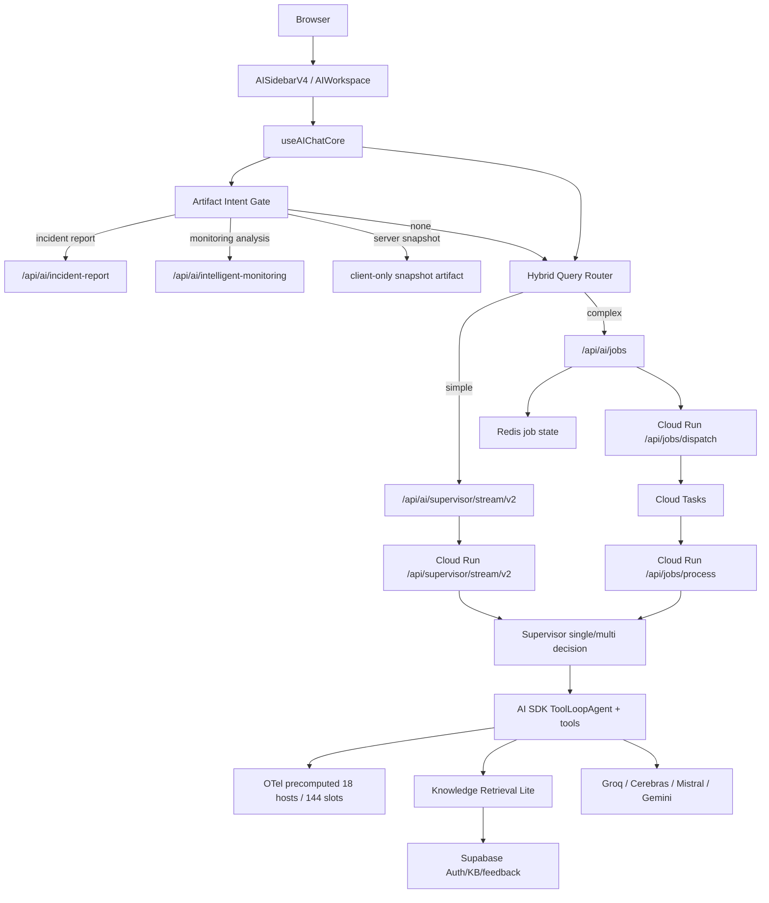

# AI Assistant Initial Design Comparison

> 처음부터 설계한다면 어떤 아키텍처를 선택할 수 있었는가 — Option A(채택)와 검토한 대안을 비교해 현재 상태의 변경·개선 필요점을 도출한다
> Owner: platform-architecture
> Status: Active Supporting
> Doc type: Explanation
> Last reviewed: 2026-05-03
> Canonical: docs/reference/architecture/ai/ai-assistant-initial-design-comparison.md
> Tags: ai,assistant,architecture,frontend,backend,comparison

**분석 기준일**: 2026-05-03
**현재 구현 기준**: OpenManager AI v8.11.85, Vercel Frontend + Cloud Run AI Engine
**목적**: 처음부터 프로젝트를 설계한다고 가정하고, 실제 채택한 구조(Option A)와 검토했던 대안들을 비교한다. 합리화가 아니라 대체 설계와의 차이를 통해 현재 구현에서 바꿀 점, 유지할 점, 나중에 검토할 점을 분리하는 것이 목적이다. 더 나은 방법이 있으면 채택한다.

**문서 사용법**:

- 대안들은 즉시 rewrite 후보가 아니라 현재 구현을 비추는 비교 렌즈로 사용한다.
- 각 대안은 "현재 Option A에 무엇을 흡수해야 하는가", "무엇은 지금 바꾸지 말아야 하는가"를 판단하기 위한 기준이다.
- 최종 산출물은 추상적인 아키텍처 선호가 아니라 §7의 적용 시나리오와 §8의 미결정 질문이다.

---

## 0. 고정 전제 조건 (변경 없음)

비교의 전제 조건이다. 이 조건을 충족하지 못하는 대안은 검토 대상에서 제외한다.

| 항목 | 결정 |
|------|------|
| 플랫폼 비용 | 모든 외부 플랫폼 무료 tier 준수. Vercel Pro는 유지하되 사용량 최소화 (Standard build, Cron 비활성). |
| 데이터 | OTel/Loki 기반 24시간 deterministic fixture를 날짜와 무관하게 회전 재사용한다. 실시간 ingestion 전환 없음. |
| 런타임 | Frontend = Vercel(Next.js). AI Engine = Cloud Run(Hono). 변경 없음. |
| AI SDK | Root app과 AI Engine 모두 Vercel AI SDK `^6.0.156` 기반을 유지한다. SDK는 transport, streaming, structured output, tool orchestration 계층으로 사용하고 metric 판단 엔진으로 쓰지 않는다. |
| BFF 목표 | 장기 기준안은 `/api/ask` 단일 진입점이다. 현재 여러 route surface는 즉시 제거하지 않고, `AssistantPlan`/`AssistantResult` facade와 공통 metadata부터 수렴한다. |
| 스토리지 | Redis(job/cache/quota), Supabase(auth/KB/feedback). 변경 없음. |
| Provider | Groq / Cerebras / Mistral / Gemini 무료 tier 기반 fallback. 단일 유료 provider 고정 불가. |

---

## 1. 결론 요약

처음부터 설계한다면 **Option A(현재 채택 구조)**를 다시 선택한다. 단, 지금 바로 개선할 수 있는 네 가지와 다음 단계에서 흡수할 두 가지 원칙이 있다.

이 문서에서 **대체 설계**와 **개선 항목**은 분리한다.

- 대체 설계는 Option A와 control plane, state boundary, primary output, execution model 중 최소 하나가 근본적으로 달라야 한다.
- `/api/ask` facade, `routeDecision` metadata, artifact 표준 필드, provider freshness는 대체 설계가 아니라 현재 Option A에 흡수할 개선 항목이다.

**지금 바로 개선 가능한 것**

| 개선 | 방법 | 현재 구현 상태 |
|------|------|----------------|
| BFF surface 수렴 | `/api/ask` facade를 목표로 삼되, 먼저 기존 streaming/job/artifact route가 같은 `AssistantPlan`/`AssistantResult` metadata를 쓰게 한다. | 미구현. 현재 `/supervisor/stream/v2`, `/jobs`, `/incident-report`, `/intelligent-monitoring` route가 분리되어 있음. |
| Route decision drift 방지 | frontend, job API, Cloud Run이 같은 route decision schema를 사용하게 통일 | 미구현. frontend `useQueryExecution`과 backend `resolveSupervisorModeDecision()`이 독립적으로 판단 중. |
| Artifact 표준 필드 | `artifactVersion`, `traceId`, `dataSlot`을 모든 artifact card에 표준 포함 | `dataSlot`은 일부 artifact에서 사용 중. `artifactVersion`은 코드베이스에 미존재. |
| Provider smoke freshness | provider policy에 `lastVerified`, `expiresAt` 필드 추가 | 미구현. 현재 `provider-model-policy.ts`에 freshness 관련 필드 없음. |

**다음 단계에서 흡수할 원칙 (Option C + E에서)**

- **C 원칙**: 장애 보고서, RCA, 추세 분석은 저장·재현 가능한 typed artifact schema를 갖는다.
- **E 원칙**: 메트릭/로그/상태 판단은 deterministic tool이 계산하고, LLM은 설명·요약·조치안에만 집중한다.

설계 원칙과 기준 아키텍처 상세는 §3을 참조한다.

### 1.1 Vercel AI SDK 사용 경계

이 문서는 Vercel AI SDK를 제거하거나 대체하는 설계안이 아니다. 기준 아키텍처는 계속 AI SDK 위에 둔다.

| SDK 사용처 | 설계 기준 |
|------------|-----------|
| Frontend chat transport | `useChat` + `DefaultChatTransport`로 UIMessage stream을 유지한다. |
| Cloud Run streaming | `createUIMessageStreamResponse`, `streamText`를 stream protocol과 token delivery에 사용한다. |
| Artifact formatting | `generateObject` + Zod schema로 typed artifact를 생성·검증한다. |
| Drill-down 조사 | `ToolLoopAgent`/tool calling은 사용하되, tool은 deterministic OTel Engine의 typed query만 노출한다. |
| Provider abstraction | Groq/Cerebras/Mistral/Gemini fallback과 capability gate를 SDK wrapper 뒤에 둔다. |

반대로 CPU 임계값, status 판정, ranking, anomaly score, correlation 같은 운영 판단은 AI SDK나 LLM이 아니라 deterministic OTel Engine에서 계산한다. 즉 **AI SDK는 실행·스트리밍·구조화 출력 계층이고, 판단 주체는 아니다.**

---

## 2. 현재 구현 스냅샷

### 2.1 현재 요청 흐름



### 2.2 현재 구현의 강점

| 강점 | 근거 |
|------|------|
| Frontend와 AI runtime 분리 | `src/app/api/ai/supervisor/stream/v2/route.ts`는 BFF proxy, `cloud-run/ai-engine/src/routes/supervisor.ts`는 AI execution 진입점이다. |
| AI SDK v6 방향과 일치 | Frontend는 `DefaultChatTransport`, Cloud Run은 `createUIMessageStreamResponse`, backend agents는 `ToolLoopAgent`를 사용한다. |
| Free tier에 맞는 라우팅 | `useQueryExecution`은 복잡도에 따라 streaming/job queue를 나누고, backend `resolveSupervisorModeDecision()`은 auto/single/multi를 통제한다. |
| 데이터 정합성 의식 | `queryAsOfDataSlot`과 `precomputed-state`로 dashboard/AI가 같은 슬롯을 보도록 설계되어 있다. |
| Precomputed 데이터의 artifact-first 적합성 | `precomputed-state`의 18개 호스트 x 144슬롯 구조는 deterministic analyzer가 바로 snapshot/report/trend artifact를 만들 수 있는 형태다. 즉 현재 데이터 계층은 이미 Option C 방향의 절반을 갖고 있다. |
| Artifact 비용 최적화 | `server-snapshot`은 client-only artifact이고, artifact intent gate가 모호한 질문을 일반 채팅으로 남겨 불필요한 LLM/API 호출을 줄인다. |
| Provider failure 내성 | provider capability gate, quota tracker, fallback metadata, stream text guard가 이미 존재한다. |
| Retrieval 과잉 방지 | Knowledge Retrieval Lite는 BM25 RPC + metadata boost 중심으로, vector/GraphRAG보다 운영 비용과 복잡도를 낮춘다. 단, 자연어 의미 유사도 의존 질의에서는 recall gap을 별도로 측정해야 한다. |

### 2.3 현재 구현의 잠재 리스크

| 리스크 | 영향 | 관찰 포인트 |
|--------|------|-------------|
| Frontend와 backend 라우팅 중복 | artifact intent, complexity routing, supervisor routing이 서로 다른 기준으로 drift될 수 있다. | route decision event를 단일 schema로 기록해야 한다. |
| API surface가 넓음 | `artifact-intent`, `incident-report`, `intelligent-monitoring`, `jobs`, `supervisor` 등 경로가 많아 contract drift 가능성이 있다. | endpoint catalog와 route tests를 계속 유지해야 한다. |
| Artifact와 chat history 결합 | artifact metadata가 message metadata에 실리므로 legacy restore 내성이 중요하다. | restore fallback test가 계속 필요하다. |
| Observability가 제품 trace와 완전 결합되진 않음 | `traceparent`와 Langfuse/Pino는 있으나 UI artifact render까지 end-to-end trace가 약해질 수 있다. | user-visible artifact id와 backend trace id 연결 필요. |
| Provider policy 변동성 | `provider-model-policy.ts`의 deprecation, quota, capability 값이 운영 품질을 직접 좌우한다. | 공식 provider 정책 변경 시 smoke와 policy drift guard가 필요하다. |
| Typed output coverage 차이 | 일부 경로는 structured artifact, 일부는 text stream 중심이다. | final answer도 display contract를 더 좁힐 수 있다. |
| Retrieval recall gap | BM25 RPC + metadata boost는 비용과 예측 가능성은 좋지만, 동의어·증상 표현·긴 자연어 유사도 질의에서 vector/GraphRAG보다 놓치는 근거가 생길 수 있다. | no-result/low-score 질의에서 LLM이 근거 없이 빈칸을 메우지 않도록 recall eval과 "근거 부족" 응답 계약이 필요하다. |

### 2.4 데이터 본질과 아키텍처 복잡도 관찰

코드 교차 검증을 통해 발견한 구조적 관찰이다. 합리화가 아니라 개선 방향을 정확히 잡기 위한 분석이다.

**핵심 관찰: 현재 코드는 _실질적으로_ Option E처럼 동작하지만, _구조적으로는_ Option A로 포장되어 있다.**

| 계층 | 실질 동작 | 명목 구조 | Gap |
|------|-----------|-----------|-----|
| 데이터 | precomputed deterministic (18호스트 × 144슬롯, 같은 입력 → 같은 출력) | 실시간 모니터링 AI처럼 보이는 UX | 데이터 복잡도 < 아키텍처 복잡도 |
| 판단 | `rca-analysis.ts`, `analyst-tools-detect.ts` 등 모든 tool이 deterministic code로 계산 | ToolLoopAgent + multi-agent supervisor | LLM이 "판단"이 아닌 "설명" 역할 |
| 라우팅 | `supervisor-routing.ts` 574줄 regex 기반 deterministic intent 분류 | LLM 기반 agent orchestration처럼 보이는 구조 | 실체는 rule engine |
| 비동기 | precomputed 데이터 기반 계산은 대부분 수 초 이내 완료 | Job queue (Redis + Cloud Tasks) | 60초 timeout이 병목이 되는 경우는 LLM 호출 실패이지 분석 시간 초과가 아님 |

**이 관찰의 의미**:

- 현재 아키텍처가 _잘못된_ 것은 아니다. 실시간 ingestion 전환이나 외부 데이터 연동 시 이 복잡도가 정당화된다.
- 하지만 현재 precomputed 데이터 전제 하에서는, LLM 역할을 "판단"에서 "설명"으로 명시적으로 축소하고, Planner를 deterministic-first로 강화하는 것이 가장 효과적인 개선이다.
- 이 gap을 의식하면서 C/E 원칙을 흡수하는 것이 §1에서 제시한 점진적 개선 방향의 근거다.

---

## 3. 내가 처음 설계한다면: 기준 아키텍처

### 3.1 설계 원칙

1. **관측 데이터가 먼저, LLM은 나중**
   CPU, memory, disk, network, status, alert, log correlation은 deterministic code가 계산한다. LLM은 결과를 읽고 설명한다.

2. **채팅은 입구이고, artifact가 결과물**
   "현재 상태 알려줘"는 chat answer여도 되지만 "장애 보고서", "RCA", "추세 분석", "상태 스냅샷"은 typed artifact로 저장·다운로드·재현 가능해야 한다.

3. **짧은 경로와 긴 경로를 물리적으로 분리**
   단순 조회는 streaming으로 즉시 응답하고, multi-step RCA/report는 job queue로 분리한다.

4. **Provider-neutral runtime, provider-aware policy**
   SDK는 provider-neutral하게 쓰되, tool calling/structured output/context window/quota는 provider별 capability table로 강제한다.

5. **LLM 호출 전에 cheap guard를 최대한 실행**
   intent, scope, data slot, rate limit, prompt guard, cache hit, retrieval need를 먼저 판단한다.

### 3.2 기준안 아키텍처


### 3.3 Frontend 기준 설계

| 레이어 | 책임 | 구현 감각 |
|--------|------|-----------|
| Chat shell | 자연어 입출력, streaming 상태, stop/regenerate/resume | AI SDK `useChat` + `DefaultChatTransport` 유지 |
| Artifact workspace | 보고서, 스냅샷, 추세 분석, RCA를 카드/상세/다운로드로 표시 | 메시지 내부 카드가 아니라 workspace state와도 연결 |
| Query preflight | 입력 정리, 중복 제출 방지, 필수 UI 상태 확인 | route/artifact/job 판단은 Cloud Run Planner가 단일 책임을 갖는다. |
| Data slot sync | dashboard 시점과 AI 분석 기준 시점 고정 | `queryAsOfDataSlot`를 모든 경로에 전달 |
| Progressive disclosure | 빠른 요약 먼저, 근거/툴/trace는 접기 | 운영자는 긴 답보다 근거와 조치 우선 |
| Failure UI | provider fallback, stale data, retrieval unavailable 구분 | "AI 실패" 하나로 뭉치지 않음 |

처음부터 잡을 frontend component split은 다음과 같다.

```text
AIExperienceShell
├── ChatPanel
│   ├── MessageList
│   ├── Composer
│   └── StreamStatus
├── ArtifactPanel
│   ├── ServerSnapshotCard
│   ├── IncidentReportCard
│   ├── TrendAnalysisCard
│   └── RCAReportCard
├── EvidencePanel
│   ├── MetricsEvidence
│   ├── RetrievalEvidence
│   └── ProviderTrace
└── RuntimeControls
    ├── SourceMode
    ├── AnalysisMode
    └── DataSlotSelector
```

### 3.4 Backend 기준 설계

| 레이어 | 책임 | 구현 감각 |
|--------|------|-----------|
| Gateway | auth secret, Zod request validation, trace context, prompt guard | Cloud Run Hono route에서 일관 적용 |
| Planner | query를 `lookup`, `ranking`, `diagnosis`, `forecast`, `report` 계획으로 변환 | LLM 전 deterministic classifier + optional structured classifier |
| Tool layer | metrics/logs/topology/retrieval/web를 모두 typed tool로 제공 | LLM이 raw data를 만들지 않고 도구 결과만 사용 |
| Agent runtime | plan별 single/multi/tool loop 실행 | AI SDK `ToolLoopAgent`, `streamText`, `generateText`, `generateObject` 조합 |
| Artifact builder | report/trend/RCA/snapshot schema 생성 | Zod schema + versioned artifact contract |
| Resilience | timeout, abort, fallback, quota, cache | provider policy와 quota tracker를 runtime 앞단에 둠 |
| Observability | route decision, tool call, provider attempt, usage, artifact id | trace id를 frontend metadata까지 전파 |

처음부터 backend contract는 다음처럼 둔다. 아래 타입은 **proposed sketch**이며, 실제 도입 시에는 기존 타입과 정렬해야 한다. 특히 `EvidenceCard`는 현재 `cloud-run/ai-engine/src/lib/retrieval-contract.ts`의 계약을 우선 재사용하고, `ArtifactKind`/`PublicErrorCode` 같은 이름은 실제 코드의 artifact/error union에 맞춰 확정한다.

> **구현 상태 (2026-05-03)**: `AssistantPlan`/`AssistantResult`는 미구현이다. 현재 route decision은 frontend `useQueryExecution`과 backend `resolveSupervisorModeDecision()`이 독립적으로 수행한다.

```ts
type AssistantPlan =
  | { kind: 'chat'; stream: true; tools: ToolName[] }
  | { kind: 'artifact'; artifactKind: ArtifactKind; job: boolean }
  | { kind: 'clarification'; missing: ScopeField[] };

type AssistantResult =
  | { kind: 'chat'; text: string; evidence: EvidenceCard[]; metadata: TraceMetadata }
  | { kind: 'artifact'; artifact: AssistantArtifact; evidence: EvidenceCard[]; metadata: TraceMetadata }
  | { kind: 'error'; code: PublicErrorCode; retryAfterMs?: number };
```

---

## 4. 아키텍처 선택지 비교

처음부터 설계한다면 선택할 수 있었던 방법들이다. 모두 고정 전제 조건(Vercel+Cloud Run, 무료 tier, multi-provider, precomputed 데이터)을 충족한다. Option A는 실제 채택한 구조다.

이 섹션의 목적은 "어떤 대안으로 갈아탈 것인가"만 결정하는 것이 아니다. 각 대안이 현재 구현 대비 어떤 결함을 드러내는지, 그리고 그 결함을 Option A 안에서 흡수할 수 있는지를 판단한다.

### 4.0 대체 설계 후보 요약

대체 후보는 **4개**다. 모두 고정 전제 조건을 충족하며, Option A와 execution model / state boundary / primary output / control plane 중 최소 하나가 근본적으로 다르다.

| # | 후보 | 대체 설계 유형 | Option A와 다른 핵심 축 | 주요 장점 | 종합 점수¹ |
|---|------|---------------|------------------------|-----------|:---------:|
| B | Direct Streaming-Only | **실행 단순화** — job queue 제거, BFF는 인증만 | State boundary: Redis/Cloud Tasks 없음 | 운영 부담 감소, 디버깅 단순화 | 29 / 40 |
| C | Artifact-First | **출력 우선 전환** — typed artifact가 1차 결과물 | Primary output: chat stream → typed artifact | 재현성·계약 테스트·QA 용이 | 33.5 / 40 |
| D | Dedicated Pipeline | **실행 경계 분리** — 범용 supervisor 제거 | Control plane: 단일 supervisor → artifact별 pipeline | pipeline별 독립 테스트·최적화 | 31 / 40 |
| E | Analytics Core | **판단 주체 전환** — deterministic engine이 핵심 | Execution model: LLM agent → query planner + DSL | hallucination 최소화, 비용 예측 가능 | 34.5 / 40 |

> ¹ 점수 산정: §4 종합 매트릭스 9개 기준, 각 5점 만점. "현재 구현과 거리"는 가까울수록 고점(없음=5, 중=3, 높음=2).
> **Option A 기준점: 34 / 40**

반대로 `/api/ask` facade, `AssistantPlan`/`AssistantResult`, `routeDecision`, `ArtifactEnvelope`, provider smoke freshness는 대체 설계가 아니라 **Option A 개선 항목**이다. 이 항목들은 §7의 적용 시나리오에서 다룬다.

**대체 설계 판정 기준**: 현재 구조의 작은 변형은 후보에서 제외한다.

| 후보 | Option A와 근본적으로 다른 점 | 이 문서에서의 용도 |
|------|-------------------------------|-------------------|
| B Direct Streaming-Only | Redis/Cloud Tasks job queue를 제거하고, BFF도 장시간 stream proxy 역할을 하지 않는다. | 현재 job queue 복잡도가 실제로 필요한지 검증하는 렌즈 |
| C Artifact-First | chat stream이 아니라 typed artifact를 1차 제품 출력으로 둔다. | report/RCA/snapshot의 contract와 UX를 강화하는 렌즈 |
| D Dedicated Pipeline | 공통 supervisor를 제거하고 artifact 종류별 실행 경계를 분리한다. | supervisor 범용성이 오히려 복잡도를 만드는지 검증하는 렌즈 |
| E Analytics Core | LLM agent가 아니라 deterministic query/analysis engine을 중심에 둔다. | LLM 판단 의존을 줄이고 Fact Pack을 표준화하는 렌즈 |

### Option A. ✅ 채택 — Next.js BFF + Cloud Run Multi-Agent

```text
Browser -> Next.js BFF -> Cloud Run Supervisor -> Agent Tools -> Provider fallback
                         \-> Redis/Cloud Tasks for long jobs
```

| 항목 | 평가 |
|------|------|
| 장점 | 긴 실행/비동기 작업/멀티에이전트/쿼터 방어를 수용하기 쉽다. 무료 tier 운영 제약과 맞다. |
| 단점 | route surface와 상태 전파가 복잡하다. frontend/backend 라우팅 drift를 계속 막아야 한다. |
| Frontend | transport, stream resume, artifact card, job progress가 필요하다. |
| Backend | supervisor, provider policy, quota, tools, retrieval, job worker가 필요하다. |

### Option B. Direct Streaming-Only — Job Queue와 BFF long proxy 없는 구조

```text
Browser -> Next.js short auth/token route -> Cloud Run signed streaming endpoint
```

job queue(Redis/Cloud Tasks)를 제거하고 모든 요청을 Cloud Run streaming으로 처리하는 방식이다. 현재 A의 BFF proxy + job queue 구조와 달리, Next.js는 짧은 인증/토큰 발급만 맡고 장시간 실행 상태는 Cloud Run stream 하나에 둔다.

| 항목 | 평가 |
|------|------|
| 장점 | 상태 전파가 단순하다. Redis job state, Cloud Tasks dispatch 운영 부담이 없다. BFF function duration 병목을 피할 수 있다. |
| 단점 | 브라우저가 Cloud Run stream에 직접 붙으므로 signed token, CORS, stream reconnect, abort, abuse protection 설계를 새로 해야 한다. durable result가 없으므로 탭 종료/네트워크 끊김에 약하다. |
| Frontend | `useChat` transport 대상이 BFF stream route가 아니라 signed Cloud Run stream이 된다. job progress UI는 불필요하지만 reconnect/resume UX가 중요해진다. |
| Backend | supervisor는 남길 수 있지만 job worker가 없다. 긴 report는 partial streaming 또는 client retry로 처리해야 한다. |
| 적합도 | 대부분의 분석이 60초 이내이고, 결과 저장보다 즉시 응답 UX가 중요한 제품이면 현실적이다. 운영 보고서/재현성까지 중요하면 A보다 약하다. |

### Option C. Artifact-First Monitoring Copilot

```text
Browser -> Artifact Command -> Cloud Run Deterministic Analyzer -> Typed Artifact -> Optional LLM narration
```

| 항목 | 평가 |
|------|------|
| 장점 | 운영 도메인에 가장 안정적이다. 결과 재현성, 다운로드, QA, contract test가 쉽다. precomputed OTel 데이터가 이미 이 구조에 적합하다. |
| 단점 | 자유 채팅의 유연성은 줄고, artifact 종류별 UX/스키마 설계 비용이 크다. |
| Frontend | chat보다 artifact workspace가 중심이 된다. |
| Backend | LLM보다 analyzer/artifact builder가 핵심이다. Cloud Run은 분석 실행에 집중한다. |
| 적합도 | 장애 보고서, RCA, 상태 카드처럼 "결과물"이 중요한 기능에 최적. 현재 구현의 다음 단계로 적합하다. |

### Option D. Dedicated Pipeline — Supervisor 없는 아티팩트별 실행 경계

```text
Browser -> Next.js BFF -> Snapshot Pipeline
                       -> Incident Report Pipeline
                       -> RCA Pipeline
                       -> Trend Pipeline
```

일반 supervisor를 제거하고 artifact 종류마다 독립 실행 경계를 두는 방식이다. 같은 Cloud Run/Hono 플랫폼을 유지하되, 현재처럼 하나의 범용 supervisor가 모든 요청을 해석하지 않는다. 구현 선택은 별도 Cloud Run service까지 분리하거나, 하나의 Hono 앱 안에서 pipeline별 독립 entrypoint와 테스트 경계를 강하게 두는 방식 모두 가능하다.

| 항목 | 평가 |
|------|------|
| 장점 | 각 파이프라인을 독립적으로 테스트하기 쉽고, provider 선택과 tool 집합을 artifact마다 최적화할 수 있다. supervisor routing drift가 사라진다. |
| 단점 | 공통 로직(provider fallback, quota, auth, trace)이 중복되기 쉽다. pipeline 수가 늘수록 배포/스모크/문서/endpoint catalog 유지 비용이 증가한다. |
| Frontend | 요청 대상 pipeline을 명시적으로 선택해야 한다. artifact-first UI와 잘 맞지만 자유 채팅 UX와는 거리가 생긴다. |
| Backend | 공통 middleware package와 pipeline registry가 필요하다. 별도 service로 나누면 cold start와 free-tier 관측 부담도 증가한다. |
| 적합도 | artifact 종류가 많고 각 산출물이 독립 제품처럼 커질 때 강력하다. 현재 규모에서는 A보다 운영 복잡도가 높아 즉시 채택 후보는 아니다. |

### Option E. Analytics Core + LLM Explanation

```text
Browser -> Query Planner -> Cloud Run Metrics DSL execution -> Deterministic answer -> LLM explanation
```

| 항목 | 평가 |
|------|------|
| 장점 | 가장 비용 예측 가능하고, 모니터링 정확도가 높다. LLM hallucination 위험을 크게 줄인다. precomputed OTel 슬롯이 이미 query planner의 입력으로 적합하다. |
| 단점 | 자연어 유연성, 복합 보고서 작성 품질, 탐색적 대화 경험은 별도 보강이 필요하다. |
| Frontend | 필터/비교/기간/서버 그룹 컨트롤이 더 중요해진다. |
| Backend | query planner, metric DSL, ranking/RCA rules가 핵심이다. 현재 deterministic tool layer를 강화하는 방향이다. |
| 적합도 | "AI"보다 "운영 분석 엔진" 품질을 우선하는 경우 강력하다. |

### 종합 매트릭스

> 5점 척도: 매우 높음=5 / 높음=4 / 중~높음=3.5 / 중=3 / 낮음~중=2.5 / 낮음=2
> "현재 구현과 거리"는 가까울수록 고점 (없음=5, 중=3, 중~높음=2.5, 높음=2)

| 기준 | A 채택 | B Direct Streaming | C Artifact-first | D Dedicated Pipeline | E Analytics core |
|------|:------:|:------------------:|:----------------:|:--------------------:|:----------------:|
| 구현 속도 | 3 | 3 | 2 | 2 | 2.5 |
| 운영 안정성 | 4 | 3 | 4 | 4 | 4 |
| Free tier 적합성 | 4 | 4 | 4 | 4 | 5 |
| Provider 독립성 | 4 | 4 | 4 | 4 | 4 |
| UX 풍부함 | 4 | 3 | 4 | 3 | 3 |
| 디버깅 용이성 | 3 | 4 | 4 | 4 | 4 |
| 계약 테스트 용이성 | 3 | 3 | 5 | 4 | 5 |
| 장기 확장성 | 4 | 3 | 4 | 4 | 4 |
| 현재 구현과 거리 | 5 | 2 | 2.5 | 2 | 3 |
| **합계 (/ 40)** | **34** | **29** | **33.5** | **31** | **34.5** |

**채택 이유**: A는 job queue가 없으면 처리 못 하는 장시간 분석(B의 한계)과, artifact별 운영 복잡도(D의 단점) 사이에서 현실적 균형점이다. C와 E의 원칙은 A 구조 안에서 점진적으로 흡수한다.

**솔직한 자기 진단**: §2.4에서 분석한 것처럼 현재 데이터가 precomputed/deterministic인 환경에서는 C+E 하이브리드가 데이터 본질에 더 맞았을 수 있다. 그럼에도 A를 유지하는 현실적 근거는 세 가지다: (1) 이미 작동하는 구현의 rewrite 비용이 개선 이점보다 크다, (2) 실시간 ingestion 전환 시 A의 복잡도가 정당화된다, (3) 포트폴리오/학습 자산으로서 multi-agent + provider fallback 경험이 가치가 있다. B의 운영 안정성은 precomputed 데이터 환경에서 "중"으로 평가한다. direct Cloud Run stream은 BFF 60초 병목을 피할 수 있지만, durable result와 reconnect/resume을 포기하거나 별도로 다시 설계해야 한다.

---

## 5. Frontend 비교 분석

### 5.1 현재 Frontend 평가

| 항목 | 현재 상태 | 평가 |
|------|-----------|------|
| Chat transport | `DefaultChatTransport`로 `/api/ai/supervisor/stream/v2` 호출 | AI SDK v6 방향과 맞다. |
| Dynamic headers/body | trace id, device type, source mode, analysis mode, data slot 전달 | 운영 trace와 data parity에 유리하다. |
| Routing | complexity 기반 streaming/job queue 분기 | 비용과 UX 균형이 좋지만 backend routing과 drift 가능성이 있다. |
| Artifact intent | local regex + optional LLM classifier | LLM 호출 절감 설계가 좋다. 다만 rule version/eval guard 유지가 필수다. |
| UX state | sidebar/workspace/history/job progress/stream status | 기능은 풍부하지만 state ownership이 복잡해질 수 있다. |

현재 구현은 frontend artifact intent와 complexity routing을 갖고 있다. 기준안에서는 이 판단을 Cloud Run Planner의 `AssistantPlan`으로 흡수하고, frontend는 입력 정리·중복 제출 방지·UI 상태 유지만 담당하도록 축소한다.

### 5.2 내가 보강할 Frontend 설계

| 보강 | 이유 |
|------|------|
| RouteDecisionBadge를 개발/QA 모드에 노출 | "왜 job queue로 갔는지", "왜 artifact로 갔는지"를 즉시 확인한다. |
| Artifact workspace를 message metadata에서 분리 가능한 store로 관리 | chat history 복원 실패가 artifact 표시 실패로 번지는 것을 줄인다. |
| Data freshness banner 표준화 | stale data, slot mismatch, retrieval unavailable을 UI에서 구분한다. |
| Evidence-first detail panel | 운영자는 결론보다 근거 metric/log/source를 확인해야 한다. |
| Query scope selector | 서버 그룹, 시간 슬롯, metric type을 UI에서 고정해 LLM ambiguity를 줄인다. |

### 5.3 Frontend missed checklist

| 체크 | 현재 관찰 | 제안 |
|------|-----------|------|
| 모바일 artifact usability | 카드가 늘어날수록 chat list 내부 표시는 한계가 있다. | 모바일에서는 artifact 전용 detail sheet 우선. |
| 접근성 | 채팅/카드/다운로드 버튼은 테스트가 있으나 stream event narration은 별도 점검 필요. | streaming 응답에 `aria-live="polite"` live region contract 추가. artifact card 생성 시 screen reader announcement, loading/error 상태별 `role="status"` 구분. |
| Explainability | `AnalysisBasis`가 있지만 routing decision과 artifact intent reason을 더 잘 노출 가능. | QA/debug tab에 route decision timeline 표시. |

---

## 6. Backend 비교 분석

### 6.1 현재 Backend 평가

| 항목 | 현재 상태 | 평가 |
|------|-----------|------|
| Runtime split | Cloud Run Hono AI Engine | 긴 실행과 provider fallback에 적합하다. |
| Agent execution | AI SDK `ToolLoopAgent`, `generateText`, `streamText`, `generateObject` 조합 | provider-neutral하고 TypeScript 생태계와 맞다. |
| Mode decision | multi-first + controlled single | 비용과 품질 균형을 잡으려는 설계다. |
| Tools | metrics/logs/analysis/retrieval/web/finalAnswer | 도메인 tool coverage가 넓다. |
| Provider policy | capability/quota/deprecation metadata | 무료 tier 운영에 필수다. |
| Job queue | Redis state + Cloud Tasks dispatch + worker | 복잡 질의 처리에 맞다. |

### 6.2 내가 보강할 Backend 설계

| 보강 | 이유 |
|------|------|
| `AssistantPlan` schema 도입 | frontend/backend가 같은 route decision 언어를 쓰게 한다. |
| Planner와 Agent 분리 강화 | LLM이 route와 answer를 동시에 책임지면 재현성이 떨어진다. |
| Tool result canonical schema | metric/log/retrieval evidence가 agent별로 다르게 흐르는 것을 막는다. |
| Artifact version registry | `incident-report:v1`, `server-snapshot:v1`처럼 migration 가능하게 만든다. |
| Provider smoke freshness | provider policy가 오래되면 런타임 장애로 이어진다. smoke timestamp와 expiry를 policy에 포함한다. |
| Trace id propagation to artifacts | 사용자가 보는 artifact id로 provider attempt와 tool result를 추적한다. |

### 6.3 Backend missed checklist

| 체크 | 현재 관찰 | 제안 |
|------|-----------|------|
| Tool-side guardrail | prompt guard는 있으나 tool input/output guardrail을 agent별로 더 좁힐 수 있다. | destructive/unsupported command, stale evidence, empty evidence를 tool guard로 차단. |
| Long job idempotency | Cloud Tasks retry와 Cloud Run timeout 특성상 idempotency가 중요하다. | job process lock + result version + retry attempt 기록 강화. |
| Partial result | 장시간 report 실패 시 전체 실패 대신 partial artifact를 줄 수 있다. | `artifact.status = partial` contract 추가 검토. |
| Provider capability drift | tool calling/structured output 지원 여부가 변하면 장애가 난다. | capability smoke를 정기/배포 전으로 분리. |
| Retrieval recall gap 측정 | Knowledge Retrieval Lite가 no-result/low-score를 반환하는 자연어 질의에서 LLM이 근거 없는 일반론으로 보완할 수 있다. | `retrieval-contract.ts`의 `RetrievalSuppressedReason` (`no_results`/`budget_guard`/`unavailable`) 분포와 query class별 evidenceCount=0 응답 품질을 추적. 특히 `suppressedReason='no_results'`일 때 LLM 응답에 사실 근거가 포함되지 않았는지 검증. |
| Evaluation set | artifact intent corpus는 좋지만 backend answer quality eval은 더 넓힐 수 있다. | query class별 golden response/evidence eval 추가. |

---

## 7. 설계 선택별 적용 시나리오

§4~§6의 비교 분석에서 도출한 현재 상태의 변경 필요점이다. 아래 항목은 대안 설계 자체를 구현하자는 뜻이 아니라, 현재 Option A 구조를 유지하면서 C/E 원칙과 contract 정렬을 어디부터 흡수할지 정리한 실행 후보군이다.

### 7.1 지금 당장 큰 구조 변경 없이 개선

1. `AssistantPlan` / `AssistantResult`를 read-only metadata로 먼저 정의한다. 실제 라우팅 권한은 아직 바꾸지 않는다.
2. Frontend streaming path, job queue path, Cloud Run planner/stream done event가 같은 `routeDecision` object를 기록하게 한다.
3. 기존 route surface 위에 `/api/ask` facade 목표를 문서화하고, 새 기능은 facade-compatible request/response shape를 우선 사용한다.
4. Artifact card에 `artifactVersion`, `traceId`, `dataSlot`, `sourceMode`, `providerSummary`를 표준 필드로 표시한다.
5. Provider policy smoke evidence에 `lastVerified`, `expiresAt`, `smokeSource`를 추가해 freshness 기준을 명시한다.

### 7.2 다음 단계 제품성 강화

1. `RCAReportArtifact`를 추가한다.
2. Artifact schema registry를 먼저 설계한 뒤, trend/anomaly/report를 하나의 `MonitoringArtifact` family로 versioning한다.
3. Evidence panel을 chat/card 공통 컴포넌트로 분리한다.
4. Job queue 결과도 streaming route와 같은 `AssistantResult` shape로 정규화한다.

### 7.3 장기 재설계

전제 조건은 현재 서로 다른 응답 shape를 갖는 job queue 경로(`/api/ai/jobs`)와 streaming 경로(`/api/ai/supervisor/stream/v2`)를 먼저 정렬하는 것이다. 이 정규화 없이 `AssistantPlan`을 공통 contract로 올리면 BFF와 Cloud Run이 같은 계획 언어를 쓰더라도 결과 복원, artifact 렌더, retry 흐름이 다시 갈라진다.

1. `AssistantPlan`을 BFF와 Cloud Run의 공통 contract로 만든다.
2. Planner는 deterministic first, LLM classifier optional로 구성한다.
3. Agent runtime은 plan executor로 내려가고, provider-specific logic은 policy layer에만 둔다.
4. 모든 artifact는 schema registry와 migration function을 갖는다.

---

## 8. Open Questions

실시간 ingestion 전환은 §0 고정 전제에서 제외했으므로 이 문서의 open question에 포함하지 않는다.

| 우선순위 | 질문 | 판단 기준 |
|:--:|------|-----------|
| 1 | 분석 결과를 서버에 저장할 것인가? | 비용/개인정보/무료 tier 부담이 크면 artifact 다운로드 + client history 우선이다. 서버 저장을 택하면 Supabase schema, retention, 삭제 정책이 먼저 필요하다. |
| 2 | AI Assistant의 주 결과물은 채팅인가 artifact인가? | 운영자가 나중에 다시 열어볼 가치가 있으면 artifact다. 현재 방향은 artifact-first로 기울었지만 명시적 제품 결정은 필요하다. |
| 3 | Multi-agent를 언제 강제할 것인가? | RCA, 보고서, cross-server correlation처럼 tool/evidence가 2종 이상 필요할 때. `resolveSupervisorModeDecision()`이 일부 답하지만 artifact/report 기준의 명시 정책이 더 필요하다. |
| 4 | Web search는 언제 허용할 것인가? | 내부 KB에 없는 provider/runtime 정책 확인이나 외부 장애 이슈 확인 때만. 현재 source mode 정책이 있어 상대적으로 후순위다. |
| 5 | Cloud Run cold start가 AI 응답 품질에 미치는 영향을 어떻게 관리할 것인가? | Free tier scale-to-zero 특성상 첫 요청에 수 초의 지연이 발생한다. 이 시간에 frontend가 어떤 UX를 보여줄지, warm-up 전략을 둘지, cold start 시 provider fallback 순서를 다르게 할지 결정이 필요하다. |

---

## 9. 공식 문서 기반 설계 메모

- Vercel AI SDK v6 문서는 `useChat`이 transport 기반 구조를 사용하고, streaming chat UI 상태를 관리한다고 설명한다. 현재 `DefaultChatTransport` 사용은 이 방향과 맞다.
- AI SDK UI의 `createUIMessageStreamResponse`는 UI message chunk streaming을 위한 Response를 만든다. 현재 Cloud Run stream v2가 이 프로토콜을 직접 만든다.
- AI SDK Core는 `generateText`/`streamText`를 기본 텍스트 생성 API로 두고, tool calling과 structured data generation을 그 위 기능으로 설명한다.
- AI SDK `ToolLoopAgent`는 tool을 여러 step에서 호출하고 stop condition까지 반복하는 agent primitive다. 현재 BaseAgent의 `ToolLoopAgent` 사용은 multi-step monitoring agent에 적합하다.
- Vercel Functions는 duration 제한이 있고, Cloud Run service timeout은 기본 300초, 최대 3600초다. 긴 AI 분석을 Cloud Run/job worker로 분리한 선택은 이 제약과 맞다.
- OpenAI Structured Outputs는 JSON Schema 기반 schema adherence를 제공한다. provider가 OpenAI가 아니더라도 artifact contract 설계 원칙으로는 동일하게 유효하다.
- OpenAI Agents SDK는 handoffs, guardrails, tracing을 SDK primitive로 제공한다. 다만 이 문서의 대안들은 Vercel AI SDK 기반을 고정 전제로 하므로, OpenAI Agents SDK는 비교 대상이 아니라 참고 가능한 managed-agent 설계 배경으로만 본다.

### External References

- Vercel AI SDK `useChat`: https://ai-sdk.dev/docs/reference/ai-sdk-ui/use-chat
- Vercel AI SDK Transport: https://ai-sdk.dev/docs/ai-sdk-ui/transport
- Vercel AI SDK `createUIMessageStreamResponse`: https://ai-sdk.dev/docs/reference/ai-sdk-ui/create-ui-message-stream-response
- Vercel AI SDK `ToolLoopAgent`: https://ai-sdk.dev/docs/reference/ai-sdk-core/tool-loop-agent
- Vercel AI SDK loop control: https://ai-sdk.dev/docs/agents/loop-control
- Vercel AI SDK text generation: https://ai-sdk.dev/docs/ai-sdk-core/generating-text
- Vercel Functions duration: https://vercel.com/docs/functions/configuring-functions/duration
- Cloud Run request timeout: https://cloud.google.com/run/docs/configuring/request-timeout
- OpenAI Structured Outputs: https://platform.openai.com/docs/guides/structured-outputs
- OpenAI Agents SDK guardrails: https://openai.github.io/openai-agents-js/guides/guardrails/
- OpenAI Agents SDK handoffs: https://openai.github.io/openai-agents-js/guides/handoffs/
- OpenAI Agents SDK tracing: https://openai.github.io/openai-agents-js/guides/tracing/
- OpenAI Responses API: https://platform.openai.com/docs/api-reference/responses/create

---

## 10. Related Internal Docs

- [AI Engine Architecture](./ai-engine-architecture.md)
- [Frontend vs Backend AI Assistant 비교 분석](./frontend-backend-comparison.md)
- [RAG Knowledge Engine](./rag-knowledge-engine.md)
- [Free Tier Optimization](../infrastructure/free-tier-optimization.md)
- [System Architecture Current](../system/system-architecture-current.md)

---

## 11. Decision Log

| 날짜 | 결정 | 근거 |
|------|------|------|
| 2026-05-03 | Option A 재확인, C/E 원칙 점진 흡수 | job queue 필요성(B 배제), 현재 규모에서의 D 과잉, C/E의 원칙적 우위를 A 내부에서 실현 가능 |
| 2026-05-03 | 코드 교차 검증 기반 보강 | `AssistantPlan`/`artifactVersion`/`lastVerified` 미구현 현황 명시, 종합 매트릭스에 계약 테스트 용이성 축 추가, Cold Start open question 추가 |
| 2026-05-03 | §2.4 데이터 본질 vs 아키텍처 복잡도 관찰 추가 | 실질 동작은 E(deterministic 계산 + LLM 설명)이나 구조는 A(multi-agent supervisor)인 gap 명시. B 운영 안정성 "중"으로 상향. rewrite하지 않고 C+E 원칙을 A 안에서 흡수하는 방향 재확인 |
| 2026-05-03 | 문서 목적을 현재 상태 개선 분석으로 명시 | 대안 설계를 rewrite 후보가 아니라 현재 구현의 변경·개선 필요점을 도출하는 비교 렌즈로 사용하도록 목적/§4/§7을 보강 |
| 2026-05-03 | 대체 설계 후보 기준 강화 | `/api/ask`, `routeDecision`, `ArtifactEnvelope` 등은 대체 설계가 아니라 A의 개선 항목으로 분리. B/C/D/E는 A와 execution/state/output/control plane이 다른 후보로 재정의 |
