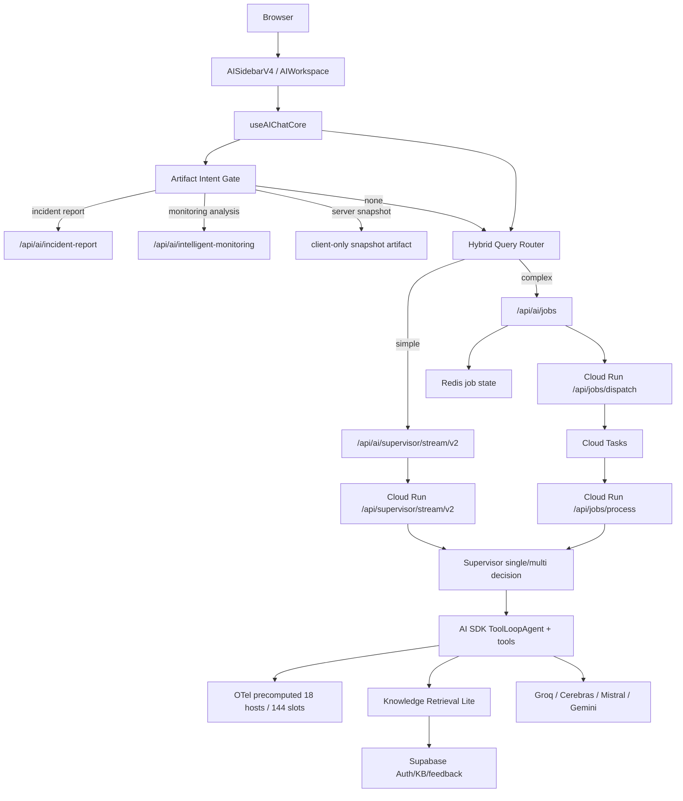
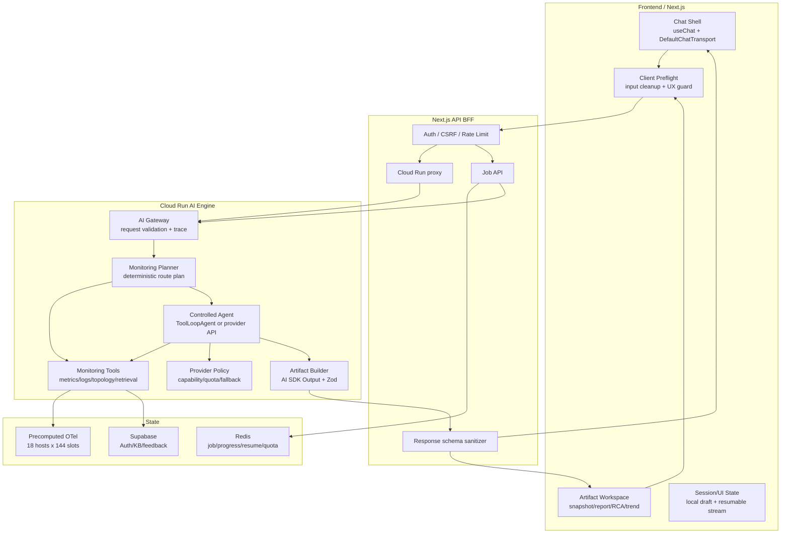

# AI Assistant Initial Design Comparison

> 처음부터 설계한다면 어떤 아키텍처를 선택할 수 있었는가 — Option A(채택)와 검토한 대안을 비교해 현재 상태의 변경·개선 필요점을 도출한다
> Owner: platform-architecture
> Status: Active Supporting
> Doc type: Explanation
> Last reviewed: 2026-05-04
> Canonical: docs/reference/architecture/ai/ai-assistant-initial-design-comparison.md
> Tags: ai,assistant,architecture,frontend,backend,comparison

**분석 기준일**: 2026-05-04
**현재 구현 기준**: OpenManager AI v8.11.88, Vercel Frontend + Cloud Run AI Engine
**목적**: 처음부터 프로젝트를 설계한다고 가정하고, 실제 채택한 구조(Option A)와 검토했던 대안들을 비교한다. 합리화가 아니라 대체 설계와의 차이를 통해 현재 구현에서 바꿀 점, 유지할 점, 나중에 검토할 점을 분리하는 것이 목적이다. 더 나은 방법이 있으면 채택한다.

**문서 사용법**:

- 대안들은 즉시 rewrite 후보가 아니라 현재 구현을 비추는 비교 렌즈로 사용한다.
- 각 대안은 "현재 Option A에 무엇을 흡수해야 하는가", "무엇은 지금 바꾸지 말아야 하는가"를 판단하기 위한 기준이다.
- 최종 산출물은 추상적인 아키텍처 선호가 아니라 §7의 적용 시나리오와 §8의 미결정 질문이다.

**현재 상태 판정**:

- 현재 구현은 여전히 **Option A 기반**이지만, 2026-05-03 작업으로 M1~M7과 AI Streaming UI S1~S3가 완료되어 단순 read-only contract 단계를 넘어 **wrapper facade + deterministic fact boundary + stream step visibility** 단계에 들어갔다.
- M4는 `ArtifactEnvelope` 호환 metadata/helper를 legacy-safe하게 추가했고, M5는 Cloud Run planner shadow, drift metadata, `executionMode`, thinking On/Off routing delta 측정을 완료했다.
- M6는 `/api/ai/ask` wrapper-only facade로 기존 route surface를 감쌌고, M7은 `MonitoringFactPack`, retrieval recall guard, provider freshness guard를 deterministic test 범위로 추가했다.
- 남은 핵심 제품 과제는 artifact workspace/schema registry, facade opt-in 확대/route catalog 정리, provider-native reasoning capability policy 정밀화다.

---

## 0. 고정 전제 조건 (변경 없음)

비교의 전제 조건이다. 이 조건을 충족하지 못하는 대안은 검토 대상에서 제외한다.

| 항목 | 결정 |
|------|------|
| 플랫폼 비용 | 모든 외부 플랫폼 무료 tier 준수. Vercel Pro는 유지하되 사용량 최소화 (Standard build, Cron 비활성). |
| 데이터 | OTel/Loki 기반 24시간 deterministic fixture를 날짜와 무관하게 회전 재사용한다. 실시간 ingestion 전환 없음. |
| 런타임 | Frontend = Vercel(Next.js). AI Engine = Cloud Run(Hono). 변경 없음. |
| AI SDK | Root app과 AI Engine 모두 Vercel AI SDK `^6.0.156` 기반을 유지한다. SDK는 transport, streaming, structured output, tool orchestration 계층으로 사용하고 metric 판단 엔진으로 쓰지 않는다. |
| BFF 목표 | 장기 기준안은 `/api/ai/ask` 단일 진입점이다. 현재 여러 route surface는 즉시 제거하지 않고, `AssistantPlan`/`AssistantResult` facade와 공통 metadata부터 수렴한다. |
| 스토리지 | Redis(job/cache/quota), Supabase(auth/KB/feedback). 변경 없음. |
| Provider | Groq / Cerebras / Mistral / Gemini 무료 tier 기반 fallback. 단일 유료 provider 고정 불가. |

---

## 1. 결론 요약

처음부터 설계한다면 **Option A(현재 채택 구조)**를 다시 선택한다. 단, 지금 바로 개선할 수 있는 항목들과 다음 단계에서 흡수할 두 가지 원칙이 있다.

이 문서에서 **대체 설계**와 **개선 항목**은 분리한다.

- 대체 설계는 Option A와 control plane, state boundary, primary output, execution model 중 최소 하나가 근본적으로 달라야 한다.
- `/api/ai/ask` facade, `routeDecision` metadata, artifact 표준 필드, provider freshness는 대체 설계가 아니라 현재 Option A에 흡수할 개선 항목이다.

**지금 바로 개선 가능한 것**

| 개선 | 방법 | 현재 구현 상태 |
|------|------|----------------|
| BFF surface 수렴 | `/api/ai/ask` facade를 목표로 삼되, 먼저 기존 streaming/job/artifact route가 같은 `AssistantPlan`/`AssistantResult` metadata를 쓰게 한다. | M6 완료. `/api/ai/ask`는 wrapper-only facade로 기존 stream/job/artifact route에 위임하며, `NEXT_PUBLIC_AI_ASK_FACADE_ENABLED=true`일 때 streaming frontend path에서 opt-in 가능하다. |
| Route decision drift 방지 | frontend, job API, Cloud Run이 같은 route decision schema를 사용하고 Cloud Run planner candidate와 local decision drift를 측정한다. | M5 완료. frontend/BFF authority는 유지하되 Cloud Run planner shadow, public-safe drift reason, 50개 corpus threshold가 추가됐다. |
| Thinking 버튼 유지 | provider-native hidden reasoning이 아니라 app-level routing intensity toggle로 유지한다. | M5c 완료. corpus 6개 기준 frontend job queue는 `auto 2/6` → `thinking 4/6`, Cloud Run multi mode도 `auto 2/6` → `thinking 4/6`로 측정됐다. |
| Artifact 표준 필드 | `artifactVersion`, `traceId`, `dataSlot`, `sourceMode`, `providerSummary`를 artifact contract metadata로 표준화한다. | M4 완료. `ArtifactContractMetadata`와 `ArtifactEnvelope` helper가 추가됐다. 다만 artifact workspace store, schema registry, 모든 UI 표시는 아직 후속 과제다. |
| Provider reasoning/freshness policy | 무료 tier provider별 reasoning/thinking 지원과 smoke freshness를 policy에 기록한다. | M7에서 `smokeEvidence` 날짜 기반 stale guard는 추가됐다. 다만 `lastVerified`, `expiresAt`, `smokeSource`, `reasoningCapability` 같은 명시 필드는 아직 policy contract로 승격되지 않았다. |
| MonitoringFactPack/eval guard | deterministic fact boundary와 retrieval/evidence quality eval을 명시한다. | M7 완료. monitoring snapshot은 `factPack`을 포함하고, severity는 threshold rule로 재계산하며, retrieval 최소 evidence 미달은 `insufficient_evidence`로 노출한다. |

**다음 단계에서 흡수할 원칙 (Option C + E에서)**

- **C 원칙**: 장애 보고서, RCA, 추세 분석은 저장·재현 가능한 typed artifact schema를 갖는다.
- **E 원칙**: 메트릭/로그/상태 판단은 deterministic tool이 계산하고, LLM은 설명·요약·조치안에만 집중한다.

설계 원칙과 기준 아키텍처 상세는 §3을 참조한다.

### 1.1 Vercel AI SDK 사용 경계

이 문서는 Vercel AI SDK를 제거하거나 대체하는 설계안이 아니다. 기준 아키텍처는 계속 AI SDK 위에 둔다.

| SDK 사용처 | 설계 기준 |
|------------|-----------|
| Frontend chat transport | `useChat` + `DefaultChatTransport`로 UIMessage stream을 유지한다. |
| Cloud Run streaming | `createUIMessageStreamResponse`, `streamText`를 stream protocol과 token delivery에 사용한다. |
| Artifact formatting | 목표 설계는 AI SDK v6 `generateText`/`streamText` + `Output.object`/Zod schema로 typed artifact를 생성·검증한다. 현재 일부 `generateObjectWithFallback` 경로는 compatibility layer로 보고 점진 수렴한다. |
| Drill-down 조사 | `ToolLoopAgent`/tool calling은 사용하되, tool은 deterministic OTel Engine의 typed query만 노출한다. |
| Provider abstraction | Groq/Cerebras/Mistral/Gemini fallback과 capability gate를 SDK wrapper 뒤에 둔다. |

반대로 CPU 임계값, status 판정, ranking, anomaly score, correlation 같은 운영 판단은 AI SDK나 LLM이 아니라 deterministic OTel Engine에서 계산한다. 즉 **AI SDK는 실행·스트리밍·구조화 출력 계층이고, 판단 주체는 아니다.**

---

## 2. 현재 구현 스냅샷

### 2.1 현재 요청 흐름



### 2.2 현재 구현의 강점

| 강점 | 근거 |
|------|------|
| Frontend와 AI runtime 분리 | `src/app/api/ai/supervisor/stream/v2/route.ts`는 BFF proxy, `cloud-run/ai-engine/src/routes/supervisor.ts`는 AI execution 진입점이다. |
| AI SDK v6 방향과 일치 | Frontend는 `DefaultChatTransport`, Cloud Run은 `createUIMessageStreamResponse`, backend agents는 `ToolLoopAgent`를 사용한다. |
| Free tier에 맞는 라우팅 | `useQueryExecution`은 복잡도에 따라 streaming/job queue를 나누고, backend `resolveSupervisorModeDecision()`은 auto/single/multi를 통제한다. |
| 데이터 정합성 의식 | `queryAsOfDataSlot`과 `precomputed-state`로 dashboard/AI가 같은 슬롯을 보도록 설계되어 있다. |
| Precomputed 데이터의 artifact-first 적합성 | `precomputed-state`의 18개 호스트 x 144슬롯 구조는 deterministic analyzer가 바로 snapshot/report/trend artifact를 만들 수 있는 형태다. 즉 현재 데이터 계층은 이미 Option C 방향의 절반을 갖고 있다. |
| Artifact 비용 최적화 | `server-snapshot`은 client-only artifact이고, artifact intent gate가 모호한 질문을 일반 채팅으로 남겨 불필요한 LLM/API 호출을 줄인다. |
| Artifact envelope 호환성 | M4에서 `ArtifactContractMetadata`와 `ArtifactEnvelope` helper를 추가해 `artifactVersion`, `sourceMode`, `dataSlot`, `traceId`, `evidence`, `providerSummary`를 legacy-safe하게 다룬다. |
| Planner shadow 측정 기반 | M5에서 Cloud Run planner candidate, `executionMode`, escalation reason, public-safe drift reason을 `AssistantPlan` metadata에 추가했다. authority 이전 없이 drift를 먼저 볼 수 있다. |
| Thinking mode의 실효 차이 측정 | M5c corpus 기준 thinking On은 frontend job routing과 Cloud Run multi mode를 각각 2/6에서 4/6으로 늘린다. 따라서 버튼은 provider-native thinking 표시가 아니라 "심층 라우팅" 조절로 유지할 근거가 있다. |
| Provider failure 내성 | provider capability gate, quota tracker, fallback metadata, stream text guard가 이미 존재한다. |
| Retrieval 과잉 방지 | Knowledge Retrieval Lite는 BM25 RPC + metadata boost 중심으로, vector/GraphRAG보다 운영 비용과 복잡도를 낮춘다. 단, 자연어 의미 유사도 의존 질의에서는 recall gap을 별도로 측정해야 한다. |

### 2.3 현재 구현의 잠재 리스크

| 리스크 | 영향 | 관찰 포인트 |
|--------|------|-------------|
| Frontend와 backend 라우팅 중복 | M5 planner shadow와 M6 wrapper facade로 drift 관측은 가능해졌지만, 실제 authority는 아직 frontend/BFF/Cloud Run에 분산되어 있다. | `/api/ai/ask` facade는 wrapper-only로 유지하고, authority 이전은 drift/latency/free-tier 기준 통과 후 별도 gate로 제한한다. |
| API surface가 넓음 | `artifact-intent`, `incident-report`, `intelligent-monitoring`, `jobs`, `supervisor`, `/api/ai/ask` 등 경로가 많아 contract drift 가능성이 있다. | facade가 독립 구현으로 커지면 복잡도가 다시 늘어난다. 기존 route 내부 위임과 route catalog 정리를 우선한다. |
| Artifact와 chat history 결합 | M4로 metadata는 표준화됐지만 artifact workspace store와 schema registry는 아직 없다. | restore fallback test와 함께 artifact family/version registry를 추가해야 한다. |
| Fact boundary 적용 범위 | M7에서 `MonitoringFactPack`과 retrieval/provider guard는 추가됐지만, 모든 artifact/report/evidence UI가 이 fact boundary를 소비하는 단계는 아니다. | metric severity는 deterministic fact pack이 책임지고, LLM은 explanation/formatting만 수행한다는 계약을 artifact family와 eval corpus까지 확대한다. |
| Observability가 제품 trace와 완전 결합되진 않음 | `traceparent`와 Langfuse/Pino는 있으나 UI artifact render까지 end-to-end trace가 약해질 수 있다. | user-visible artifact id와 backend trace id 연결 필요. |
| Provider policy 변동성 | `provider-model-policy.ts`의 deprecation, quota, capability 값이 운영 품질을 직접 좌우한다. reasoning/thinking 지원도 provider와 계정 entitlement에 따라 다르다. | 공식 provider 정책 변경 시 smoke freshness와 policy drift guard가 필요하다. |
| Typed output coverage 차이 | 일부 경로는 structured artifact, 일부는 text stream 중심이다. | final answer도 display contract를 더 좁힐 수 있다. |
| Retrieval recall gap | BM25 RPC + metadata boost는 비용과 예측 가능성은 좋지만, 동의어·증상 표현·긴 자연어 유사도 질의에서 vector/GraphRAG보다 놓치는 근거가 생길 수 있다. | M7의 `insufficient_evidence` guard를 query class별 recall/precision eval과 "근거 부족" 응답 품질 기준으로 넓힌다. |

### 2.4 데이터 본질과 아키텍처 복잡도 관찰

코드 교차 검증을 통해 발견한 구조적 관찰이다. 합리화가 아니라 개선 방향을 정확히 잡기 위한 분석이다.

**핵심 관찰: 현재 코드는 _실질적으로_ Option E처럼 동작하지만, _구조적으로는_ Option A로 포장되어 있다.**

| 계층 | 실질 동작 | 명목 구조 | Gap |
|------|-----------|-----------|-----|
| 데이터 | precomputed deterministic (18호스트 × 144슬롯, 같은 입력 → 같은 출력) | 실시간 모니터링 AI처럼 보이는 UX | 데이터 복잡도 < 아키텍처 복잡도 |
| 판단 | `rca-analysis.ts`, `analyst-tools-detect.ts` 등 모든 tool이 deterministic code로 계산 | ToolLoopAgent + multi-agent supervisor | LLM이 "판단"이 아닌 "설명" 역할 |
| 라우팅 | `supervisor-routing.ts`의 큰 regex 기반 deterministic intent 분류 | LLM 기반 agent orchestration처럼 보이는 구조 | 실체는 rule engine |
| 비동기 | precomputed 데이터 기반 계산은 대부분 수 초 이내 완료 | Job queue (Redis + Cloud Tasks) | route duration/stream 유지가 병목이 되는 경우는 LLM 호출 실패이지 분석 시간 초과가 아님 |

**이 관찰의 의미**:

- 현재 아키텍처가 _잘못된_ 것은 아니다. 실시간 ingestion 전환이나 외부 데이터 연동 시 이 복잡도가 정당화된다.
- 하지만 현재 precomputed 데이터 전제 하에서는, LLM 역할을 "판단"에서 "설명"으로 명시적으로 축소하고, Planner를 deterministic-first로 강화하는 것이 가장 효과적인 개선이다.
- 이 gap을 의식하면서 C/E 원칙을 흡수하는 것이 §1에서 제시한 점진적 개선 방향의 근거다.

**구조적 복잡도의 인과관계 체인**:

업계 레퍼런스(§2.5)와 비교할 때 OpenManager의 구조가 더 복잡한 근본 원인은 **Vercel + Cloud Run 인프라 분리**다. 이 분리가 4단계 연쇄로 복잡도를 누적시킨다.

```text
[원인 1] Vercel + Cloud Run 분리 (auth는 Vercel, AI 실행은 Cloud Run)
  │
  ├─→ BFF proxy 계층 필수
  │     └─ 큰 stream route (fetch → retry → timeout → resumable)
  │     └─ 여러 BFF 엔드포인트 (각기 다른 maxDuration, 에러 핸들링)
  │     └─ 메시지 정규화 (normalizeMessagesForCloudRun)
  │
  ├─→ [원인 2] Vercel function duration / stream proxy 제약
  │     └─ route별 maxDuration, 비용, 장시간 streaming 안정성 때문에 Job Queue (Redis + Cloud Tasks) 도입
  │     └─ /api/ai/jobs route + 상태 폴링 + progress UI
  │     └─ 단, precomputed 데이터 기반 계산은 수 초면 완료
  │        → 장시간 경로의 실제 병목은 "분석 계산"보다 LLM 호출 실패/재시도/stream 유지 시나리오
  │        → job queue의 실제 활용도가 낮은 이유
  │
  ├─→ [원인 3] Multi-provider 무료 tier 제약 (분리와 독립적 원인)
  │     └─ 4개 provider × 각기 다른 rate limit, capability, structured output 지원
  │     └─ provider-model-policy.ts + quota tracker + cooldown + fallback chain
  │     └─ generateObjectWithFallback (JSON parse fallback 포함)
  │     └─ 이 복잡도는 정당 — 단일 유료 provider면 불필요했을 것
  │
  └─→ [원인 4] Frontend/Backend 라우팅 이중화 (원인 1의 파생)
        └─ Frontend: useQueryExecution (복잡도 판단 → streaming vs job 분기)
        └─ Backend: supervisor-routing.ts (large regex intent classifier)
        └─ 같은 질문에 대해 두 곳에서 독립적으로 판단 → drift 위험
```

**업계 레퍼런스는 왜 단순한가**: Datadog AI, New Relic AIM 등은 단일 플랫폼(자체 인프라)에서 query engine과 LLM wrapper가 같은 런타임으로 동작한다. BFF proxy가 불필요하고, duration 제한이 없어 job queue 동기도 없다. 단일 유료 provider 계약이므로 multi-provider fallback 복잡도도 없다.

**분리 자체는 올바른 결정이었다**: Vercel에 모든 것을 넣으면 route별 duration, 비용, streaming proxy 안정성 제약을 강하게 받기 쉽고, Cloud Run에 모든 것을 넣으면 SSR/CDN/edge 이점을 포기해야 한다. 분리는 맞지만, 분리로 인한 복잡도를 §7의 개선 방향(`/api/ai/ask` facade, `AssistantPlan` 통일, Planner를 Cloud Run 집중)으로 줄이는 것이 과제다.

### 2.5 업계 레퍼런스와 LLM 의존도 스펙트럼

상용 AI 제품(ChatGPT, Grok, Claude, Gemini)과 LLM API + Framework 기반 커스텀 앱, 그리고 업계 모니터링 AI copilot들을 비교해 현재 구현의 위치를 확인한다.

**LLM 의존도 스펙트럼**:

```text
LLM 의존도 높음 ◄──────────────────────────────────────────► LLM 의존도 낮음

상용 AI        일반 AI SDK 앱       OpenManager(명목)      OpenManager(실질)
(ChatGPT 등)   (LLM이 판단+생성)    (supervisor가 LLM      (deterministic tool이
                                   orchestration)        계산, LLM은 설명만)
```

**업계 모니터링 AI copilot 비교**:

| 제품 | 패턴 | OpenManager와 공통점 | OpenManager와 차이 |
|------|------|---------------------|-------------------|
| Datadog AI Assistant | 자체 query engine (PromQL 등) + LLM narration | deterministic 계산 → LLM 설명 패턴 동일 | 실시간 사용자 데이터 기반. 구조가 실질에 맞게 단순 |
| New Relic AIM | NRQL 자동 생성 + GPT-4 narrator | query engine이 판단 주체, LLM은 설명 역할 | MCP 서버 호출 지원. full-stack observability |
| Elastic AI Assistant | RAG + Elasticsearch query → LLM 요약 | 쿼리 엔진 결과를 LLM이 변환하는 구조 동일 | vector search 활용. 실시간 로그/메트릭 |

**핵심 확인**: 업계 레퍼런스 모두 **"deterministic query/analysis engine + LLM narration"** 패턴을 사용한다. LLM이 메트릭을 직접 "판단"하지 않는다. OpenManager의 `precomputed-state` → deterministic tool → LLM narration 실질 동작은 이 업계 표준과 일치한다.

**구조적 차이**: 업계 레퍼런스는 query engine + LLM wrapper로 실질에 맞게 구조를 단순화한 반면, OpenManager는 multi-agent supervisor + 8 BFF routes + job queue로 실질보다 구조가 복잡하다. 이것은 §2.4의 gap을 외부 근거로 재확인한다.

**무료 tier provider의 thinking/reasoning 실사용성**:

| Provider | 공식 capability | 현재 OpenManager 기본값 | 판단 |
|----------|-----------------|-------------------------|------|
| Groq | Qwen 3 32B, GPT-OSS 계열은 `reasoning_effort`, `reasoning_format`/`include_reasoning` 계열을 제공한다. | 기본 text provider는 `meta-llama/llama-4-scout-17b-16e-instruct`다. reasoning 모델을 기본으로 쓰지 않는다. | 기능은 가능하지만 현재 기본 모델과 다르다. free-tier quota, tool/JSON mode, latency smoke를 통과하기 전까지 provider-native thinking으로 UI를 정의하면 안 된다. |
| Cerebras | Chat Completions는 `gpt-oss-120b` reasoning field와 `reasoning_effort`를 문서화한다. 일부 thinking Qwen preview도 노출된다. | runtime 기본은 `llama3.1-8b`다. `gpt-oss-120b`는 현재 계정 smoke 404로 제외, Qwen preview는 high-traffic/preview로 제외됐다. | 공식 capability와 현재 계정 entitlement가 다르다. provider-native thinking을 제품 기능으로 약속하기 어렵다. |
| Mistral | `magistral-*` native reasoning, `mistral-small-latest` adjustable `reasoning_effort`를 제공한다. | last-resort text fallback은 `mistral-small-latest`다. | 이론상 thinking toggle과 가장 잘 맞지만, fallback provider라서 모든 요청에 일관 적용하기 어렵고 토큰/latency 증가가 있다. |
| Gemini | Gemini thinking은 `thinkingLevel`/`thinkingBudget`으로 제어 가능하다. | vision primary는 `gemini-2.5-flash-lite`이며 코드 주석상 사고 토큰 비용을 피하기 위해 flash-lite를 선호한다. | vision 경로 보조에는 가능하지만 현재 text assistant의 일관된 thinking UX 근거로 쓰기에는 부적합하다. |

**결론**: `thinking` 버튼은 provider-native hidden reasoning을 켜는 버튼이 아니라, OpenManager 내부의 routing intensity를 높이는 제품 컨트롤로 유지한다. M5c 측정처럼 켰을 때 job/multi-agent 경로가 늘어나는 차이가 실제로 있으므로 UI에 남길 근거가 있고, provider-native reasoning은 smoke freshness와 capability policy가 준비된 뒤 provider별 최적화로만 붙인다.

**상용 AI 대신 커스텀 앱을 선택한 근거**: 내부 서버 메트릭 직접 접근, multi-provider 무료 tier 활용, 도메인 특화 UI/artifact, deterministic 계산 보장은 ChatGPT/Claude/Gemini 같은 상용 제품으로는 충족 불가하므로 LLM API + Vercel AI SDK 기반 커스텀 앱 선택은 올바르다.

---

## 3. 내가 처음 설계한다면: 기준 아키텍처

### 3.1 설계 원칙

1. **관측 데이터가 먼저, LLM은 나중**
   CPU, memory, disk, network, status, alert, log correlation은 deterministic code가 계산한다. LLM은 결과를 읽고 설명한다.

2. **채팅은 입구이고, artifact가 결과물**
   "현재 상태 알려줘"는 chat answer여도 되지만 "장애 보고서", "RCA", "추세 분석", "상태 스냅샷"은 typed artifact로 저장·다운로드·재현 가능해야 한다.

3. **짧은 경로와 긴 경로를 물리적으로 분리**
   단순 조회는 streaming으로 즉시 응답하고, multi-step RCA/report는 job queue로 분리한다.

4. **Provider-neutral runtime, provider-aware policy**
   SDK는 provider-neutral하게 쓰되, tool calling/structured output/context window/quota는 provider별 capability table로 강제한다.

5. **LLM 호출 전에 cheap guard를 최대한 실행**
   intent, scope, data slot, rate limit, prompt guard, cache hit, retrieval need를 먼저 판단한다.

### 3.2 기준안 아키텍처



### 3.3 Frontend 기준 설계

| 레이어 | 책임 | 구현 감각 |
|--------|------|-----------|
| Chat shell | 자연어 입출력, streaming 상태, stop/regenerate/resume | AI SDK `useChat` + `DefaultChatTransport` 유지 |
| Artifact workspace | 보고서, 스냅샷, 추세 분석, RCA를 카드/상세/다운로드로 표시 | 메시지 내부 카드가 아니라 workspace state와도 연결 |
| Query preflight | 입력 정리, 중복 제출 방지, 필수 UI 상태 확인 | route/artifact/job 판단은 Cloud Run Planner가 단일 책임을 갖는다. |
| Data slot sync | dashboard 시점과 AI 분석 기준 시점 고정 | `queryAsOfDataSlot`를 모든 경로에 전달 |
| Progressive disclosure | 빠른 요약 먼저, 근거/툴/trace는 접기 | 운영자는 긴 답보다 근거와 조치 우선 |
| Failure UI | provider fallback, stale data, retrieval unavailable 구분 | "AI 실패" 하나로 뭉치지 않음 |

처음부터 잡을 frontend component split은 다음과 같다.

```text
AIExperienceShell
├── ChatPanel
│   ├── MessageList
│   ├── Composer
│   └── StreamStatus
├── ArtifactPanel
│   ├── ServerSnapshotCard
│   ├── IncidentReportCard
│   ├── TrendAnalysisCard
│   └── RCAReportCard
├── EvidencePanel
│   ├── MetricsEvidence
│   ├── RetrievalEvidence
│   └── ProviderTrace
└── RuntimeControls
    ├── SourceMode
    ├── AnalysisMode
    └── DataSlotSelector
```

### 3.4 Backend 기준 설계

| 레이어 | 책임 | 구현 감각 |
|--------|------|-----------|
| Gateway | auth secret, Zod request validation, trace context, prompt guard | Cloud Run Hono route에서 일관 적용 |
| Planner | query를 `lookup`, `ranking`, `diagnosis`, `forecast`, `report` 계획으로 변환 | LLM 전 deterministic classifier + optional structured classifier |
| Tool layer | metrics/logs/topology/retrieval/web를 모두 typed tool로 제공 | LLM이 raw data를 만들지 않고 도구 결과만 사용 |
| Agent runtime | plan별 single/multi/tool loop 실행 | AI SDK `ToolLoopAgent`, `streamText`, `generateText` + `Output.object` 중심. 현재 `generateObjectWithFallback`는 compatibility path로 유지 |
| Artifact builder | report/trend/RCA/snapshot schema 생성 | AI SDK Output/Zod schema + versioned artifact contract |
| Resilience | timeout, abort, fallback, quota, cache | provider policy와 quota tracker를 runtime 앞단에 둠 |
| Observability | route decision, tool call, provider attempt, usage, artifact id | trace id를 frontend metadata까지 전파 |

현재 M6 contract는 **authoritative planner가 아니라 planner shadow가 포함된 read-only facade + wrapper-only BFF entrypoint**다. 실제 shape는 `src/lib/ai/assistant-contract.ts`가 기준이며, 기존 `RouteDecision`을 감싸서 frontend stream/job/artifact, BFF job, Cloud Run stream done/job result metadata, history/restore/SSE 경로에 보존한다. M5에서 `executionMode`, `escalationReasonCodes`, `plannerShadow`가 추가됐고, M6에서 `/api/ai/ask`가 기존 stream/job/artifact route를 감싸는 opt-in facade로 추가됐다. 실제 라우팅 권한은 아직 frontend `useQueryExecution`과 backend `resolveSupervisorModeDecision()`에 분산되어 있다.

```ts
type AssistantPlan = {
  kind: 'chat' | 'artifact' | 'clarification';
  planVersion: string;
  routeDecision: RouteDecision;
  executionPath: RouteDecisionExecutionPath;
  executionMode?: 'deterministic' | 'single-agent' | 'multi-agent';
  stream: boolean;
  job: boolean;
  artifactKind?: RouteDecisionArtifactKind;
  reasonCodes: string[];
  escalationReasonCodes?: MultiAgentEscalationReasonCode[];
  plannerShadow?: AssistantPlannerShadow;
  dataSlot?: string;
  traceId?: string;
  decidedBy: RouteDecisionDecider;
};

type AssistantResult = {
  kind: 'chat' | 'artifact' | 'error';
  resultVersion: string;
  routeDecision?: RouteDecision;
  status: 'completed' | 'failed' | 'partial';
  artifactKind?: RouteDecisionArtifactKind;
  traceId?: string;
  errorCode?: string;
};
```

future target에서는 위 facade가 Cloud Run Planner가 생성한 authoritative plan으로 승격되고, `AssistantResult`가 typed `ArtifactEnvelope` 또는 chat result payload를 직접 운반한다. 그 단계에서 `EvidenceCard`는 현재 `cloud-run/ai-engine/src/lib/retrieval-contract.ts`의 계약을 우선 재사용하고, artifact/error union은 실제 코드의 artifact/error 타입과 맞춰 확정한다.

---

## 4. 아키텍처 선택지 비교

처음부터 설계한다면 선택할 수 있었던 방법들이다. 모두 고정 전제 조건(Vercel+Cloud Run, 무료 tier, multi-provider, precomputed 데이터)을 충족한다. Option A는 실제 채택한 구조다.

이 섹션의 목적은 "어떤 대안으로 갈아탈 것인가"만 결정하는 것이 아니다. 각 대안이 현재 구현 대비 어떤 결함을 드러내는지, 그리고 그 결함을 Option A 안에서 흡수할 수 있는지를 판단한다.

### 4.0 대체 설계 후보 요약

대체 후보는 **4개**다. 모두 고정 전제 조건을 충족하며, Option A와 execution model / state boundary / primary output / control plane 중 최소 하나가 근본적으로 다르다.

2026-05-04 공식 문서 재검토 기준으로는 최신 agent 트렌드에서 추가로 볼 렌즈가 3개 있다. 다만 이들은 현재 고정 전제 조건과 완전히 같은 레벨의 대체 아키텍처라기보다, Option A에 흡수할 수 있는 **추가 비교 렌즈**로 분리한다.

| # | 후보 | 대체 설계 유형 | Option A와 다른 핵심 축 | 주요 장점 | 종합 점수¹ |
|---|------|---------------|------------------------|-----------|:---------:|
| B | Direct Streaming-Only | **실행 단순화** — job queue 제거, BFF는 인증만 | State boundary: Redis/Cloud Tasks 없음 | 운영 부담 감소, 디버깅 단순화 | 29 / 45 |
| C | Artifact-First | **출력 우선 전환** — typed artifact가 1차 결과물 | Primary output: chat stream → typed artifact | 재현성·계약 테스트·QA 용이 | 33.5 / 45 |
| D | Dedicated Pipeline | **실행 경계 분리** — 범용 supervisor 제거 | Control plane: 단일 supervisor → artifact별 pipeline | pipeline별 독립 테스트·최적화 | 31 / 45 |
| E | Analytics Core | **판단 주체 전환** — deterministic engine이 핵심 | Execution model: LLM agent → query planner + DSL | hallucination 최소화, 비용 예측 가능 | 34.5 / 45 |

> ¹ 점수 산정: §4 종합 매트릭스 9개 기준, 각 5점 만점. "현재 구현과 거리"는 가까울수록 고점(없음=5, 중=3, 높음=2).
> **Option A 기준점: 34 / 45**

**최신 트렌드 기반 추가 비교 렌즈**

| # | 렌즈 | 핵심 패턴 | OpenManager 적용 판단 |
|---|------|-----------|------------------------|
| F | Durable Workflow Graph | checkpoint/replay/human-in-the-loop 중심의 장기 실행 graph | 현재는 Redis/Cloud Tasks job + precomputed data로 충분하다. RCA/report가 승인·재시작·장기 실행 중심으로 커지면 D보다 먼저 검토한다. |
| G | MCP-Native Tool Fabric | tools/resources/prompts를 표준 protocol로 노출하고 client가 tool permission을 통제 | 내부 monitoring tool만으로는 과하다. GitHub, runbook, incident system, 외부 DB 연동이 늘면 tool boundary 표준화 후보로 흡수한다. |
| H | Managed Agent Platform | provider-native agents, tracing, guardrails, handoffs, hosted tools | free-tier/multi-provider 원칙과 provider lock-in이 충돌한다. core 대체는 부적합하지만 guardrails/tracing/evals 방식은 계속 흡수한다. |

반대로 `/api/ai/ask` facade, `AssistantPlan`/`AssistantResult`, `routeDecision`, `ArtifactEnvelope`, provider smoke freshness는 대체 설계가 아니라 **Option A 개선 항목**이다. 이 항목들은 §7의 적용 시나리오에서 다룬다.

**대체 설계 판정 기준**: 현재 구조의 작은 변형은 후보에서 제외한다.

| 후보 | Option A와 근본적으로 다른 점 | 이 문서에서의 용도 |
|------|-------------------------------|-------------------|
| B Direct Streaming-Only | Redis/Cloud Tasks job queue를 제거하고, BFF도 장시간 stream proxy 역할을 하지 않는다. | 현재 job queue 복잡도가 실제로 필요한지 검증하는 렌즈 |
| C Artifact-First | chat stream이 아니라 typed artifact를 1차 제품 출력으로 둔다. | report/RCA/snapshot의 contract와 UX를 강화하는 렌즈 |
| D Dedicated Pipeline | 공통 supervisor를 제거하고 artifact 종류별 실행 경계를 분리한다. | supervisor 범용성이 오히려 복잡도를 만드는지 검증하는 렌즈 |
| E Analytics Core | LLM agent가 아니라 deterministic query/analysis engine을 중심에 둔다. | LLM 판단 의존을 줄이고 Fact Pack을 표준화하는 렌즈 |
| F Durable Workflow Graph | durable graph runtime이 job/process state와 실행 재개를 책임진다. | 장기 실행 RCA/report가 product core가 될 때 재검토하는 렌즈 |
| G MCP-Native Tool Fabric | tool/resource/prompt 표준 protocol이 tool boundary를 책임진다. | 외부 tool ecosystem이 커질 때 tool contract를 표준화하는 렌즈 |
| H Managed Agent Platform | provider-native agent runtime이 tracing/guardrails/handoffs를 통합 제공한다. | lock-in을 피하면서 guardrail/eval/tracing 설계만 흡수하는 렌즈 |

### Option A. ✅ 채택 — Next.js BFF + Cloud Run Multi-Agent

```text
Browser -> Next.js BFF -> Cloud Run Supervisor -> Agent Tools -> Provider fallback
                         \-> Redis/Cloud Tasks for long jobs
```

| 항목 | 평가 |
|------|------|
| 장점 | 긴 실행/비동기 작업/멀티에이전트/쿼터 방어를 수용하기 쉽다. 무료 tier 운영 제약과 맞다. |
| 단점 | route surface와 상태 전파가 복잡하다. frontend/backend 라우팅 drift를 계속 막아야 한다. |
| Frontend | transport, stream resume, artifact card, job progress가 필요하다. |
| Backend | supervisor, provider policy, quota, tools, retrieval, job worker가 필요하다. |

### Option B. Direct Streaming-Only — Job Queue와 BFF long proxy 없는 구조

```text
Browser -> Next.js short auth/token route -> Cloud Run signed streaming endpoint
```

job queue(Redis/Cloud Tasks)를 제거하고 모든 요청을 Cloud Run streaming으로 처리하는 방식이다. 현재 A의 BFF proxy + job queue 구조와 달리, Next.js는 짧은 인증/토큰 발급만 맡고 장시간 실행 상태는 Cloud Run stream 하나에 둔다.

| 항목 | 평가 |
|------|------|
| 장점 | 상태 전파가 단순하다. Redis job state, Cloud Tasks dispatch 운영 부담이 없다. BFF function duration 병목을 피할 수 있다. |
| 단점 | 브라우저가 Cloud Run stream에 직접 붙으므로 signed token, CORS, stream reconnect, abort, abuse protection 설계를 새로 해야 한다. durable result가 없으므로 탭 종료/네트워크 끊김에 약하다. |
| Frontend | `useChat` transport 대상이 BFF stream route가 아니라 signed Cloud Run stream이 된다. job progress UI는 불필요하지만 reconnect/resume UX가 중요해진다. |
| Backend | supervisor는 남길 수 있지만 job worker가 없다. 긴 report는 partial streaming 또는 client retry로 처리해야 한다. |
| 적합도 | 대부분의 분석이 짧은 요청 예산 안에 끝나고, 결과 저장보다 즉시 응답 UX가 중요한 제품이면 현실적이다. 운영 보고서/재현성까지 중요하면 A보다 약하다. |

### Option C. Artifact-First Monitoring Copilot

```text
Browser -> Artifact Command -> Cloud Run Deterministic Analyzer -> Typed Artifact -> Optional LLM narration
```

| 항목 | 평가 |
|------|------|
| 장점 | 운영 도메인에 가장 안정적이다. 결과 재현성, 다운로드, QA, contract test가 쉽다. precomputed OTel 데이터가 이미 이 구조에 적합하다. |
| 단점 | 자유 채팅의 유연성은 줄고, artifact 종류별 UX/스키마 설계 비용이 크다. |
| Frontend | chat보다 artifact workspace가 중심이 된다. |
| Backend | LLM보다 analyzer/artifact builder가 핵심이다. Cloud Run은 분석 실행에 집중한다. |
| 적합도 | 장애 보고서, RCA, 상태 카드처럼 "결과물"이 중요한 기능에 최적. 현재 구현의 다음 단계로 적합하다. |

### Option D. Dedicated Pipeline — Supervisor 없는 아티팩트별 실행 경계

```text
Browser -> Next.js BFF -> Snapshot Pipeline
                       -> Incident Report Pipeline
                       -> RCA Pipeline
                       -> Trend Pipeline
```

일반 supervisor를 제거하고 artifact 종류마다 독립 실행 경계를 두는 방식이다. 같은 Cloud Run/Hono 플랫폼을 유지하되, 현재처럼 하나의 범용 supervisor가 모든 요청을 해석하지 않는다. 구현 선택은 별도 Cloud Run service까지 분리하거나, 하나의 Hono 앱 안에서 pipeline별 독립 entrypoint와 테스트 경계를 강하게 두는 방식 모두 가능하다.

| 항목 | 평가 |
|------|------|
| 장점 | 각 파이프라인을 독립적으로 테스트하기 쉽고, provider 선택과 tool 집합을 artifact마다 최적화할 수 있다. supervisor routing drift가 사라진다. |
| 단점 | 공통 로직(provider fallback, quota, auth, trace)이 중복되기 쉽다. pipeline 수가 늘수록 배포/스모크/문서/endpoint catalog 유지 비용이 증가한다. |
| Frontend | 요청 대상 pipeline을 명시적으로 선택해야 한다. artifact-first UI와 잘 맞지만 자유 채팅 UX와는 거리가 생긴다. |
| Backend | 공통 middleware package와 pipeline registry가 필요하다. 별도 service로 나누면 cold start와 free-tier 관측 부담도 증가한다. |
| 적합도 | artifact 종류가 많고 각 산출물이 독립 제품처럼 커질 때 강력하다. 현재 규모에서는 A보다 운영 복잡도가 높아 즉시 채택 후보는 아니다. |

### Option E. Analytics Core + LLM Explanation

```text
Browser -> Query Planner -> Cloud Run Metrics DSL execution -> Deterministic answer -> LLM explanation
```

| 항목 | 평가 |
|------|------|
| 장점 | 가장 비용 예측 가능하고, 모니터링 정확도가 높다. LLM hallucination 위험을 크게 줄인다. precomputed OTel 슬롯이 이미 query planner의 입력으로 적합하다. |
| 단점 | 자연어 유연성, 복합 보고서 작성 품질, 탐색적 대화 경험은 별도 보강이 필요하다. |
| Frontend | 필터/비교/기간/서버 그룹 컨트롤이 더 중요해진다. |
| Backend | query planner, metric DSL, ranking/RCA rules가 핵심이다. 현재 deterministic tool layer를 강화하는 방향이다. |
| 적합도 | "AI"보다 "운영 분석 엔진" 품질을 우선하는 경우 강력하다. |

### Option F. Durable Workflow Graph — 장기 실행/재개/승인 중심 graph runtime

```text
Browser -> BFF -> Durable Graph Runtime -> Checkpointed Steps -> Tool/LLM -> Resume/HITL
```

LangGraph류 durable execution 패턴은 graph state를 checkpoint하고 중단 지점에서 재개할 수 있게 하며, human-in-the-loop나 long-running multi-step workflow에 강하다. 최신 agent 앱에서는 장기 실행, 승인, retry/replay, state inspection 요구가 커질수록 이 방식이 유리하다.

| 항목 | 평가 |
|------|------|
| 장점 | 장시간 RCA/report, 승인 단계, 실패 후 재개, step-level trace에 강하다. |
| 단점 | 현재 OpenManager의 precomputed 데이터와 짧은 deterministic tool 계산에는 runtime 복잡도가 과하다. Redis/Cloud Tasks job queue와 겹치는 부분도 많다. |
| Frontend | job progress보다 graph step/timeline, 승인/재개 UX가 필요하다. |
| Backend | graph state store, checkpoint schema, migration, replay safety가 필요하다. |
| 적합도 | 지금의 A를 대체할 정도는 아니다. 다만 RCA/report가 durable workflow 제품이 되면 D(Dedicated Pipeline)보다 먼저 검토한다. |

### Option G. MCP-Native Tool Fabric — 외부 tool/resource 표준화 중심

```text
Browser/Agent Client -> MCP Client -> Monitoring/Runbook/Incident MCP Servers -> LLM Orchestrator
```

MCP는 tool, resource, prompt를 protocol 단위로 표준화하고 client가 server connection과 permission boundary를 통제하는 패턴이다. tool ecosystem이 커질수록 각 도구를 agent별 ad hoc wrapper로 붙이는 것보다 표준 boundary를 두는 편이 유지보수에 유리하다.

| 항목 | 평가 |
|------|------|
| 장점 | GitHub, runbook, incident system, external DB처럼 tool source가 늘 때 boundary와 permission 모델을 정리하기 쉽다. |
| 단점 | 현재 내부 monitoring tool 중심 구조에는 protocol/runtime 오버헤드가 크다. 무료 tier 운영에서는 MCP server 추가 운영비와 health check 부담도 생긴다. |
| Frontend | user consent, tool permission, resource citation 표시가 필요해진다. |
| Backend | Cloud Run tool layer를 MCP server/client boundary로 재구성하거나 adapter를 둬야 한다. |
| 적합도 | core 대체 설계가 아니라 future tool integration 렌즈다. OpenManager 내부 tool은 지금처럼 typed tool로 유지하고, 외부 tool이 늘 때 adapter로 흡수한다. |

### Option H. Managed Agent Platform — provider-native agent runtime

```text
Browser -> Provider Agent Runtime -> Hosted Tools / Guardrails / Tracing / Evals
```

OpenAI Agents SDK/Responses 계열처럼 provider-native agent runtime은 guardrails, tracing, handoffs, hosted tools, evals를 빠르게 묶을 수 있다. 최신 managed agent 트렌드와는 가장 직접적으로 맞지만, OpenManager의 free-tier/multi-provider 원칙과는 충돌한다.

| 항목 | 평가 |
|------|------|
| 장점 | tracing, guardrails, handoffs, hosted tool, eval loop를 빠르게 구성할 수 있다. |
| 단점 | provider lock-in, 비용, free-tier 불확실성, multi-provider fallback 약화가 크다. |
| Frontend | provider runtime stream/event shape에 강하게 묶인다. |
| Backend | Vercel AI SDK/provider abstraction보다 provider SDK 중심이 된다. |
| 적합도 | core 대체로는 부적합하다. 다만 tool guardrail, trace/span, eval result, handoff metadata 설계는 계속 흡수한다. |

### 종합 매트릭스

> 5점 척도: 매우 높음=5 / 높음=4 / 중~높음=3.5 / 중=3 / 낮음~중=2.5 / 낮음=2
> "현재 구현과 거리"는 가까울수록 고점 (없음=5, 중=3, 중~높음=2.5, 높음=2)

| 기준 | A 채택 | B Direct Streaming | C Artifact-first | D Dedicated Pipeline | E Analytics core |
|------|:------:|:------------------:|:----------------:|:--------------------:|:----------------:|
| 구현 속도 | 3 | 3 | 2 | 2 | 2.5 |
| 운영 안정성 | 4 | 3 | 4 | 4 | 4 |
| Free tier 적합성 | 4 | 4 | 4 | 4 | 5 |
| Provider 독립성 | 4 | 4 | 4 | 4 | 4 |
| UX 풍부함 | 4 | 3 | 4 | 3 | 3 |
| 디버깅 용이성 | 3 | 4 | 4 | 4 | 4 |
| 계약 테스트 용이성 | 3 | 3 | 5 | 4 | 5 |
| 장기 확장성 | 4 | 3 | 4 | 4 | 4 |
| 현재 구현과 거리 | 5 | 2 | 2.5 | 2 | 3 |
| **합계 (/ 45)** | **34** | **29** | **33.5** | **31** | **34.5** |

**채택 이유**: A는 job queue가 없으면 처리 못 하는 장시간 분석(B의 한계)과, artifact별 운영 복잡도(D의 단점) 사이에서 현실적 균형점이다. C와 E의 원칙은 A 구조 안에서 점진적으로 흡수한다.

**최신 트렌드 반영 후 판단**: F/G/H는 모두 유효한 렌즈지만 현 시점의 더 나은 전면 대체안은 아니다. F는 durable workflow 요구가 커질 때, G는 외부 tool ecosystem이 커질 때, H는 provider lock-in을 받아들일 때 강해진다. 현재 free-tier, multi-provider, precomputed OTel, Vercel+Cloud Run 분리 전제에서는 **A 유지 + C/E 흡수 + F/G/H 일부 원칙 흡수**가 가장 합리적이다.

**솔직한 자기 진단**: §2.4에서 분석한 것처럼 현재 데이터가 precomputed/deterministic인 환경에서는 C+E 하이브리드가 데이터 본질에 더 맞았을 수 있다. M7 `MonitoringFactPack` 완료로 E 원칙은 상당 부분 흡수됐다. 그럼에도 A를 유지하는 현실적 근거는 세 가지다: (1) 이미 작동하는 구현의 rewrite 비용이 개선 이점보다 크다, (2) 실시간 ingestion 전환 시 A의 복잡도가 정당화된다, (3) 포트폴리오/학습 자산으로서 multi-agent + provider fallback 경험이 가치가 있다. B의 운영 안정성은 precomputed 데이터 환경에서 "중"으로 평가한다. direct Cloud Run stream은 BFF duration/stream proxy 병목을 피할 수 있지만, durable result와 reconnect/resume을 포기하거나 별도로 다시 설계해야 한다.

---

## 5. Frontend 비교 분석

### 5.1 현재 Frontend 평가

| 항목 | 현재 상태 | 평가 |
|------|-----------|------|
| Chat transport | `DefaultChatTransport`로 `/api/ai/supervisor/stream/v2` 호출 | AI SDK v6 방향과 맞다. |
| Dynamic headers/body | trace id, device type, source mode, analysis mode, data slot 전달 | 운영 trace와 data parity에 유리하다. |
| Routing | complexity 기반 streaming/job queue 분기. `analysisMode=thinking`은 threshold를 `19 -> 11`로 낮춘다. | 비용과 UX 균형이 좋지만 backend routing과 drift 가능성이 있다. M5c로 delta는 측정 중이다. |
| Artifact intent | local regex + optional LLM classifier | LLM 호출 절감 설계가 좋다. 다만 rule version/eval guard 유지가 필수다. |
| Attachment path | 첨부가 있으면 thinking이어도 streaming으로 유지한다. | vision/multimodal은 job queue보다 stream path 안정성이 우선이다. |
| UX state | sidebar/workspace/history/job progress/stream status | 기능은 풍부하지만 state ownership이 복잡해질 수 있다. |

현재 구현은 frontend artifact intent와 complexity routing을 갖고 있다. 기준안에서는 이 판단을 Cloud Run Planner의 `AssistantPlan`으로 흡수하고, frontend는 입력 정리·중복 제출 방지·UI 상태 유지만 담당하도록 축소한다.

### 5.2 내가 보강할 Frontend 설계

| 보강 | 이유 |
|------|------|
| RouteDecisionBadge를 개발/QA 모드에 노출 | "왜 job queue로 갔는지", "왜 artifact로 갔는지"를 즉시 확인한다. |
| Artifact workspace를 message metadata에서 분리 가능한 store로 관리 | chat history 복원 실패가 artifact 표시 실패로 번지는 것을 줄인다. |
| Data freshness banner 표준화 | stale data, slot mismatch, retrieval unavailable을 UI에서 구분한다. |
| Evidence-first detail panel | 운영자는 결론보다 근거 metric/log/source를 확인해야 한다. |
| Query scope selector | 서버 그룹, 시간 슬롯, metric type을 UI에서 고정해 LLM ambiguity를 줄인다. |

### 5.3 Frontend missed checklist

| 체크 | 현재 관찰 | 제안 |
|------|-----------|------|
| 모바일 artifact usability | 카드가 늘어날수록 chat list 내부 표시는 한계가 있다. | 모바일에서는 artifact 전용 detail sheet 우선. |
| 접근성 | 채팅/카드/다운로드 버튼은 테스트가 있으나 stream event narration은 별도 점검 필요. | streaming 응답에 `aria-live="polite"` live region contract 추가. artifact card 생성 시 screen reader announcement, loading/error 상태별 `role="status"` 구분. |
| Explainability | `AnalysisBasis`가 있지만 routing decision과 artifact intent reason을 더 잘 노출 가능. | QA/debug tab에 route decision timeline 표시. |

---

## 6. Backend 비교 분석

### 6.1 현재 Backend 평가

| 항목 | 현재 상태 | 평가 |
|------|-----------|------|
| Runtime split | Cloud Run Hono AI Engine | 긴 실행과 provider fallback에 적합하다. |
| Agent execution | AI SDK `ToolLoopAgent`, `generateText`, `streamText`, 일부 `generateObjectWithFallback` compatibility path 조합 | provider-neutral하고 TypeScript 생태계와 맞다. 단, 새 structured output 경로는 AI SDK v6 `Output.object` 방향으로 수렴한다. |
| Mode decision | multi-first + controlled single | 비용과 품질 균형을 잡으려는 설계다. |
| Tools | metrics/logs/analysis/retrieval/web/finalAnswer | 도메인 tool coverage가 넓다. |
| Provider policy | capability/quota/deprecation metadata | 무료 tier 운영에 필수다. |
| Job queue | Redis state + Cloud Tasks dispatch + worker | 복잡 질의 처리에 맞다. |

### 6.2 내가 보강할 Backend 설계

| 보강 | 이유 |
|------|------|
| authoritative `AssistantPlan` 승격 | M6 wrapper-only facade와 M7 fact boundary는 완료됐다. 다음 단계는 facade opt-in 범위 확대, route catalog 정리, drift/latency 기준 통과 후 routing authority 점진 이전이다. |
| Planner와 Agent 분리 강화 | LLM이 route와 answer를 동시에 책임지면 재현성이 떨어진다. |
| Tool result canonical schema | metric/log/retrieval evidence가 agent별로 다르게 흐르는 것을 막는다. |
| Artifact version registry | M4 metadata/helper는 완료됐다. 다음은 `incident-report:v1`, `server-snapshot:v1`, `rca-report:v1`처럼 artifact family registry와 migration function을 명시하는 것이다. |
| Provider smoke freshness | M7 stale guard는 `smokeEvidence` 날짜를 deterministic하게 검사한다. 다음은 smoke timestamp, expiry, reasoning capability, account entitlement를 명시 필드로 policy에 포함하는 것이다. |
| Trace id propagation to artifacts | 사용자가 보는 artifact id로 provider attempt와 tool result를 추적한다. |
| MonitoringFactPack consumer 확대 | M7에서 fact pack 자체는 들어갔다. 다음은 artifact/report/evidence panel이 같은 fact boundary를 재사용하게 해서 LLM hallucination guard를 사용자-facing 결과까지 연결하는 것이다. |

### 6.3 Backend missed checklist

| 체크 | 현재 관찰 | 제안 |
|------|-----------|------|
| Tool-side guardrail | prompt guard는 있으나 tool input/output validation을 agent별로 더 좁힐 수 있다. | destructive/unsupported command, stale evidence, empty evidence를 tool input/output guard로 차단. |
| Long job idempotency | Cloud Tasks retry와 Cloud Run timeout 특성상 idempotency가 중요하다. | job process lock + result version + retry attempt 기록 강화. |
| Partial result | 장시간 report 실패 시 전체 실패 대신 partial artifact를 줄 수 있다. | `artifact.status = partial` contract 추가 검토. |
| Provider capability drift | tool calling/structured output 지원 여부가 변하면 장애가 난다. | capability smoke를 정기/배포 전으로 분리. |
| Retrieval recall gap 측정 | Knowledge Retrieval Lite가 no-result/low-score를 반환하는 자연어 질의에서 LLM이 근거 없는 일반론으로 보완할 수 있다. | `retrieval-contract.ts`의 `RetrievalSuppressedReason` (`no_results`/`budget_guard`/`unavailable`) 분포와 query class별 evidenceCount=0 응답 품질을 추적. 특히 `suppressedReason='no_results'`일 때 LLM 응답에 사실 근거가 포함되지 않았는지 검증. |
| Evaluation set | artifact intent corpus는 좋지만 backend answer quality eval은 더 넓힐 수 있다. | query class별 golden response/evidence eval, retrieval context recall/precision, evidenceCount=0 응답 품질 기준 추가. |

### 6.4 현재 코드 교차 감사 결과

2026-05-04 현재 코드 기준으로 실제 authority와 contract 위치를 다시 확인했다. 결론은 문서의 큰 방향과 일치한다. **M1~M7은 관측·정렬·wrapper·fact boundary 계층이고, 실제 routing authority 이전은 아직 아니다.**

| 표면 | 현재 코드 근거 | 평가 |
|------|---------------|------|
| Frontend route authority | `src/hooks/ai/core/useQueryExecution.ts`가 `buildFrontendQueryRoutingDecision()` 결과로 streaming/job queue를 직접 고른다. `src/hooks/ai/core/query-routing.test.ts`는 thinking mode에서 `autoJobCount 2/6 -> thinkingJobCount 4/6`을 고정한다. | thinking 버튼은 실질 차이가 있다. 다만 planner authority는 아직 frontend에 남아 있으므로 M6에서 facade를 붙여도 즉시 제거하면 안 된다. |
| Frontend artifact authority | `src/hooks/ai/useAIChatCore.ts`가 `generateIncidentReportArtifact`, `generateMonitoringAnalysisArtifact`, `generateServerSnapshotArtifact`를 client path에서 실행하고 `RouteDecision`/`AssistantPlan` metadata를 붙인다. | Artifact-first 방향은 맞지만 workspace store가 아니라 message metadata 중심이다. C 원칙은 아직 절반만 반영됐다. |
| BFF stream proxy | `src/app/api/ai/supervisor/stream/v2/route.ts`가 `analysisMode`, `queryAsOf`, sanitized `localRouteDecision`을 Cloud Run으로 전달한다. | M6 `/api/ai/ask`는 이 proxy 로직을 재구현하지 않고 감싸는 방식으로 완료됐다. 남은 일은 opt-in 범위와 route catalog 관리다. |
| BFF job queue | `src/app/api/ai/jobs/route.ts`가 Redis job, `queryAsOf`, BFF `routeDecision`, `assistantPlan`, `localRouteDecision`을 생성하고 Cloud Run worker에 넘긴다. | Option B(streaming-only)로 단순화하면 durable progress/result와 retry 경계가 사라진다. 현재 제품에는 A가 더 안전하다. |
| Cloud Run supervisor | `cloud-run/ai-engine/src/routes/supervisor.ts`가 `queryAsOf`와 `localRouteDecision`을 normalize하고 invalid payload를 무시한다. | public-safe metadata 방어는 들어갔다. authority 이전 전 관측 데이터로 쓰기에 적합하다. |
| Planner shadow | `cloud-run/ai-engine/src/services/ai-sdk/supervisor-mode.ts`가 `resolveSupervisorModeDecision()`으로 실제 mode를 고르고, 별도로 `buildSupervisorPlannerShadowForRequest()`를 만들어 candidate/drift/latency를 plan metadata에 붙인다. | M5는 "실행 변경"이 아니라 "비교 측정"이다. M6/M7 이후에도 authority 이전 전까지 shadow result를 제품 의사결정 근거로 축적해야 한다. |
| Monitoring fact boundary | `cloud-run/ai-engine/src/services/monitoring/monitoring-fact-pack.ts`, `monitoring-data-source.ts`, `monitoring-types.ts`가 `MonitoringFactPack`과 snapshot `factPack`을 제공한다. | M7은 완료됐다. 남은 것은 artifact/report/evidence panel과 answer quality eval이 fact pack을 일관되게 소비하게 하는 것이다. |
| Artifact contract | `src/lib/ai/chat-artifacts/types.ts`가 `ArtifactContractMetadata`, `ArtifactEnvelope`, `attachArtifactEnvelopeMetadata()`를 제공한다. | M4는 완료. 남은 것은 registry, migration, workspace/store, evidence UI 표준화다. |
| Provider policy | `cloud-run/ai-engine/src/services/ai-sdk/provider-model-policy.ts`는 deprecation/quota/capability/smokeEvidence와 stale finding guard를 갖지만 `lastVerified`, `expiresAt`, `reasoningCapability`는 없다. | provider-native thinking을 UI 계약으로 노출하기엔 아직 부족하다. 현재 `thinking` 버튼은 routing intensity로 유지하는 판단이 맞다. |

**개선 우선순위 재평가**:

1. M6 `/api/ai/ask`는 기존 stream/job/artifact route를 **wrapper-only**로 감싸는 방식으로 완료됐다. 새 planner를 여기서 다시 만들면 A의 복잡도가 줄지 않는다.
2. M7 `MonitoringFactPack`은 `sourceMode/queryAsOf/evidenceRefs`를 하나의 canonical result로 묶어 E 원칙을 tool contract로 고정했다. 다음은 이 fact boundary를 artifact/report/evidence UI까지 확장하는 일이다.
3. Artifact workspace/schema registry는 C 원칙을 강화하는 다음 제품성 과제다. message metadata와 route authority drift를 키우지 않도록 registry/migration부터 작게 시작한다.
4. Provider-native reasoning은 capability smoke와 freshness policy가 준비된 뒤 provider별 opt-in으로만 붙인다. 지금 UI copy는 "심층 분석" 또는 "라우팅 강도"가 정확하다.
5. Durable Workflow Graph, MCP-Native Tool Fabric, Managed Agent Platform은 현재 구조를 대체할 active plan이 아니라 RCA/report 장기 실행, 외부 tool ecosystem, provider lock-in 수용 같은 트리거가 생길 때 재검토하는 후보로 둔다.

---

## 7. 설계 선택별 적용 시나리오

§4~§6의 비교 분석에서 도출한 현재 상태의 변경 필요점이다. 아래 항목은 대안 설계 자체를 구현하자는 뜻이 아니라, 현재 Option A 구조를 유지하면서 C/E 원칙과 contract 정렬을 어디부터 흡수할지 정리한 실행 후보군이다.

### 7.1 지금 당장 큰 구조 변경 없이 개선

1. `routeDecision` read-only metadata를 먼저 정의한다. 실제 라우팅 권한은 아직 바꾸지 않는다. **완료: 2026-05-03 M1**
2. Frontend streaming path, job queue path, Cloud Run planner/stream done event가 같은 `routeDecision` object를 기록하게 한다. **완료: 2026-05-03 M1**
3. `AssistantPlan` / `AssistantResult` facade를 read-only result/plan metadata로 확장한다. 실제 라우팅 권한은 아직 바꾸지 않는다. **완료: 2026-05-03 M2**
4. RouteDecision/AssistantPlan restore, history, SSE, job result 정합성을 맞춘다. **완료: 2026-05-03 M3**
5. Artifact card에 `artifactVersion`, `traceId`, `dataSlot`, `sourceMode`, `providerSummary`를 표준 metadata로 보존한다. **완료: 2026-05-03 M4**
6. Cloud Run planner shadow, `executionMode`, escalation/drift reason을 추가하고 기존 authority는 유지한다. **완료: 2026-05-03 M5b**
7. Thinking 버튼 On/Off가 실제 routing intensity에 주는 차이를 corpus로 고정한다. **완료: 2026-05-03 M5c**
8. 기존 route surface 위에 `/api/ai/ask` facade를 wrapper-only로 추가하고, 새 기능은 facade-compatible request/response shape를 우선 사용한다. **완료: 2026-05-03 M6**
9. `MonitoringFactPack`, retrieval `insufficient_evidence`, provider smoke freshness guard를 deterministic test로 고정한다. **완료: 2026-05-03 M7**
10. Provider policy smoke evidence에 `lastVerified`, `expiresAt`, `smokeSource`, `reasoningCapability`를 명시 필드로 추가해 provider-native thinking opt-in 기준을 좁힌다.

### 7.2 다음 단계 제품성 강화

1. `RCAReportArtifact`를 추가한다.
2. Artifact schema registry를 먼저 설계한 뒤, trend/anomaly/report를 하나의 `MonitoringArtifact` family로 versioning한다.
3. Evidence panel을 chat/card 공통 컴포넌트로 분리한다.
4. Job queue 결과도 streaming route와 같은 `AssistantResult` shape로 정규화한다. **완료: 2026-05-03 M2**

### 7.3 장기 재설계

전제 조건은 현재 서로 다른 응답 shape를 갖는 job queue 경로(`/api/ai/jobs`)와 streaming 경로(`/api/ai/supervisor/stream/v2`)를 먼저 정렬하는 것이다. 이 정규화 없이 `AssistantPlan`을 공통 contract로 올리면 BFF와 Cloud Run이 같은 계획 언어를 쓰더라도 결과 복원, artifact 렌더, retry 흐름이 다시 갈라진다.

1. Cloud Run Planner가 생성한 authoritative `AssistantPlan`을 BFF와 Cloud Run의 공통 contract로 만든다.
2. Planner는 deterministic first, LLM classifier optional로 구성한다.
3. Agent runtime은 plan executor로 내려가고, provider-specific logic은 policy layer에만 둔다.
4. 모든 artifact는 schema registry와 migration function을 갖는다.

### 7.4 M4~M7 + Streaming UI Gap Table

M1~M7과 Streaming UI S1~S3는 기존 라우팅을 한 번에 바꾸지 않고 공통 metadata, shadow 측정, wrapper facade, deterministic fact boundary, stream progress visibility를 만든 단계다. 남은 gap은 새 runtime 도입이 아니라 opt-in 확대, artifact workspace/schema registry, provider reasoning capability policy 정밀화, factPack consumer 확대다.

| Milestone | 현재 상태 | 남은 gap | 다음 계약 |
|-----------|-----------|----------|-----------|
| M4 `ArtifactEnvelope` | 완료. `ArtifactContractMetadata`, `ArtifactEnvelope`, legacy restore fallback이 있다. | schema registry, artifact family migration, workspace store, 모든 card의 evidence UI 표시는 남아 있다. | legacy payload는 계속 렌더링하고, 신규 artifact는 versioned envelope 또는 envelope-compatible metadata를 항상 포함 |
| M5 authoritative Planner shadow | 완료. Cloud Run planner candidate, `executionMode`, escalation/drift reason, latency measurement, thinking On/Off delta corpus가 있다. | routing authority는 아직 이전하지 않았다. drift/latency/free-tier 기준을 실제 traffic 또는 확장 corpus로 더 봐야 한다. | Cloud Run planner candidate를 metadata로 보존하고 mismatch는 public-safe reason code로 기록한다. authority 이전은 M6 이후 별도 gate로 처리 |
| M6 `/api/ai/ask` facade | 완료. `/api/ai/ask`가 stream/job/incident-report/monitoring-analysis 기존 route를 내부 위임으로 감싼다. 기본 endpoint는 유지하고 frontend는 env flag로 opt-in한다. | route authority는 아직 이전하지 않았다. 기존 route와 facade가 함께 존재하므로 route catalog 관리는 계속 필요하다. | facade는 wrapper-only로 유지하고, 기존 route는 deprecation 전까지 backward compatible 유지 |
| M7 `MonitoringFactPack`/eval guard | 완료. `MonitoringFactPack` builder, replay snapshot `factPack`, retrieval `insufficient_evidence`, provider smoke freshness stale guard가 있다. | factPack consumer가 monitoring snapshot 중심이다. artifact/report/evidence panel과 answer quality eval corpus까지 확대가 남아 있다. | 같은 dataSlot/query scope는 같은 fact pack을 만들고, LLM은 fact explanation/formatting만 수행 |
| Streaming UI S1~S3 | 완료 및 v8.11.88 배포. 전체 페이지 SSE, cold start 카운트다운, Cloud Run `agent-step` event와 frontend handling이 들어갔다. | `/api/ai/ask` opt-in 확대 후에도 stream event contract와 QA evidence를 계속 유지해야 한다. | facade transport와 기존 stream route가 progress, cold start, tool step, partial result를 같은 의미로 표시 |

---

## 8. Open Questions

실시간 ingestion 전환은 §0 고정 전제에서 제외했으므로 이 문서의 open question에 포함하지 않는다.

| 우선순위 | 질문 | 판단 기준 |
|:--:|------|-----------|
| 1 | `/api/ai/ask` facade를 어느 범위까지 public entrypoint로 만들 것인가? | M6는 wrapper-only로 시작했고 기본 route는 유지한다. 기존 route를 다시 구현하거나 authority를 즉시 이전하면 route surface가 줄지 않고 늘어난다. |
| 2 | AI Assistant의 주 결과물은 채팅인가 artifact인가? | 운영자가 나중에 다시 열어볼 가치가 있으면 artifact다. 현재 방향은 artifact-first로 기울었지만 workspace store/schema registry까지 제품 결정이 필요하다. |
| 3 | `MonitoringFactPack`의 책임 경계는 어디까지인가? | 같은 dataSlot/query scope는 같은 fact pack을 만들어야 한다. LLM은 fact explanation/formatting만 수행하고 severity/ranking은 deterministic tool이 책임진다. |
| 4 | Retrieval evidence가 없거나 낮을 때 응답은 어떻게 제한할 것인가? | `suppressedReason='no_results'` 또는 evidenceCount=0이면 사실 주장 대신 근거 부족/추가 범위 요청으로 제한해야 한다. |
| 5 | Thinking 버튼은 provider-native reasoning까지 제어할 것인가? | 현재는 routing intensity toggle로 유지한다. provider-native reasoning은 provider별 smoke freshness, entitlement, token/latency budget이 준비된 뒤 opt-in으로만 붙인다. |
| 6 | Cloud Run cold start가 AI 응답 품질에 미치는 영향을 어떻게 관리할 것인가? | Free tier scale-to-zero 특성상 첫 요청에 수 초의 지연이 발생한다. 이 시간에 frontend가 어떤 UX를 보여줄지, warm-up 전략을 둘지, cold start 시 provider fallback 순서를 다르게 할지 결정이 필요하다. |
| 7 | Durable Workflow, MCP, Managed Agent Platform은 언제 도입 후보가 되는가? | RCA/report가 승인·재개·장기 실행 제품으로 커지면 Durable Workflow를, GitHub/runbook/incident tool ecosystem이 커지면 MCP boundary를, provider lock-in을 비용보다 가치 있게 볼 때 Managed Agent Platform을 재검토한다. |

---

## 9. 공식 문서 기반 설계 메모

- Vercel AI SDK v6 문서는 `useChat`이 transport 기반 구조를 사용하고, streaming chat UI 상태를 관리한다고 설명한다. 현재 `DefaultChatTransport` 사용은 이 방향과 맞다.
- AI SDK UI의 `createUIMessageStreamResponse`는 UI message chunk streaming을 위한 Response를 만든다. 현재 Cloud Run stream v2가 이 프로토콜을 직접 만든다.
- AI SDK Core는 `generateText`/`streamText`를 기본 텍스트 생성 API로 두고, tool calling과 structured data generation을 그 위 기능으로 설명한다. v6 기준 새 structured output 경로는 `Output.object` 같은 output specification을 우선 기준으로 삼고, 현재 `generateObjectWithFallback` 경로는 compatibility/migration 대상으로 본다.
- AI SDK `ToolLoopAgent`는 tool을 여러 step에서 호출하고 stop condition까지 반복하는 agent primitive다. 현재 BaseAgent의 `ToolLoopAgent` 사용은 multi-step monitoring agent에 적합하다.
- Vercel Functions는 plan/runtime 설정에 따라 duration 제한이 있고, Cloud Run service timeout은 기본 300초, 최대 3600초다. 긴 AI 분석을 Cloud Run/job worker로 분리한 선택은 route별 duration, stream 안정성, 비용 통제 관점에서 타당하다.
- OpenAI Structured Outputs는 JSON Schema 기반 schema adherence를 제공한다. provider가 OpenAI가 아니더라도 artifact contract 설계 원칙으로는 동일하게 유효하다.
- OpenAI Agents SDK는 handoffs, guardrails, tracing을 SDK primitive로 제공한다. 다만 이 문서의 대안들은 Vercel AI SDK 기반을 고정 전제로 하므로, OpenAI Agents SDK는 비교 대상이 아니라 tool guardrail/tracing 설계 배경으로만 본다.
- OpenTelemetry GenAI semantic conventions와 Datadog LLM Observability는 LLM call, tool call, token, latency, evaluation result를 trace/span 단위로 보는 방향을 제시한다. `traceId`, `providerSummary`, `tool span`, `promptVersion`, `artifactVersion`은 M4~M7에서 함께 정렬할 관측성 축이다.
- Elastic/New Relic 계열 observability AI 문서는 자연어 입력을 query/data fetch로 연결한 뒤 설명, 차트, 보고서로 반환하는 패턴을 보여준다. OpenManager의 deterministic fact → LLM explanation 방향은 이 패턴과 맞지만, broad prompt/token limit 관리는 scope narrowing과 clarification으로 보강해야 한다.
- Groq, Cerebras, Mistral, Gemini 문서는 모두 provider-native reasoning/thinking 계열 기능을 제공하지만 모델별 parameter, reasoning trace 노출 방식, 계정 entitlement, 토큰 비용이 다르다. 따라서 OpenManager의 `thinking` 버튼은 우선 provider-neutral routing intensity로 유지하고, provider-native reasoning은 capability smoke와 freshness policy가 준비된 뒤에만 연결한다.
- LangGraph durable execution 문서는 graph state checkpoint, interrupt, resume/replay 같은 장기 실행 agent primitive를 강조한다. OpenManager는 아직 job result와 Cloud Tasks retry로 충분하지만, RCA/report가 승인 기반 장기 workflow가 되면 Option F를 재검토한다.
- MCP architecture는 client, server, tools, resources, prompts를 protocol boundary로 분리한다. 현재는 내부 monitoring tool 중심이라 과하지만, 외부 runbook/GitHub/incident system 연동이 늘면 Option G의 tool boundary가 합리적이다.
- OpenAI Agents SDK의 tracing/guardrails/handoffs와 managed agent 플랫폼 흐름은 빠른 제품화에는 강하지만, free-tier/multi-provider 원칙과 lock-in 비용이 맞지 않는다. 따라서 Option H는 core runtime 대체가 아니라 guardrail/eval/tracing 설계 원칙만 흡수한다.
- Datadog Bits AI SRE와 New Relic AI Monitoring 계열 문서는 AI가 alert/context를 조사하되 observability query engine과 evidence를 중심으로 설명을 만드는 흐름을 보인다. 이는 M7 `MonitoringFactPack`처럼 deterministic fact boundary를 먼저 두는 방향을 강화한다.

### External References

- Vercel AI SDK `useChat`: https://ai-sdk.dev/docs/reference/ai-sdk-ui/use-chat
- Vercel AI SDK Transport: https://ai-sdk.dev/docs/ai-sdk-ui/transport
- Vercel AI SDK `createUIMessageStreamResponse`: https://ai-sdk.dev/docs/reference/ai-sdk-ui/create-ui-message-stream-response
- Vercel AI SDK `ToolLoopAgent`: https://ai-sdk.dev/docs/reference/ai-sdk-core/tool-loop-agent
- Vercel AI SDK loop control: https://ai-sdk.dev/docs/agents/loop-control
- Vercel AI SDK text generation: https://ai-sdk.dev/docs/ai-sdk-core/generating-text
- Vercel AI SDK Output: https://ai-sdk.dev/docs/reference/ai-sdk-core/output
- Vercel AI SDK Testing: https://ai-sdk.dev/docs/ai-sdk-core/testing
- Vercel AI SDK Telemetry: https://ai-sdk.dev/docs/ai-sdk-core/telemetry
- Vercel Functions duration: https://vercel.com/docs/functions/configuring-functions/duration
- Cloud Run request timeout: https://cloud.google.com/run/docs/configuring/request-timeout
- Cloud Tasks HTTP target tasks: https://cloud.google.com/tasks/docs/creating-http-target-tasks
- OpenAI Structured Outputs: https://platform.openai.com/docs/guides/structured-outputs
- OpenAI Evaluation best practices: https://developers.openai.com/api/docs/guides/evaluation-best-practices
- OpenAI Agents SDK guardrails: https://openai.github.io/openai-agents-js/guides/guardrails/
- OpenAI Agents SDK handoffs: https://openai.github.io/openai-agents-js/guides/handoffs/
- OpenAI Agents SDK tracing: https://openai.github.io/openai-agents-js/guides/tracing/
- OpenAI Responses API: https://platform.openai.com/docs/api-reference/responses/create
- OpenTelemetry GenAI spans: https://opentelemetry.io/docs/specs/semconv/gen-ai/gen-ai-spans/
- Datadog LLM Observability: https://docs.datadoghq.com/llm_observability/
- Datadog Bits AI SRE investigate alerts: https://docs.datadoghq.com/bits_ai/bits_ai_sre/investigate_alerts/
- Elastic Observability AI Assistant: https://www.elastic.co/docs/solutions/observability/ai/observability-ai-assistant
- New Relic AI: https://docs.newrelic.com/docs/agentic-ai/new-relic-ai/
- New Relic AI Monitoring: https://docs.newrelic.com/docs/ai-monitoring/intro-to-ai-monitoring/
- LangGraph durable execution: https://docs.langchain.com/oss/javascript/langgraph/durable-execution
- Model Context Protocol architecture: https://modelcontextprotocol.io/docs/concepts/architecture
- Groq Reasoning: https://console.groq.com/docs/reasoning
- Groq Supported Models: https://console.groq.com/docs/models
- Cerebras Chat Completions: https://inference-docs.cerebras.ai/api-reference/chat-completions
- Mistral Reasoning: https://docs.mistral.ai/capabilities/reasoning/
- Mistral Adjustable Reasoning: https://docs.mistral.ai/capabilities/reasoning/adjustable
- Gemini Thinking: https://ai.google.dev/gemini-api/docs/thinking

---

## 10. Related Internal Docs

- [AI Engine Architecture](./ai-engine-architecture.md)
- [Frontend vs Backend AI Assistant 비교 분석](./frontend-backend-comparison.md)
- [RAG Knowledge Engine](./rag-knowledge-engine.md)
- [Free Tier Optimization](../infrastructure/free-tier-optimization.md)
- [System Architecture Current](../system/system-architecture-current.md)

---

## 11. Decision Log

| 날짜 | 결정 | 근거 |
|------|------|------|
| 2026-05-03 | Option A 재확인, C/E 원칙 점진 흡수 | job queue 필요성(B 배제), 현재 규모에서의 D 과잉, C/E의 원칙적 우위를 A 내부에서 실현 가능 |
| 2026-05-03 | 코드 교차 검증 기반 보강 | 당시 M3 기준 `AssistantPlan`/`artifactVersion`/`lastVerified` 미구현 현황 명시, 종합 매트릭스에 계약 테스트 용이성 축 추가, Cold Start open question 추가 |
| 2026-05-03 | §2.4 데이터 본질 vs 아키텍처 복잡도 관찰 추가 | 실질 동작은 E(deterministic 계산 + LLM 설명)이나 구조는 A(multi-agent supervisor)인 gap 명시. B 운영 안정성 "중"으로 상향. rewrite하지 않고 C+E 원칙을 A 안에서 흡수하는 방향 재확인 |
| 2026-05-03 | 문서 목적을 현재 상태 개선 분석으로 명시 | 대안 설계를 rewrite 후보가 아니라 현재 구현의 변경·개선 필요점을 도출하는 비교 렌즈로 사용하도록 목적/§4/§7을 보강 |
| 2026-05-03 | 대체 설계 후보 기준 강화 | `/api/ai/ask`, `routeDecision`, `ArtifactEnvelope` 등은 대체 설계가 아니라 A의 개선 항목으로 분리. B/C/D/E는 A와 execution/state/output/control plane이 다른 후보로 재정의 |
| 2026-05-03 | §2.5 업계 레퍼런스 비교 추가 | Datadog AI, New Relic AIM, Elastic AI 모두 "deterministic query engine + LLM narration" 패턴 확인. OpenManager 실질 동작은 업계 표준과 일치하나 구조적 복잡도에서 gap 존재를 외부 근거로 재확인 |
| 2026-05-03 | §2.4 구조적 복잡도 인과관계 체인 추가 | Vercel+Cloud Run 분리가 BFF proxy(large stream route), duration/stream 제약→job queue, 라우팅 이중화의 1차 원인. multi-provider 무료 tier가 독립적 2차 원인. 업계 레퍼런스가 단순한 이유(단일 플랫폼, 단일 provider)와 대비. 분리 자체는 올바르나 복잡도를 §7 개선 방향으로 축소하는 것이 과제 |
| 2026-05-03 | `routeDecision` read-only metadata M1 구현 | 라우팅 동작은 유지하되 frontend stream/job/artifact, BFF job, Cloud Run stream done/job result metadata가 같은 `RouteDecision` shape를 보존하도록 정렬. `AssistantPlan`/`AssistantResult` facade와 routing authority 이전은 다음 단계로 유지 |
| 2026-05-03 | `AssistantPlan`/`AssistantResult` read-only facade M2 구현 | 기존 라우팅 동작은 유지하고 `RouteDecision`을 plan/result facade로 감싸 frontend artifact/stream/job metadata, BFF job response/Redis metadata, Cloud Run supervisor stream done/job result metadata, history/restore/SSE 경로에 보존. `/api/ai/ask`와 routing authority 이전은 후속 과제로 유지 |
| 2026-05-03 | Architecture Evolution M3 문서 정합성 보정 | 현재 M2 read-only facade shape와 future authoritative planner target을 분리하고, 9개 기준 점수 분모를 `/45`로 정정했으며, M4~M7 gap table을 추가 |
| 2026-05-03 | 웹/공식 문서 기반 M3 보강 | 현재 상태를 Option A 개선 중간 단계로 명시하고, AI SDK v6 structured output 목표를 `Output.object` 방향으로 보정했으며, Vercel duration을 60초 고정 제약으로 단정하지 않도록 수정. tool guardrail, eval, OTel/LLM observability, token limit 관점도 M4~M7 gap에 반영 |
| 2026-05-03 | v8.11.87 비교 문서 갱신 | M4 ArtifactEnvelope-compatible metadata, M5 planner shadow, M5c thinking On/Off delta 측정, M6 wrapper-only `/api/ai/ask` facade 완료를 반영. 남은 개선 우선순위를 M7 `MonitoringFactPack`, Streaming UI S1~S3, provider freshness로 재정렬 |
| 2026-05-04 | v8.11.88 및 최신 agent 설계 트렌드 반영 | M7 `MonitoringFactPack`/retrieval/provider freshness guard와 Streaming UI S1~S3 완료 상태를 반영. Durable Workflow Graph, MCP-Native Tool Fabric, Managed Agent Platform을 대체 설계 후보가 아니라 향후 트리거 기반 비교 렌즈로 추가 |
