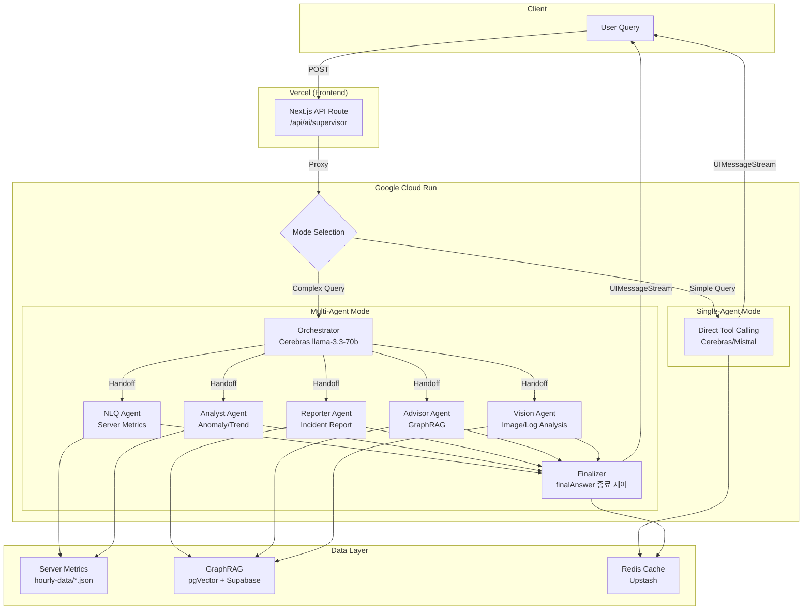

# AI Engine Architecture

> OpenManager AI Engine의 멀티 에이전트 아키텍처 기준 문서
> Owner: platform-architecture
> Status: Active Canonical
> Doc type: Reference
> Last reviewed: 2026-02-15
> Canonical: docs/reference/architecture/ai/ai-engine-architecture.md
> Tags: ai,architecture,multi-agent,cloud-run
>
> **v8.0.0** | Updated 2026-02-15
> (ai-model-policy.md 내용 통합됨, 2026-02-14)

## Overview

OpenManager AI의 AI Engine은 **Vercel AI SDK v6** 기반 **Multi-Agent System**입니다.
Dual-Mode Supervisor 패턴으로 특화된 에이전트를 오케스트레이션하며, **Google Cloud Run**에서 실행되고 프론트엔드는 **Vercel**에 배포됩니다.

**100% 오픈소스 LLM 기반** — 자체 NLP 엔진 없이 외부 LLM API를 사용합니다.

| 구분 | 내용 |
|------|------|
| **NLP 엔진** | 자체 구현 없음 (외부 LLM API 사용) |
| **기반 모델** | Meta Llama 3.3 70B (오픈소스), Gemini 2.5 Flash-Lite (Vision) |
| **호스팅** | Cerebras, Groq, Mistral, Google AI (Gemini) 인프라 |
| **비용** | 모두 무료 tier 한도 내 운영 (프로덕션 배포 한정) |

> **⚠️ [주의: 개발/배포 환경 비용 분리 원칙]**
> 문서 전반에서 언급되는 `비용 = ₩0 유지 (Free Tier)` 원칙은 **"실제 배포되어 구동 중인 서비스(Production)"의 인프라/API 비용**에만 적용됩니다. 코드를 작성하고 아키텍처를 설계하는 **개발 환경 (Claude Code, Cursor 등 AI 코딩 에이전트)**에서는 품질 확보를 위해 유료 토큰을 적극 사용하였으므로, 미래의 유지보수자나 AI 에이전트들은 이 두 가지 환경을 혼동하여 제약을 잘못 해석해서는 안 됩니다.

### AI SDK v6 주요 기능

| Feature | Description |
|---------|-------------|
| **UIMessageStream** | Native streaming protocol (replaces custom SSE) |
| **DefaultChatTransport** | Built-in transport with `resume: true` |
| **finalAnswer Tool** | Agent termination pattern (`hasToolCall` + `stepCountIs`) |
| **Resumable Stream v2** | Automatic stream reconnection via Redis |
| **prepareStep** | Pre-step optimization for agent routing |

## Architecture (v8.0.0)

### Deployment Mode

| Mode | Backend | Status |
|------|---------|--------|
| **Cloud Run** | `cloud-run/ai-engine/` (Vercel AI SDK) | Active (Primary) |
| **Vercel** | `src/app/` (Next.js Frontend) | Active (Frontend Only) |
| ~~Cloud Run~~ | ~~LangGraph/LangChain~~ | Removed (v5.92.0) |

### 아키텍처 변경 배경

**LangGraph/LangChain → Vercel AI SDK 마이그레이션** (2025-12):

1. **Cerebras multi-turn tool calling 제한**: LangGraph에서 Cerebras 호환 문제
2. **Google AI 무료 티어 제한 강화**: Google AI 무료 할당량 급감
3. **임베딩 차원 변경**: 384d (Google) → 1024d (Mistral)
4. **LLM 멀티 에이전트 도입**: 역할별 최적화된 LLM 배치
5. **통합 인프라**: Cloud Run 단일 서비스, `@ai-sdk-tools/agents` 기반 오케스트레이션

### 코드 배치 구조

```
cloud-run/ai-engine/src/services/ai-sdk/
├── model-provider.ts     # LLM 프로바이더 관리 (3-way Fallback)
├── supervisor.ts         # 메인 에이전트 오케스트레이션
└── agents/
    ├── orchestrator.ts   # 멀티에이전트 오케스트레이터 (Dual-Path Routing)
    ├── nlq-agent.ts      # 자연어 쿼리 처리
    ├── analyst-agent.ts  # 분석, 이상 탐지
    ├── reporter-agent.ts # 보고서 생성
    ├── reporter-pipeline.ts  # Evaluator-Optimizer 패턴
    ├── advisor-agent.ts  # RAG 기반 조언
    └── vision-agent.ts   # Vision Agent (Gemini Flash-Lite)
```

### Agent Stack

| Agent | Primary Provider | Fallback | Role | Tools |
|-------|------------------|----------|------|-------|
| **Orchestrator** | Cerebras llama-3.3-70b | Mistral mistral-small-2506 | 빠른 의도 라우팅 (~200ms) | Agent handoffs |
| **NLQ Agent** | Cerebras llama-3.3-70b | Groq → Mistral | 서버 메트릭 쿼리 | `getServerMetrics`, `getServerMetricsAdvanced`, `filterServers` |
| **Analyst Agent** | Groq llama-3.3-70b-versatile | Cerebras → Mistral | 이상 탐지, 트렌드 예측 | `detectAnomalies`, `predictTrends`, `analyzePattern`, `correlateMetrics`, `findRootCause` |
| **Reporter Agent** | Groq llama-3.3-70b-versatile | Cerebras → Mistral | 장애 보고서, 타임라인 | `buildIncidentTimeline`, `findRootCause`, `correlateMetrics`, `searchKnowledgeBase` |
| **Advisor Agent** | Mistral mistral-small-2506 | Groq → Cerebras | 트러블슈팅, 지식 검색 | `searchKnowledgeBase` (GraphRAG), `recommendCommands` |
| **Vision Agent** | Gemini 2.5-flash | OpenRouter (Nemotron/Mistral/Gemma Free) | 스크린샷/로그 분석, Search Grounding | `analyzeScreenshot`, `analyzeLargeLog`, `searchWithGrounding` |
| **Evaluator Agent** | Cerebras llama-3.3-70b | - | 보고서 품질 평가 (내부) | `evaluateIncidentReport`, `validateReportStructure` |
| **Optimizer Agent** | Mistral mistral-small-2506 | - | 보고서 품질 개선 (내부) | `refineRootCauseAnalysis`, `enhanceSuggestedActions` |

> **Note**: 실행 에이전트는 7개(NLQ/Analyst/Reporter/Advisor/Vision/Evaluator/Optimizer)이며, Orchestrator는 코디네이터 컴포넌트로 별도 집계합니다.

> **Dual-Mode Strategy**: Single-agent mode (단순 쿼리, 저지연), Multi-agent mode (복잡 쿼리, 전문 처리). Cerebras는 빠른 라우팅/NLQ, Groq는 분석/보고서 안정성.

### Embedding

| 역할 | 모델 | 차원 | 비고 |
|------|------|------|------|
| **Vector Search** | mistral-embed | 1024d | Supabase pgvector 연동 |

### Frontend → Agent Mapping

| Feature | Vercel API Route | Cloud Run Endpoint | Primary Agent | Handoff Agents |
|---------|------------------|-------------------|---------------|----------------|
| **AI Chat (NLQ)** | `/api/ai/supervisor` | `/api/ai/supervisor` | Orchestrator | NLQ, Analyst, Reporter, Advisor |
| **Auto Incident Report** | `/api/ai/incident-report` | `/api/ai/incident-report` | Reporter | - (Direct call) |
| **Intelligent Monitoring** | `/api/ai/intelligent-monitoring` | `/api/ai/analyze-server` | Analyst | - (Direct call) |

### 무료 티어 한도 (2026-01 기준)

| Provider | 무료 할당량 | 용도 | 모델 |
|----------|-------------|------|------|
| **Cerebras** | 24M tokens/day | Orchestrator, NLQ Agent | llama-3.3-70b |
| **Groq** | 100K tokens/day | Analyst, Reporter Agent | llama-3.3-70b-versatile |
| **Mistral** | 1M tokens/mo | Advisor, Embedding, Optimizer | mistral-small-2506 |
| **Gemini** | 250 RPD, 10 RPM, 250K TPM | Vision Agent | gemini-2.5-flash |
| **OpenRouter** | Provider/Model별 상이 | Vision Fallback | nvidia/nemotron-nano-12b-v2-vl:free (+ fallback list) |

> **주의**: OpenRouter 무료 모델은 일일 50회 제한으로 저사용량 시나리오에만 적합합니다.

## 의도 분류 (Intent Classification)

경량 정규식 기반 라우팅으로 LLM 호출 전 CPU 부담을 최소화합니다.

| 카테고리 | 패턴 예시 | 라우팅 |
|----------|----------|--------|
| 보고서 | `보고서`, `리포트`, `인시던트` | Multi-Agent (Reporter) |
| 원인 분석 | `왜.*높아`, `원인.*뭐`, `rca` | Multi-Agent (Analyst) |
| 문제 해결 | `어떻게.*해결`, `조치.*방법` | Multi-Agent (Advisor) |
| 예측/추세 | `예측`, `트렌드`, `앞으로` | Multi-Agent (Analyst) |
| 비교 분석 | `어제.*대비`, `비교.*해` | Multi-Agent (Analyst) |
| 용량 계획 | `언제.*부족`, `증설.*필요` | Multi-Agent (Analyst) |
| 이상 분석 | `왜.*이상`, `스파이크.*원인` | Multi-Agent (Analyst) |
| 요약 | `서버.*요약`, `핵심.*알려` | Multi-Agent (NLQ) |
| **기타** | 단순 조회 | **Single-Agent** |

```typescript
// Pre-filter 우선순위
1. Fast Path Check (RegExp)     // ~1ms  — 단순 인사말은 LLM 없이 즉시 응답
2. Forced Routing (Keywords)    // ~1ms  — 키워드 매칭으로 에이전트 직접 호출
3. LLM Intent Classification    // ~200ms — Orchestrator (Cerebras)
```

> **설계 원칙**: Python NLP 라이브러리 대신 정규식 사용으로 Cloud Run CPU 부담 최소화

## Key Features

- **Dual-Mode Supervisor**: Single-agent (simple) vs Multi-agent (complex) mode 자동 선택
- **Agent Handoffs**: Pattern 기반 라우팅 (`matchOn` keywords + regex)
- **Multi-Step Tool Calling**: Vercel AI SDK `maxSteps`로 안정적 도구 실행
- **Fallback Chains**: 에이전트별 프로바이더 폴백 (Cerebras → Groq, Groq → Cerebras)
- **User-Triggered Design**: 모든 AI 기능은 사용자 명시적 트리거 (자동 실행 없음)
- **Circuit Breaker**: 모델 상태 모니터링 및 자동 장애 전환
- **GraphRAG Integration**: Advisor agent의 hybrid vector + graph search
- **Protocol Adaptation**: UIMessageStream native protocol (v6)
- **Response Completion Control**: `finalAnswer` 패턴으로 도구 루프 종료 제어

### Version History

<details>
<summary>v7.1.0 (2026-01-27)</summary>

- **BaseAgent Abstract Class**: 모든 에이전트의 공통 실행 로직 캡슐화
- **AgentFactory Pattern**: 중앙화된 에이전트 생성 및 가용성 관리
- **Vision Agent**: Gemini Flash-Lite 전용 (1M context, multimodal, Google Search Grounding)
- **AI SDK v6.0.50**: `timeout: { totalMs, chunkMs }` 설정 지원
- **3-Way Fallback**: 각 에이전트별 3중 프로바이더 폴백 체인
- **Graceful Degradation**: Vision Agent 미가용 시 Analyst Agent로 자동 폴백
</details>

<details>
<summary>v6.1.0 (2026-01-25)</summary>

- **AI SDK v6 Native Protocol**: UIMessageStream for streaming
- **Resumable Stream v2**: `resumable-stream` package with Redis state
- **finalAnswer Pattern**: `hasToolCall('finalAnswer')` + `stepCountIs(N)` for clean termination
- **prepareStep Optimization**: Agent routing order (RCA → Reporter → Analyst)
- **DefaultChatTransport**: Built-in transport with `resume: true` for auto-reconnect
- **v1 Removal**: Legacy stream endpoint removed (508 lines deleted)
</details>

<details>
<summary>v5.87.0 ~ v5.91.0 (LangGraph era)</summary>

- **v5.87.0**: LangGraph → Vercel AI SDK Migration, Dual-Mode Supervisor, GraphRAG Hybrid Search
- **v5.88.0**: Gemini API Key Failover, LangChain maxRetries Fix
- **v5.89.0**: Dual-Provider Architecture, Advanced NLQ Tool
- **v5.90.0**: Triple-Provider Strategy, Rate Limit Distribution
- **v5.91.0**: RCA Agent, Capacity Agent, Workflow Caching, Tavily 웹 검색 마이그레이션
</details>

## Agent Lifecycle (v8.0.0)

### BaseAgent + ToolLoopAgent Pattern

모든 에이전트는 `BaseAgent` 추상 클래스를 통해 AI SDK v6의 공식 `ToolLoopAgent`를 내부적으로 사용합니다. 7개 에이전트 모두 `ConfigBasedAgent` 단일 클래스로 구현됩니다.

```typescript
abstract class BaseAgent {
  abstract getName(): string;
  abstract getConfig(): AgentConfig | null;
  async run(query, options?): Promise<AgentResult>;   // → ToolLoopAgent.generate()
  async *stream(query, options?): AsyncGenerator<AgentStreamEvent>; // → ToolLoopAgent.stream()
  isAvailable(): boolean;
}

interface AgentRunOptions {
  timeoutMs?: number;          // 최대 실행 시간 (default: 45000)
  maxSteps?: number;           // 최대 LLM 호출 횟수 (default: 5)
  temperature?: number;        // 응답 다양성 (default: 0.4)
  webSearchEnabled?: boolean;  // 웹 검색 허용 (default: true)
}
```

### AgentFactory 사용법

```typescript
import { AgentFactory, runAgent, streamAgent } from './agent-factory';

const nlq = AgentFactory.create('nlq');       // ConfigBasedAgent 인스턴스 반환
const available = AgentFactory.isAvailable('vision');
const result = await runAgent('nlq', '서버 상태 알려줘');
for await (const event of streamAgent('analyst', '이상 탐지')) {
  console.log(event);
}
```

### 실행 흐름

```
1. Orchestrator가 쿼리 분석
2. preFilterQuery()로 패턴 매칭 (정규식 기반 의도 분류)
3. AgentFactory.create()로 ConfigBasedAgent 생성
4. BaseAgent.run() → ToolLoopAgent.generate() 위임
5. ToolLoopAgent stopWhen 조건 충족 시 종료:
   - hasToolCall('finalAnswer')
   - stepCountIs(maxSteps)
6. 결과 반환 (toolsCalled, usage, metadata)
```

## Resilience & Performance

### 3-Way Provider Fallback

모든 에이전트는 3중 Fallback 체계를 갖추고 있어 특정 프로바이더 장애 시 자동으로 다음 순위 모델로 전환됩니다. Quota 80% 초과 시에도 자동 전환됩니다.

| Agent | Primary | Secondary | Tertiary |
|-------|---------|-----------|----------|
| Orchestrator | Cerebras | Mistral | - |
| NLQ Agent | Cerebras | Groq | Mistral |
| Analyst Agent | Groq | Cerebras | Mistral |
| Reporter Agent | Groq | Cerebras | Mistral |
| Advisor Agent | Mistral | Groq | Cerebras |

### Circuit Breaker & Retry

| 메커니즘 | 동작 |
|---------|------|
| **Circuit Breaker** | API 실패 반복 시 해당 프로바이더를 일시 차단하여 불필요한 대기 시간 감소 |
| **Exponential Backoff** | Rate Limit(429) 발생 시 지수적으로 재시도 간격 증가 (1s → 2s → 4s) |
| **Health Check** | 주기적으로 차단된 프로바이더의 복구 상태 확인 후 자동 복원 |

### Reporter Pipeline (Evaluator-Optimizer)

Reporter Agent는 고품질 보고서를 위해 3단계 파이프라인을 실행합니다.

```
Generate (Draft) → Evaluate (Score) → Optimize (Improve) → Re-evaluate
                       │
                   quality >= 0.75? → Return
                       │
                   No: Iterate (max 2회)
```

| 설정 | 값 | 설명 |
|------|-----|------|
| **qualityThreshold** | 0.75 | 최소 품질 점수 |
| **maxIterations** | 2 | 최대 개선 반복 |
| **timeout** | 40초 | 파이프라인 타임아웃 |

**평가 기준** (5가지, 가중치 합계 1.0):

| 기준 | 가중치 | 설명 |
|------|--------|------|
| completeness | 0.20 | 필수 정보 포함 여부 |
| accuracy | 0.25 | 데이터 정확도 |
| clarity | 0.20 | 명확한 표현 |
| actionability | 0.20 | 실행 가능한 권고 |
| structure | 0.15 | 논리적 구조 |

### Task Decomposition

복잡한 쿼리는 Orchestrator가 **Task Decomposition** 패턴으로 분할 처리합니다.

| 실행 모드 | 조건 | 예시 |
|----------|------|------|
| **Parallel** | 독립적 작업 | "모든 서버 CPU와 메모리 현황" |
| **Sequential** | 의존적 작업 | "장애 원인 분석 후 해결책 제시" |
| **Hybrid** | 혼합 | 병렬 수집 → 순차 분석 |

### Tavily 웹 검색 통합

Reporter Agent는 **Tavily API**를 통해 실시간 웹 검색 기능을 제공합니다.

| 항목 | 값 |
|------|-----|
| **timeout** | 15초 |
| **maxRetries** | 2 |
| **cacheSize** | 30 (LRU) |
| **cacheTTL** | 5분 |
| **API Key Failover** | `TAVILY_API_KEY` → `TAVILY_API_KEY_BACKUP` |

### Vision Agent (Gemini Flash + OpenRouter)

Vision Agent는 Gemini Flash를 주력으로 사용하며, 무료 할당량(250 RPD) 소진 시 OpenRouter 무료 모델로 폴백합니다.

| Feature | Capability |
|---------|------------|
| **Context Window** | 1M tokens (Gemini) |
| **Multimodal** | Image/PDF/Video/Audio |
| **Google Search** | Grounding 지원 (Gemini Only) |
| **URL Context** | 웹 페이지 분석 |

**Graceful Degradation**: Gemini/OpenRouter 모두 장애 시 Vision Agent는 비활성화되며, 기존 에이전트(NLQ/Analyst/Reporter/Advisor)는 100% 정상 동작합니다. OpenRouter 무료 모델은 기능 편차가 커서 기본적으로 Tool Calling을 비활성화하고 텍스트/이미지 분석 중심으로 동작합니다.

### Observability (Langfuse)

모든 에이전트의 실행 과정이 Langfuse로 추적됩니다.

| 추적 항목 | 설명 |
|----------|------|
| **Input/Output** | 각 에이전트의 입력 메시지 및 응답 |
| **Tool Calls** | 호출된 도구 목록 및 결과 |
| **Latency** | 에이전트별 처리 시간 |
| **Token Usage** | Prompt/Completion 토큰 수 |
| **Handoff Chain** | 에이전트 간 위임 경로 |

## Agent Communication Patterns

| Pattern | Description | Use Case |
|---------|-------------|----------|
| **Return-to-Supervisor** | Agent sets `returnToSupervisor=true` | 다른 에이전트 전문성 필요 시 |
| **Command Pattern** | Explicit `toAgent` in DelegationRequest | 특정 에이전트 직접 위임 |
| **FinalAnswer Loop** | `finalAnswer` 도구 호출 시 루프 종료 | 무한 루프 방지 및 종료 일관성 |

## Tool Registry (27개 도구)

| Category | Tool | Agent | Description |
|----------|------|-------|-------------|
| **Metrics (6)** | `getServerMetrics` | NLQ | 서버 메트릭 조회 |
| | `getServerMetricsAdvanced` | NLQ | 고급 메트릭 분석 |
| | `filterServers` | NLQ | 서버 필터링 |
| | `getServerByGroup` | NLQ | 서버 그룹 조회 |
| | `getServerByGroupAdvanced` | NLQ | 서버 그룹 복합 조회 |
| | `getServerLogs` | NLQ/Reporter | 서버 로그 조회 |
| **RCA (3)** | `findRootCause` | Analyst, Reporter | 근본 원인 분석 |
| | `correlateMetrics` | Analyst, Reporter | 메트릭 상관관계 |
| | `buildIncidentTimeline` | Reporter | 인시던트 타임라인 |
| **Analyst (4)** | `detectAnomalies` | Analyst | 이상 탐지 |
| | `detectAnomaliesAllServers` | Analyst | 전체 서버 이상 탐지 |
| | `predictTrends` | Analyst | 트렌드 예측 |
| | `analyzePattern` | Analyst | 패턴 분석 |
| **Reporter (3)** | `searchKnowledgeBase` | Reporter/Advisor | RAG 지식 검색 |
| | `recommendCommands` | Reporter/Advisor | 조치 명령 추천 |
| | `searchWeb` | Reporter | 웹 검색 (Tavily) |
| **Evaluation (6)** | `evaluateIncidentReport` | Reporter Pipeline | 보고서 품질 평가 |
| | `validateReportStructure` | Reporter Pipeline | 구조 검증 |
| | `scoreRootCauseConfidence` | Reporter Pipeline | RCA 신뢰도 점수화 |
| | `refineRootCauseAnalysis` | Reporter Pipeline | RCA 개선 |
| | `enhanceSuggestedActions` | Reporter Pipeline | 조치안 구체화 |
| | `extendServerCorrelation` | Reporter Pipeline | 서버 연관성 확장 |
| **Control (1)** | `finalAnswer` | All | 에이전트 종료 신호 |
| **Vision (4)** | `analyzeScreenshot` | Vision | 스크린샷 분석 |
| | `analyzeLargeLog` | Vision | 대용량 로그 분석 |
| | `searchWithGrounding` | Vision | Google Search Grounding |
| | `analyzeUrlContent` | Vision | URL 콘텐츠 분석 |

> **Note**: `finalAnswer`는 AI SDK v6 베스트 프랙티스에 따른 에이전트 종료 도구. `stopWhen: [hasToolCall('finalAnswer')]` 패턴과 함께 사용.

## 환경 변수

```env
# Cloud Run AI Engine
CLOUD_RUN_AI_URL=https://ai-engine-xxx.asia-northeast1.run.app
CLOUD_RUN_AI_ENABLED=true

# Provider API Keys (Cloud Run 내부 관리)
CEREBRAS_API_KEY=xxx
GROQ_API_KEY=xxx
MISTRAL_API_KEY=xxx
GEMINI_API_KEY=xxx   # Vision Agent 전용

# Tavily (Reporter Agent)
TAVILY_API_KEY=xxx
TAVILY_API_KEY_BACKUP=xxx

# Note: Vercel에서는 Cloud Run URL만 필요, API 키는 Cloud Run 환경에서 관리
```

## Architecture Diagram



### ASCII Fallback

```
┌──────────────────────────────────────────────────────────────────┐
│  User Query                                                       │
└─────────────────────────────┬────────────────────────────────────┘
                              │ POST
                              ▼
┌──────────────────────────────────────────────────────────────────┐
│  Vercel (Next.js)  →  /api/ai/supervisor  →  Proxy              │
└─────────────────────────────┬────────────────────────────────────┘
                              │ X-API-Key
                              ▼
┌──────────────────────────────────────────────────────────────────┐
│  Google Cloud Run (AI Engine)                                     │
│                                                                   │
│  ┌────────────────────────────────────────────────────────────┐  │
│  │  Mode Selection                                             │  │
│  │  ┌─────────────────┐      ┌──────────────────────────┐    │  │
│  │  │ Simple Query    │      │ Complex Query             │    │  │
│  │  │ → Single Agent  │      │ → Orchestrator            │    │  │
│  │  │   (Cerebras)    │      │   (Cerebras llama-3.3)    │    │  │
│  │  └────────┬────────┘      └────────────┬─────────────┘    │  │
│  │           │                   ┌────────┼────────┐          │  │
│  │           │                   ▼        ▼        ▼          │  │
│  │           │               ┌─────┐ ┌────────┐ ┌────────┐   │  │
│  │           │               │ NLQ │ │Analyst │ │Reporter│   │  │
│  │           │               └──┬──┘ └───┬────┘ └───┬────┘   │  │
│  │           │                  │        │          │         │  │
│  │           │               ┌────────┐ ┌────────┐           │  │
│  │           │               │Advisor │ │ Vision │           │  │
│  │           │               └───┬────┘ └───┬────┘           │  │
│  │           │                   └─────┬────┘                │  │
│  │           │                         ▼                     │  │
│  │           │                  ┌────────────┐               │  │
│  │           └──────────────────│ Finalizer  │               │  │
│  │                              └──────┬─────┘               │  │
│  └─────────────────────────────────────┼─────────────────────┘  │
└─────────────────────────────────────────┼────────────────────────┘
                                          ▼
┌─────────────┐     ┌──────────────┐     ┌──────────────────┐
│ Server Data │     │ GraphRAG     │     │ Redis Cache      │
│ hourly-data │     │ pgVector     │     │ Upstash          │
└─────────────┘     └──────────────┘     └──────────────────┘
```

### Interactive Diagrams (FigJam)

| Diagram | Description | Link |
|---------|-------------|------|
| **System Architecture** | Full AI engine overview | [View](https://www.figma.com/online-whiteboard/create-diagram/9a4b29bd-0376-4e0a-8e22-3b9bd008854a) |
| **Agent Routing Flow** | Supervisor → Agent routing | [View](https://www.figma.com/online-whiteboard/create-diagram/22dbc5b3-44c1-44e7-9eee-1fa0cf8e402a) |
| **Multi-Agent Communication** | Inter-agent delegation | [View](https://www.figma.com/online-whiteboard/create-diagram/a32f26ab-5d3c-40f6-a8ed-4eb5ec0ed843) |
| **Supervisor Execution Flow** | Query → Supervisor → Agents → finalAnswer 종료 흐름 | [View](https://www.figma.com/online-whiteboard/create-diagram/eb37f54b-2795-4320-bd2e-c41854a7ec52) |

---

## Related Documentation

- **[API Endpoints](../../api/endpoints.md)** - 라우트 기준 API 명세
- **[System Architecture](../system/system-architecture-current.md)** - 배포/데이터 흐름 포함 전체 구조
- **[Monitoring & ML Engine](./monitoring-ml.md)** - 이상탐지, 트렌드 예측, 적응형 임계값 시스템
- **[RAG & Knowledge Engine](./rag-knowledge-engine.md)** - 검색 및 지식 그래프 아키텍처
- **[Data Architecture](../data/data-architecture.md)** - 서버 데이터 아키텍처
