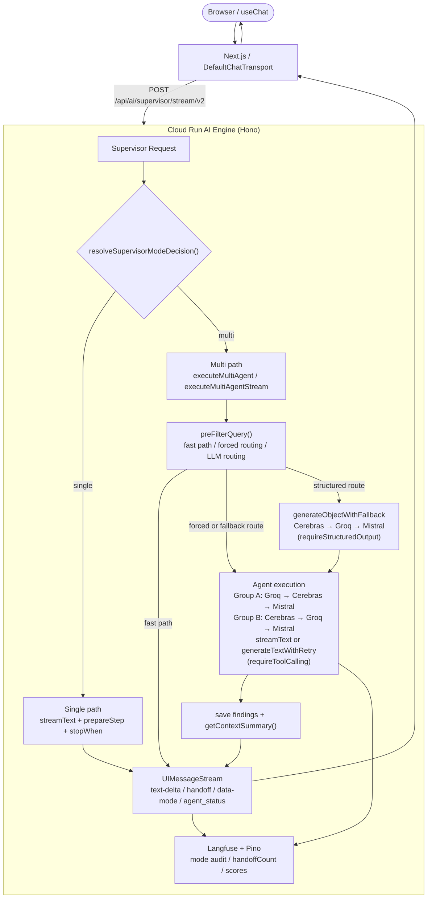
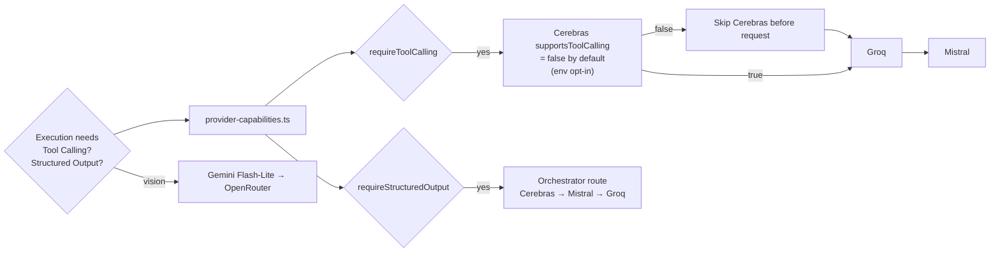

# AI Engine Architecture

> OpenManager AI Engine의 멀티 에이전트 아키텍처 기준 문서
> Owner: platform-architecture
> Status: Active Canonical
> Doc type: Reference
> Last reviewed: 2026-04-26
> Canonical: docs/reference/architecture/ai/ai-engine-architecture.md
> Tags: ai,architecture,multi-agent,cloud-run
>
> **v8.10.9** | Updated 2026-04-26
> (ai-model-policy.md 내용 통합됨, 2026-02-14)

## 1. Overview

OpenManager AI의 AI Engine은 **Vercel AI SDK v6 계열** 기반 **multi-agent first** 아키텍처입니다.
프론트엔드는 `useChat` + 커스텀 `DefaultChatTransport`를 사용하고, Cloud Run(Hono) 백엔드는 `createUIMessageStreamResponse`, `streamText`, `generateText`, `generateObject`, BaseAgent 내부 tool loop를 조합한 하이브리드 실행 구조를 사용합니다.

현재 정책은 다음과 같습니다.

- 기본 운영 철학: **multi-agent first**
- 명시적 `multi`: 항상 multi-agent 경로 유지
- 명시적 `single`: `ALLOW_DEGRADED_SINGLE=true`일 때만 허용
- `auto`: 복잡도 기반으로 저비용 요청은 `single`, 복합 질의는 `multi`

즉, 현재 시스템은 "멀티에이전트 전용"이 아니라 **멀티에이전트 우선 + 통제된 단일 경로 허용** 구조입니다.

| 구분 | 내용 |
|------|------|
| **NLP 전처리** | 규칙 기반 커스텀 파이프라인 (ML 라이브러리 미사용) — 쿼리 분류·복잡도 분석·명확화·텍스트 정제·Prompt Injection 방어 포함. 상세: [frontend-backend-comparison.md §2.3](./frontend-backend-comparison.md) |
| **기반 모델** | Groq `llama-4-scout-17b-16e-instruct`, Cerebras `qwen-3-235b-a22b-instruct-2507` + `llama3.1-8b` intra-fallback, Mistral `mistral-large-latest`, Gemini `gemini-2.5-flash-lite` |
| **호스팅** | Cerebras, Groq, Mistral, Google AI (Gemini), OpenRouter 인프라 |
| **비용** | 프로덕션 서비스는 무료 tier 한도 내 운영 |

> **[비용 분리 원칙]**: `Free Tier` 원칙은 **프로덕션 인프라/API 비용**에만 적용됩니다.
> 개발 환경 (Claude Code 등 AI 코딩 에이전트)에서는 품질 확보를 위해 유료 토큰을 사용합니다.

## 2. Architectural Philosophy & Framework Context (2026)

이 섹션은 OpenManager AI Engine의 설계 선택을 외부 프레임워크 문서와 비교해 설명합니다.
문서에서 사용하는 **"Frameworkless AI"**는 업계 표준 용어가 아니라, 이 저장소에서 사용하는 내부 표현이며 의미는 **low-abstraction / framework-light 구성**입니다.

### 2.1. Low-abstraction 전략 (LangChain / LangGraph 대비)
- LangChain은 prebuilt agent architecture를 제공하고, LangChain agents는 LangGraph 위에서 durable execution, persistence, human-in-the-loop 등을 활용하도록 설계되어 있습니다.
- OpenManager는 해당 기능 집합 자체를 부정하는 것이 아니라, 현재 운영 요구(예측 가능한 라우팅, 디버깅 단순성, 타입스크립트 코드 중심 제어)에 맞춰 Vercel AI SDK의 핵심 함수(`generateText`, `generateObject`)와 자체 라우터를 직접 조합하는 방식을 선택했습니다.

### 2.2. Router-first 실행 구조 (CrewAI / AutoGen 대비)
- CrewAI 문서는 `crews/flows` 중심으로 memory, state, persist execution, resume long-running workflow 등을 제공한다고 설명합니다.
- AutoGen 문서는 conversational single/multi-agent 애플리케이션과 event-driven multi-agent 시스템 구축을 주요 시나리오로 제시합니다.
- OpenManager는 서버 운영 질의에서 지연 시간과 토큰 사용량의 예측 가능성을 우선하여, **Orchestrator(의도/라우팅) → 전문 Agent(실행)** 구조를 기본값으로 유지합니다. 이는 범용 우위 주장이라기보다, 현재 도메인과 비용 제약(Free Tier)에서의 운영 선택입니다.

### 2.3. OpenAI Swarm / Agents SDK와의 관계
- OpenAI `swarm` 저장소는 현재 Agents SDK로 대체되었고, production use case는 Agents SDK 사용을 권장합니다.
- OpenAI Agents SDK는 "few abstractions"와 handoffs(에이전트 위임)를 핵심 primitive로 제시합니다.
- OpenManager의 handoff 흐름은 이 개념과 방향성이 유사하지만, 구현체는 OpenAI Agents SDK 자체가 아니라 **Vercel AI SDK + TypeScript 라우팅** 기반의 커스텀 오케스트레이션입니다.

### 2.4. Next.js ↔ Cloud Run 분리와 BFF 적용
- Vercel Functions는 최대 실행 시간(max duration) 제한이 있고, 제한을 초과하면 함수가 종료됩니다.
- Cloud Run 서비스 요청 timeout은 기본 5분이며, 최대 60분까지 확장할 수 있습니다.
- BFF(Backends for Frontends) 패턴은 프런트엔드별 요구사항에 맞게 백엔드를 분리하는 접근입니다.
- OpenManager는 이 원칙에 따라 Next.js를 BFF/API 프록시 계층으로 두고, 장시간 AI 실행(예: RAG, 다단계 라우팅)은 Cloud Run `ai-engine`으로 분리합니다.

### 2.5. External References (Fact-check)
- LangChain overview: https://docs.langchain.com/oss/python/langchain/overview
- CrewAI docs: https://docs.crewai.com/
- AutoGen docs: https://microsoft.github.io/autogen/stable/
- OpenAI Swarm repo: https://github.com/openai/swarm
- OpenAI Agents SDK docs: https://openai.github.io/openai-agents-python/
- Vercel Function duration: https://vercel.com/docs/functions/configuring-functions/duration
- Cloud Run request timeout: https://cloud.google.com/run/docs/configuring/request-timeout
- BFF pattern (Microsoft Learn): https://learn.microsoft.com/en-us/azure/architecture/patterns/backends-for-frontends

### 2.6. 라우팅 경로별 LLM 호출 수 vs Free Tier 소비

Multi-agent 경로를 선택할수록 LLM 호출 횟수가 늘어 Free Tier 쿼터 소비가 증가합니다. Supervisor가 단순 질의의 과잉 라우팅을 방어하는 것은 응답 속도뿐만 아니라 **무료 API 한도 보존**이 직접적인 목적입니다.

| 실행 경로 | LLM 호출 수 | 예상 토큰 소비 | Free Tier 압박 |
|----------|:----------:|-------------|:----------:|
| Single-Agent | 1회 | ~500–2,000 | 낮음 |
| Multi-Agent (일반) | 2–3회 | ~1,500–5,000 | 중간 |
| Reporter Pipeline | 4–5회 (Reporter + Eval + Optimize×2) | ~4,000–10,000 | 높음 |
| RAG 포함 시 | +0회 (Knowledge Retrieval Lite) | EvidenceCard 텍스트만 추가 | 낮음 |

**Supervisor가 과잉 라우팅을 방어해야 하는 이유**: Groq/Cerebras 무료 tier는 RPM·TPD 한도가 고정됩니다. Reporter Pipeline 1회 실행이 단순 조회 4–5회 분의 쿼터를 소모하므로, 복합 쿼리 여부를 정확히 판별해 라우팅하는 것이 **비용(API 한도) 방어의 핵심**입니다.

## 3. System Architecture

### Current Request Flow


```mermaid
flowchart TB
    User([Browser / useChat]) --> Vercel["Next.js / DefaultChatTransport"]
    Vercel -->|POST /api/ai/supervisor/stream/v2| CR

    subgraph CR["Cloud Run AI Engine (Hono)"]
        Entry["Supervisor Request"]
        Mode{"resolveSupervisorModeDecision()"}
        Single["Single path\nstreamText + prepareStep + stopWhen"]
        Multi["Multi path\nexecuteMultiAgent / executeMultiAgentStream"]
        Prefilter["preFilterQuery()\nfast path / forced routing / LLM routing"]
        Route["generateObjectWithFallback\nCerebras → Groq → Mistral\n(requireStructuredOutput)"]
        Agent["Agent execution\nGroup A: Groq → Cerebras → Mistral\nGroup B: Cerebras → Groq → Mistral\nstreamText or generateTextWithRetry\n(requireToolCalling)"]
        Context["save findings + getContextSummary()"]
        Stream["UIMessageStream\ntext-delta / handoff / data-mode / agent_status"]
        Trace["Langfuse + Pino\nmode audit / handoffCount / scores"]

        Entry --> Mode
        Mode -->|single| Single
        Mode -->|multi| Multi
        Multi --> Prefilter
        Prefilter -->|fast path| Stream
        Prefilter -->|forced or fallback route| Agent
        Prefilter -->|structured route| Route
        Route --> Agent
        Agent --> Context
        Context --> Stream
        Single --> Stream
        Stream --> Trace
        Agent --> Trace
    end

    Stream --> Vercel --> User
```

### Capability-Aware Provider Gate


```mermaid
flowchart LR
    Need{"Execution needs\nTool Calling?\nStructured Output?"} --> Caps["provider-capabilities.ts"]
    Caps --> TC{"requireToolCalling"}
    Caps --> SO{"requireStructuredOutput"}

    TC -->|yes| CerebrasTool["Cerebras supportsToolCalling\n= false by default\n(env opt-in)"]
    CerebrasTool -->|false| Skip["Skip Cerebras before request"]
    Skip --> Groq["Groq"]
    Groq --> Mistral["Mistral"]
    CerebrasTool -->|true| Groq

    SO -->|yes| Structured["Orchestrator route\nCerebras → Mistral → Groq"]
    Need -->|vision| Vision["Gemini Flash-Lite → OpenRouter"]
```

### ASCII 상세 구조

```
┌─────────────────────────────────────────────────────────────┐
│  유저 브라우저                                                │
│  └─ React 19 + Next.js 16.1 (Vercel)                        │
│     └─ useChat + DefaultChatTransport                       │
└────────────────────┬────────────────────────────────────────┘
                     │ POST /api/ai/supervisor/stream/v2
                     │ X-API-Key + W3C Trace Context
                     ▼
┌─────────────────────────────────────────────────────────────┐
│  Cloud Run AI Engine (Hono, 1 vCPU / 512Mi)                 │
│                                                              │
│  ┌────────────────────────────────────────────────────────┐ │
│  │ Supervisor (진입점)                                     │ │
│  │  ├─ resolveSupervisorModeDecision()                    │ │
│  │  │  ├─ explicit multi → multi                          │ │
│  │  │  ├─ explicit single → gated                         │ │
│  │  │  └─ auto → complexity 기반 single/multi             │ │
│  │  ├─ Single-Agent → streamText() + prepareStep         │ │
│  │  └─ Multi-Agent  → Orchestrator에 위임                 │ │
│  ├────────────────────────────────────────────────────────┤ │
│  │ Orchestrator (멀티에이전트 조율)                         │ │
│  │  ├─ Pre-Filter (fast path / forced route)              │ │
│  │  ├─ Structured routing (generateObjectWithFallback)    │ │
│  │  ├─ Agent tool loop (generateText/streamText)          │ │
│  │  ├─ 세션 컨텍스트 요약 주입                            │ │
│  │  └─ mode audit / handoffCount 추적                     │ │
│  ├────────────────────────────────────────────────────────┤ │
│  │ 5 Work Agents + Reporter Pipeline + Vision Fallback    │ │
│  └────────────────────────────────────────────────────────┘ │
│           │              │              │                     │
│     ┌─────┴─────┐  ┌────┴────┐  ┌─────┴──────┐             │
│     │ OTel Data │  │Knowledge│  │   Redis    │             │
│     │ (18 hosts)│  │ Lite KB │  │  (Upstash) │             │
│     └───────────┘  └─────────┘  └────────────┘             │
└─────────────────────────────────────────────────────────────┘
```

> Source of truth (2026-04-04): `cloud-run/ai-engine/src/services/ai-sdk/supervisor-mode.ts`, `cloud-run/ai-engine/src/services/ai-sdk/agents/orchestrator-execution.ts`, `cloud-run/ai-engine/src/services/ai-sdk/agents/config/agent-configs.ts`, `cloud-run/ai-engine/src/services/ai-sdk/provider-capabilities.ts`

### Supervisor vs Orchestrator (분리 이유)

| | Supervisor | Orchestrator |
|---|---|---|
| **레벨** | High-level entrypoint | Multi-agent coordinator |
| **결정** | `single / multi / auto` 최종 실행 모드 | 어떤 에이전트, 어떤 provider, 어떤 fallback을 쓸지 |
| **방법** | complexity + explicit mode gate + tool filtering | pre-filter + structured routing + fallback routing |
| **실행** | `streamText()` 중심 실시간 스트리밍 | `generateObjectWithFallback`, `generateTextWithRetry`, `streamText` |
| **타임아웃** | Supervisor 하드 50초/40초 warning, stream은 120초/96초 warning | Orchestrator 하드 90초, 라우팅 10초, warn 60초 |
| **호출 시점** | 모든 쿼리 | multi-agent로 resolve된 요청에서만 |

**분리 유지 근거**: 스트리밍 모델이 다르고, LLM 호출 그래프 분리, 각자 독립 테스트 가능.

## 3. Capability-Aware Provider 배분

각 provider는 역할이 다릅니다. 현재 구조는 "모든 단계에서 같은 provider를 쓰는" 방식이 아니라, 실행 단계별 요구 capability를 먼저 보고 provider를 좁힙니다.

| Provider | Primary 에이전트 | 모델 | 운영 메모 |
|----------|----------------|------|-----------|
| **Groq** | Supervisor, NLQ, Analyst, Reporter, Advisor, Verifier | `meta-llama/llama-4-scout-17b-16e-instruct` | tool-calling 중심 텍스트 경로의 primary |
| **Cerebras** | Orchestrator/Analyst/Reporter/Verifier primary, text fallback | `qwen-3-235b-a22b-instruct-2507` → `llama3.1-8b` | Qwen primary, 8B는 intra-provider fallback. `gpt-oss-120b`는 현재 계정 chat completions 404로 runtime 후보에서 제외 |
| **Mistral** | Text last-resort fallback | `mistral-large-latest` | 저RPM 병목 때문에 마지막 fallback으로만 사용. RAG runtime/embedding에는 사용하지 않음 |
| **Gemini** | Vision primary | `gemini-2.5-flash-lite` | Flash 대비 thinking token 소모 없음. Vision 기본 경로 |
| **OpenRouter** | Vision fallback | `google/gemma-3-27b-it:free` → `gemma-3-12b-it:free` → `gemma-3-4b-it:free` | Vision fallback 전용. free-tier 모델 특성상 tool-calling은 기본 비활성 |

### Fallback 체인

Structured routing은 Orchestrator 정책(`Cerebras → Groq → Mistral`)을 따릅니다. 텍스트 에이전트는 quota 격리를 위해 Group A(Supervisor/NLQ/Advisor)는 `Groq → Cerebras → Mistral`, Group B(Analyst/Reporter/Verifier)는 `Cerebras → Groq → Mistral`을 사용합니다. Cerebras 내부에서는 Qwen을 먼저 시도하고, 초기화/쿼터/권한 문제가 있으면 `llama3.1-8b`로 intra-provider fallback합니다.

| Agent | Primary | → 2nd | → 3rd (Last Resort) |
|-------|---------|-------|---------------------|
| Supervisor | Groq | Cerebras | Mistral |
| Orchestrator | Cerebras | Groq | Mistral |
| NLQ | Groq | Cerebras | Mistral |
| Analyst | Cerebras | Groq | Mistral |
| Reporter | Cerebras | Groq | Mistral |
| Advisor | Groq | Cerebras | Mistral |
| Vision | Gemini | OpenRouter | — |

> SSOT: `agent-runtime-policy.ts`, `agent-model-selectors.ts`, `model-provider.ts` — Supervisor/NLQ/Advisor는 Groq-first, Analyst/Reporter/Verifier/Orchestrator는 Cerebras-first chain을 사용합니다.

### Cerebras Tool-Calling 변화 대응

2026-04-04 기준 대응은 "Cerebras를 완전히 제거"가 아니라, **tool-calling이 필요한 경로에서만 capability gate로 선제 차단**하는 방식입니다.

1. `CEREBRAS_TOOL_CALLING_ENABLED` 환경 변수는 기본 `false`, 필요할 때만 `true`로 opt-in
2. `provider-capabilities.ts`에서 provider별 capability를 중앙 선언
3. `selectTextModel(... requiredCapabilities)`가 tool-calling/structured-output 요구사항을 먼저 검사
4. `generateTextWithRetry()`도 tool 사용 시 capability mismatch면 Cerebras를 요청 전에 skip
5. Orchestrator structured output 경로는 Cerebras를 계속 활용 가능

즉, 현재 변경은 "Cerebras 툴콜 이슈 때문에 전체 provider 전략이 무너진 것"이 아니라, **tool route와 structured-output route를 분리해서 운영 리스크를 줄인 조정**입니다.

> 참고: 위 표의 무료 티어/처리량 정보는 운영 판단용 참고치입니다. 정확한 한도 수치는 공급사 정책이 수시 변경되므로 배포 전 별도 확인해야 하며, 이 문서의 SSOT 범위는 **라우팅/폴백 구조와 코드 적용 상태**입니다.

## 4. Agent 구성 (5개 작업 에이전트 + 2개 내부 품질 단계)

### 작업 에이전트 (5개)

| 에이전트 | 역할 | 주요 도구 | 트리거 키워드 |
|---------|------|----------|-------------|
| **NLQ** | 서버 메트릭 조회/요약 | getServerMetrics, filterServers, searchWeb | 서버, CPU, 메모리, 요약 |
| **Analyst** | 이상 탐지, 예측, RCA | detectAnomalies, predictTrends, findRootCause | 이상, 예측, 원인 |
| **Reporter** | 장애 보고서 생성 | buildIncidentTimeline, correlateMetrics, searchWeb | 보고서, 장애, 인시던트 |
| **Advisor** | 해결방안, CLI 추천 | searchKnowledgeBase, recommendCommands, searchWeb | 해결, 방법, 명령어 |
| **Vision** | 대시보드 스크린샷/첨부 이미지 분석 | analyzeScreenshot | 스크린샷, 이미지, 대시보드 |

> Note: `Math`는 독립 에이전트가 아니라 NLQ/Analyst가 사용하는 도구 세트(`evaluateMathExpression`, `computeSeriesStats`, `estimateCapacityProjection`)입니다.
> Note: Vision 관련 `analyzeLargeLog`, `searchWithGrounding`, `analyzeUrlContent` 도구는 Tool Registry에 존재하지만, 현재 `AGENT_CONFIGS['Vision Agent']`의 기본 노출 도구는 `analyzeScreenshot` + `finalAnswer`입니다.

### 내부 품질 단계 (2개)

| 에이전트 | 역할 | 도구 |
|---------|------|------|
| **Evaluator** | 보고서 품질을 결정론적으로 평가 | evaluateIncidentReport, validateReportStructure, scoreRootCauseConfidence |
| **Optimizer** | 보고서를 결정론적으로 보강 | refineRootCauseAnalysis, enhanceSuggestedActions, extendServerCorrelation |

> `Evaluator`와 `Optimizer`는 `AgentConfig` 상 항목으로 유지되지만, 실제 실행은 `reporter-pipeline.ts` 내부의 결정론적 평가/개선 단계로 처리됩니다. 즉 일반 작업 에이전트처럼 독립 LLM 실행 루프를 돌리지 않습니다.

### Agent Factory

모든 에이전트는 `ConfigBasedAgent` 단일 클래스로 구현되며, `AgentFactory`가 생성을 관리합니다.

```typescript
const nlq = AgentFactory.create('nlq');
const result = await runAgent('nlq', '서버 상태 알려줘');
for await (const event of streamAgent('analyst', '이상 탐지')) { ... }
```

## 5. 요청 처리 흐름

### Single-Agent (단순 쿼리)

```
유저: "서버 CPU가 왜 높아?"
  │
  ├─ ① 입력 검증 (Zod) → 보안 (API Key) → Rate Limit
  ├─ ② Supervisor: selectExecutionMode() [regex] → 'single'
  ├─ ③ getSupervisorModel() → Groq (CB 확인, Cerebras tool loop 기본 비활성)
  ├─ ④ streamText() + prepareStep (intent='rca')
  │    ├─ Step 1: findRootCause() → 결과
  │    ├─ Step 2: correlateMetrics() → 상관 분석
  │    └─ Step 3: finalAnswer() → 루프 종료
  ├─ ⑤ SSE 스트리밍 → 유저 실시간 응답
  └─ ⑥ Langfuse 트레이싱 (비동기)
```

### Multi-Agent (복잡 쿼리)

```
유저: "장애 분석 보고서 작성해줘"
  │
  ├─ ① Supervisor: selectExecutionMode() → 'multi' (보고서 패턴)
  ├─ ② Orchestrator: preFilterQuery() → 신뢰도 90%
  ├─ ③ Reporter Pipeline 실행
  │    ├─ Reporter Agent: 초안 생성 (Cerebras → Groq fallback)
  │    ├─ Evaluator Agent: 품질 평가 (4차원 점수)
  │    ├─ 품질 < 75%? → Optimizer Agent 개선 (최대 2회)
  │    └─ 최종 보고서 반환
  └─ ④ SSE 스트리밍 → 유저
```

### Intent Classification (경량 regex 기반)

| 카테고리 | 패턴 예시 | 라우팅 |
|----------|----------|--------|
| 보고서 | `보고서`, `리포트`, `인시던트` | Multi → Reporter |
| 원인 분석 | `왜.*높아`, `원인.*뭐`, `rca` | Multi → Analyst |
| 문제 해결 | `어떻게.*해결`, `조치.*방법` | Multi → Advisor |
| 예측/추세 | `예측`, `트렌드`, `앞으로` | Multi → Analyst |
| 요약 | `서버.*요약`, `핵심.*알려` | Multi → NLQ |
| **기타** | 단순 조회 | **Single-Agent** |

## 6. Tool Registry (30개)

| Category | 도구 | 에이전트 | 설명 |
|----------|------|---------|------|
| **Metrics (6)** | getServerMetrics | NLQ | 서버 메트릭 조회 |
| | getServerMetricsAdvanced | NLQ | 시간 범위 집계 |
| | filterServers | NLQ | 조건부 필터링 |
| | getServerByGroup/Advanced | NLQ | 그룹별 조회 |
| | getServerLogs | NLQ/Reporter | 시스템/에러/앱 로그 |
| **RCA (3)** | findRootCause | Analyst, Reporter | 근본 원인 분석 |
| | correlateMetrics | Analyst, Reporter | 메트릭 상관 분석 |
| | buildIncidentTimeline | Reporter | 인시던트 타임라인 |
| **Analyst (4)** | detectAnomalies[AllServers] | Analyst | 2sigma 이상 탐지 |
| | predictTrends | Analyst | 선형 회귀 예측 |
| | analyzePattern | Analyst | 시계열 패턴 분석 |
| **Knowledge (3)** | searchKnowledgeBase | Reporter/Advisor | Knowledge Retrieval Lite 내부 지식 검색 (BM25 + metadata boost) |
| | recommendCommands | Reporter/Advisor | CLI 추천 |
| | searchWeb | NLQ/Reporter/Advisor | 외부 실시간 웹 검색 |
| **Math (3)** | evaluateMathExpression | NLQ/Analyst | 수식 계산 (사칙연산/함수), 퍼센트 지원 |
| | computeSeriesStats | Analyst | 배열 통계 (평균/중앙값/분산/표준편차/백분위) |
| | estimateCapacityProjection | Analyst | 성장률 기반 용량 포화 시뮬레이션 |
| **Evaluation (6)** | evaluateIncidentReport | Pipeline | 보고서 품질 평가 |
| | validateReportStructure | Pipeline | 구조 검증 |
| | scoreRootCauseConfidence | Pipeline | RCA 신뢰도 |
| | refine/enhance/extend | Pipeline | 개선 도구 3종 |
| **Vision (4)** | analyzeScreenshot | Vision | 대시보드 스크린샷 분석 |
| | analyzeLargeLog | Vision | 1M context 로그 파싱 |
| | searchWithGrounding | Vision | Google Search Grounding |
| | analyzeUrlContent | Vision | URL 문서 추출 |
| **Control (1)** | finalAnswer | All | 에이전트 종료 신호 |

### 검색 제어 정책

- **웹 검색 제어 (`enableWebSearch`)**
  - 기본 정책: 요청 단에서 `enableWebSearch` 값이 `true`일 때만 Web Search를 사용.
  - `false`일 때는 `searchWeb` 도구를 라우팅 단계에서 제거하여 NLQ/Reporter/Advisor가 웹 검색을 호출하지 않음.
  - Vercel API 라우터(`src/app/api/ai/supervisor/route.ts`)에서 수신한 `enableWebSearch` 값을 Cloud Run 프록시 바디에 함께 전달.
- **RAG 제어 (`enableRAG`)**
  - `false`일 때는 `searchKnowledgeBase` 도구를 제외하여 지식기반 조회가 발생하지 않음.
  - 해당 제어값 역시 Cloud Run 요청 체인으로 일관 전달.
  - 구현: `createPrepareStep(query, { enableRAG })` → 내부 `filterToolsByRAG()`가 `enableRAG=false` 시 `searchKnowledgeBase` 도구를 필터링. Orchestrator의 `filterToolsByRAG()`도 동일 로직 적용.
- **수학 도구 (항상 활성)**
  - 계산 계열 도구(`evaluateMathExpression`, `computeSeriesStats`, `estimateCapacityProjection`)는 별도 토글 없이 항상 활성.
  - `createPrepareStep`의 intent 분류에 따라 math/prediction 쿼리일 때만 activeTools에 포함되므로, 일반 대화에서는 LLM에 노출되지 않음.

## 7. Resilience 계층

```
┌──────────────────────────────────────────┐
│ Capability Registry / Preflight Gate      │
│  tool-calling / structured-output 사전 차단 │
├──────────────────────────────────────────┤
│ Circuit Breaker (provider별)              │
│  5회 실패 → OPEN (30초) → HALF_OPEN     │
├──────────────────────────────────────────┤
│ Quota Tracker (Redis 기반)                │
│  80% 도달 → 사전 전환 (Pre-emptive)      │
├──────────────────────────────────────────┤
│ Retry with Fallback (3-way)              │
│  429/502/503/504 → 다음 provider         │
│  408/500 → 동일 provider 재시도 (2회)     │
├──────────────────────────────────────────┤
│ Timeout 계층                              │
│  Single non-stream: Supervisor 50s → Agent 45s → Tool 25s │
│  Single stream: Supervisor 120s → Agent 45s → Tool 25s    │
│  Multi-agent: Orchestrator 90s → Agent 45s → Tool 25s     │
└──────────────────────────────────────────┘
```

### Fallback 발생 시 사용자 체감 지연 시나리오

| 시나리오 | 예상 추가 지연 | 사용자 통보 (`agent_status`) |
|---------|:-----------:|---------------------------|
| Circuit Breaker OPEN (사전 차단) | ~0ms (즉시 전환) | `provider 일시 차단됨, 대안 모델로 전환 중...` |
| 429 Rate Limit → 다음 provider | ~0–500ms | `provider 응답 없음, 대안 모델로 전환 중...` |
| 타임아웃 후 fallback (408/500) | +2–10s (backoff) | `provider 오류 발생, 대안 모델로 전환 중...` |
| 모든 provider 소진 | N/A | `error`: ALL_PROVIDERS_FAILED |

> **가장 큰 지연 원인**: tool timeout(25s) 소진 후 provider 전환이 누적될 때 single stream은 최대 120s, multi-agent는 Orchestrator 90s 한도 안에서 지연이 커질 수 있습니다.
> **완화책**: Circuit Breaker가 5회 실패 감지 시 OPEN 전환 → 이후 요청은 즉시 차단 후 전환하여 cascading 지연 차단

### Reporter Pipeline (Evaluator-Optimizer)

```
Generate (Draft) → Evaluate (Score) → Optimize (Improve) → Re-evaluate
                       │
                   quality >= 0.75? → Return
                       │
                   No: Iterate (max 2회)
```

## 8. Data Pipeline

### Pre-computed State (144 슬롯)

```
public/data/otel-data/hourly/*.json (24개 파일)
  │  15서버 × 24시간 × 10분 간격 = 144 슬롯
  ▼
precomputed-state.ts → buildPrecomputedStates()
  │  getCurrentState() → 현재 시간 슬롯 반환
  ▼
도구에서 사용 (getServerMetrics, detectAnomalies 등)
```

### RAG Pipeline

```
쿼리
  → retrieval policy
  → Supabase search_knowledge_text RPC
  → BM25/text score + category/tag/metadata boost
  → EvidenceCard[] + retrieval metadata 반환
```

이 경로는 Cloud Run request path에서 외부 embedding, graph traversal, LLM reranking, 자동 web-search fallback을 호출하지 않습니다. 외부 웹 검색은 `searchWeb` 도구가 별도 feature flag와 quota 정책으로 처리합니다.

## 9. API Endpoints

| 엔드포인트 | 메서드 | 역할 |
|-----------|--------|------|
| `/api/ai/supervisor` | POST | 레거시 JSON/text 프록시 (local dev fallback, cache/plain callers, smoke/contract anchor) |
| `/api/ai/generate[/stream]` | POST | 독립 텍스트 생성 |
| `/api/ai/graphrag/extract` | POST | legacy graph runtime 410 shim. replacement: `searchKnowledgeBase` |
| `/api/ai/graphrag/stats` | GET | legacy graph runtime 410 shim. replacement: `Knowledge Retrieval Lite` |
| `/api/ai/graphrag/related/:nodeId` | GET | legacy graph runtime 410 shim. replacement: `searchKnowledgeBase` |
| `/api/ai/approval` | POST | 의사결정 승인 워크플로우 |
| `/api/ai/feedback` | POST | 유저 피드백 수집 |
| `/api/ai/providers` | GET | Provider 상태 + 쿼타 |
| `/api/ai` | GET | 사용량 분석 |
| `/api/jobs` | POST | 비동기 Job 관리 |

> Source of truth (2026-04-28): `cloud-run/ai-engine/src/server.ts`, `cloud-run/ai-engine/src/routes/graphrag.ts`, `cloud-run/ai-engine/src/lib/legacy-contracts.ts`.

## 10. Observability

| 도구 | 역할 |
|------|------|
| **Langfuse** | 트레이스, 토큰 사용량, 품질 점수, 핸드오프 체인 |
| **Pino Logger** | 구조화 로깅 (GCP Cloud Logging 호환) |
| **OpenTelemetry** | W3C Trace Context header 전파 (Vercel → Cloud Run), full OTLP span stitching은 아직 미구현 |
| **/monitoring** | Circuit Breaker 상태, 쿼타 요약, 에이전트 가용성 |

## 11. 코드 구조

```
cloud-run/ai-engine/src/
├── server.ts                          # Hono 서버 (미들웨어, lazy route loading)
├── routes/                            # 9개 API 라우트
├── services/
│   ├── ai-sdk/
│   │   ├── model-provider.ts          # Provider 선택 (3-way fallback)
│   │   ├── model-provider-core.ts     # Provider 생성 (Cerebras/Groq/Mistral/Gemini/OpenRouter)
│   │   ├── model-provider-status.ts   # API Key 검증 + 토글 상태
│   │   ├── supervisor.ts              # Supervisor 공개 API
│   │   ├── supervisor-stream.ts       # Single-Agent 스트리밍 실행
│   │   ├── supervisor-routing.ts      # 모드 선택 + 의도 분류
│   │   └── agents/
│   │       ├── orchestrator.ts        # Orchestrator 파사드
│   │       ├── orchestrator-execution.ts   # 멀티에이전트 실행
│   │       ├── orchestrator-routing.ts     # 에이전트 라우팅 + 강제 라우팅
│   │       ├── orchestrator-decomposition.ts # 태스크 분해
│   │       ├── base-agent.ts          # BaseAgent 추상 클래스
│   │       ├── agent-factory.ts       # AgentFactory (생성 + 가용성)
│   │       ├── reporter-pipeline.ts   # Evaluator-Optimizer 파이프라인
│   │       └── config/
│   │           ├── agent-configs.ts   # 7개 AgentConfig SSOT (5 routing + 2 pipeline internal)
│   │           └── agent-model-selectors.ts  # 에이전트별 모델 선택
│   ├── resilience/
│   │   ├── circuit-breaker.ts         # CB (CLOSED/OPEN/HALF_OPEN)
│   │   ├── quota-tracker.ts           # 쿼타 추적 + Pre-emptive Fallback
│   │   └── retry-with-fallback.ts     # 3-way retry + exponential backoff
│   └── observability/
│       └── langfuse.ts                # Langfuse 파사드 (trace/score/usage)
├── tools-ai-sdk/                      # 30개 도구 정의
├── lib/
│   ├── knowledge-retrieval-lite.ts    # active 내부 지식 검색 (BM25 + metadata boost)
│   ├── retrieval-contract.ts          # EvidenceCard/RetrievalMetadata SSOT
│   ├── legacy-contracts.ts            # legacy graph runtime 410/useGraphRAG 경계
│   ├── rag-doc-policy.ts              # knowledge_base corpus 길이/카테고리 정책
│   └── rag-merge-planner.ts           # knowledge_base 중복 문서 merge 계획
└── data/
    └── precomputed-state.ts           # 144 슬롯 사전 계산
```

## 12. 핵심 수치

| 항목 | 값 |
|------|-----|
| 에이전트 | 5개 라우팅 AgentType + Evaluator/Optimizer는 Reporter 파이프라인 내부 도구 |
| 도구 | 30개 (8개 카테고리) |
| LLM Provider | 5개 (Cerebras, Groq, Mistral, Gemini, OpenRouter) |
| Fallback 체인 | 3-way (모든 에이전트) |
| 데이터 슬롯 | 144개 (24h x 6/hr, 10분 간격) |
| 모니터링 서버 | 15개 (사전 생성 OTel 데이터) |
| Cold Start | ~2-3초 (lazy loading + deferred init) |
| TTFB 목표 (Single, Warm) | <2초 |
| TTFB 목표 (Multi, Warm) | <5초 (Orchestrator 라우팅 포함) |
| TTFB 목표 (Cold Start 포함) | Single <5초 / Multi <8초 |
| TTFB 계측 범위 | Single: `supervisor-stream.ts` / Multi: `orchestrator-agent-stream.ts` (`ttfbMs`) |
| 인프라 | Cloud Run 1vCPU / 512Mi (운영 기본값) |
| AI SDK | Vercel AI SDK v6 계열 (`ai`, `@ai-sdk/react`) |

### AI SDK v6 주요 기능

| Feature | Description |
|---------|-------------|
| **useChat + UIMessage** | 프론트엔드 표준 메시지 모델 |
| **DefaultChatTransport** | 커스텀 transport로 warmup 추적, 디바이스/trace 헤더, reconnect hook 주입 |
| **UIMessageStream** | Vercel/Cloud Run 양쪽에서 사용하는 native streaming protocol |
| **Resumable Stream 인프라** | 서버 측 Upstash Redis wrapper + `prepareReconnectToStreamRequest` 준비, 클라이언트 auto-resume는 기본 비활성 |
| **Tool loop + finalAnswer** | 작업 에이전트 내부 루프 패턴 (`stopWhen`) |
| **generateObjectWithFallback** | 구조화 라우팅 및 text+JSON fallback (Orchestrator) |
| **Mode audit metadata** | `requestedMode`, `resolvedMode`, `modeSelectionSource`, `handoffCount` 기록 |

> 현재 구조는 pure ToolLoopAgent-only가 아니라, `BaseAgent(ToolLoopAgent)` + `generateText`/`generateObject` 직접 호출을 병행하는 하이브리드 구조입니다.

## Version History

<details>
<summary>v8.10.8 (2026-04-04) - Multi-Agent First Hardening + Capability Gate</summary>

- **Mode policy 정리**: explicit `single`은 `ALLOW_DEGRADED_SINGLE=true`일 때만 허용, `auto`는 복잡도 기반 유지
- **Capability registry 도입**: `provider-capabilities.ts`로 tool-calling / structured-output / vision capability를 중앙 선언
- **Cerebras tool-calling 기본 비활성화**: `CEREBRAS_TOOL_CALLING_ENABLED=false`를 기본값으로 두고, 필요할 때만 opt-in
- **Vision 정합성 수정**: `gemini-2.5-flash-lite` 기본화, OpenRouter free fallback 체인 정리
- **Observability 확장**: `requestedMode`, `resolvedMode`, `modeSelectionSource`, `handoffCount`와 Langfuse score 기록
- **Context distillation**: 세션 요약을 routing/forced routing/agent stream prompt에 주입
</details>

<details>
<summary>v8.5.0 (2026-02-27) - Orchestrator/Analyst Model Redistribution + RAG Toggle</summary>

- **Groq `json_schema` 에러 해결**: Orchestrator `generateObject()` 호출 시 당시 Groq 모델의 `json_schema` 미지원 → 모델 우선순위를 `['cerebras', 'mistral', 'groq']`로 재배치
- **Analyst Primary 변경**: Groq → Cerebras (`gpt-oss-120b`) 전환. Cerebras가 4개 에이전트(Supervisor, NLQ, Analyst, Orchestrator) Primary 담당
- **RAG 토글 구현**: `createPrepareStep` + `filterToolsByRAG`로 `enableRAG=false` 시 `searchKnowledgeBase` 도구 필터링
- **Math Tools 통합**: 수식 계산/통계/용량 예측 3종 도구 추가 (intent 기반 라우팅, 항상 활성)
- **Storybook v10 호환성**: v8 전용 패키지 제거 (`@storybook/blocks`, `@storybook/test`)
</details>

<details>
<summary>v8.3.3 (2026-02-23) - 3-Way Provider Redistribution</summary>

- **Cerebras → gpt-oss-120b** (120B MoE, tool calling, 3000 tok/s)
- **Mistral → Advisor Primary** (mistral-large-latest, Frontier model)
- **3-way fallback 전면 적용**: 모든 에이전트 (Cerebras ↔ Groq ↔ Mistral)
- **@llamaindex 의존성 전면 제거**: AI SDK `generateText` + Cerebras로 대체
- **당시 GraphRAG 보조 단계 이관**: query expansion, rerank, triplet/generate 보조 경로를 Cerebras로 옮겼던 이력. 현재 Knowledge Retrieval Lite request path에서는 별도 RAG 보조 LLM 호출을 사용하지 않음
- **Mistral RPM 실측 테스트 완료**: 60+ embed/min, 15+ chat/min
</details>

<details>
<summary>v8.0.0 (2026-02-15) - ConfigBasedAgent + Reporter Pipeline</summary>

- **ConfigBasedAgent**: 5개 라우팅 에이전트 단일 클래스 구현 (Evaluator/Optimizer는 내부 도구)
- **Reporter Pipeline**: Evaluator-Optimizer 패턴 (품질 ≥ 0.75)
- **Vision Agent**: Gemini 2.5 Flash + OpenRouter Fallback
- **Task Decomposition**: Parallel/Sequential/Hybrid 실행
</details>

<details>
<summary>v7.1.0 (2026-01-27) - BaseAgent + AgentFactory</summary>

- **BaseAgent Abstract Class**: 공통 실행 로직 캡슐화
- **AgentFactory Pattern**: 중앙화된 에이전트 생성 및 가용성 관리
- **AI SDK v6.0.50**: `timeout: { totalMs, chunkMs }` 지원
- **3-Way Fallback** 도입
</details>

<details>
<summary>v6.1.0 (2026-01-25) - AI SDK v6 Native Protocol</summary>

- **UIMessageStream**: Native streaming protocol
- **Resumable Stream v2**: Redis 기반 자동 재연결
- **finalAnswer Pattern**: 에이전트 종료 일관성
- **prepareStep Optimization**: 의도 기반 도구 필터링
</details>

---

## 13. Architecture Evaluation (2026-04-04)

### AI Agent Expert Assessment

| 항목 | 평가 | 상세 |
|------|------|------|
| **에이전트 구조** | 적절 (작업 5 + 내부 품질 단계 2) | NLQ/Analyst/Reporter/Advisor/Vision은 도구·프롬프트가 분리됨. Evaluator/Optimizer는 Reporter Pipeline 내부용 **결정론적 단계** |
| **Supervisor→Orchestrator→Agent 계층** | 잘 설계됨 | Single-Agent(`streamText`)와 Multi-Agent(`generateObjectWithFallback` + agent tool loop)의 분리가 명확. `executeForcedRouting`이 BaseAgent 우회하는 이중 경로는 여전히 존재 |
| **3-Layer 라우팅** | 효율적 | Pre-filter confidence(0.5~0.92) 후 `forcedRoutingConfidence=0.85`, `fallbackRoutingConfidence=0.65`로 2단 fallback. 서버 모니터링 도메인에서 신호 보존이 높은 편 |
| **ConfigBasedAgent + AgentFactory** | 올바른 패턴 | 서브클래스 폭발 방지, 단일 SSOT 설정. BaseAgent에 ConfigBasedAgent 하나만 구현 → 확장성 확보 |
| **도구 할당** | 적절 | 에이전트별 도구 중복(findRootCause 등)은 Cross-cutting 용도로 정당. NLQ=조회, Analyst=분석으로 구분 |
| **finalAnswer 패턴** | AI SDK v6 Best Practice | `stopWhen: [hasToolCall('finalAnswer'), stepCountIs(N)]` 적용. 기본 multi-agent cap은 `7`, 복합 tool workflow가 잦은 Analyst/Reporter만 `10` 유지. 빈 텍스트 시 toolResults 복구 로직 구현 |
| **Cerebras 활용성** | 조건부 강함 | structured output에는 여전히 유효하지만, tool-calling 경로는 `CEREBRAS_TOOL_CALLING_ENABLED`와 capability gate에 종속됨 |
| **AI SDK v6 구현 성숙도** | 높음 | Frontend는 `useChat`/`DefaultChatTransport`, 서버는 `createUIMessageStreamResponse`, `streamText`, `generateText`, `generateObjectWithFallback`를 조합함. SDK core abstraction을 우회하지 않으면서 커스텀 복원력 계층을 붙임 |
| **업계 비교** | 실용적 수준 | AutoGen보다 구조적이고 LangGraph보다 가볍다. 서버 모니터링 도메인에 필요한 tool use와 fallback 제어를 현실적으로 구현 |

### Model & Routing Notes (2026-04-04)

| 항목 | 상세 분석 |
|------|-----------|
| **모델 배분** | Groq는 tool-calling 중심 text path primary, Cerebras는 structured route primary + opt-in text fallback, Mistral은 Advisor/Embedding, Gemini는 Vision primary, OpenRouter는 Vision fallback으로 역할이 분리됨 |
| **AI SDK 적용 방식** | 프론트엔드는 `useChat`/`DefaultChatTransport`, 서버는 `createUIMessageStreamResponse`, `streamText`, `generateText`, `generateObjectWithFallback`, 작업 에이전트는 BaseAgent 내부 tool loop를 사용함 |
| **문서 검증 범위** | 2026-04-04 기준 코드로 직접 검증한 항목은 mode policy, capability gate, Vision Flash-Lite default, context distillation, Langfuse mode audit임. 외부 provider 무료 티어/성능 수치는 별도 재검증 필요 |

### System Architecture Expert Assessment

| 항목 | 평가 | 상세 |
|------|------|------|
| **3-Way Fallback** | 적절 | provider capability gate + circuit breaker + quota tracker + retry/fallback 순서가 명확함 |
| **CB + Quota + Retry 레이어링** | 건전, CB 통합 완료 | `getAvailableProviders()`에서 CB `isAllowed()` 사전 체크 → OPEN 상태 provider 제외 |
| **타임아웃 체계** | 양호 | Tool(25s)→Agent(45s), single non-stream은 Supervisor(50s/40s warning), single stream은 Supervisor hardStreaming(120s/96s warning), multi-agent는 Orchestrator(90s)로 분리되어 있음 |
| **Vercel 플랜** | Pro (유일한 유료 예외) | `timeout-config.ts`에 Pro 60s 반영 완료 |
| **Free Tier 현실성** | 충분 | 1vCPU/512Mi에서 경량 객체, I/O-bound LLM 호출. 병목은 provider RPM |
| **Cold Start 최적화** | 잘 설계됨 | Lazy route loading + deferred service init + cpu-boost |
| **Secret 관리** | 적절 | 5개 JSON 그룹 (tavilyBackup 통합 완료), GCP Secret Manager `:latest` |
| **Knowledge Retrieval Lite** | 기능 | BM25 + metadata boost 기반. cosine vector path 기본 비활성 (P2), Supabase `search_knowledge_text` RPC 의존 |
| **Observability** | 충분 | Langfuse + Pino + Cloud Logging, 그리고 Vercel↔Cloud Run 간 W3C Trace Context 전파는 구현되어 있음. 다만 OTLP exporter 기반 full distributed tracing은 아직 아님 |
| **확장성 한계** | Provider RPM이 첫 병목 | 기본적으로 LLM 쿼터/쿨타임 정책이 병목 가능, 추적 필요 |

### Architecture Maturity Summary (2026-04-04)

| Dimension | Score | Evidence |
|-----------|:-----:|----------|
| Resilience | A+ | CB + capability gate + structured/tool route 분리 fallback |
| Observability | A | Langfuse + Sentry + Pino + W3C traceparent 전파. 단, OTLP exporter 기반 full span stitching은 아직 아님 |
| Security | A | 52-패턴 Injection 방어 + Zod + Rate Limit + 출력 필터링 |
| Caching | A | legacy `/api/ai/supervisor` response cache와 `/stream/v2` Redis resumable state를 분리 운영, 엔드포인트별 TTL 차별화 |
| Data Architecture | A | 144-slot O(1) Pre-computed State, ~100토큰 컨텍스트 |
| Cost Efficiency | A | 전 구간 Free Tier 최적화, 샘플링 적용 |
| Session Continuity | B+→A- | localStorage sessionId 영속화 (30분 TTL) |
| Job Recovery | B→B+ | 실패 Job 재시도 (max 2회) |

### Agent Performance Baseline (Current Routing)

| Agent | Current Primary | Route Type | Tool Count | Quality Gate |
|-------|-----------------|------------|:----------:|:------------:|
| NLQ | Groq `llama-4-scout-17b-16e-instruct` | tool-calling text path | 7 | — |
| Analyst | Cerebras `qwen-3-235b-a22b-instruct-2507` | tool-calling text path | 8 | — |
| Reporter | Cerebras `qwen-3-235b-a22b-instruct-2507` | Reporter pipeline + tool path | 12 | score ≥ 0.75 |
| Advisor | Groq `llama-4-scout-17b-16e-instruct` | tool-calling text path | 4 | — |
| Vision | Gemini `gemini-2.5-flash-lite` | multimodal primary + OpenRouter fallback | 2 | — |
| Orchestrator | Cerebras `qwen-3-235b-a22b-instruct-2507` | structured output routing | — | — |
| Evaluator | 결정론적 (LLM 없음) | pipeline internal | 3 | — |
| Optimizer | 결정론적 (LLM 없음) | pipeline internal | 3 | — |

> Latency는 provider 정책, quota, attachment size, routing path에 따라 크게 변동하므로 이 문서에서는 절대 수치 대신 **현재 primary route**만 SSOT로 유지합니다.

### Runtime Latency Snapshot (Observed Samples, 2026-04-18)

아래 수치는 **최근 production/Cloud Run QA 실측 표본**을 요약한 것이며, 장기 평균이나 SLO가 아닙니다. 사용자 체감과 운영 판단을 위해 유지하는 참고치입니다.

| Surface / Path | Observed Samples | Sample Average | Interpretation |
|------|------|------|------|
| Multi topology probe (`resolvedMode=multi`) | `0.403s`, `0.595s` | `0.499s` | 매우 빠름. KB-direct + finalAnswer 수렴 경로 |
| General topology / incident probe | `9.17s`, `5.12s`, `7.02s` | `7.10s` | 일반 multi 경로 기준 정상 범위 |
| Mixed advisory probe | `12.91s`, `3.23s`, `29.26s` | `15.13s` | 편차 큼. Advisor/RAG/fallback 영향이 큼 |
| Reporter Agent historical QA | `~1s`, `2.9s` | `~1.95s` | 빠름. 즉시 생성형 사용성 양호 |
| Analyst Agent historical QA | `~18s`, `~25s` | `~21.5s` | 무거운 전체 분석 경로. 허용 가능하나 즉답형은 아님 |
| Job queue chat E2E | `~8.0s` | `8.0s` | medium/job-queue 질의 기준 정상 범위 |
| Analyst fan-out endpoint | `~5.2s` | `5.2s` | 전체 분석 endpoint 자체는 빠른 편 |
| Vision Agent historical sample | `3.7s` | sample `1` | 최신 장기 표본 부족. 참고치로만 사용 |

**Sample sources**
- [QA-20260415-0284](../../../../reports/qa/runs/2026/qa-run-QA-20260415-0284.json)
- [QA-20260415-0285](../../../../reports/qa/runs/2026/qa-run-QA-20260415-0285.json)
- [QA-20260415-0286](../../../../reports/qa/runs/2026/qa-run-QA-20260415-0286.json)
- [QA-20260309-0069](../../../../reports/qa/runs/2026/qa-run-QA-20260309-0069.json)
- [QA-20260310-0088](../../../../reports/qa/runs/2026/qa-run-QA-20260310-0088.json)
- [QA-20260310-0089](../../../../reports/qa/runs/2026/qa-run-QA-20260310-0089.json)

**Current interpretation**
- `NLQ / Reporter`는 사용성 기준으로 빠른 편이다.
- `Analyst`는 기능상 무거워 `18~25s` 수준이 정상 범위에 가깝다.
- 현재 tail latency의 중심 리스크는 `Advisor / Mistral` 계열이다.
- `multi-agent` 자체가 느린 것이라기보다, 질문 성격과 specialist route에 따라 편차가 커진다.

### Response Process UI: What It Can and Cannot Prove

사용자가 보는 `AI 처리 과정`, `분석 근거`, `응답 과정`, `handoff path`, `traceId`, `도구 결과 요약` UI는 **정성 검증용**으로는 충분히 유용하지만, **정량 성능 검증의 SSOT는 아니다**.

#### UI만으로 확인 가능한 것
- 어떤 도구/에이전트가 사용되었는지
- handoff가 있었는지
- fallback 상태 메시지가 노출되었는지
- fullscreen handoff 이후에도 동일한 `traceId / tool chain / timeRange`가 유지되는지
- 개별 응답 기준 `processingTime`, `resolvedMode`, `latencyTier`, `modeSelectionSource`
- 최근 개선한 가시성 기능이 실제 production UI에 반영되었는지

#### UI만으로 확인하기 어려운 것
- provider/model별 **실제 평균 응답속도**
- provider retry / fallback depth와 재시도 횟수
- request population 기준 `avg / p95 / p99`
- 첫 청크 기준 `TTFB`의 장기 평균
- 어느 provider가 **최종 성공 청크**를 반환했는지에 대한 확정 근거

즉, UI는 `무슨 경로를 탔는가`를 보는 데는 강하지만, `얼마나 빨랐는가`를 체계적으로 증명하는 용도로는 불충분하다.

#### 정량 검증에 필요한 근거
- `ttfbMs` / `processingTimeMs` 메타데이터
- Langfuse trace
- Cloud Logging / access log
- targeted Cloud Run probe 또는 production QA run JSON

#### `resolvedMode` UI 해석 기준
- `resolvedMode=single`: UI에서 `단일 응답 경로`로 표시한다.
- `resolvedMode=multi`: UI에서 `오케스트레이션 협업 경로`로 표시한다.
- 여기서 `multi`는 deep multi-hop만 의미하지 않는다. orchestrator가 specialist/tool 경로를 조율한 단일 handoff 응답도 포함한다.

현재 코드에서는 single/multi stream 경로 모두 `ttfbMs` 계측을 포함한다.
- Single: `supervisor-stream.ts`
- Multi: `orchestrator-agent-stream.ts`

운영 판단 원칙:
- **사용자 경험 검증**: UI process view + Playwright QA
- **성능/지연 검증**: trace/log/QA sample data
- 둘을 함께 봐야 실제 상태를 오판하지 않는다.

### Pending Improvements (Current Evidence-Driven Priorities)

#### P1

- **Latency rollup 부재 해소**: `ttfbMs`, `processingTimeMs`, `X-AI-Latency-Ms`는 이미 기록되지만, 운영자가 agent/provider별 `avg / p95`를 바로 읽는 집계 리포트는 아직 없다. 현재 평균 속도 평가는 QA 표본 수집에 의존한다.

#### P2

- **Process UI detail 깊이 조정**: 현재 `분석 근거`와 `AI 처리 과정`은 `processingTime`, `resolvedMode`, `latencyTier`, `modeSelectionSource`까지는 노출한다. 다만 provider retry depth, fallback 횟수, handoff depth 같은 운영자 세부 지표는 아직 기본 UI에 직접 노출하지 않는다.
- **Vision 최신 표본 보강**: 현재 문서의 Vision 응답 속도는 sample `1`건 수준이라 장기 판단 근거로는 약하다.
- **Supervisor/Orchestrator 타임아웃 정렬 점검**
- **`console.log` → `logger.info` 통일** (`orchestrator-routing.ts`, `reporter-pipeline.ts`)
- **RAG cosine threshold 0.3 → 0.5 상향**
- **Handoff Ring Buffer Redis 이관**
- **스트리밍 `fullStream` 전환** (tool_call 인터리빙)
- **3-way fallback 모델 선택 공통 유틸 `resolveModelWithFallback()` 추출**

---

## Related Documentation

- **[System Architecture](../system/system-architecture-current.md)** - 배포/데이터 흐름 포함 전체 구조
- **[Monitoring & ML Engine](./monitoring-ml.md)** - 이상탐지, 트렌드 예측
- **[RAG & Knowledge Engine](./rag-knowledge-engine.md)** - 검색 및 지식 그래프
- **[Resilience Architecture](../infrastructure/resilience.md)** - CB 상태 전이, 쿼타 임계값
- **[Data Architecture](../data/data-architecture.md)** - 서버 데이터 아키텍처
> 참고: `/api/ai/supervisor`는 여전히 legacy JSON/text proxy로 남아 있으며, local dev fallback과 cache/plain callers가 사용합니다. 현재 기본 AI 채팅 경로는 `/api/ai/supervisor/stream/v2`입니다.
