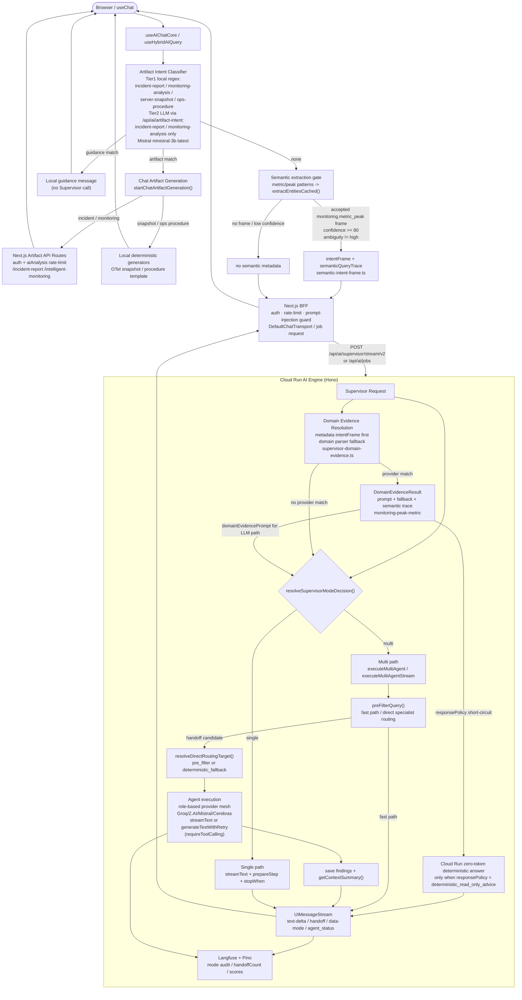
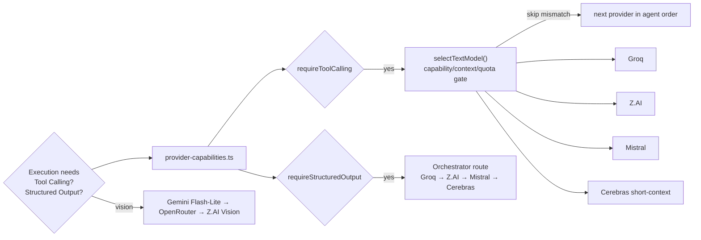

# AI Engine Architecture

> OpenManager AI Engine의 deterministic-first AI runtime 기준 문서
> Owner: platform-architecture
> Status: Active Canonical
> Doc type: Reference
> Last reviewed: 2026-05-16
> Canonical: docs/reference/architecture/ai/ai-engine-architecture.md
> Tags: ai,architecture,deterministic-runtime,multi-agent,cloud-run
>
> **v8.11.156+** | Updated 2026-05-16
> (ai-model-policy.md 내용 통합됨, 2026-02-14)

## 1. Overview

OpenManager AI의 AI Engine은 **Vercel AI SDK v6 계열** 기반 **deterministic/single-first + conditional routing-based multi-agent workflow** 아키텍처입니다.
프론트엔드는 `useChat` + 커스텀 `DefaultChatTransport`를 사용하고, Cloud Run(Hono) 백엔드는 `createUIMessageStreamResponse`, `streamText`, `generateText + Output.object`, BaseAgent 내부 tool loop를 조합한 하이브리드 실행 구조를 사용합니다.

현재 정책은 다음과 같습니다.

- 기본 운영 철학: **deterministic/single-first**
- 명시적 `multi`: 항상 multi-agent 경로 유지
- 명시적 `single`: `ALLOW_DEGRADED_SINGLE=true`일 때만 허용
- `auto`: 복잡도 기반으로 단순 메트릭 조회/ranking/server snapshot은 deterministic 또는 `single`, RCA/report/advisor/vision 같은 복합 질의는 `multi`

즉, 현재 시스템은 "멀티에이전트 전용"이 아니라 **도메인 fact와 저비용 single path를 기본값으로 두고, 필요한 경우에만 specialist agent workflow로 승격하는** 구조입니다. 여기서 `multi-agent`는 중앙 LLM supervisor가 동적 handoff를 결정한다는 뜻이 아니라, Direct Router가 Metrics Query/Analyst/Reporter/Advisor/Vision 중 적합한 Tool-loop specialist를 선택하는 구조를 뜻합니다.

제품 경계는 **advisory assistant**입니다. 범용 분류로는 **운영 의사결정 AI 어시스턴트**이고, 구현 분류로는 **tool-augmented LLM + deterministic decision layer**입니다. AI Engine은 실제 서버를 직접 변경하지 않고, 운영 수치·근거·보고서·조치안 초안을 생성합니다. 자율 remediation은 승인, dry-run, rollback, audit, 권한 계약이 갖춰진 별도 요구사항으로 분리합니다.

> **As-built note (2026-05-16)**: 이 문서는 초기 설계도가 아니라 실제 구현을 역추적한 현재 아키텍처 기준입니다. 기본 채팅 transport는 `/api/ai/supervisor/stream/v2`입니다. 최근 안정화는 Z.AI 무료 GLM Flash 기반 provider mesh, Cerebras `llama3.1-8b` graceful exit (2026-05-27 cutoff, `isCerebrasExpiredByDate()` 구현 완료), NLQ 전처리 파이프라인 (N0~N2/N4 완료: QueryGuard, intentFrame 신뢰 경로, streaming output filter), intent별 LLM parameter, tool-result response enrichment, deterministic ranking/recovery fallback을 중심으로 이루어졌습니다.

## AI 작업용 빠른 참조

이 문서는 긴 정본 문서이므로, AI 에이전트가 매번 전체를 읽기보다 아래 질문별 진입점을 먼저 사용합니다.

| 질문 | 먼저 볼 곳 | 같이 확인할 문서 |
|---|---|---|
| AI 요청이 어떤 route로 흐르는가 | §3 System Architecture, §5 Request Flow | [frontend-backend-comparison.md](./frontend-backend-comparison.md), [../../../architecture/02-runtime-architecture.md](../../../architecture/02-runtime-architecture.md) |
| single/multi/job/facade 판단은 어디서 하는가 | §2.6 Free Tier 소비, §6 Supervisor/Orchestrator | [../../../design/01-ai-agent-design.md](../../../design/01-ai-agent-design.md) |
| LLM 외부 지식과 데이터 출처는 어디서 들어오는가 | §External Knowledge and Data Source Map, §8 Data Pipeline | [./rag-knowledge-engine.md](./rag-knowledge-engine.md), [../data/otel-data-architecture.md](../data/otel-data-architecture.md) |
| provider fallback이나 reasoning capability를 바꿔도 되는가 | §7 Provider Strategy, §8 Model Policy | [../../../guides/ai/ai-standards.md](../../../guides/ai/ai-standards.md) |
| dashboard/AI 데이터 정합성 기준은 무엇인가 | §9 Data Flow, §10 MonitoringFactPack/RAG | [../data/otel-data-architecture.md](../data/otel-data-architecture.md), [./rag-knowledge-engine.md](./rag-knowledge-engine.md) |
| 무료 티어, 장애 격리, 장시간 실행 제약은 무엇인가 | §2.4 BFF 적용, §2.6 Free Tier 소비, §11 Operations | [../../../operations/README.md](../../../operations/README.md), [../infrastructure/free-tier-optimization.md](../infrastructure/free-tier-optimization.md) |

현재 구현 기준 변경은 이 문서와 design 문서를 먼저 갱신합니다. 초기 대안 비교 기록은 [archived ai-assistant-initial-design-comparison.md](../../../archived/ai-assistant-initial-design-comparison.md)에서 historical evidence로만 확인합니다.

## 문서 범위 및 분할 판단

이 파일은 AI Engine runtime의 canonical reference로 유지합니다. 주요 독자는 AI/runtime 변경을 수행하는 개발자와 아키텍트이며, 운영자는 배포·장애 대응 절차를 [Operations](../../../operations/README.md)와 [Deployment Guide](../../../operations/deployment-guide.md)에서 확인합니다.

현재 길이는 1500줄 미만이고, 섹션들이 provider, route, tool, data, resilience 계약을 같은 runtime 경계 안에서 설명하므로 분할하지 않습니다. 운영 절차나 provider 정책이 독립 runbook 수준으로 커질 때만 별도 문서로 분리합니다.

| 구분 | 내용 |
|------|------|
| **NLP 전처리** | 규칙 기반 커스텀 파이프라인 (ML 라이브러리 미사용) — 쿼리 분류·복잡도 분석·명확화·텍스트 정제·Prompt Injection 방어 포함. 상세: [frontend-backend-comparison.md §2.3](./frontend-backend-comparison.md) |
| **기반 모델** | Groq `llama-4-scout-17b-16e-instruct`, Z.AI `glm-4.5-flash`/`glm-4.6v-flash`, Mistral `mistral-small-latest`, Cerebras `llama3.1-8b`, Gemini `gemini-2.5-flash-lite` |
| **호스팅** | Groq, Z.AI, Mistral, Cerebras, Google AI (Gemini), OpenRouter 인프라 |
| **비용** | 프로덕션 서비스는 무료 tier 한도 내 운영 |
| **복합 질의 비동기 처리** | Redis job store + Cloud Tasks dispatch + Cloud Run `/api/jobs/process` worker |

> **[비용 분리 원칙]**: `Free Tier` 원칙은 **프로덕션 인프라/API 비용**에만 적용됩니다.
> 개발 환경 (Claude Code 등 AI 코딩 에이전트)에서는 품질 확보를 위해 유료 토큰을 사용합니다.

## External Knowledge and Data Source Map

현재 AI Assistant는 LLM 자체 지식만으로 답하지 않습니다. LLM은 최종 합성과 표현을 담당하고, 운영 사실, 내부 지식, 최신 외부 정보, 세션 컨텍스트는 아래 경로로 별도 주입합니다.

```text
User query
  |
  v
Next.js BFF / frontend guards
  |-- local rules
  |     |-- artifact intent regex
  |     |-- query complexity and job routing
  |     |-- off-domain / prompt-injection guard
  |     `-- source options: web search On, knowledge retrieval mostly Auto
  |
  |-- small classifier LLMs
  |     |-- /api/ai/artifact-intent       -> Mistral ministral-3b-latest
  |     `-- /api/ai/nlq/extract-entities -> Groq llama-4-scout
  |
  v
Cloud Run AI Engine
  |-- monitoring facts
  |     |-- public/data/otel-data/hourly/*.json
  |     |-- precomputed-state.ts
  |     `-- monitoring fact pack / deterministic evidence providers
  |
  |-- internal knowledge
  |     `-- Supabase knowledge_base + search_knowledge_text
  |         -> Knowledge Retrieval Lite
  |         -> EvidenceCard[] + RetrievalMetadata
  |
  |-- external live knowledge
  |     `-- searchWeb -> Tavily, quota gate, cache, explicit tool boundary
  |
  |-- tools
  |     |-- metrics / logs / anomaly / RCA / timeline
  |     |-- command recommendation
  |     |-- math and capacity projection
  |     `-- vision tools -> Gemini / OpenRouter / Z.AI Vision
  |
  |-- short-lived context
  |     `-- Redis context store, in-memory fallback, TTL-bound handoff findings
  |
  v
LLM path
  |-- Groq / Z.AI / Mistral / Cerebras text agents
  |-- Gemini / OpenRouter / Z.AI vision
  `-- final answer with evidence metadata
```

### Current Utilization Inventory

| Source or mechanism | Current use | Runtime owner | User-facing evidence |
|---|---|---|---|
| Synthetic OTel data | Dashboard and AI monitoring facts: current state, metric rankings, anomaly detection, incident timelines, artifact generation | `src/data/otel-data/index.ts`, `cloud-run/ai-engine/src/data/precomputed-state.ts`, monitoring tools | Analysis basis, artifacts, deterministic summaries |
| Monitoring domain evidence | `metric_peak`, current metric ranking, server health queries can become deterministic evidence before the LLM path | `cloud-run/ai-engine/src/domains/monitoring/*-evidence-provider.ts` | `semanticQueryTrace`, route metadata, deterministic answer |
| Knowledge Retrieval Lite | Internal runbooks, incident history, topology and operational documents | `knowledge_base`, `search_knowledge_text`, `knowledge-retrieval-lite.ts`, `searchKnowledgeBase` | `EvidenceCard[]`, `RetrievalMetadata`; `ragSources` only as legacy bridge |
| External web search | Latest external docs, security issues, release/version checks, web-only troubleshooting | `searchWeb`, Tavily client, quota tracker | Web source cards, tool summaries |
| Agent tool registry | Controlled access to metrics, logs, RCA, math, commands, vision and final answer tools | `agent-runtime-policy.ts`, `tools-ai-sdk/index.ts` | Tool result summaries and handoff badges |
| Session context | Handoff history and structured findings within a session | Redis context store with in-memory fallback | Context summary inside subsequent agent runs |
| Classifier LLMs | Lightweight routing and semantic frame extraction, not final answer generation | `/api/ai/artifact-intent`, `/api/ai/nlq/extract-entities` | Route decision, semantic query trace |
| Provider policy | Text/vision model selection, fallback, quota and circuit breaker behavior | model provider and resilience modules | Provider/model metadata, fallback reason |

### Internal Knowledge Storage Decision

내부 지식은 Supabase를 원본 저장소가 아니라 검색 serving index로 사용합니다. 원본 지식은 repo 문서와 seed JSON에 남고, `knowledge_base`는 `search_knowledge_text` RPC가 읽는 materialized corpus입니다.

```text
repo docs / seed JSON
  -> Supabase knowledge_base + search_vector
  -> search_knowledge_text RPC
  -> Knowledge Retrieval Lite
  -> EvidenceCard[] / source group: knowledge-base
```

현재 corpus는 60건 규모이고 category/golden smoke로 `architecture`, `command`, `incident`와 CPU·DB·topology 운영 표현 alias를 확인합니다. 이 규모에서는 PostgreSQL Full Text Search가 무료 티어, 단순성, deterministic 검증 가능성 측면에서 가장 적합합니다. Vertex AI Search 같은 managed search는 대량 파일 ingest, IAM 기반 문서 권한, 수천~수만 문서 규모가 되면 재검토합니다. Vercel Blob/Edge Config는 파일·설정 보관에는 맞지만 내부 지식 검색 DB 역할에는 두지 않습니다.

### Improvement Candidates

These are architectural gaps or cleanup opportunities identified from the current implementation. They are not all immediate code blockers.

| Priority | Improvement | Why it matters | Current tracking |
|---|---|---|---|
| Medium | Finish EvidenceCard browser regression QA | The backend/frontend contract now prefers `EvidenceCard[]`, but UI rendering still needs manual production-style confirmation. | T2 UI check and T7 QA closure |
| Medium | Drop legacy GraphRAG DB inventory after approval | `vector_documents_stats`, `command_vectors`, `knowledge_relationships`, and `knowledge_base.embedding` are outside the request path. Removing them reduces schema ambiguity, but it is destructive and needs explicit approval. | T5 |
| Future | Implement a real `live-otel` adapter only behind source mode and cost gates | `live-otel` is intentionally disabled; replay JSON is the production baseline. A live adapter would be useful only with explicit cost, timeout and fallback contracts. | Not active |
| Future | Define long-term memory separately from session context | The current context store is TTL-bound session memory. Persistent operational memory would need retention, privacy, provenance and deletion rules. | Not active |

Near-term priority is the destructive T5 only after user approval, followed by T7 UI/QA evidence closure.

## 2. Architectural Philosophy & Framework Context (2026)

이 섹션은 OpenManager AI Engine의 설계 선택을 외부 프레임워크 문서와 비교해 설명합니다.
문서에서 사용하는 **"Frameworkless AI"**는 업계 표준 용어가 아니라, 이 저장소에서 사용하는 내부 표현이며 의미는 **low-abstraction / framework-light 구성**입니다.

### 2.1. Low-abstraction 전략 (LangChain / LangGraph 대비)
- LangChain은 prebuilt agent architecture를 제공하고, LangChain agents는 LangGraph 위에서 durable execution, persistence, human-in-the-loop 등을 활용하도록 설계되어 있습니다.
- OpenManager는 해당 기능 집합 자체를 부정하는 것이 아니라, 현재 운영 요구(예측 가능한 라우팅, 디버깅 단순성, 타입스크립트 코드 중심 제어)에 맞춰 Vercel AI SDK의 핵심 함수(`generateText`, `streamText`, `Output.object`)와 자체 라우터를 직접 조합하는 방식을 선택했습니다.

### 2.2. Router-first 실행 구조 (CrewAI / AutoGen 대비)
- CrewAI 문서는 `crews/flows` 중심으로 memory, state, persist execution, resume long-running workflow 등을 제공한다고 설명합니다.
- AutoGen 문서는 conversational single/multi-agent 애플리케이션과 event-driven multi-agent 시스템 구축을 주요 시나리오로 제시합니다.
- OpenManager는 서버 운영 질의에서 지연 시간과 토큰 사용량의 예측 가능성을 우선하여, 현재는 **deterministic/single-first + routing-based multi-agent workflow** 구조를 유지합니다. 이는 범용 우위 주장이라기보다, 현재 도메인과 비용 제약(Free Tier)에서의 운영 선택입니다.

> **[ADR-005, 2026-05-16]** Orchestrator LLM routing과 `decomposeTask()` LLM decomposition은 기본 request path에서 제거됐습니다. 현재 multi-agent path는 Direct Router가 deterministic pre-filter 결과를 기반으로 specialist Tool-loop agent를 선택합니다.
>
> NLQ 전처리 파이프라인 완료 현황 (2026-05-16):
> - N0 ✅ 입력 길이 UX guard (maxLength=10,000 / warning=8,000)
> - N1 ✅ Front NLQ `intentFrame.executionMode`를 Cloud Run `selectExecutionMode()` primary signal로 연결. confidence ≥ 0.8이면 LLM 결과 우선, regex fallback 4개로 축소.
> - N2 ✅ `QueryGuard` — `/api/ai/nlq/extract-entities` 입력 경계에서 공격 패턴 차단, log_paste 감지, oversized truncate
> - N4 ✅ streaming output filter — `/api/ai/supervisor/stream/v2` 응답에서 XSS 패턴 제거, 시스템 프롬프트 유출 차단
> - N3 ⬜ 잔여 — `inputType/logExtract` Cloud Run 계약 확정 + log paste → multi 분석 경로 연결
>
> 검토 문서: [ADR-005](../../../adr/adr-005-routing-pattern-over-orchestrator-worker.md)
> 구현 계획: `reports/planning/nlq-preprocessing-redesign-plan.md` N3 (잔여), `reports/planning/provider-quota-rebalance-plan.md` Q3

### 2.3. OpenAI Swarm / Agents SDK와의 관계
- OpenAI `swarm` 저장소는 현재 Agents SDK로 대체되었고, production use case는 Agents SDK 사용을 권장합니다.
- OpenAI Agents SDK는 "few abstractions"와 handoffs(에이전트 위임)를 핵심 primitive로 제시합니다.
- OpenManager의 handoff 흐름은 이 개념과 방향성이 유사하지만, 구현체는 OpenAI Agents SDK 자체가 아니라 **Vercel AI SDK + TypeScript 라우팅** 기반의 커스텀 오케스트레이션입니다.

### 2.4. Next.js ↔ Cloud Run 분리와 BFF 적용
- Vercel Functions는 최대 실행 시간(max duration) 제한이 있고, 제한을 초과하면 함수가 종료됩니다.
- Cloud Run 서비스 요청 timeout은 기본 5분이며, 최대 60분까지 확장할 수 있습니다.
- BFF(Backends for Frontends) 패턴은 프런트엔드별 요구사항에 맞게 백엔드를 분리하는 접근입니다.
- OpenManager는 이 원칙에 따라 Next.js를 BFF/API 프록시 계층으로 두고, 장시간 AI 실행(예: 내부 지식 검색, 다단계 라우팅)은 Cloud Run `ai-engine`으로 분리합니다.
- AI Assistant artifact fast path도 Next.js BFF 경계를 우회하지 않습니다. LLM artifact classifier, incident report, monitoring analysis POST route는 auth와 `aiAnalysis` rate-limit를 적용하고, server snapshot/ops procedure는 Cloud Run 직접 호출 없이 로컬 deterministic generator를 사용합니다.

### 2.5. External References (Fact-check)
- LangChain overview: https://docs.langchain.com/oss/python/langchain/overview
- CrewAI docs: https://docs.crewai.com/
- AutoGen docs: https://microsoft.github.io/autogen/stable/
- OpenAI Swarm repo: https://github.com/openai/swarm
- OpenAI Agents SDK docs: https://openai.github.io/openai-agents-python/
- Vercel Function duration: https://vercel.com/docs/functions/configuring-functions/duration
- Cloud Run request timeout: https://cloud.google.com/run/docs/configuring/request-timeout
- BFF pattern (Microsoft Learn): https://learn.microsoft.com/en-us/azure/architecture/patterns/backends-for-frontends

### 2.6. 라우팅 경로별 LLM 호출 수 vs Free Tier 소비

Multi-agent 경로를 선택할수록 LLM 호출 횟수가 늘어 Free Tier 쿼터 소비가 증가합니다. Supervisor가 단순 질의의 과잉 라우팅을 방어하는 것은 응답 속도뿐만 아니라 **무료 API 한도 보존**이 직접적인 목적입니다.

| 실행 경로 | LLM 호출 수 | 예상 토큰 소비 | Free Tier 압박 |
|----------|:----------:|-------------|:----------:|
| Single-Agent | 1회 | ~500–2,000 | 낮음 |
| Multi-Agent (일반) | 2–3회 | ~1,500–5,000 | 중간 |
| Reporter Pipeline | 4–5회 (Reporter + Eval + Optimize×2) | ~4,000–10,000 | 높음 |
| 내부 지식 검색 포함 시 | +0회 (Knowledge Retrieval Lite) | EvidenceCard 텍스트만 추가 | 낮음 |

**Supervisor가 과잉 라우팅을 방어해야 하는 이유**: Groq/Cerebras 무료 tier는 RPM·TPD 한도가 고정됩니다. Reporter Pipeline 1회 실행이 단순 조회 4–5회 분의 쿼터를 소모하므로, 복합 쿼리 여부를 정확히 판별해 라우팅하는 것이 **비용(API 한도) 방어의 핵심**입니다.

## 3. System Architecture

### Current Request Flow

#### Mermaid


```mermaid
flowchart TB
    User([Browser / useChat]) --> Hook["useAIChatCore / useHybridAIQuery"]

    Hook --> ArtifactTier["Artifact Intent Classifier\nTier1 local regex:\nincident-report / monitoring-analysis /\nserver-snapshot / ops-procedure\nTier2 LLM via /api/ai/artifact-intent:\nincident-report / monitoring-analysis only\nMistral ministral-3b-latest"]
    ArtifactTier -->|artifact match| ArtifactGen["Chat Artifact Generation\nstartChatArtifactGeneration()"]
    ArtifactGen -->|incident / monitoring| ArtifactBFF["Next.js Artifact API Routes\nauth + aiAnalysis rate-limit\n/incident-report /intelligent-monitoring"]
    ArtifactGen -->|snapshot / ops procedure| LocalArtifact["Local deterministic generators\nOTel snapshot / procedure template"]
    ArtifactBFF --> User
    LocalArtifact --> User
    ArtifactTier -->|guidance match| Guidance["Local guidance message\n(no Supervisor call)"]
    Guidance --> User

    ArtifactTier -->|none| SemanticGate["Semantic extraction gate\nmetric/peak patterns -> extractEntitiesCached()"]
    SemanticGate -->|accepted monitoring.metric_peak frame\nconfidence >= 80\nambiguity != high| Frame["intentFrame + semanticQueryTrace\nsemantic-intent-frame.ts"]
    SemanticGate -->|no frame / low confidence| NoFrame["no semantic metadata"]
    Frame --> Vercel["Next.js BFF\nauth · rate-limit · prompt-injection guard\nDefaultChatTransport / job request"]
    NoFrame --> Vercel

    Vercel -->|POST /api/ai/supervisor/stream/v2\nor /api/ai/jobs| CR

    subgraph CR["Cloud Run AI Engine (Hono)"]
        Entry["Supervisor Request"]
        Mode{"resolveSupervisorModeDecision()"}
        DomEvidence["Domain Evidence Resolution\nmetadata intentFrame first\ndomain parser fallback\nsupervisor-domain-evidence.ts"]
        Evidence["DomainEvidenceResult\nprompt + fallback + semantic trace\nmonitoring-peak-metric"]
        Determ["Cloud Run zero-token deterministic answer\nonly when responsePolicy = deterministic_read_only_advice"]
        Single["Single path\nstreamText + prepareStep + stopWhen"]
        Multi["Multi path\nexecuteMultiAgent / executeMultiAgentStream"]
        Prefilter["preFilterQuery()\nfast path / direct specialist routing"]
        DirectRouter["resolveDirectRoutingTarget()\npre_filter or deterministic_fallback"]
        Agent["Agent execution\nrole-based provider mesh\nGroq/Z.AI/Mistral/Cerebras\nstreamText or generateTextWithRetry\n(requireToolCalling)"]
        Context["save findings + getContextSummary()"]
        Stream["UIMessageStream\ntext-delta / handoff / data-mode / agent_status"]
        Trace["Langfuse + Pino\nmode audit / handoffCount / scores"]

        Entry --> Mode
        Entry --> DomEvidence
        DomEvidence -->|provider match| Evidence
        DomEvidence -->|no provider match| Mode
        Evidence -->|responsePolicy short-circuit| Determ
        Evidence -->|domainEvidencePrompt for LLM path| Mode
        Determ --> Stream
        Mode -->|single| Single
        Mode -->|multi| Multi
        Multi --> Prefilter
        Prefilter -->|fast path| Stream
        Prefilter -->|handoff candidate| DirectRouter
        DirectRouter --> Agent
        Agent --> Context
        Context --> Stream
        Single --> Stream
        Stream --> Trace
        Agent --> Trace
    end

    Stream --> Vercel --> User
```

#### ASCII

```text
Browser / useChat
  -> useAIChatCore
     +-- Artifact Intent Classifier
     |     +-- local regex:
     |     |     incident-report, monitoring-analysis, server-snapshot, ops-procedure
     |     +-- LLM /api/ai/artifact-intent:
     |     |     incident-report, monitoring-analysis only
     |     +-- artifact match -> chat artifact generation
     |     |     +-- incident/monitoring -> Next.js artifact API routes
     |     |     |     auth + aiAnalysis rate-limit -> UI
     |     |     `-- snapshot/ops procedure -> local deterministic generators -> UI
     |     +-- guidance match -> local guidance message -> UI
     |     `-- none -> semantic extraction gate
     |
     `-- Semantic extraction gate
           +-- accepted monitoring.metric_peak frame
           |     confidence >= 80 and ambiguity != high
           |     session-scoped extractEntitiesCached()
           |     -> intentFrame + semanticQueryTrace
           `-- no accepted frame
                 -> no semantic metadata
           -> Next.js BFF
              +-- stream: /api/ai/supervisor/stream/v2
              `-- job:    /api/ai/jobs

Cloud Run AI Engine
  -> Supervisor Request
     +-- resolveSupervisorModeDecision()
     |     +-- single
     |     `-- multi
     |
     `-- resolveDomainEvidenceForStream()
           +-- metadata intentFrame
           `-- monitoring domain parser fallback
           -> monitoring-peak-metric provider
              +-- responsePolicy=deterministic_read_only_advice
              |     -> Cloud Run zero-token deterministic answer
              `-- otherwise
                    -> domainEvidencePrompt/fallback available to LLM path

LLM path
  single -> streamText + prepareStep
  multi  -> preFilterQuery()
            +-- fast path -> UIMessageStream
            `-- direct specialist route -> Agent execution
  Agent execution -> context summary -> UIMessageStream
  Trace -> Langfuse + Pino
```

### Capability-Aware Provider Gate


```mermaid
flowchart LR
    Need{"Execution needs\nTool Calling?\nStructured Output?"} --> Caps["provider-capabilities.ts"]
    Caps --> TC{"requireToolCalling"}
    Caps --> SO{"requireStructuredOutput"}

    TC -->|yes| CapabilityGate["selectTextModel()\ncapability/context/quota gate"]
    CapabilityGate -->|skip mismatch| NextProvider["next provider in agent order"]
    CapabilityGate --> Groq["Groq"]
    CapabilityGate --> ZAI["Z.AI"]
    CapabilityGate --> Mistral["Mistral"]
    CapabilityGate --> Cerebras["Cerebras short-context"]

    SO -->|yes| Structured["Orchestrator route\nGroq → Z.AI → Mistral → Cerebras"]
    Need -->|vision| Vision["Gemini Flash-Lite → OpenRouter → Z.AI Vision"]
```

### ASCII 상세 구조

```
┌─────────────────────────────────────────────────────────────┐
│  유저 브라우저                                                │
│  └─ React 19 + Next.js 16.1 (Vercel)                        │
│     └─ useChat + DefaultChatTransport                       │
└────────────────────┬────────────────────────────────────────┘
                     │ POST /api/ai/supervisor/stream/v2
                     │ X-API-Key + W3C Trace Context
                     ▼
┌─────────────────────────────────────────────────────────────┐
│  Cloud Run AI Engine (Hono, 1 vCPU / 512Mi)                 │
│                                                              │
│  ┌────────────────────────────────────────────────────────┐ │
│  │ Supervisor (진입점)                                     │ │
│  │  ├─ resolveSupervisorModeDecision()                    │ │
│  │  │  ├─ explicit multi → multi                          │ │
│  │  │  ├─ explicit single → gated                         │ │
│  │  │  └─ auto → complexity 기반 single/multi             │ │
│  │  ├─ Single-Agent → streamText() + prepareStep         │ │
│  │  └─ Multi-Agent  → Direct Router로 위임                │ │
│  ├────────────────────────────────────────────────────────┤ │
│  │ Direct Router (routing-based multi-agent workflow)      │ │
│  │  ├─ Pre-Filter (fast path / specialist route)          │ │
│  │  ├─ Deterministic fallback (Metrics Query Agent)       │ │
│  │  ├─ Agent tool loop (generateText/streamText)          │ │
│  │  ├─ 세션 컨텍스트 요약 주입                            │ │
│  │  └─ mode audit / handoffCount 추적                     │ │
│  ├────────────────────────────────────────────────────────┤ │
│  │ 5 Work Agents + Reporter Pipeline + Vision Fallback    │ │
│  └────────────────────────────────────────────────────────┘ │
│           │              │              │                     │
│     ┌─────┴─────┐  ┌────┴────┐  ┌─────┴──────┐             │
│     │ OTel Data │  │Knowledge│  │   Redis    │             │
│     │ (18 hosts)│  │ Lite KB │  │ Job State  │             │
│     └───────────┘  └─────────┘  └────────────┘             │
└─────────────────────────────────────────────────────────────┘
                     ▲
                     │ Cloud Tasks delivers queued complex jobs
                     │ to Cloud Run /api/jobs/process
```

> Source of truth (2026-05-13): `src/hooks/ai/useHybridAIQuery.ts`, `src/hooks/ai/useAIChatCore.ts`, `src/app/api/ai/supervisor/stream/v2/route.ts`, `src/lib/ai/entity-extractor.ts`, `src/lib/ai/semantic-intent-frame.ts`, `src/lib/ai/chat-artifacts/chat-artifact-intent.ts`, `src/lib/ai/chat-artifacts/artifact-execution.ts`, `src/lib/ai/chat-artifacts/monitoring-analysis-artifact.ts`, `src/lib/ai/chat-artifacts/artifact-workspace-registry.ts`, `src/app/api/ai/artifact-intent/route.ts`, `cloud-run/ai-engine/src/services/ai-sdk/supervisor-mode.ts`, `cloud-run/ai-engine/src/services/ai-sdk/supervisor-semantic-metadata.ts`, `cloud-run/ai-engine/src/services/ai-sdk/supervisor-domain-evidence.ts`, `cloud-run/ai-engine/src/services/ai-sdk/supervisor-stream.ts`, `cloud-run/ai-engine/src/services/ai-sdk/supervisor-stream-messages.ts`, `cloud-run/ai-engine/src/domains/monitoring/domain-pack.ts`, `cloud-run/ai-engine/src/domains/monitoring/peak-metric-intent.ts`, `cloud-run/ai-engine/src/domains/monitoring/peak-metric-evidence-provider.ts`, `cloud-run/ai-engine/src/services/ai-sdk/agents/orchestrator-execution.ts`, `cloud-run/ai-engine/src/services/ai-sdk/agents/orchestrator-summary-fallback.ts`, `cloud-run/ai-engine/src/services/ai-sdk/agents/config/agent-runtime-policy.ts`, `cloud-run/ai-engine/src/services/ai-sdk/agents/config/agent-model-selectors.ts`, `cloud-run/ai-engine/src/services/ai-sdk/provider-capabilities.ts`, `cloud-run/ai-engine/src/routes/analytics.ts`, `cloud-run/ai-engine/src/routes/analytics-report-utils.ts`, `cloud-run/ai-engine/src/routes/jobs.ts`, `cloud-run/ai-engine/src/lib/cloud-tasks.ts`

### Semantic Query Routing 상세

자연어 질의는 정규식만으로 직접 답하지 않습니다. 앞단 LLM은 답변 생성기가 아니라 `SemanticIntentFrame` 생성기로 제한하고, 실제 데이터 조회·provider 선택·수치 계산은 domain resolver와 deterministic evidence provider가 담당합니다. Root semantic parser가 실패하거나 frame이 drop되면 Cloud Run domain parser가 보수적 fallback으로 동작합니다.

```
Browser Query
  |
  v
+--------------------------------------------------------------+
| Root App                                                     |
| src/lib/ai/entity-extractor.ts                               |
| src/lib/ai/semantic-intent-frame.ts                          |
|                                                              |
|  1. cheap guard                                              |
|     - off-domain                                             |
|     - general coding                                         |
|  2. semantic parser                                          |
|     - generateText + Output.object + Zod                     |
|     - returns SemanticIntentFrame?                           |
|  3. frame gate                                               |
|     - confidence < 80          -> drop                       |
|     - ambiguity = high         -> drop                       |
|     - domain/intent = unknown  -> drop                       |
+---------------------------+----------------------------------+
                            |
                            | metadata.intentFrame
                            v
+--------------------------------------------------------------+
| Vercel BFF                                                   |
| /api/ai/supervisor/stream/v2                                 |
|                                                              |
|  - auth / CSRF / prompt-injection guard                      |
|  - semanticQueryTrace 보존                                  |
|  - Cloud Run-safe DomainIntentFrame payload 전달             |
+---------------------------+----------------------------------+
                            |
                            v
+--------------------------------------------------------------+
| Cloud Run Supervisor                                         |
| supervisor-semantic-metadata.ts                              |
| supervisor-domain-evidence.ts                                |
|                                                              |
|  1. metadata frame normalize                                 |
|  2. resolveDomainEvidenceForStream()                         |
|     - metadata frame 우선                                    |
|     - domain.intentParser fallback                           |
|  3. domain capability lookup                                 |
|     - e.g. monitoring.metric_peak                            |
+---------------------------+----------------------------------+
                            |
                            v
+--------------------------------------------------------------+
| Monitoring Domain Pack                                       |
| domain-pack.ts                                               |
| peak-metric-intent.ts                                        |
| peak-metric-evidence-provider.ts                             |
|                                                              |
|  canHandle(frame or concept-level parser)                    |
|       |                                                      |
|       v                                                      |
|  getMonitoringPeakMetric()                                   |
|       |                                                      |
|       v                                                      |
|  deterministic evidence                                      |
|  - slotIndex / timestamp / sourceMetric / windowHours        |
|  - top servers / max value / average top value               |
+---------------------------+----------------------------------+
                            |
                            v
+--------------------------------------------------------------+
| Final Answer Generator                                       |
|                                                              |
|  - evidence prompt 기반 1-2문장 운영 해석                    |
|  - evidence 없는 수치·원인 임의 생성 금지                    |
|  - provider 구현체 이름은 user-facing answer에 노출 금지     |
+--------------------------------------------------------------+
```

Peak metric 예시는 다음처럼 해석됩니다.

```
"최근 하루 부하 최고점 top server"
  -> SemanticIntentFrame 또는 domain parser fallback
  -> domainId=openmanager-monitoring
  -> intent=metric_peak
  -> capabilityId=monitoring.metric_peak
  -> scope=whole_fleet
  -> metric=load/load1
  -> timeWindow=24h
  -> aggregation=peak
  -> monitoringPeakMetricEvidenceProvider
  -> deterministic OTel slot scan
  -> evidence-grounded final answer
```

### 기능 모듈 ASCII 맵

#### Module 1. Artifact Intent 분류 파이프라인

아티팩트 intent는 Cloud Run Supervisor에 들어가기 전 Next.js/브라우저 채팅 계층에서 먼저 판정합니다. 확정된 아티팩트 요청만 기존 artifact 생성 API를 호출하고, `none`이면 일반 Supervisor 채팅 경로로 넘어갑니다.

```
+--------------------------------------------------------------------+
| ARTIFACT INTENT PIPELINE                                           |
| src/lib/ai/chat-artifacts/chat-artifact-intent.ts                  |
| src/hooks/ai/useAIChatCore.ts                                      |
| rule version: ARTIFACT_INTENT_RULE_VERSION (corpus lock)           |
| eval guard: tests/intent-classifier/ 112 cases                     |
|   execution precision >= 0.94, all-class precision/recall >= 0.90 |
+--------------------------------------------------------------------+

User Query
    |
    v
+----------------------------------+
| classifyChatArtifactIntent()     |  Tier 1: regex, sync, no network
| returns { kind, ruleVersion, ... }  (ruleVersion always present)  |
+----------------------------------+
    |
    +-- report keyword (장애/인시던트/incident report)
    |     |
    |     +-- [guidance priority first]                ──> guidance
    |     |     어떻게/방법/어디/어떤/가능/사용법/무엇/지원/되나/
    |     |     될까/샘플/예시/화면/위치/보여줄 수
    |     |     target: incident-report
    |     |
    |     +-- [negation absent] + action ──────────────> incident-report
    |     |     작성/생성/만들/다운로드/부탁/실행/돌려/뽑아/run
    |     |     export/generate
    |     |     reason: incident_report_action_pattern
    |     |
    |     +-- guidance fallback (기능/설명/안내) ───────> guidance
    |     |     target: incident-report
    |     |
    |     `-- [negation absent] + implicit keyword ────> incident-report
    |           (short phrase, no ?)
    |           reason: incident_report_implicit_keyword
    |
    +-- monitoring keyword (이상감지/추세/트렌드/리스크/예측/anomaly/forecast)
    |     |
    |     +-- [guidance priority first]                ──> guidance
    |     |     어떻게/방법/어디/어떤/가능/사용법/무엇/지원/되나/
    |     |     될까/샘플/예시/화면/위치/보여줄 수
    |     |     target: monitoring-analysis
    |     |
    |     +-- [negation absent] + action ──────────────> monitoring-analysis
    |     |     분석해/실행/돌려/요약/확인/만들/다운로드/forecast/analyze
    |     |     reason: monitoring_action_pattern
    |     |
    |     +-- guidance fallback (기능/설명/안내) ─────> guidance
    |     |     target: monitoring-analysis
    |     |
    |     `-- [negation absent] + artifact phrase + implicit keyword
    |           추세 분석/트렌드 분석/이상감지/anomaly detection...
    |           reason: monitoring_implicit_artifact_keyword ────────> monitoring-analysis
    |
    +-- server status snapshot keyword
    |     서버 상태/인프라 상태/운영 현황 + 스냅샷/상태 카드/상태 리포트
    |     |
    |     +-- guidance/function explanation ------------------------> none
    |     |     snapshot has no separate guidance artifact target
    |     |
    |     +-- [negation absent] + action ---------------------------> server-snapshot
    |     |     생성/만들/보여줘/다운로드/요청/뽑아/export/create
    |     |     reason: server_snapshot_action_pattern
    |     |
    |     `-- [negation absent] + implicit keyword -----------------> server-snapshot
    |           (short phrase, no ?)
    |           reason: server_snapshot_implicit_artifact_keyword
    |
    `-- none
          negation only blocks action/implicit/LLM candidate paths
          (말고/아니고/없이/나중에/필요 없/하지 마/제외)
          |
          v
+----------------------------------+
| shouldUseLLMChatArtifactIntent() |  Tier 2: candidate gate
| negation pattern → false early   |  (말고/아니고/없이... → skip LLM)
+----------------------------------+
    |
    +-- false (no artifact candidate or negated) ─────> none
    |                                                    no LLM call
    |
    `-- true
          |
          v
+------------------------------------------+
| fetchLLMChatArtifactIntent()             |  Tier 3: Vercel route
| POST /api/ai/artifact-intent             |  fixed model: ministral-3b-latest
| timeout <= 3000ms, temperature 0         |  maxOutputTokens 24
+------------------------------------------+
    |
    +-- incident-report ------------------------> incident-report
    |     reason: llm_artifact_classification
    |
    +-- monitoring-analysis --------------------> monitoring-analysis
    |     reason: llm_artifact_classification
    |
    +-- none / provider error ------------------> normal Supervisor chat
    |
    `-- abort ----------------------------------> early return
                                                  no Supervisor fallthrough

Result handling in useAIChatCore.ts
    |
    +-- guidance             -> local guidance message only
    +-- incident-report      -> generateIncidentReportArtifact()
    +-- monitoring-analysis  -> generateMonitoringAnalysisArtifact()
    +-- server-snapshot      -> generateServerSnapshotArtifact()
    `-- none                 -> sendQuery() to /api/ai/supervisor/stream/v2

Loading contract
    |
    +-- LLM intent classification pending -> isLoading remains false
    `-- artifact generation started       -> setArtifactIsLoading(true)
```

#### Module 1.1. 기능 탭 Artifact 실행 Surface

기능 탭은 자연어 intent classifier를 새 target으로 늘리지 않습니다. 탭은 이미 사용자가 기능과 scope를 선택한 상태이므로 `artifact-execution` helper만 공유하고, 필요한 서버 context를 명시 입력으로 전달합니다.

```text
AI Assistant function tab
  |
  +-- Auto incident report
  |     -> executeChatArtifact(kind: incident-report)
  |     -> generateIncidentReportArtifact()
  |
  +-- Whole-system anomaly/trend
  |     -> executeChatArtifact(kind: monitoring-analysis)
  |     -> generateMonitoringAnalysisArtifact()
  |     -> POST /api/ai/intelligent-monitoring { action: analyze_batch }
  |
  `-- Selected-server anomaly/trend
        -> executeChatArtifact(kind: server-monitoring-analysis)
        -> generateServerMonitoringArtifact()
        -> POST /api/ai/intelligent-monitoring { action: analyze_server }

All generated artifacts
  -> ChatArtifact + ArtifactEnvelope
  -> artifact-workspace-registry schema guard
  -> local-session replay pack
  -> page adapter or typed artifact renderer card
```

`server-monitoring-analysis`는 기능 탭의 선택 서버 context(`serverId`, `serverName`, current metrics)를 요구하므로 현재 artifact intent classifier의 target에는 포함하지 않습니다. 자연어 채팅에서 단일 서버 분석을 직접 artifact로 승격하려면 entity extraction confidence와 서버 disambiguation 계약을 먼저 확장해야 합니다.

#### Module 2. LLM Provider Fallback Chain

Provider chain은 단일 전역 순서가 아니라 실행 위치별 policy로 나뉩니다. 2026-05-16 기준 text provider는 Groq, Z.AI, Mistral, Cerebras를 역할별로 회전시키는 spider-web order를 사용합니다. Cerebras `llama3.1-8b`는 2026-05-27 종료 전까지 short-context fallback으로 유지하되, 16K/32K context floor에서는 capability gate가 요청 전 skip합니다.

```
+--------------------------------------------------------------------+
| LLM PROVIDER FALLBACK CHAIN                                        |
| cloud-run/ai-engine/src/services/ai-sdk/agents/config/             |
+--------------------------------------------------------------------+

Text request
    |
    v
+------------------------------------------+
| selectTextModel(agent, providerOrder)    |
+------------------------------------------+
    |
    +-- circuit breaker OPEN --------------> skip provider
    +-- provider env/key missing ----------> skip provider
    +-- capability mismatch ---------------> skip provider before request
    `-- model init / call error -----------> next provider

Groq-first: Supervisor / Metrics Query
    |
    +-- Groq
    |     model: meta-llama/llama-4-scout-17b-16e-instruct
    |
    +-- Z.AI
    |     model: ZAI_DEFAULT_MODEL || glm-4.5-flash
    |
    +-- Mistral
    |     model: MISTRAL_MODEL_ID || mistral-small-latest
    |
    `-- Cerebras
          model: llama3.1-8b

Mistral-first: Analyst / Verifier
    |
    +-- Mistral
    |     model: MISTRAL_MODEL_ID || mistral-small-latest
    |
    +-- Groq
    |     model: meta-llama/llama-4-scout-17b-16e-instruct
    |
    +-- Z.AI
    |     model: ZAI_DEFAULT_MODEL || glm-4.5-flash
    |
    `-- Cerebras
          model: llama3.1-8b
          note: short-context fallback only

Z.AI-first: Reporter
    |
    +-- Z.AI -> Mistral -> Groq -> Cerebras

Mistral-first: Advisor
    |
    +-- Mistral -> Z.AI -> Groq -> Cerebras

Vision path
    |
    +-- Gemini
    |     model: GEMINI_VISION_MODEL_ID || gemini-2.5-flash-lite
    |
    +-- OpenRouter
    |     model: OpenRouter vision fallback list
    |
    `-- Z.AI Vision
          model: ZAI_VISION_MODEL_ID || glm-4.6v-flash

Vercel artifact intent classifier
    |
    `-- Mistral ministral-3b-latest
          fixed route-local classifier, no provider fallback chain
          scope: incident-report / monitoring-analysis only

Server snapshot artifact
    |
    `-- MetricsProvider OTel static data
          no LLM, no Cloud Run artifact route, no DB write

Selected-server monitoring artifact
    |
    `-- /api/ai/intelligent-monitoring analyze_server
          feature-tab scoped server context, typed replay artifact
```

#### Module 3. Routing-Based Multi-Agent Workflow

Supervisor는 실행 모드(`single`/`multi`)를 정하고, multi로 resolve된 요청만 Direct Router로 넘깁니다. Direct Router는 deterministic pre-filter와 fallback 규칙으로 specialist agent를 선택합니다. 기본 request path에서 Orchestrator LLM routing과 `decomposeTask()` LLM decomposition은 호출하지 않습니다.

```
+--------------------------------------------------------------------+
| MULTI-AGENT ORCHESTRATION                                          |
| cloud-run/ai-engine/src/services/ai-sdk/agents/                    |
+--------------------------------------------------------------------+

POST /api/ai/supervisor/stream/v2
    |
    v
+------------------------------------------+
| resolveSupervisorModeDecision()          |
+------------------------------------------+
    |
    +-- explicit multi --------------------> multi
    +-- explicit single + allowed ---------> single
    +-- explicit single + not allowed -----> multi
    +-- auto + simple ---------------------> single
    +-- auto + complex --------------------> multi
    `-- analysisMode=thinking + infra ----> multi

single
    |
    `-- executeSupervisor()
          streamText + prepareStep + stopWhen(finalAnswer)

multi
    |
    v
+------------------------------------------+
| executeMultiAgent(Stream)                |
+------------------------------------------+
    |
    +-- preFilterQuery() fast path --------> deterministic summary
    |
    +-- direct specialist route -----------> selected specialist
    |
    `-- no suggested agent ----------------> Metrics Query Agent
          |
          v
    +------------------+   +------------------+   +------------------+
    | Metrics Query Agent        |   | Analyst Agent    |   | Reporter Agent   |
    | metrics/query    |   | anomaly/trend    |   | incident/RCA     |
    +------------------+   +------------------+   +------------------+
             |                      |                      |
             +----------------------+----------------------+
                                    |
                                    v
                         +------------------+
                         | Advisor Agent    |
                         | remediation/KB   |
                         +------------------+

Vision attachments
    |
    `-- Vision Agent (Gemini -> OpenRouter -> Z.AI Vision)

SSE events to frontend
    |
    +-- text_delta
    +-- tool_call / tool_result
    +-- handoff
    +-- agent_status
    `-- done

Degraded fallback
    |
    multi error MODEL_UNAVAILABLE / MODEL_ERROR / INTERNAL_ERROR
    + ALLOW_DEGRADED_SINGLE=true
    `-- retry single path with degradedMetadata
```

#### `analysisMode=thinking`의 현재 의미

`analysisMode=thinking`은 provider-native hidden reasoning을 켜는 플래그가 아니라, OpenManager 애플리케이션 레벨의 **심층 분석 요청 모드**입니다. 현재 구현은 다음 동작만 보장합니다.

| Surface | 현재 동작 | 근거 |
|---------|-----------|------|
| Input UI | 사용자에게 `심층 분석`으로 표시하고, "숨겨진 모델 추론이 아니라 더 긴 분석/라우팅 경로"라고 설명 | `src/types/ai/analysis-mode.ts`, `src/components/ai-sidebar/ChatInputArea.tsx` |
| Frontend routing | 복잡도 threshold를 낮춰 job queue 경로를 더 적극적으로 선택. 기본 threshold `19`, thinking threshold `11` | `src/hooks/ai/core/query-routing.ts`, `src/hooks/ai/core/useQueryExecution.ts` |
| Cloud Run routing | `auto` 기준 single인 infra-context `thinking` 요청만 `multi`로 승격하고, 원래도 multi인 요청은 `auto_complexity`로 유지 | `cloud-run/ai-engine/src/services/ai-sdk/supervisor-routing.ts`, `supervisor-mode.ts` |
| Processing UI | `ThinkingProcessVisualizer`는 모델 내부 reasoning trace가 아니라 tool call / tool result summary 기반 `AI 처리 과정`을 표시 | `src/hooks/ai/utils/message-helpers.ts`, `src/components/ai/AIWorkspaceMessage.tsx` |
| LLM call options | `streamText()` / `generateTextWithRetry()` 호출에 `reasoningEffort`, `reasoningFormat`, `thinkingConfig`, `providerOptions`를 전달하지 않음 | `cloud-run/ai-engine/src/services/ai-sdk/supervisor-stream.ts`, `cloud-run/ai-engine/src/services/resilience/retry-with-fallback.ts` |

제품 결정은 `Thinking` 버튼을 유지하는 것입니다. 다만 의미는 "provider-native reasoning"이 아니라 **사용자가 더 긴 분석 경로를 요청했다는 라우팅 신호**입니다. Native reasoning을 별도 기능으로 도입하려면 모델 entitlement smoke, provider option wiring, reasoning token quota accounting, 사용자 노출 정책을 별도 계약으로 추가해야 합니다.

#### Thinking 버튼 On/Off 측정 기준

`analysisMode=thinking`의 차이는 추정이 아니라 deterministic corpus로 고정합니다.

| 계층 | Off (`auto`) | On (`thinking`) | 측정된 차이 | 회귀 가드 |
|------|--------------|-----------------|-------------|-----------|
| Frontend stream/job | corpus 6개 중 job queue `2/6` | corpus 6개 중 job queue `4/6` | borderline `streaming → job-queue` 2건 증가 | `src/hooks/ai/core/query-routing.test.ts` |
| Cloud Run single/multi | corpus 6개 중 multi `2/6` | corpus 6개 중 multi `4/6` | infra-context `single → multi` 2건 증가 | `cloud-run/ai-engine/src/services/ai-sdk/supervisor-mode.test.ts` |
| Provider-native reasoning | 미사용 | 미사용 | reasoning token / raw reasoning trace 증가 없음 | `streamText()` / fallback 호출 옵션 검토 |

운영 표본에서 On/Off 차이를 볼 때는 최소한 `analysisMode`, `routeDecision.executionPath`, `resolvedMode`, `modeSelectionSource`, `assistantPlan.plannerShadow.candidate.executionMode`, `ttfbMs`, `durationMs`, `toolsCalled`, `handoffs`, `fallback`을 함께 비교합니다. UI의 `AI 처리 과정`은 사용자가 경로를 이해하는 보조 정보이고, 버튼 효과의 정량 판단은 위 metadata와 trace/log 표본을 기준으로 합니다.

### Portable Assistant Runtime Adoption

Portable assistant core는 `cloud-run/ai-engine/src/core/assistant-runtime`의 public facade를 기준으로 재사용합니다. 외부 프로젝트 또는 새 domain pack은 `cloud-run/ai-engine/src/core/assistant-runtime/index.ts`에서 export되는 `AssistantDomain`, `AssistantRuntimeConfig`, `createAssistantRuntime`, `createInMemoryAssistantRuntimeAdapters`를 사용하고, monitoring domain 구현이나 provider policy 파일을 직접 import하지 않습니다.

Canonical sample은 `cloud-run/ai-engine/src/test-fixtures/sample-domain-pack.ts`입니다. 이 fixture는 `sample-customer-success` domain pack, deterministic tool, artifact registry, fact path를 포함하고 있으며 OpenManager OTel 데이터, Supabase, Redis, provider key 없이 동작해야 합니다. 새 domain을 붙일 때는 이 sample과 같은 순서로 `routingPolicy`, `tools`, optional `artifacts`, optional fact builder를 채우고 runtime에는 project-specific adapters만 주입합니다.

Minimal wiring checklist:

- `AssistantDomain.id/version/instructions`를 domain 고유 값으로 지정한다.
- `routingPolicy.decide()`는 domain-neutral `AssistantRouteDecision`만 반환하고 monitoring artifact literal을 core로 올리지 않는다.
- `tools.listTools()`와 `tools.resolveTool()`은 provider 호출 없이 정의 가능한 tool contract를 반환한다.
- persistence, queue, trace는 `AssistantRuntimeAdapters`로 교체하고 core runtime 파일에서 직접 infra client를 import하지 않는다.
- public response metadata에는 `assistantRuntime` 요약과 `reasoningCapability` 요약만 노출하고 raw provider payload, secret-like value, 내부 stack trace를 넣지 않는다.

Provider-native reasoning은 adoption 기본값이 아닙니다. `analysisMode=thinking`은 위 섹션처럼 app-level routing intensity이고, provider/model별 native reasoning은 `cloud-run/ai-engine/src/services/ai-sdk/provider-model-policy.ts`의 `reasoningCapability`에서만 표현합니다. Capability가 `provider-native`여도 `defaultEnabled=false`, `requiresOptIn=true`, `expiresAt` 만료 시 disabled가 기본 계약입니다.

### Async Job Queue Boundary

복합 질의는 Vercel request lifecycle에 장시간 AI 처리를 묶지 않습니다. Vercel은 `POST /api/ai/jobs`에서 Redis에 job record를 만들고 `jobId`를 반환한 뒤, `AI_JOB_TRIGGER_MODE=cloud-tasks`일 때 Cloud Run `/api/jobs/dispatch`만 짧게 호출합니다. Cloud Run dispatch endpoint는 Cloud Tasks HTTP task를 생성하고, Cloud Tasks가 다시 Cloud Run `/api/jobs/process`를 호출해 실제 AI 작업을 수행합니다.

| 계층 | 책임 |
|------|------|
| Vercel `/api/ai/jobs` | job 생성, owner metadata 저장, jobId 반환, worker dispatch 트리거 |
| Cloud Tasks | `/api/jobs/process` HTTP delivery, retry, rate/concurrency guard |
| Cloud Run `/api/jobs/process` | Supervisor/Agent 실행, 진행률 및 최종 result/error 저장 |
| Upstash Redis | `job:{id}`, `job:progress:{id}` 상태 저장과 Vercel SSE polling source |

Cloud Tasks는 작업을 저장/전달하는 queue 계층이며, job 상태와 최종 응답의 source of truth는 Redis입니다. Redis가 없으면 현재 async Job Queue는 503으로 fail-fast하고 사용자는 streaming/direct fallback 경로를 사용해야 합니다.

### Supervisor vs Direct Router (분리 이유)

| | Supervisor | Direct Router (`orchestrator-*` legacy module names) |
|---|---|---|
| **레벨** | High-level entrypoint | Multi-agent coordinator |
| **결정** | `single / multi / auto` 최종 실행 모드 | 어떤 에이전트, 어떤 provider, 어떤 fallback을 쓸지 |
| **방법** | complexity + explicit mode gate + tool filtering | pre-filter + direct specialist routing + deterministic fallback |
| **실행** | `streamText()` 중심 실시간 스트리밍 | `executeForcedRouting`, `executeAgentStream`, Vision fallback |
| **타임아웃** | Supervisor 하드 50초/40초 warning, stream은 120초/96초 warning | Multi-agent 전체 90초, warn 60초 |
| **호출 시점** | 모든 쿼리 | multi-agent로 resolve된 요청에서만 |

**분리 유지 근거**: Supervisor의 mode 결정과 specialist execution routing은 책임이 다르며, 각각 독립 테스트와 trace metadata를 유지할 수 있습니다.

## 3. Capability-Aware Provider 배분

각 provider는 역할이 다릅니다. 현재 구조는 "모든 단계에서 같은 provider를 쓰는" 방식이 아니라, 실행 단계별 요구 capability를 먼저 보고 provider를 좁힙니다.

| Provider | Primary 에이전트 | 모델 | 운영 메모 |
|----------|----------------|------|-----------|
| **Groq** | Supervisor/Metrics Query primary, fallback for long-context agent paths | `meta-llama/llama-4-scout-17b-16e-instruct` | tool-calling 중심 텍스트 primary. 공식 Free Plan 기준 30 RPM / 1K RPD / 30K TPM / 500K TPD |
| **Z.AI** | Reporter primary, Groq-first/Mistral-first fallback, Vision fallback | `glm-4.5-flash`, `glm-4.6v-flash` | 공식 pricing상 Flash text/vision 모델 무료. Web Search는 유료라 runtime 금지. AI SDK OpenAI-compatible chat path와 `thinking: disabled` patch 필요 |
| **Mistral** | Advisor primary, distributed text fallback | `mistral-small-latest` | Experiment/free tier는 workspace 제한 의존. 현재 계정 smoke 기준 50 RPM / 50K TPM까지 관측되었으나 runtime guard는 보수적으로 유지 |
| **Cerebras** | Short-context text fallback (graceful exit) | `llama3.1-8b` | 2026-05-27 `llama3.1-8b` 공식 종료. `isCerebrasExpiredByDate()`로 cutoff 이후 요청을 Groq로 사전 전환하는 graceful exit 구현 완료. 8K context이며 16K/32K 장문 경로는 capability gate가 사전 skip. 2026-05-16 header 기준 5 RPM / 30K TPM / 2.4K RPD / 1M TPD |
| **Gemini** | Vision primary | `gemini-2.5-flash-lite` | Flash-Lite 기본 budget 미설정 상태는 thinking token을 쓰지 않음. Vision 기본 경로 |
| **OpenRouter** | Vision fallback | `google/gemma-3-27b-it:free` → `gemma-3-12b-it:free` → `gemma-3-4b-it:free` | Vision fallback 전용. free model daily limit은 계정 credit 상태 의존 |

### Native Reasoning / Thinking 후보 상태

공식 provider API와 현재 코드/계정 entitlement를 분리해 관리합니다. 아래 표는 2026-05-03 기준 분석입니다.

| Provider | 공식 기능 가능성 | 현재 OpenManager runtime 상태 | 판단 |
|----------|------------------|-------------------------------|------|
| Groq | `qwen/qwen3-32b`, `openai/gpt-oss-*` reasoning 모델에서 `reasoning_format` / `reasoning_effort` 지원 | 기본 모델은 `meta-llama/llama-4-scout-17b-16e-instruct`; reasoning 모델 smoke 및 모델 정책 없음 | 별도 smoke 후 opt-in 후보 |
| Mistral | `mistral-small-latest`가 `reasoning_effort=high|none` adjustable reasoning 지원 | Analyst/Advisor primary로 사용하지만 현재 runtime은 reasoning 옵션을 전달하지 않음 | 패키지/provider option wiring 후 opt-in 후보 |
| Gemini | Gemini 2.5 Flash-Lite는 thinking capability가 있고, 기본 budget 미설정 시 "model does not think", `thinkingBudget=-1`로 dynamic thinking 가능 | Vision primary 전용. 현재 `thinkingConfig`를 전달하지 않음 | Vision 품질 실험 외 기본 비활성 |
| Cerebras | `gpt-oss-120b` 등 reasoning 모델 지원 | 현재 계정 smoke 404로 `gpt-oss-120b` runtime 제외. production runtime은 `llama3.1-8b` | 현재 실사용 후보 아님 |

References: [Groq reasoning docs](https://console.groq.com/docs/reasoning), [Mistral adjustable reasoning docs](https://docs.mistral.ai/capabilities/reasoning/adjustable), [Gemini thinking docs](https://ai.google.dev/gemini-api/docs/thinking), [Cerebras reasoning docs](https://inference-docs.cerebras.ai/capabilities/reasoning).

### Fallback 체인

텍스트 에이전트는 quota 격리를 위해 provider 순서를 역할별로 회전합니다. Cerebras runtime은 `llama3.1-8b`만 기본 후보로 두지만, 8K context와 2026-05-27 deprecation 때문에 16K/32K 장문 에이전트 primary에서는 제외하고 short-context last fallback으로만 유지합니다. 2026-05-27 이후에는 `isCerebrasExpiredByDate()`가 true를 반환해 Cerebras 요청을 Groq로 사전 전환합니다 (graceful exit 구현 완료).

| Agent | Primary | → 2nd | → 3rd | → 4th |
|-------|---------|-------|------|------|
| Supervisor | Groq | Z.AI | Mistral | Cerebras |
| Metrics Query | Groq | Z.AI | Mistral | Cerebras |
| Analyst | Mistral | Groq | Z.AI | Cerebras |
| Reporter | Z.AI | Mistral | Groq | Cerebras |
| Advisor | Mistral | Z.AI | Groq | Cerebras |
| Verifier | Mistral | Groq | Z.AI | Cerebras |
| Vision | Gemini | OpenRouter | Z.AI Vision | — |

> SSOT: `agent-runtime-policy.ts` → provider order. Cerebras account quota는 2026-05-16 header 기준 5 RPM / 2.4K RPD이며, `llama3.1-8b` deprecation contingency는 `provider-model-policy.ts`에 기록합니다. 상세 provider 한도/모델 ID 환경변수 → [`free-tier-optimization.md`](../infrastructure/free-tier-optimization.md#part-5-llm-프로바이더-비용-제어)

### Cerebras Tool-Calling 변화 대응

2026-04-04 기준 대응은 "Cerebras를 완전히 제거"가 아니라, **tool-calling이 필요한 경로에서만 capability gate로 선제 차단**하는 방식입니다.

1. `CEREBRAS_TOOL_CALLING_ENABLED` 환경 변수는 기본 `false`, 필요할 때만 `true`로 opt-in
2. `provider-capabilities.ts`에서 provider별 capability를 중앙 선언
3. `selectTextModel(... requiredCapabilities)`가 tool-calling/structured-output 요구사항을 먼저 검사
4. `generateTextWithRetry()`도 tool 사용 시 capability mismatch면 Cerebras를 요청 전에 skip
5. Legacy structured-output helper는 호환용으로 남아 있지만 기본 multi-agent request path에서는 Orchestrator structured routing을 호출하지 않음

즉, 현재 변경은 "Cerebras 툴콜 이슈 때문에 전체 provider 전략이 무너진 것"이 아니라, **tool route와 legacy structured-output helper를 분리해서 운영 리스크를 줄인 조정**입니다.

> 참고: 위 표의 무료 티어/처리량 정보는 운영 판단용 참고치입니다. 정확한 한도 수치는 공급사 정책이 수시 변경되므로 배포 전 별도 확인해야 하며, 이 문서의 SSOT 범위는 **라우팅/폴백 구조와 코드 적용 상태**입니다.

## 4. Agent 구성 (5개 작업 에이전트 + 2개 내부 품질 단계)

### 작업 에이전트 (5개)

| 에이전트 | 역할 | 주요 도구 | 트리거 키워드 |
|---------|------|----------|-------------|
| **Metrics Query** | 서버 메트릭 조회/요약/수식 계산 | getServerMetrics, filterServers, math/stat/capacity tools, searchWeb | 서버, CPU, 메모리, 요약 |
| **Analyst** | 이상 탐지, 예측, RCA | detectAnomalies, predictTrends, findRootCause | 이상, 예측, 원인 |
| **Reporter** | 장애 보고서 생성 | buildIncidentTimeline, getServerMetrics/filterServers, searchKnowledgeBase, searchWeb | 보고서, 장애, 인시던트 |
| **Advisor** | 해결방안, CLI 추천 | searchKnowledgeBase, recommendCommands, getServerLogs, searchWeb | 해결, 방법, 명령어 |
| **Vision** | 대시보드 스크린샷/첨부 이미지 분석 | analyzeScreenshot | 스크린샷, 이미지, 대시보드 |

> Note: `Math`는 독립 에이전트가 아니라 Metrics Query/Analyst가 사용하는 도구 세트(`evaluateMathExpression`, `computeSeriesStats`, `estimateCapacityProjection`)입니다.
> Note: Vision 관련 `analyzeLargeLog`, `searchWithGrounding`, `analyzeUrlContent` 도구는 Tool Registry에 존재하지만, 현재 `AGENT_CONFIGS['Vision Agent']`의 기본 노출 도구는 `analyzeScreenshot` + `finalAnswer`입니다.

### 내부 품질 단계 (2개)

| 에이전트 | 역할 | 도구 |
|---------|------|------|
| **Evaluator** | 보고서 품질을 결정론적으로 평가 | evaluateIncidentReport, validateReportStructure, scoreRootCauseConfidence |
| **Optimizer** | 보고서를 결정론적으로 보강 | refineRootCauseAnalysis, enhanceSuggestedActions, extendServerCorrelation |

> `Evaluator`와 `Optimizer`는 `AgentConfig` 상 항목으로 유지되지만, 실제 실행은 `reporter-pipeline.ts` 내부의 결정론적 평가/개선 단계로 처리됩니다. 즉 일반 작업 에이전트처럼 독립 LLM 실행 루프를 돌리지 않습니다.
> `AgentConfig.visibility`는 이 차이를 명시합니다. 작업 에이전트는 `routable`, Evaluator/Optimizer는 `pipeline-internal`이며 `AgentFactory.create('evaluator'|'optimizer')`는 public agent 생성 요청에서 `null`을 반환합니다.
> Reporter pipeline metadata는 내부 단계를 `Reporter Pipeline: evaluator stage`, `Reporter Pipeline: optimizer stage`로 표시합니다. 이 값은 `pipelineStages[]`에 보존되며 public agent 목록과 분리됩니다.

### Agent Factory

모든 에이전트는 `ConfigBasedAgent` 단일 클래스로 구현되며, `AgentFactory`가 생성을 관리합니다.

```typescript
const metricsQuery = AgentFactory.create('nlq'); // AgentType id (내부 식별자 'nlq' 유지, 표시명은 'Metrics Query Agent')
const result = await runAgent('nlq', '서버 상태 알려줘');
for await (const event of streamAgent('analyst', '이상 탐지')) { ... }
```

### Agent Loop Settings

`buildAgentLoopSettings(agentName, surface)`가 `stopWhen`, `maxSteps`, `maxOutputTokens`, AI SDK 내부 `maxRetries`, telemetry implementation 이름을 단일 계약으로 제공합니다.

| Surface | AI SDK primitive | Retry policy | Metadata implementation |
|---------|------------------|--------------|-------------------------|
| BaseAgent direct | `ToolLoopAgent` | `maxRetries: 1` | `tool-loop-agent` |
| Forced routing | `generateText` via provider fallback | AI SDK `maxRetries: 0`, provider mesh가 retry 담당 | `core-generate-text` |
| Agent stream | `streamText` via provider fallback | AI SDK `maxRetries: 0`, provider mesh가 retry 담당 | `core-stream-text` |

현재 runtime policy의 step ceiling은 Metrics/Advisor 4, Analyst/Reporter 5, Vision 2입니다. 이 값은 Free Tier RPM/TPM 보호를 위해 `agent-runtime-policy.ts`에서 관리합니다.
Multi-agent stream done metadata에는 non-stream과 같은 sanitized `routingDecisionTrace`가 포함됩니다. Direct routing source는 `agentDecision.source`의 `pre_filter` 또는 `deterministic_fallback`으로 구분합니다. `llm_routing` enum은 legacy trace 호환용으로 남아 있지만 기본 request path에서는 생성하지 않습니다.

## 5. 요청 처리 흐름

### Single-Agent (단순 쿼리)

```
유저: "서버 CPU가 왜 높아?"
  │
  ├─ ① 입력 검증 (Zod) → 보안 (API Key) → Rate Limit
  ├─ ② Supervisor: selectExecutionMode() [policy + frame/fallback] → 'single'
  ├─ ③ getSupervisorModel() → Groq → Z.AI → Mistral → Cerebras (CB/capability/quota 확인)
  ├─ ④ streamText() + prepareStep (intent='rca')
  │    ├─ Step 1: 원인 분석 intent에 맞는 activeTools 선택
  │    ├─ Step 2: 도구 결과 기반 근거 수집
  │    └─ Step 3: finalAnswer() → 루프 종료
  ├─ ⑤ SSE 스트리밍 → 유저 실시간 응답
  └─ ⑥ Langfuse 트레이싱 (비동기)
```

### Multi-Agent (복잡 쿼리)

```
유저: "장애 분석 보고서 작성해줘"
  │
  ├─ ① Supervisor: selectExecutionMode() → 'multi' (보고서 패턴)
  ├─ ② Direct Router: preFilterQuery() → Reporter Agent 직접 선택
  ├─ ③ Reporter Pipeline 실행
  │    ├─ Reporter Agent: 초안 생성 (Z.AI → Mistral → Groq → Cerebras fallback)
  │    ├─ Evaluator Agent: 품질 평가 (4차원 점수)
  │    ├─ 품질 < 75%? → Optimizer Agent 개선 (최대 2회)
  │    └─ 최종 보고서 반환
  └─ ④ SSE 스트리밍 → 유저
```

### Intent Classification (경량 regex 기반)

| 카테고리 | 패턴 예시 | 라우팅 |
|----------|----------|--------|
| 보고서 | `보고서`, `리포트`, `인시던트` | Multi → Reporter |
| 원인 분석 | `왜.*높아`, `원인.*뭐`, `rca` | Multi → Analyst |
| 문제 해결 | `어떻게.*해결`, `조치.*방법` | Multi → Advisor |
| 예측/추세 | `예측`, `트렌드`, `앞으로` | Multi → Analyst |
| 요약 | `서버.*요약`, `핵심.*알려` | Multi → Metrics Query |
| **기타** | 단순 조회 | **Single-Agent** |

## 6. Tool Registry (30개)

| Category | 도구 | 에이전트 | 설명 |
|----------|------|---------|------|
| **Metrics (6)** | getServerMetrics | Metrics Query | 서버 메트릭 조회 |
| | getServerMetricsAdvanced | Metrics Query | 시간 범위 집계 |
| | filterServers | Metrics Query | 조건부 필터링 |
| | getServerByGroup/Advanced | Metrics Query | 그룹별 조회 |
| | getServerLogs | Advisor | 시스템/에러/앱 로그 |
| **RCA (3)** | findRootCause | Analyst / pipeline Optimizer | 근본 원인 분석 |
| | correlateMetrics | Analyst / pipeline Optimizer | 메트릭 상관 분석 |
| | buildIncidentTimeline | Reporter | 인시던트 타임라인 |
| **Analyst (4)** | detectAnomalies[AllServers] | Analyst | 2sigma 이상 탐지 |
| | predictTrends | Analyst | 선형 회귀 예측 |
| | analyzePattern | Analyst | 시계열 패턴 분석 |
| **Knowledge (3)** | searchKnowledgeBase | Reporter/Advisor | Knowledge Retrieval Lite 내부 지식 검색 (BM25 + metadata boost) |
| | recommendCommands | Advisor | CLI 추천 |
| | searchWeb | Metrics Query/Reporter/Advisor | 외부 실시간 웹 검색 |
| **Math (3)** | evaluateMathExpression | Metrics Query | 수식 계산 (사칙연산/함수), 퍼센트 지원 |
| | computeSeriesStats | Metrics Query | 배열 통계 (평균/중앙값/분산/표준편차/백분위) |
| | estimateCapacityProjection | Metrics Query | 성장률 기반 용량 포화 시뮬레이션 |
| **Evaluation (6)** | evaluateIncidentReport | Pipeline | 보고서 품질 평가 |
| | validateReportStructure | Pipeline | 구조 검증 |
| | scoreRootCauseConfidence | Pipeline | RCA 신뢰도 |
| | refine/enhance/extend | Pipeline | 개선 도구 3종 |
| **Vision (4)** | analyzeScreenshot | Vision | 대시보드 스크린샷 분석 |
| | analyzeLargeLog | Vision | 1M context 로그 파싱 |
| | searchWithGrounding | Vision | Google Search Grounding |
| | analyzeUrlContent | Vision | URL 문서 추출 |
| **Control (1)** | finalAnswer | All | 에이전트 종료 신호 |

### 검색 제어 정책

- **웹 검색 제어 (`enableWebSearch`)**
  - 기본 정책: 요청 단에서 `enableWebSearch` 값이 `true`일 때만 Web Search를 사용.
  - `false`일 때는 `searchWeb` 도구를 라우팅 단계에서 제거하여 Metrics Query/Reporter/Advisor가 웹 검색을 호출하지 않음.
  - Vercel API 라우터(`src/app/api/ai/supervisor/route.ts`)에서 수신한 `enableWebSearch` 값을 Cloud Run 프록시 바디에 함께 전달.
- **내부 지식 검색 제어 (`enableRAG`, legacy request flag)**
  - `false`일 때는 `searchKnowledgeBase` 도구를 제외하여 지식기반 조회가 발생하지 않음.
  - 해당 제어값 역시 Cloud Run 요청 체인으로 일관 전달.
  - 구현: `createPrepareStep(query, { enableRAG })` → 내부 `filterToolsByRAG()`가 `enableRAG=false` 시 `searchKnowledgeBase` 도구를 필터링. Orchestrator의 `filterToolsByRAG()`도 동일 로직 적용.
- **수학 도구 (항상 활성)**
  - 계산 계열 도구(`evaluateMathExpression`, `computeSeriesStats`, `estimateCapacityProjection`)는 별도 토글 없이 항상 활성.
  - `createPrepareStep`의 intent 분류에 따라 math/prediction 쿼리일 때만 activeTools에 포함되므로, 일반 대화에서는 LLM에 노출되지 않음.

## 7. Resilience 계층

```
┌──────────────────────────────────────────┐
│ Capability Registry / Preflight Gate      │
│  tool-calling / structured-output 사전 차단 │
├──────────────────────────────────────────┤
│ Provider Circuit Breaker (provider별)     │
│  5회 실패 → OPEN (30초) → HALF_OPEN     │
├──────────────────────────────────────────┤
│ Quota Admission Gate (호출 전 사전 예약)   │
│  Redis atomic EVAL → 85% 임박 시 차단     │
│  429/queue_exceeded → 90초 cooldown      │
│  실제 사용량 확인 후 token delta 보정      │
├──────────────────────────────────────────┤
│ Retry with Fallback (provider mesh)      │
│  429/502/503/504 → 다음 provider         │
│  408/500 → 동일 provider 재시도 (2회)     │
├──────────────────────────────────────────┤
│ Timeout 계층                              │
│  Single non-stream: Supervisor 50s → Agent 45s → Tool 25s │
│  Single stream: Supervisor 120s → Agent 45s → Tool 25s    │
│  Multi-agent: Orchestrator 90s → Agent 45s → Tool 25s     │
└──────────────────────────────────────────┘
```

### Quota Admission Gate 상세

LLM 호출 **전에** 예약(admission)을 요청하고, 호출 **후에** 실제 사용량으로 보정하는 2단계 구조.

```
호출 전: reserveProviderQuota(provider, estimatedTokens)
  → Redis EVAL atomic: cooldown 확인 → 일일/분당 limit 확인 → 예약
  → Redis 불가: in-memory fallback (withUsageLock 직렬화)

호출 후: reconcileProviderQuotaReservation(reservation, actualTokensUsed)
  → 실제 토큰 - 예약 토큰 = delta를 Redis/in-memory 모두 보정
```

**Provider별 Quota 기준 (Free Tier)**

→ 상세 표 및 모델 ID 환경변수: [`free-tier-optimization.md` Part 5](../infrastructure/free-tier-optimization.md#part-5-llm-프로바이더-비용-제어)

런타임 SSOT: `quota-tracker.ts` `PROVIDER_QUOTAS` 상수.

Pre-emptive 차단 임계값: 일일 토큰 80%, 일일 요청/분당 요청/분당 토큰 85%.

### Redis Circuit Breaker (redis-client.ts)

Redis 자체 장애 시 매 호출마다 1초 timeout을 낭비하지 않도록 Circuit Breaker를 내장.

```
정상: Redis EVAL 성공 → 실패 카운터 초기화
장애: 연속 3회 실패 → circuit OPEN (30초)
OPEN: fetchRedis() 즉시 null 반환 (0ms) → quota-tracker in-memory fallback 즉시 진입
30초 후: HALF-OPEN → 동시 probe 1회만 허용
  probe 성공 → circuit CLOSED, 카운터 초기화
  probe 실패 → circuit 다시 OPEN 30초
```

Redis 장애 여부는 `/health` 응답의 `redis.degraded`/`redis.state` 필드로 확인 가능하다. 이 조회는 read-only이며 HALF_OPEN probe를 소비하지 않는다.

```json
{
  "redis": {
    "configured": true,
    "degraded": false,
    "state": "closed",
    "retryAfterMs": 0
  }
}
```

**Redis 장애 시 안전성 (MAX_INSTANCES=1 기준)**

- 단일 인스턴스 내 `withUsageLock` promise chain으로 동시 요청 직렬화 → race-free
- rolling deployment(수초 창) 동안 구·신 인스턴스 각자 Redis 없이 in-memory 추적 → 이 짧은 구간에서 quota 공유 불가 (허용된 trade-off)
- reconcile 실패 시 예약 토큰이 유지됨 → 보수적으로 동작하므로 실제 초과 위험 없음

### Fallback 발생 시 사용자 체감 지연 시나리오

| 시나리오 | 예상 추가 지연 | 사용자 통보 (`agent_status`) |
|---------|:-----------:|---------------------------|
| Quota Admission 차단 (사전) | ~0ms | `provider 쿼터 보호로 대안 모델로 전환 중...` |
| Provider Circuit Breaker OPEN | ~0ms | `provider 일시 차단됨, 대안 모델로 전환 중...` |
| 429 Rate Limit → 다음 provider | ~0–500ms | `provider 응답 없음, 대안 모델로 전환 중...` |
| 타임아웃 후 fallback (408/500) | +2–10s (backoff) | `provider 오류 발생, 대안 모델로 전환 중...` |
| 모든 provider 소진 | N/A | `error`: ALL_PROVIDERS_FAILED |

> **가장 큰 지연 원인**: tool timeout(25s) 소진 후 provider 전환이 누적될 때 single stream은 최대 120s, multi-agent workflow는 90s 한도 안에서 지연이 커질 수 있습니다.
> **완화책**: Quota Admission Gate가 RPM 85% 도달 시 호출 전 차단 → 실제 429 발생 이전에 다음 provider로 전환. Redis Circuit Breaker가 3회 실패 후 30초 동안 Redis 시도를 차단하여 timeout 낭비 방지.

### Reporter Pipeline (Evaluator-Optimizer)

```
Generate (Draft) → Evaluate (Score) → Optimize (Improve) → Re-evaluate
                       │
                   quality >= 0.75? → Return
                       │
                   No: Iterate (max 2회)
```

## 8. Data Pipeline

### Pre-computed State (144 슬롯)

```
public/data/otel-data/hourly/*.json (24개 파일)
  │  15서버 × 24시간 × 10분 간격 = 144 슬롯
  ▼
precomputed-state.ts → buildPrecomputedStates()
  │  getCurrentState() → 현재 시간 슬롯 반환
  ▼
도구에서 사용 (getServerMetrics, detectAnomalies 등)
```

### Internal Knowledge Pipeline

```
쿼리
  → retrieval policy
  → Supabase search_knowledge_text RPC
  → BM25/text score + category/tag/metadata boost
  → EvidenceCard[] + retrieval metadata 반환
```

이 경로는 Cloud Run request path에서 외부 embedding, graph traversal, LLM reranking, 자동 web-search fallback을 호출하지 않습니다. 외부 웹 검색은 `searchWeb` 도구가 별도 feature flag와 quota 정책으로 처리합니다.

## 9. API Endpoints

| 엔드포인트 | 메서드 | 역할 |
|-----------|--------|------|
| `/api/ai/supervisor` | POST | 레거시 JSON/text 프록시 (local dev fallback, cache/plain callers, smoke/contract anchor) |
| `/api/ai/generate[/stream]` | POST | 독립 텍스트 생성 |
| `/api/ai/approval` | POST | 의사결정 승인 워크플로우 |
| `/api/ai/providers` | GET | Provider 상태 + 쿼타 |
| `/api/ai` | GET | 사용량 분석 |
| `/api/jobs` | POST | 비동기 Job 관리 |

> Source of truth (2026-05-10): `cloud-run/ai-engine/src/server.ts`, `cloud-run/ai-engine/src/lib/legacy-contracts.ts`. `/api/ai/graphrag/*`는 호환 기간 종료 후 route 등록이 제거되었습니다.

## 10. Observability

| 도구 | 역할 |
|------|------|
| **Langfuse** | 트레이스, 토큰 사용량, 품질 점수, 핸드오프 체인 |
| **Pino Logger** | 구조화 로깅 (GCP Cloud Logging 호환) |
| **OpenTelemetry** | W3C Trace Context header 전파 (Vercel → Cloud Run), full OTLP span stitching은 아직 미구현 |
| **/monitoring** | Circuit Breaker 상태, 쿼타 요약, 에이전트 가용성 |

## 11. 코드 구조

```
cloud-run/ai-engine/src/
├── server.ts                          # Hono 서버 (미들웨어, lazy route loading)
├── routes/                            # API 라우트
├── services/
│   ├── ai-sdk/
│   │   ├── model-provider.ts          # Provider 선택 (spider-web fallback mesh)
│   │   ├── model-provider-core.ts     # Provider 생성 (Groq/Z.AI/Mistral/Cerebras/Gemini/OpenRouter)
│   │   ├── model-provider-status.ts   # API Key 검증 + 토글 상태
│   │   ├── supervisor.ts              # Supervisor 공개 API
│   │   ├── supervisor-stream.ts       # Single-Agent 스트리밍 실행
│   │   ├── supervisor-routing.ts      # 모드 선택 + 의도 분류
│   │   └── agents/
│   │       ├── orchestrator.ts        # Orchestrator 파사드
│   │       ├── orchestrator-execution.ts   # 멀티에이전트 실행
│   │       ├── orchestrator-routing.ts     # 에이전트 라우팅 + 강제 라우팅
│   │       ├── orchestrator-decomposition.ts # 태스크 분해
│   │       ├── orchestrator-query-intent.ts  # 쿼리 의도 분류 (data-lookup/filter/ranking vs causal/predictive/advisory)
│   │       ├── orchestrator-summary-fallback.ts # deterministic 응답 포매터
│   │       ├── base-agent.ts          # BaseAgent 추상 클래스
│   │       ├── agent-factory.ts       # AgentFactory (생성 + 가용성)
│   │       ├── reporter-pipeline.ts   # Evaluator-Optimizer 파이프라인
│   │       └── config/
│   │           ├── agent-runtime-policy.ts   # agent별 provider order/tool allowlist SSOT
│   │           ├── agent-configs.ts   # AgentConfig SSOT (5 routing LLM + 2 pipeline internal)
│   │           └── agent-model-selectors.ts  # 에이전트별 모델 선택
│   ├── resilience/
│   │   ├── circuit-breaker.ts         # CB (CLOSED/OPEN/HALF_OPEN)
│   │   ├── quota-tracker.ts           # 쿼타 추적 + Pre-emptive Fallback
│   │   └── retry-with-fallback.ts     # provider mesh retry + exponential backoff
│   └── observability/
│       └── langfuse.ts                # Langfuse 파사드 (trace/score/usage)
├── tools-ai-sdk/                      # 30개 도구 정의
├── lib/
│   ├── knowledge-retrieval-lite.ts    # active 내부 지식 검색 (BM25 + metadata boost)
│   ├── retrieval-contract.ts          # EvidenceCard/RetrievalMetadata SSOT
│   ├── legacy-contracts.ts            # legacy ragSources response/history bridge
│   ├── rag-doc-policy.ts              # knowledge_base corpus 길이/카테고리 정책
│   └── rag-merge-planner.ts           # knowledge_base 중복 문서 merge 계획
└── data/
    ├── precomputed-state.ts           # 144 슬롯 사전 계산 + queryAsOf 컨텍스트 연동
    └── query-as-of-context.ts         # AsyncLocalStorage 기반 쿼리 슬롯 실행 컨텍스트
```

## 12. 핵심 수치

| 항목 | 값 |
|------|-----|
| 에이전트 | 5개 라우팅 AgentType + Evaluator/Optimizer는 Reporter 파이프라인 내부 도구 |
| 도구 | 30개 (8개 카테고리) |
| LLM Provider | 6개 (Groq, Z.AI, Mistral, Cerebras, Gemini, OpenRouter) |
| Fallback 체인 | 역할별 spider-web text mesh + Vision 3-way fallback |
| 데이터 슬롯 | 144개 (24h x 6/hr, 10분 간격) |
| 모니터링 서버 | 18개 (15대 주 서비스 + 3대 보조 capacity node, 사전 생성 OTel 데이터) |
| Cold Start | ~2-3초 (lazy loading + deferred init) |
| TTFB 목표 (Single, Warm) | <2초 |
| TTFB 목표 (Multi, Warm) | <5초 (Orchestrator 라우팅 포함) |
| TTFB 목표 (Cold Start 포함) | Single <5초 / Multi <8초 |
| TTFB 계측 범위 | Single: `supervisor-stream.ts` / Multi: `orchestrator-agent-stream.ts` (`ttfbMs`) |
| 인프라 | Cloud Run 1vCPU / 512Mi (운영 기본값) |
| AI SDK | Vercel AI SDK v6 계열 (`ai`, `@ai-sdk/react`) |

### AI SDK v6 주요 기능

| Feature | Description |
|---------|-------------|
| **useChat + UIMessage** | 프론트엔드 표준 메시지 모델 |
| **DefaultChatTransport** | 커스텀 transport로 warmup 추적, 디바이스/trace 헤더, reconnect hook 주입 |
| **UIMessageStream** | Vercel/Cloud Run 양쪽에서 사용하는 native streaming protocol |
| **Resumable Stream 인프라** | 서버 측 Upstash Redis wrapper + `prepareReconnectToStreamRequest` 준비, 클라이언트 auto-resume는 기본 비활성 |
| **Tool loop + finalAnswer** | 작업 에이전트 내부 루프 패턴 (`stopWhen`) |
| **Structured Output Fallback** | `generateText + Output.object` 구조화 라우팅, incident report typed output, text+JSON fallback (Orchestrator compatibility path) |
| **Mode audit metadata** | `requestedMode`, `resolvedMode`, `modeSelectionSource`, `handoffCount` 기록 |

> 현재 구조는 pure ToolLoopAgent-only가 아니라, `BaseAgent(ToolLoopAgent)` + `generateText`/`streamText`/`Output.object`를 병행하는 하이브리드 구조입니다.

### Vercel AI SDK Multi-Agent Conformance (2026-05-16)

Vercel AI SDK v6 공식 agent 문서 기준으로 현재 구현을 재평가한 결과, OpenManager는 **AI SDK primitive 기반 routing workflow + specialist Tool-loop agents** 구조에 해당한다. 즉, `ToolLoopAgent`/`streamText`/`UIMessageStream`은 적극 사용하지만, 모든 handoff를 AI SDK subagent-as-tool 패턴이나 중앙 LLM supervisor로 모델링하지는 않는다.

| 평가 축 | 현재 구현 | 판정 |
|---------|-----------|------|
| Agent loop | `BaseAgent`는 `ToolLoopAgent`, forced/stream path는 core `generateText`/`streamText`를 사용하되 모두 `buildAgentLoopSettings()`의 `stopWhen: [hasToolCall('finalAnswer'), stepCountIs(N)]` 계약을 공유 | 부합. direct path 병행은 유지하되 loop drift 위험은 낮춤 |
| Loop control | single path는 `prepareStep`으로 activeTools/toolChoice를 제어. multi direct/stream path는 role별 tool allowlist + `stopWhen` 중심 | 부분 부합 |
| Routing workflow | `preFilterQuery()`와 `resolveDirectRoutingTarget()`이 specialist를 선택하고, suggested agent가 없으면 Metrics Query Agent로 deterministic fallback | 부합. Orchestrator-Worker가 아니라 Routing pattern |
| Subagents | Metrics Query/Analyst/Reporter/Advisor/Vision specialist는 독립 tool policy/provider policy를 가진다. AI SDK subagent-as-tool idiom은 미적용 | 기능은 있음. 중앙 LLM handoff는 없음 |
| UI stream | Cloud Run과 Vercel BFF 모두 `createUIMessageStreamResponse` 기반 custom data event 사용 | 부합. `createAgentUIStreamResponse` 전환은 선택 사항 |
| Testing | `agent-loop-settings`, forced routing metadata, stream `routingDecisionTrace`, Reporter pipeline stage naming, factory internal-only taxonomy conformance 테스트 보강 | 부합도 개선 |

**종합 부합도: 8.6/10.** SDK 교체가 아니라 `ToolLoopAgent` 경로와 direct core 경로의 `maxSteps`, `stopWhen`, `agentLoop` telemetry, stream `routingDecisionTrace`, public agent taxonomy를 같은 계약으로 묶는 개선을 완료했다. 남은 개선은 AI SDK subagent-as-tool PoC와 `createAgentUIStreamResponse` adapter 가능성 검토다. 상세 추적은 [Vercel AI SDK Multi-Agent Conformance Plan](../../../../reports/planning/archive/vercel-ai-sdk-multi-agent-conformance-plan.md)에 둔다.

## 13. Deterministic Response Routing

LLM 텍스트 생성을 생략하고 tool 결과에서 직접 응답을 구성하는 경로입니다. 비용·latency 절감과 수치 정확성 확보가 목적입니다.

### 쿼리 의도 분류 (`orchestrator-query-intent.ts`)

쿼리를 구조적 신호(의문사, 비교 연산자, 서수)와 모니터링 metric 신호(`cpu/memory/disk/network/status`) 기반으로 분류합니다. deterministic 응답은 metric/operator/status를 확정할 수 있고 tool 결과가 있을 때만 사용합니다.

| Intent | 신호 | 라우팅 |
|--------|------|--------|
| `data-lookup` | 모니터링 대상(서버/인프라/pod) 언급, 복합 신호 없음 | **Deterministic** (데이터 있을 때) |
| `data-filter` | metric + 비교 연산자 (`CPU >= 70`, `메모리 90% 이상`, `status: warning`) | **Deterministic** (metric/operator/status + 데이터 있을 때) |
| `data-ranking` | metric + 서수 (`DISK 상위 5`, `memory top 3`, `CPU 가장 높은`) | **Deterministic** (metric + 데이터 있을 때) |
| `causal-analysis` | 인과 의문사 (`왜`, `원인`, `why`, `reason`) | **LLM 필수** |
| `predictive` | 예측 신호 (`예측`, `전망`, `forecast`, `will`) | **LLM 필수** |
| `advisory` | 권고 요청 (`추천`, `어떻게 해야`, `recommend`, `should`) | **LLM 필수** |
| `unknown` | 분류 불가 | **LLM fallback** |

### 라우팅 결정 흐름

```
툴 실행 완료 → 서버 수 집계
                    ↓
classifyQueryIntent(query) → intent + metric/operator/status metadata
                    ↓
shouldPreferDeterministic(intent, serverCount)
  ├─ causal / predictive / advisory / unknown → false → LLM 텍스트 사용
  ├─ data-* + serverCount == 0              → false → LLM 텍스트 사용
  ├─ data-filter + metric/operator 미확정   → false → LLM 텍스트 사용
  ├─ data-ranking + metric 미확정           → false → LLM 텍스트 사용
  └─ data-* + metadata 확정 + 데이터 있음   → true  → Deterministic 포맷
```

**이전 방식과의 차이**: 구 버전은 툴 실행 전에 한국어/영어 모니터링 키워드 regex 3개로 판단했습니다(`isDeterministicSummaryQuery`). 현재는 툴 결과 수집 후 intent + 데이터 완전성으로 판단합니다.

Formatter는 `getServerMetrics`와 `filterServers` 결과를 모두 처리합니다. `filterServers`가 0건을 반환해도 `summary.total`과 `emptyResultHint`가 있으면 메인 답변에 "0대"와 참고 상위 서버를 출력합니다.

원인/조치처럼 LLM이 필요한 질의는 deterministic 응답으로 대체하지 않습니다. 대신 tool 결과가 있는데 모델 스트림이 제목/골격만 반환하면 `LOW_INFORMATION_RESPONSE`로 분류하고, tool 결과 기반 summarization fallback을 추가 전송해 메인 응답 가시성을 복구합니다.

### queryAsOf 데이터 슬롯 계약

비동기 AI job은 생성 시각(KST 10분 OTel 슬롯)을 `queryAsOf` 객체로 고정합니다. worker 실행 시각과 dashboard 슬롯 드리프트를 방지합니다.

```
POST /api/ai/jobs
  └─ buildJobQueryAsOf(createdAt)   # Vercel — 슬롯 고정
       └─ Redis 메타데이터 저장
       └─ worker payload 전달
            └─ runWithQueryAsOf(queryAsOf, callback)  # Cloud Run
                 └─ AsyncLocalStorage 컨텍스트 전파
                      └─ getActiveQuerySlotIndex()    # 모든 메트릭 tool이 참조
```

`slotIndex * 10 === minuteOfDay` 불변식을 `normalizeQueryAsOf()`가 검증합니다. 검증 실패 시 wall-clock fallback으로 전환됩니다.

## Version History

<details>
<summary>v8.11.59 (2026-04-29) - Query Intent Classification + queryAsOf Slot Contract</summary>

- **Query Intent Classifier 도입** (`orchestrator-query-intent.ts`): 구 regex 3개(한국어/영어 키워드 기반) → 구조적 신호(의문사/연산자/서수)와 metric metadata 기반 6-category intent 분류로 대체
- **Deterministic routing data-driven 전환**: `isDeterministicSummaryQuery`의 판단 시점을 툴 실행 전→후로 변경. intent + metric/operator/status + tool result server count 기반으로 LLM 우회 여부 결정
- **Metric-aware deterministic formatter**: `cpu/memory/disk/network/status` filter/ranking과 `filterServers` empty result 포맷 지원
- **queryAsOf 데이터 슬롯 계약** (`query-as-of-context.ts`): AsyncLocalStorage 기반 실행 컨텍스트로 job 생성 시각 KST 10분 슬롯을 worker 전체에 전파. 비동기 job 실행 시 슬롯 드리프트 방지
- **Provider fallback 강화**: `queue_exceeded`, `high traffic`, `too_many_requests` 감지 추가. `maxRetries: 0`으로 SDK 내부 재시도 증폭 차단. Cerebras rate limit 시 Groq 자동 전환
- **Tool-grounded stream visibility repair**: tool 결과가 있는데 본문이 제목/골격만 있는 경우 `LOW_INFORMATION_RESPONSE`로 감지해 summarization fallback을 추가 전송
- **Query routing hardcode cleanup**: `query-type-classifier.ts` 제거, Metrics Query instruction layering을 intent classifier로 통합, direct server ID 감지를 resource-catalog 기반 lazy pattern으로 전환
</details>

<details>
<summary>v8.10.8 (2026-04-04) - Multi-Agent First Hardening + Capability Gate</summary>

- **Mode policy 정리**: explicit `single`은 `ALLOW_DEGRADED_SINGLE=true`일 때만 허용, `auto`는 복잡도 기반 유지
- **Capability registry 도입**: `provider-capabilities.ts`로 tool-calling / structured-output / vision capability를 중앙 선언
- **Cerebras tool-calling 기본 비활성화**: `CEREBRAS_TOOL_CALLING_ENABLED=false`를 기본값으로 두고, 필요할 때만 opt-in
- **Vision 정합성 수정**: `gemini-2.5-flash-lite` 기본화, OpenRouter free fallback 체인 정리
- **Observability 확장**: `requestedMode`, `resolvedMode`, `modeSelectionSource`, `handoffCount`와 Langfuse score 기록
- **Context distillation**: 세션 요약을 routing/forced routing/agent stream prompt에 주입
</details>

<details>
<summary>v8.5.0 (2026-02-27) - Orchestrator/Analyst Model Redistribution + RAG Toggle</summary>

- **Groq `json_schema` 에러 해결**: Orchestrator structured-output 호출 시 당시 Groq 모델의 `json_schema` 미지원 → 모델 우선순위를 `['cerebras', 'mistral', 'groq']`로 재배치
- **Analyst Primary 변경**: Groq → Cerebras (`gpt-oss-120b`) 전환. Cerebras가 4개 에이전트(Supervisor, Metrics Query, Analyst, Orchestrator) Primary 담당
- **RAG 토글 구현**: `createPrepareStep` + `filterToolsByRAG`로 `enableRAG=false` 시 `searchKnowledgeBase` 도구 필터링
- **Math Tools 통합**: 수식 계산/통계/용량 예측 3종 도구 추가 (intent 기반 라우팅, 항상 활성)
- **Storybook v10 호환성**: v8 전용 패키지 제거 (`@storybook/blocks`, `@storybook/test`)
</details>

<details>
<summary>v8.3.3 (2026-02-23) - 3-Way Provider Redistribution</summary>

- **Cerebras → gpt-oss-120b** (120B MoE, tool calling, 3000 tok/s)
- **Mistral → Advisor Primary** (mistral-large-latest, Frontier model)
- **3-way fallback 전면 적용**: 모든 에이전트 (Cerebras ↔ Groq ↔ Mistral)
- **@llamaindex 의존성 전면 제거**: AI SDK `generateText` + Cerebras로 대체
- **당시 GraphRAG 보조 단계 이관**: query expansion, rerank, triplet/generate 보조 경로를 Cerebras로 옮겼던 이력. 현재 Knowledge Retrieval Lite request path에서는 별도 RAG 보조 LLM 호출을 사용하지 않음
- **Mistral RPM 실측 테스트 완료**: 60+ embed/min, 15+ chat/min
</details>

<details>
<summary>v8.0.0 (2026-02-15) - ConfigBasedAgent + Reporter Pipeline</summary>

- **ConfigBasedAgent**: 5개 라우팅 에이전트 단일 클래스 구현 (Evaluator/Optimizer는 내부 도구)
- **Reporter Pipeline**: Evaluator-Optimizer 패턴 (품질 ≥ 0.75)
- **Vision Agent**: Gemini 2.5 Flash + OpenRouter Fallback
- **Task Decomposition**: Parallel/Sequential/Hybrid 실행
</details>

<details>
<summary>v7.1.0 (2026-01-27) - BaseAgent + AgentFactory</summary>

- **BaseAgent Abstract Class**: 공통 실행 로직 캡슐화
- **AgentFactory Pattern**: 중앙화된 에이전트 생성 및 가용성 관리
- **AI SDK v6.0.50**: `timeout: { totalMs, chunkMs }` 지원
- **3-Way Fallback** 도입
</details>

<details>
<summary>v6.1.0 (2026-01-25) - AI SDK v6 Native Protocol</summary>

- **UIMessageStream**: Native streaming protocol
- **Resumable Stream v2**: Redis 기반 자동 재연결
- **finalAnswer Pattern**: 에이전트 종료 일관성
- **prepareStep Optimization**: 의도 기반 도구 필터링
</details>

---

## 13. Architecture Evaluation (2026-04-04)

### AI Agent Expert Assessment

| 항목 | 평가 | 상세 |
|------|------|------|
| **에이전트 구조** | 적절 (작업 5 + 내부 품질 단계 2) | Metrics Query/Analyst/Reporter/Advisor/Vision은 도구·프롬프트가 분리됨. Evaluator/Optimizer는 Reporter Pipeline 내부용 **결정론적 단계** |
| **Supervisor→Direct Router→Agent 계층** | 잘 설계됨 | Single-Agent(`streamText`)와 routing-based multi-agent workflow(agent tool loop)의 분리가 명확. `executeForcedRouting`이 BaseAgent 우회하는 이중 경로는 여전히 존재 |
| **Direct routing** | 효율적 | `preFilterQuery()`가 suggested specialist를 내면 confidence와 무관하게 직접 실행하고, suggested agent가 없으면 Metrics Query Agent로 deterministic fallback한다. 서버 모니터링 도메인에서 무료 티어 쿼터 보존에 유리 |
| **ConfigBasedAgent + AgentFactory** | 올바른 패턴 | 서브클래스 폭발 방지, 단일 SSOT 설정. BaseAgent에 ConfigBasedAgent 하나만 구현 → 확장성 확보 |
| **도구 할당** | 적절 | 역할 경계를 좁혀 Metrics Query는 조회/수식/통계, Analyst는 RCA/상관 분석, Reporter는 타임라인/보고서, Advisor는 KB/로그/명령 추천 중심으로 구분 |
| **finalAnswer 패턴** | AI SDK v6 Best Practice | `buildAgentLoopSettings()`가 `stopWhen: [hasToolCall('finalAnswer'), stepCountIs(N)]`를 일괄 제공. 현재 cap은 Metrics/Advisor 4, Analyst/Reporter 5, Vision 2. 빈 텍스트 시 toolResults 복구 로직 구현 |
| **Cerebras 활용성** | 조건부 강함 | 기본 multi-agent path의 Orchestrator structured routing은 제거됐지만, text fallback과 legacy structured-output helper에서는 capability gate/모델 정책에 따라 활용 가능 |
| **AI SDK v6 구현 성숙도** | 높음 | Frontend는 `useChat`/`DefaultChatTransport`, 서버는 `createUIMessageStreamResponse`, `streamText`, `generateText`, `Output.object` 기반 structured-output fallback을 조합함. SDK core abstraction을 우회하지 않으면서 커스텀 복원력 계층을 붙임 |
| **업계 비교** | 실용적 수준 | AutoGen보다 구조적이고 LangGraph보다 가볍다. 서버 모니터링 도메인에 필요한 tool use와 fallback 제어를 현실적으로 구현 |

### Model & Routing Notes (2026-05-16)

| 항목 | 상세 분석 |
|------|-----------|
| **모델 배분** | Groq는 Supervisor/Metrics Query primary, Z.AI는 Reporter primary 및 free Flash fallback, Mistral은 Advisor primary 및 distributed fallback, Cerebras는 2026-05-27 전까지 short-context fallback, Gemini는 Vision primary, OpenRouter/Z.AI Vision은 Vision fallback으로 역할이 분리됨 |
| **AI SDK 적용 방식** | 프론트엔드는 `useChat`/`DefaultChatTransport`, 서버는 `createUIMessageStreamResponse`, `streamText`, `generateText`, `Output.object`, 작업 에이전트는 BaseAgent 내부 tool loop를 사용함 |
| **문서 검증 범위** | 2026-05-16 기준 코드/계정 smoke로 직접 검증한 항목은 Z.AI chat/tool path, provider order, capability gate, quota metadata, Vision fallback chain, Cerebras account header다. 외부 provider 무료 티어/성능 수치는 모델 전략 변경 전 재검증 필요 |

### System Architecture Expert Assessment

| 항목 | 평가 | 상세 |
|------|------|------|
| **Spider-Web Fallback Mesh** | 적절 | provider capability gate + circuit breaker + quota tracker + retry/fallback 순서가 명확하고, agent별 provider order가 한 provider 장애 시 같은 fallback으로 수렴하지 않도록 분산됨 |
| **CB + Quota + Retry 레이어링** | 건전, CB 통합 완료 | `getAvailableProviders()`에서 CB `isAllowed()` 사전 체크 → OPEN 상태 provider 제외 |
| **타임아웃 체계** | 양호 | Tool(25s)→Agent(45s), single non-stream은 Supervisor(50s/40s warning), single stream은 Supervisor hardStreaming(120s/96s warning), multi-agent workflow는 90s 한도로 분리되어 있음 |
| **Vercel 플랜** | Pro (유일한 유료 예외) | `timeout-config.ts`에 Pro 60s 반영 완료 |
| **Free Tier 현실성** | 충분 | 1vCPU/512Mi에서 경량 객체, I/O-bound LLM 호출. 병목은 provider RPM |
| **Cold Start 최적화** | 잘 설계됨 | Lazy route loading + deferred service init + cpu-boost |
| **Secret 관리** | 적절 | 5개 JSON 그룹 (tavilyBackup 통합 완료), GCP Secret Manager `:latest` |
| **Knowledge Retrieval Lite** | 기능 | BM25 + metadata boost 기반. cosine vector path 기본 비활성 (P2), Supabase `search_knowledge_text` RPC 의존 |
| **Observability** | 충분 | Langfuse + Pino + Cloud Logging, 그리고 Vercel↔Cloud Run 간 W3C Trace Context 전파는 구현되어 있음. 다만 OTLP exporter 기반 full distributed tracing은 아직 아님 |
| **확장성 한계** | Provider RPM이 첫 병목 | 기본적으로 LLM 쿼터/쿨타임 정책이 병목 가능, 추적 필요 |

### Architecture Maturity Summary (2026-04-04)

| Dimension | Score | Evidence |
|-----------|:-----:|----------|
| Resilience | A+ | CB + capability gate + structured/tool route 분리 fallback |
| Observability | A | Langfuse + Pino + Cloud Logging + W3C traceparent 전파. 단, OTLP exporter 기반 full span stitching은 아직 아님 |
| Security | A | 52-패턴 Injection 방어 + Zod + Rate Limit + 출력 필터링 |
| Caching | A | legacy `/api/ai/supervisor` response cache와 `/stream/v2` Redis resumable state를 분리 운영, 엔드포인트별 TTL 차별화 |
| Data Architecture | A | 144-slot O(1) Pre-computed State, ~100토큰 컨텍스트 |
| Cost Efficiency | A | 전 구간 Free Tier 최적화, 샘플링 적용 |
| Session Continuity | B+→A- | localStorage sessionId 영속화 (30분 TTL) |
| Job Recovery | B→B+ | 실패 Job 재시도 (max 2회) |

### Agent Performance Baseline (Current Routing)

| Agent | Current Primary | Route Type | Tool Count | Quality Gate |
|-------|-----------------|------------|:----------:|:------------:|
| Metrics Query | Groq `llama-4-scout-17b-16e-instruct` → Z.AI → Mistral → Cerebras | tool-calling text path | 10 | — |
| Analyst | Mistral `mistral-small-latest` → Groq → Z.AI → Cerebras | tool-calling text path | 8 | — |
| Reporter | Z.AI `glm-4.5-flash` → Mistral → Groq → Cerebras | Reporter pipeline + tool path | 12 | score ≥ 0.75 |
| Advisor | Mistral `mistral-small-latest` → Z.AI → Groq → Cerebras | tool-calling text path | 4 | — |
| Vision | Gemini `gemini-2.5-flash-lite` | multimodal primary + OpenRouter/Z.AI fallback | 2 | — |
| Orchestrator | Groq primary → Z.AI → Mistral → Cerebras | structured output routing | — | — |
| Evaluator | 결정론적 (LLM 없음) | pipeline internal | 3 | — |
| Optimizer | 결정론적 (LLM 없음) | pipeline internal | 3 | — |

> Latency는 provider 정책, quota, attachment size, routing path에 따라 크게 변동하므로 이 문서에서는 절대 수치 대신 **현재 primary route**만 SSOT로 유지합니다.

### Runtime Latency Snapshot (Observed Samples, 2026-04-18)

아래 수치는 **최근 production/Cloud Run QA 실측 표본**을 요약한 것이며, 장기 평균이나 SLO가 아닙니다. 사용자 체감과 운영 판단을 위해 유지하는 참고치입니다.

| Surface / Path | Observed Samples | Sample Average | Interpretation |
|------|------|------|------|
| Multi topology probe (`resolvedMode=multi`) | `0.403s`, `0.595s` | `0.499s` | 매우 빠름. KB-direct + finalAnswer 수렴 경로 |
| General topology / incident probe | `9.17s`, `5.12s`, `7.02s` | `7.10s` | 일반 multi 경로 기준 정상 범위 |
| Mixed advisory probe | `12.91s`, `3.23s`, `29.26s` | `15.13s` | 편차 큼. Advisor/RAG/fallback 영향이 큼 |
| Reporter Agent historical QA | `~1s`, `2.9s` | `~1.95s` | 빠름. 즉시 생성형 사용성 양호 |
| Analyst Agent historical QA | `~18s`, `~25s` | `~21.5s` | 무거운 전체 분석 경로. 허용 가능하나 즉답형은 아님 |
| Job queue chat E2E | `~8.0s` | `8.0s` | medium/job-queue 질의 기준 정상 범위 |
| Analyst fan-out endpoint | `~5.2s` | `5.2s` | 전체 분석 endpoint 자체는 빠른 편 |
| Vision Agent historical sample | `3.7s` | sample `1` | 최신 장기 표본 부족. 참고치로만 사용 |

**Sample sources**
- [QA-20260415-0284](../../../../reports/qa/runs/2026/qa-run-QA-20260415-0284.json)
- [QA-20260415-0285](../../../../reports/qa/runs/2026/qa-run-QA-20260415-0285.json)
- [QA-20260415-0286](../../../../reports/qa/runs/2026/qa-run-QA-20260415-0286.json)
- [QA-20260309-0069](../../../../reports/qa/runs/2026/qa-run-QA-20260309-0069.json)
- [QA-20260310-0088](../../../../reports/qa/runs/2026/qa-run-QA-20260310-0088.json)
- [QA-20260310-0089](../../../../reports/qa/runs/2026/qa-run-QA-20260310-0089.json)

**Current interpretation**
- `Metrics Query / Reporter`는 사용성 기준으로 빠른 편이다.
- `Analyst`는 기능상 무거워 `18~25s` 수준이 정상 범위에 가깝다.
- 현재 tail latency의 중심 리스크는 `Advisor / Mistral` 계열이다.
- `multi-agent` 자체가 느린 것이라기보다, 질문 성격과 specialist route에 따라 편차가 커진다.

### Response Process UI: What It Can and Cannot Prove

사용자가 보는 `AI 처리 과정`, `분석 근거`, `응답 과정`, `handoff path`, `traceId`, `도구 결과 요약` UI는 **정성 검증용**으로는 충분히 유용하지만, **정량 성능 검증의 SSOT는 아니다**.

#### UI만으로 확인 가능한 것
- 어떤 도구/에이전트가 사용되었는지
- handoff가 있었는지
- fallback 상태 메시지가 노출되었는지
- fullscreen handoff 이후에도 동일한 `traceId / tool chain / timeRange`가 유지되는지
- 개별 응답 기준 `processingTime`, `resolvedMode`, `latencyTier`, `modeSelectionSource`
- 최근 개선한 가시성 기능이 실제 production UI에 반영되었는지

#### UI만으로 확인하기 어려운 것
- provider/model별 **실제 평균 응답속도**
- provider retry / fallback depth와 재시도 횟수
- request population 기준 `avg / p95 / p99`
- 첫 청크 기준 `TTFB`의 장기 평균
- 어느 provider가 **최종 성공 청크**를 반환했는지에 대한 확정 근거

즉, UI는 `무슨 경로를 탔는가`를 보는 데는 강하지만, `얼마나 빨랐는가`를 체계적으로 증명하는 용도로는 불충분하다.

#### 정량 검증에 필요한 근거
- `ttfbMs` / `processingTimeMs` 메타데이터
- Langfuse trace
- Cloud Logging / access log
- targeted Cloud Run probe 또는 production QA run JSON

#### `resolvedMode` UI 해석 기준
- `resolvedMode=single`: UI에서 `단일 응답 경로`로 표시한다.
- `resolvedMode=multi`: UI에서 `오케스트레이션 협업 경로`로 표시한다.
- 여기서 `multi`는 deep multi-hop만 의미하지 않는다. orchestrator가 specialist/tool 경로를 조율한 단일 handoff 응답도 포함한다.

현재 코드에서는 single/multi stream 경로 모두 `ttfbMs` 계측을 포함한다.
- Single: `supervisor-stream.ts`
- Multi: `orchestrator-agent-stream.ts`

운영 판단 원칙:
- **사용자 경험 검증**: UI process view + Playwright QA
- **성능/지연 검증**: trace/log/QA sample data
- 둘을 함께 봐야 실제 상태를 오판하지 않는다.

### Pending Improvements (Current Evidence-Driven Priorities)

#### P1

- **Latency rollup 부재 해소**: `ttfbMs`, `processingTimeMs`, `X-AI-Latency-Ms`는 이미 기록되지만, 운영자가 agent/provider별 `avg / p95`를 바로 읽는 집계 리포트는 아직 없다. 현재 평균 속도 평가는 QA 표본 수집에 의존한다.

#### P2

- **Process UI detail 깊이 조정**: 현재 `분석 근거`와 `AI 처리 과정`은 `processingTime`, `resolvedMode`, `latencyTier`, `modeSelectionSource`까지는 노출한다. 다만 provider retry depth, fallback 횟수, handoff depth 같은 운영자 세부 지표는 아직 기본 UI에 직접 노출하지 않는다.
- **Vision 최신 표본 보강**: 현재 문서의 Vision 응답 속도는 sample `1`건 수준이라 장기 판단 근거로는 약하다.
- **Supervisor/Orchestrator 타임아웃 정렬 점검**
- **`console.log` → `logger.info` 통일** (`orchestrator-routing.ts`, `reporter-pipeline.ts`)
- **RAG cosine threshold 0.3 → 0.5 상향**
- **Handoff Ring Buffer Redis 이관**
- **스트리밍 `fullStream` 전환** (tool_call 인터리빙)
- **3-way fallback 모델 선택 공통 유틸 `resolveModelWithFallback()` 추출**

---

## Related Documentation

- **[System Architecture](../system/system-architecture-current.md)** - 배포/데이터 흐름 포함 전체 구조
- **[Monitoring & ML Engine](./monitoring-ml.md)** - 이상탐지, 트렌드 예측
- **[Knowledge Retrieval Lite](./rag-knowledge-engine.md)** - 내부 지식 검색 및 evidence 계약
- **[Resilience Architecture](../infrastructure/resilience.md)** - CB 상태 전이, 쿼타 임계값
- **[Data Architecture](../data/data-architecture.md)** - 서버 데이터 아키텍처
> 참고: `/api/ai/supervisor`는 여전히 legacy JSON/text proxy로 남아 있으며, local dev fallback과 cache/plain callers가 사용합니다. 현재 기본 AI 채팅 경로는 `/api/ai/supervisor/stream/v2`입니다.
