# Frontend vs Backend AI Assistant 비교 분석

> 프론트엔드와 AI Engine 백엔드 역할/성숙도 비교 레퍼런스
> Owner: platform-architecture
> Status: Active
> Doc type: Reference
> Last reviewed: 2026-04-25
> Canonical: docs/reference/architecture/ai/frontend-backend-comparison.md
> Tags: ai,frontend,backend,comparison

**분석 일시**: 2026-04-25 (route count / deployment topology refresh)
**버전**: v8.11.32
**아키텍처**: Vercel (Frontend) + Cloud Run (Backend AI Engine)

---

## 1. 아키텍처 개요

### Mermaid Diagram

```mermaid
graph LR
    User["사용자"] --> Vercel

    subgraph Vercel["Vercel/Next.js Frontend"]
        UI["AISidebarV4"]
        Hook["useAIChatCore"]
        Router["Hybrid Query Router"]
        Security["Security (52패턴)"]
        Stream["Resumable Stream"]
    end

    subgraph CloudRun["Cloud Run AI Engine"]
        Supervisor["Supervisor (듀얼모드)"]
        Orchestrator["Orchestrator (모듈 분할)"]
        Agents["7 Execution Agents<br/>(NLQ/Analyst/Reporter/<br/>Advisor/Vision/Evaluator/Optimizer)"]
        Provider["Quad-Provider LLM"]
        PreComp["Pre-computed 144슬롯"]
    end

    Vercel -->|"primary stream /api/ai/supervisor/stream/v2\nlegacy JSON/text /api/ai/supervisor"| CloudRun
```



### ASCII Fallback

```
[사용자] → [Vercel/Next.js Frontend] ──primary stream v2──→ [Cloud Run AI Engine]
              │                                        │
         UI/UX Layer                            AI Processing Layer
         - AISidebarV4                          - Supervisor (듀얼모드)
         - useAIChatCore                        - Orchestrator (모듈 분할)
         - Hybrid Query Router                  - 7 Execution Agents
         - Security (52패턴 방어)               - Quad-Provider LLM
         - Resumable Stream                     - Pre-computed 144슬롯

부가 경로: `/api/ai/supervisor`는 legacy JSON/text proxy이며 cache/plain callers와 local dev fallback을 담당합니다.
```

> Source of truth (2026-04-25): `cloud-run/ai-engine/src/services/ai-sdk/agents/config/agent-configs.ts` (execution agents 7 + internal deterministic Evaluator/Optimizer configs), `src/app/api/**/route.ts(x)` (frontend API routes 31), `cloud-run/ai-engine/src/server.ts` `app.route('/api/...')` (Cloud Run API mounts 9), `cloud-run/ai-engine/src/routes/*.ts` (13 non-test route/helper modules).

---

## 2. 기능별 비교 매트릭스

### 2.1 AI 채팅 핵심 기능

| 기능 | Frontend | Backend | 평가 |
|------|:--------:|:-------:|:----:|
| 메시지 송수신 | useAIChatCore (426줄) | Supervisor Stream V2 + legacy JSON/text route | 양쪽 완벽 |
| 스트리밍 응답 | UIMessageStream | AI SDK streamText | 양쪽 완벽 |
| Resumable Stream | Upstash Redis List | appendResponseMessages | 양쪽 완벽 |
| 세션 관리 | sessionId + localStorage | Redis 기반 | 양쪽 완벽 |
| 에러 복구 | Fallback UI + 재시도 | Circuit Breaker | 양쪽 완벽 |

### 2.2 에이전트 시스템

| 기능 | Frontend | Backend | 평가 |
|------|:--------:|:-------:|:----:|
| Agent 선택 UI | Quick Prompts 3종 | - | Frontend 전담 |
| Agent 라우팅 | 쿼리 타입 힌트 전달 | Supervisor 자동 라우팅 | Backend 주도 |
| Multi-Agent 오케스트레이션 | - | Orchestrator (5모듈 분할) | Backend 전담 |
| Agent 진행 상태 표시 | InlineAgentStatus | step annotations 전송 | 양쪽 완벽 |
| Agent 종류 (7종) | - | NLQ/Analyst/Reporter/Advisor/Vision/Evaluator/Optimizer | Backend 전담 |

### 2.3 쿼리 처리 시스템

| 기능 | Frontend | Backend | 평가 |
|------|:--------:|:-------:|:----:|
| Hybrid Query Router | 복잡도 기반 자동 분기 (909줄) | stream/json 듀얼 모드 | 양쪽 완벽 |
| Streaming (단순 쿼리) | useChat SSE | streamText SSE | 양쪽 완벽 |
| Job Queue (복잡 쿼리) | useAsyncAIQuery SSE | generateText Job | 양쪽 완벽 |
| Job 진행률 표시 | JobProgressIndicator | 단계별 progress 전송 | 양쪽 완벽 |
| Clarification Dialog | ClarificationDialog | confidence < 0.6 감지 | 양쪽 완벽 |

### 2.3-A NLP / 쿼리 전처리 파이프라인

> 전통적 NLP 라이브러리(형태소 분석기, POS 태거 등) 없이, 서버 모니터링 도메인에 특화된 **규칙 기반 커스텀 파이프라인**으로 구성되어 있습니다. 실제 자연어 이해는 LLM이 담당하며, 전처리 계층은 라우팅 최적화와 보안을 담당합니다.

#### Frontend 전처리 (Vercel 측)

| 모듈 | 파일 | 기능 |
|------|------|------|
| 쿼리 분류기 | `src/lib/ai/query-classifier.ts` | 인텐트 분류 (`general\|monitoring\|analysis\|guide\|coding`), 신뢰도 0-100% 계산 |
| 복잡도 분석기 | `src/lib/ai/utils/query-complexity.ts` | 4단계 분류 (`simple\|moderate\|complex\|very_complex`), 복잡도 점수 기반 Streaming/Job Queue 자동 전환 |
| 명확화 생성기 | `src/lib/ai/clarification-generator.ts` | `confidence < 85% && complexity ≥ 2` 조건에서 서버 스코프·시간범위·메트릭 유형 중 부족한 항목 자동 감지 → 선택지 생성 |
| 메시지 정규화 | `src/lib/ai/utils/message-normalizer.ts` | AI SDK v6 UIMessage ↔ Cloud Run 형식 변환, 멀티모달(이미지·파일) 추출 |
| 컨텍스트 압축 | `src/lib/ai/utils/context-compressor.ts` | 4개 이상 메시지 시 자동 압축 (최근 3개 유지), 토큰 추정 (한국어 ~1.5자/토큰) |

**복잡도 점수 주요 가중치**

| 키워드 유형 | 가중치 |
|------------|:------:|
| 분석·패턴·비교 | +20 |
| 예측·forecast | +25 |
| 근본원인·왜·진단 | +30 |
| 보고서·report | +20 |
| 쿼리 길이 >200자 | +20 |

> **라우팅 기준**: `score > complexityThreshold (default: 19)` → Job Queue / 이하 → Streaming.
> 레벨 라벨(simple ≤20 / moderate 21-45 / complex >45)은 복잡도 기술자이며 라우팅 임계값이 아님.
> `forceJobQueueKeywords`(보고서·리포트·근본 원인 등) 매칭 시 점수 무관하게 Job Queue 강제.

#### Backend 전처리 (Cloud Run 측)

| 모듈 | 파일 | 기능 |
|------|------|------|
| 텍스트 정제 | `cloud-run/ai-engine/src/lib/text-sanitizer.ts` | LLM 출력의 중국어→한국어 51개 매핑, 러시아어·베트남어·독일어·가타카나 제거, JSON 재귀 정제 |
| Prompt Guard | `cloud-run/ai-engine/src/lib/prompt-guard.ts` | Prompt Injection 방어: 입력 18개 + 출력 10개 패턴 (`ignore previous instructions`, `jailbreak`, `DAN mode` 등) |
| RAG 문서 정규화 | `cloud-run/ai-engine/src/lib/rag-merge-planner.ts` | 문서 필드 trim, TF-IDF + Cosine 유사도 기반 중복 병합 (임계값 0.6) |
| RAG 재순위정렬 | `cloud-run/ai-engine/src/lib/reranker.ts` | Groq LLM 기반 관련성 재순위정렬 (Cerebras fallback), 타임아웃 8초 |
| NLQ 명령어 | `cloud-run/ai-engine/src/services/ai-sdk/agents/config/instructions/nlq.ts` | 정량 기준 해석 ("높은"=70%+, "낮은"=30% 미만), 빈 결과 fallback chain (임계값 완화 → Top-N 대안) |

#### 미구현 / 의도적 제외

| 기능 | 상태 |
|------|------|
| Tokenization (형태소) | 미구현 — 정규식만 사용 |
| Stemming / Lemmatization | 미구현 |
| Named Entity Recognition | 패턴 매칭 수준 (NER 미사용) |
| 다중 인텐트 분류 | 미구현 (단일 인텐트만) |
| ML 기반 분류 모델 | 미구현 (규칙 기반만) |

> **설계 근거**: 도메인이 서버 모니터링으로 한정되어 있어 ML 기반 분류 도입 대비 규칙 기반의 예측 가능성·디버깅 용이성이 더 높다고 판단. LLM이 실질적인 자연어 이해를 담당하므로 전통적 NLP 스택의 실효 이득이 낮음.

### 2.4 보안

| 기능 | Frontend | Backend | 평가 |
|------|:--------:|:-------:|:----:|
| Prompt Injection 방어 | 596줄 security.ts (52패턴) | 서버 측 Zod 검증 | 양쪽 완벽 |
| API 인증 | CLOUD_RUN_API_SECRET | Secret Manager | 양쪽 완벽 |
| Rate Limiting | IP 기반 (API Route) | Sliding Window (rate-limiter.ts) | 양쪽 완벽 |
| Input Sanitization | XSS/SQL Injection 필터 | Zod 스키마 검증 | 양쪽 완벽 |

### 2.5 데이터 & 캐싱

| 기능 | Frontend | Backend | 평가 |
|------|:--------:|:-------:|:----:|
| 서버 메트릭 데이터 | hourly-data SSOT | precomputed-state (853줄) | 상태 정합성 완벽 (online/warning/critical/offline) |
| 캐시 전략 | legacy `/api/ai/supervisor` 응답 캐시 + `/stream/v2` optional resumable stream state (Chat History만 localStorage) | precomputed-state + Redis session/job state | 설명 분리 완료 |
| 쿼리 정규화 | - | Cache Normalization | Backend 전담 |
| 토큰 최적화 | - | 144슬롯 ~100토큰 압축 | Backend 전담 |

### 2.6 Observability

| 기능 | Frontend | Backend | 평가 |
|------|:--------:|:-------:|:----:|
| 사용자 피드백 | 좋아요/싫어요 + 텍스트 | Supabase 저장 | 양쪽 완벽 |
| AI 추적 | `traceparent`/timing header 전달 | Langfuse Tracing + Pino 상관관계 | 양쪽 완벽 |
| 에러 모니터링 | Sentry (AI context 태그 포함) | Pino 구조화 로깅 + Cloud Logging | 양쪽 완벽 |
| 비용 모니터링 | - | Free Tier 자동 차단 (90%) | Backend 전담 |

> 관측 계약 메모: 현재 문서에서 말하는 OpenTelemetry는 `traceparent` 기반 W3C Trace Context 전파를 뜻합니다. OTLP exporter 기반 full distributed tracing/spans stitching까지 구현됐다고 가정하지 않습니다.

### 2.7 UI/UX 기능

| 기능 | Frontend | Backend | 평가 |
|------|:--------:|:-------:|:----:|
| 채팅 UI (사이드바) | AISidebarV4 (463줄) | - | Frontend 전담 |
| 파일 첨부 | 드래그앤드롭 (이미지/PDF/MD) | Vision Agent 처리 | 양쪽 완벽 |
| 대화 이력 | localStorage 영구 저장 | - | Frontend 전담 |
| 테마/반응형 | Tailwind + Dark Mode | - | Frontend 전담 |
| 드래그 리사이즈 | 400~900px (기본 600px) | - | Frontend 전담 |
| 모바일 스와이프 | 100px 오른쪽 스와이프 닫기 | - | Frontend 전담 |
| Quick Prompts | 3종 (채팅/보고서/분석) | - | Frontend 전담 |

---

## 3. 주요 파일 매핑 (실측 기준)

### Frontend 핵심 파일 (총 3,314줄)

| 파일 | 역할 | 줄 수 | 비중 |
|------|------|:-----:|:----:|
| `src/hooks/ai/useHybridAIQuery.ts` | Hybrid Query Router | 909 | 27% |
| `src/app/api/ai/supervisor/security.ts` | 보안 레이어 (52패턴) | 596 | 18% |
| `src/stores/useAISidebarStore.ts` | Zustand 상태관리 | 551 | 17% |
| `src/components/ai-sidebar/AISidebarV4.tsx` | 메인 사이드바 UI | 463 | 14% |
| `src/hooks/ai/useAIChatCore.ts` | 공유 채팅 훅 | 426 | 13% |
| `src/app/api/ai/supervisor/route.ts` | legacy JSON/text 프록시 | 369 | 11% |

### Backend 핵심 파일

| 파일 | 역할 | 줄 수 | 비고 |
|------|------|:-----:|------|
| `supervisor.ts` + 분할 4개 | Supervisor 듀얼모드 | 45 + 46,609 | 5파일 분할 |
| `orchestrator.ts` + 분할 5개 | 오케스트레이터 | 51 + 72,348 | 6파일 분할 |
| `agent-factory.ts` | 에이전트 팩토리 7종 | 394 | 단일 파일 |
| `model-provider.ts` | Quad-Provider | 680 | 4단계 폴백 |
| `tools-ai-sdk/index.ts` | 도구 레지스트리 (가변) | 344 | 모듈별 도구 세트 |
| `precomputed-state.ts` | 사전 계산 144슬롯 | 853 | O(1) 조회 |

### Backend 도구 파일 규모

| 도구 파일 | 줄 수 | 비고 |
|----------|:-----:|------|
| server-metrics/ | ~336 (4파일) | tools.ts + schemas.ts + data.ts + index.ts |
| reporter-tools/ | ~394 (3파일) | knowledge.ts + web-search.ts + index.ts |
| incident-evaluation-tools.ts | 258 | |
| analyst-tools.ts | 222 | |
| vision-tools.ts | 221 | |
| rca-analysis.ts | 116 | |
| final-answer.ts | 173 | |

---

## 4. 아키텍처 레이어링

### Frontend 의존성 그래프

```
AISidebarV4 (463줄)
├── useAIChatCore (426줄) ──→ useHybridAIQuery (909줄)
│   ├── useChatSession                ├── @ai-sdk/react (useChat)
│   ├── useChatFeedback               ├── useAsyncAIQuery
│   ├── useChatHistory                ├── queryClassifier
│   └── useChatSessionState           └── analyzeQueryComplexity
├── useAISidebarStore (551줄)
├── useResizable
└── useUserPermissions

route.ts (369줄) ──→ security.ts (596줄)
├── cloud-run-handler        ├── 52개 Injection 패턴
├── error-handler             ├── XSS 벡터 필터링
├── cache-utils               └── 민감정보 마스킹
└── withAuth + withRateLimit
```

### Backend 아키텍처

```
Supervisor (듀얼모드)
├── Single-Agent Mode (단순 쿼리)
│   └── model-provider → Agent 직접 실행
└── Multi-Agent Mode (복잡 쿼리)
    └── Orchestrator
        ├── Pattern-Based Routing (규칙 기반)
        ├── LLM Fallback Routing
        └── Agent Factory → 7종 에이전트
            ├── NLQ Agent (자연어 쿼리)
            ├── Analyst Agent (이상치/트렌드)
            ├── Reporter Agent (보고서)
            ├── Advisor Agent (트러블슈팅)
            ├── Vision Agent (이미지/PDF)
            ├── Evaluator Agent (품질 평가)
            └── Optimizer Agent (품질 개선)

Quad-Provider Fallback Chain:
  Cerebras (Primary) → Mistral → Groq → Gemini (Vision)
```

---

## 5. 강점 분석

### Frontend 강점

1. **Hybrid Query Router (909줄)**: 복잡도 점수 기반 자동 분기 (simple/moderate/complex/very_complex)
2. **Prompt Injection 방어 (596줄)**: OWASP LLM Top 10 기반 52개 패턴 + ReDoS 방지
3. **Resumable Streaming**: Upstash Redis 기반 스트림 복구로 네트워크 끊김 대응
4. **Clarification Dialog**: 모호한 쿼리에 대한 사전 해소 (confidence < 0.6)
5. **반응형 UX**: 드래그 리사이즈 + 모바일 스와이프 + ESC 키보드 단축키

### Backend 강점

1. **Modular Split Architecture**: Supervisor 5파일, Orchestrator 6파일 분할로 유지보수성 확보
2. **Quad-Provider Resilience**: Cerebras Mistral Groq Gemini 4단계 폴백
3. **전문 도구 세트**: 서버 메트릭, RCA 분석, 이상치 탐지, 웹 검색, 계산 도구를 모듈 단위로 제공
4. **Pre-computed State**: 144슬롯 10분 간격 사전 계산으로 ~100토큰 압축 (O(1) 조회)
5. **Langfuse Observability**: 전체 AI 호출 추적 + 비용 자동 제어

---

## 6. 개선 이력 및 잔여 과제

### 해결 완료 (5건, 커밋 4c302484e)

| # | 영역 | 해결 내용 | 상태 |
|---|------|----------|:----:|
| B1 | Rate Limiting | `middleware/rate-limiter.ts` 추가 (Sliding Window) | ✅ |
| B2 | CB Orchestrator | `orchestrator-execution.ts`에 CB 사전 체크 + failure 기록 | ✅ |
| B3 | 도구 파일 분할 | `server-metrics/` (4파일), `reporter-tools/` (3파일) 모듈 분할 | ✅ |
| F1 | Sentry AI Context | `error-handler.ts`에 `ai_error_type`, `traceId` scope 태그 추가 | ✅ |
| F2 | 유틸리티 추출 | `useHybridAIQuery.ts`에서 `hybrid-query-utils.ts` 분리 | ✅ (부분) |

### 추가 해결 (2건, v8.7.1)

| # | 영역 | 문제 | 해결 | 상태 |
|---|------|------|------|:----:|
| S1 | Session Continuity | sessionId 새로고침 시 유실 | localStorage 영속화 (30분 TTL) | Done |
| S2 | Job Queue Retry | 실패 Job 재시도 불가 | POST /api/ai/jobs/:id/retry + retryJob 훅 | Done |

### 잔여 과제 (2건)

| # | 영역 | 현재 상태 | 개선 방향 | 우선순위 |
|---|------|----------|----------|:--------:|
| F2-r | useHybridAIQuery 추가 분할 | 유틸 추출 후 ~844줄 | 쿼리 분류 로직 등 추가 추출로 ~500줄 목표 | Low |
| B4 | Sentry Backend 통합 | Cloud Run은 Pino만 사용 | Cloud Run에도 Sentry 연동 검토 (선택적) | Low |

---

## 7. 통합 완성도 평가

### 점수 요약

| 영역 | Frontend | Backend | 통합 |
|------|:--------:|:-------:|:----:|
| 핵심 기능 | 95% | 95% | 95% |
| 보안 | 95% | 93% | 94% |
| UX | 95% | N/A | 95% |
| 데이터/캐시 | 90% | 95% | 93% |
| Observability | 90% | 95% | 93% |
| Resilience | 92% | 95% | 94% |
| **종합** | **93%** | **95%** | **94%** |

### 등급: A+ (Production Ready)

---

## 8. 결론

OpenManager AI v8.0.0의 AI Assistant는 **Frontend-Backend 양쪽 모두 높은 완성도**를 보입니다.

- **Backend (95%)**: Modular Split Architecture, Quad-Provider 폴백, 전문 도구 세트, Pre-computed Data, Circuit Breaker (Orchestrator 포함), Rate Limiting 등 AI 처리의 핵심이 모두 구현됨
- **Frontend (93%)**: Hybrid Query Router, Resumable Streaming, Clarification Dialog, 52패턴 보안 방어, Memory+Redis 다층 캐시, Sentry AI Context 태깅 등 사용자 경험 관련 기능이 잘 구현됨

**양쪽 완성도가 거의 동등합니다.** 초기 분석 이후 Rate Limiting, CB Orchestrator 통합, Sentry AI Context, 대용량 파일 분할 등 5건의 개선이 완료되어 종합 94%로 상향. 잔여 과제는 `useHybridAIQuery.ts` 추가 분할과 Cloud Run Sentry 연동 검토(선택적)로, 현재 상태에서 프로덕션 운영에 문제가 없습니다.

### 코드 규모 비교

| 측면 | Frontend | Backend |
|------|:--------:|:-------:|
| 핵심 파일 | 6개 (3,314줄) | 108개 TypeScript 파일 |
| 가장 큰 파일 | useHybridAIQuery.ts (909줄) | model-provider.ts (680줄) |
| 도구/유틸리티 | 보안+캐시+에러 핸들링 | 모듈형 AI 도구 세트 |
| 아키텍처 분할 | 단일 파일 중심 | Modular Split (Supervisor 5, Orchestrator 6) |

### 조치 권장 사항 (Low 우선순위)

1. **useHybridAIQuery 추가 분할**: 유틸 추출 후 ~844줄, 쿼리 분류 로직 추가 추출로 ~500줄 목표
2. **Cloud Run Sentry 연동 (선택)**: 현재 Pino 구조화 로깅으로 충분하나, Sentry 통합 시 Frontend와 에러 추적 통합 가능

현재 아키텍처는 Free Tier 범위 내에서 안정적으로 운영 가능하며, High 우선순위 항목은 모두 해결 완료되었습니다.

---

_Last Updated: 2026-03-03 (diagram/metadata consistency refresh)_
_Analysis Method: 코드베이스 실측 (wc -l, symbol analysis)_
_Corrections: 캐시(Memory+Redis), Sentry(AI context), Provider순서(Cerebras→Mistral→Groq→Gemini), 줄 수 오류 수정_
