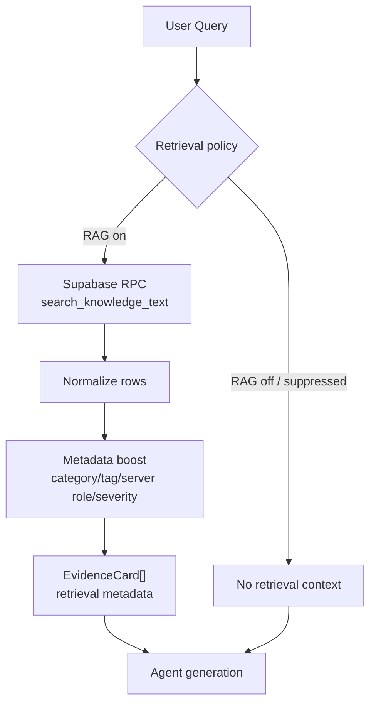

# Knowledge Retrieval Lite Architecture

> OpenManager 내부 지식 검색 및 EvidenceCard 아키텍처 레퍼런스
> Owner: platform-architecture
> Status: Active
> Doc type: Reference
> Last reviewed: 2026-04-26
> Canonical: docs/reference/architecture/ai/rag-knowledge-engine.md
> Tags: ai,rag,knowledge-engine,architecture
>
> **v1.3.0** | Updated 2026-04-26
>
> 검색 증강 생성(RAG) 및 내부 지식 검색 아키텍처 상세 문서입니다.

**관련 문서**: [AI Engine Architecture](./ai-engine-architecture.md)

---

## Overview

OpenManager AI의 RAG(Retrieval-Augmented Generation) 시스템은 **Knowledge Retrieval Lite** 기반입니다. 목적은 운영 매뉴얼, 사용 가이드, 서버 역할/토폴로지, 장애 이력, 장애 대응 절차를 LLM 컨텍스트에 주입하는 것입니다.

현재 런타임은 무료 티어와 Cloud Run request path 제약을 우선합니다. 따라서 RAG 내부에서 외부 embedding, graph expansion, query-expansion LLM, reranking LLM, 자동 web-search fallback을 호출하지 않습니다. 외부 웹 검색은 별도 `searchWeb` 도구와 quota 정책으로 분리합니다.

즉, retrieval 단계는 deterministic search/metadata boost이고, LLM은 최종 agent 답변 생성 단계에서 `EvidenceCard[]`를 참고할 때만 사용됩니다.

## RAG Corpus Governance (2026-02-23)

`knowledge_base` 운영 품질을 유지하기 위한 문서 수/길이 제약입니다. 기준은 `cloud-run/ai-engine/src/lib/rag-doc-policy.ts`를 SSOT로 사용합니다.

### 현재 규모 (실측, 정리 후)

| 지표 | 값 |
|------|---:|
| 총 문서 수 | 49 |
| 타깃 길이(280~520자) | 48 |
| 타깃 미달(<280자) | 0 |
| 하드 제한 초과(>600자) | 1 |
| command 카테고리 | 18 (36.73%) |
| auto_generated | 0 |

### 운영 제약 (권장/하드)

| 규칙 | 기준 |
|------|------|
| 총 문서 수 | 권장 `<=52`, 하드 `<=60` |
| 문서 길이 | 권장 `280~520자`, 하드 `<=600자` |
| 타깃 미달 비율 | `<=15%` |
| 하드 초과 비율 | `<=8%` |
| command 비중 | `<=38%` |
| auto_generated 문서 | `<=1` |
| placeholder 제목(예: `제목`) | `0` 유지 |

### 카테고리 목표 범위

| 카테고리 | 목표 범위 |
|----------|-----------|
| command | 18~24 |
| incident | 8~12 |
| best_practice | 8~12 |
| troubleshooting | 8~12 |
| architecture | 2~4 |
| security | 1~2 |

### 큐레이션 우선순위

1. `auto_generated` 중 placeholder 제목/내용 문서 우선 삭제 또는 재생성
2. `below_target` 문서(특히 130~220자대 seed_script)를 주제별로 병합 또는 확장
3. `over_limit` 장문 문서는 2~3개 문서로 분할해 검색 정밀도 개선
4. `command` 과다 시 Windows 전용/저빈도 명령부터 축소 검토

### Best Practice Reference

- Azure AI Search의 RAG 가이드: 인덱싱/청킹/관련성 튜닝을 검색 품질 핵심 요소로 명시  
  https://learn.microsoft.com/en-us/azure/search/retrieval-augmented-generation-overview
- Azure의 청킹 전략 가이드: 의미 단위 청킹과 파이프라인 단순화를 권장  
  https://learn.microsoft.com/en-us/azure/search/vector-search-how-to-chunk-documents
- Google Vertex AI RAG Engine: 검색 품질을 위한 인덱싱/임베딩/구조화 워크플로 강조  
  https://cloud.google.com/vertex-ai/generative-ai/docs/rag-overview

위 외부 가이드는 방향성 근거이며, OpenManager의 최종 기준값은 deterministic test, `supabase:rag:smoke`, production telemetry로 주기 재보정합니다.

### Key Technologies

| 기술 | 역할 | 구현체 |
|------|------|--------|
| **Retrieval Policy** | RAG on/off, feature 상태, suppressed reason 결정 | `retrieval-contract.ts`, supervisor/orchestrator routing |
| **BM25 Text Search** | 내부 지식 키워드 검색 | Supabase RPC `search_knowledge_text` |
| **Metadata Boost** | 서버 역할, AZ, severity, category, tag 기반 재정렬 | `knowledge-retrieval-lite.ts` |
| **EvidenceCard** | frontend/backend 공통 evidence 계약 | `retrieval-contract.ts` |
| **Legacy Boundary** | `/api/ai/graphrag/*`, `useGraphRAG` 호환 경계 | `legacy-contracts.ts`, `routes/graphrag.ts` |

---

## Architecture

### Retrieval Pipeline



### ASCII Fallback

```
User Query
     │
     ▼
┌────────────────────┐
│ Retrieval policy   │
│ enableRAG / tool   │
│ budget / category  │
└─────────┬──────────┘
          │ RAG on
          ▼
┌─────────────────────────────────────────────┐
│ Supabase search_knowledge_text RPC          │
│ PostgreSQL full-text/BM25-style ranking     │
└─────────┬───────────────────────────────────┘
          ▼
┌─────────────────────────────────────────────┐
│ Metadata boost                              │
│ category, tags, server role, severity       │
└─────────┬───────────────────────────────────┘
          ▼
┌─────────────────────────────────────────────┐
│ EvidenceCard[] + retrieval metadata         │
│ used / suppressed / unavailable / count     │
└─────────┬───────────────────────────────────┘
          ▼
    Agent context
```

> Source of truth (2026-04-26): `cloud-run/ai-engine/src/lib/knowledge-retrieval-lite.ts`, `cloud-run/ai-engine/src/lib/retrieval-contract.ts`, `cloud-run/ai-engine/src/tools-ai-sdk/reporter-tools/knowledge-search-tool.ts`, `cloud-run/ai-engine/src/lib/legacy-contracts.ts`, `cloud-run/ai-engine/src/lib/rag-doc-policy.ts`.

### Data Flow

1. **Retrieval Decision**: `enableRAG`, active tool allowlist, query intent, feature budget으로 retrieval 실행 여부를 결정
2. **Text Retrieval**: `search_knowledge_text` RPC로 내부 지식 문서 검색
3. **Metadata Boost**: category/tag/server role/severity/runbook metadata로 evidence 순서 보정
4. **Evidence Contract**: `EvidenceCard[]`와 `RetrievalMetadata`를 backend response와 frontend state에 보존
5. **Agent Context Injection**: 허용된 에이전트가 evidence를 참고하되, evidence가 없거나 unavailable이면 명시 metadata를 반환

---

## Components

### 1. Retrieval Contract (`retrieval-contract.ts`)

frontend/backend가 공유하는 evidence 계약입니다.

| 필드 | 역할 |
|------|------|
| `EvidenceCard` | title, content, category, score, source metadata를 가진 evidence 단위 |
| `RetrievalMetadata` | `enabled`, `used`, `mode`, `suppressedReason`, `evidenceCount`, `webUsed` 상태 |
| `RetrievalMode` | 기본값은 `lite`; legacy graph mode는 active runtime이 아님 |

### 2. Knowledge Retrieval Lite (`knowledge-retrieval-lite.ts`)

Supabase RPC `search_knowledge_text` 결과를 받아 category/tag/server metadata로 재정렬합니다.

| 단계 | 설명 |
|------|------|
| Query normalize | 빈 문자열/과도한 길이를 방어하고 검색어를 정규화 |
| Text search | `search_knowledge_text` RPC 호출 |
| Metadata boost | 운영 도메인 metadata가 query/context와 맞으면 score 보정 |
| Result cap | evidence budget에 맞춰 상위 결과만 반환 |
| Unavailable fallback | Supabase/RPC 오류 시 `retrievalUsed=false`, `suppressedReason=unavailable`로 명시 |

### 3. Tool Adapter (`knowledge-search-tool.ts`)

`searchKnowledgeBase` 이름은 frontend/tool-call 호환성을 위해 유지합니다. 내부 구현은 Lite retrieval만 호출합니다.

```typescript
// 개념 흐름
async execute({ query, category }) {
  const evidence = await retrieveKnowledgeEvidence({ query, category });
  return {
    evidenceCards: evidence.cards,
    metadata: evidence.metadata,
  };
}
```

Legacy boolean input인 `useGraphRAG`, `fastMode`, `includeWebSearch`는 호환 입력으로만 유지됩니다. Lite retrieval에서는 graph traversal이나 web fallback을 호출하지 않습니다.

### 4. Legacy Boundary (`legacy-contracts.ts`)

Graph runtime 제거 후에도 기존 client가 갑자기 404를 받지 않도록 명시적인 410 경계를 유지합니다.

| Legacy surface | 현재 동작 | Replacement |
|----------------|-----------|-------------|
| `POST /api/ai/graphrag/extract` | 410 Gone | `searchKnowledgeBase` |
| `GET /api/ai/graphrag/stats` | 410 Gone | Knowledge Retrieval Lite telemetry |
| `GET /api/ai/graphrag/related/:nodeId` | 410 Gone | `searchKnowledgeBase` |
| `searchKnowledgeBase.useGraphRAG` | compat-only input | Knowledge Retrieval Lite |

---

## Integration Point

### reporter-tools / agent runtime

```typescript
if (enableRAG && activeTools.includes('searchKnowledgeBase')) {
  toolChoice = shouldForceKnowledgeLookup(query)
    ? { type: 'tool', toolName: 'searchKnowledgeBase' }
    : 'auto';
}
```

에이전트는 `agent-runtime-policy.ts`의 tool allowlist와 evidence budget을 따릅니다. Vision path는 RAG와 결합하지 않고 Gemini/OpenRouter path를 유지합니다.

---

## Data Schema

### `knowledge_base`

지식 원문 및 검색 metadata 저장

```sql
CREATE TABLE knowledge_base (
  id uuid PRIMARY KEY DEFAULT gen_random_uuid(),
  title text NOT NULL,
  content text NOT NULL,
  metadata jsonb DEFAULT '{}',
  search_vector tsvector,
  category text,
  tags text[],
  created_at timestamptz DEFAULT now()
);

CREATE INDEX idx_kb_search_vector ON knowledge_base
  USING gin (search_vector);
```

### `search_knowledge_text`

```sql
SELECT * FROM search_knowledge_text(
  p_query := 'Redis 메모리 부족',
  p_category := 'runbook',
  p_limit := 5
);
```

`knowledge_relationships` 및 pgvector 관련 migration은 historical schema로 남을 수 있지만, 현재 Knowledge Retrieval Lite request path의 필수 dependency가 아닙니다.

---

## Performance Characteristics

| 단계 | 예상 지연 | 비고 |
|------|:--------:|------|
| Retrieval policy | <10ms | request-local 결정 |
| Text search RPC | ~50-150ms | Supabase 상태에 의존 |
| Metadata boost | <10ms | in-process 계산 |
| Evidence mapping | <10ms | `EvidenceCard[]` 변환 |
| **총합** | ~70-200ms | 외부 LLM/embedding 호출 없음 |

---

## Version History

| 버전 | 날짜 | 변경 내용 |
|------|------|----------|
| v1.3.0 | 2026-04-26 | Knowledge Retrieval Lite 기준으로 legacy graph runtime, external embedding, query-expansion/rerank/web fallback 설명 제거 |
| v1.2.0 | 2026-02-23 | RAG corpus 운영 제약(문서 수/길이/카테고리 비중) 및 Best Practice 참조 추가 |
| v1.1.0 | 2026-01-26 | query expansion, reranking, web augmentation 상세 추가 |
| v1.0.0 | 2026-01-26 | 초기 문서 작성 |
