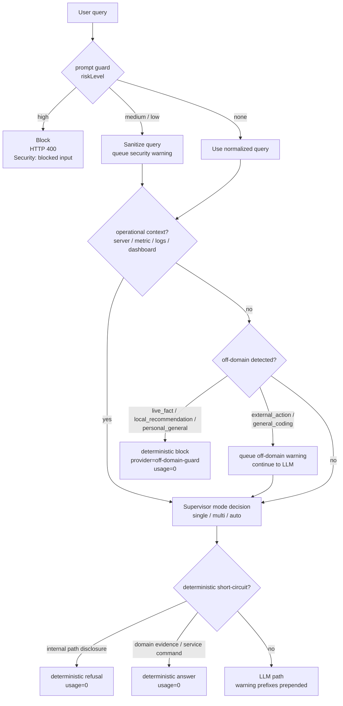

# AI 요청 가드 정책

> Cloud Run AI request guard의 차단, 경고, 위임 정책
> Owner: platform-architecture
> Status: Active
> Doc type: Reference
> Last reviewed: 2026-06-04
> Canonical: docs/reference/architecture/ai/request-guard-policy.md
> Tags: ai,architecture,guard,security,off-domain

---

## 목적

이 문서는 AI Assistant request path에서 prompt injection과 off-domain 입력을 어떻게 처리하는지 정리합니다. 정책의 목적은 `high` 위험 입력과 실시간 외부 사실처럼 정확히 처리할 수 없는 범위를 차단하고, 초안 작성이나 일반 기술 질문처럼 best-effort가 가능한 범위는 사용자에게 경고를 보여준 뒤 LLM이 한계를 설명하며 답하도록 위임하는 것입니다.

구현 기준 파일:

| 영역 | 파일 |
|------|------|
| Prompt guard | `cloud-run/ai-engine/src/lib/prompt-guard.ts` |
| Stream route guard 적용 | `cloud-run/ai-engine/src/routes/supervisor.ts` |
| Off-domain block/warn policy | `cloud-run/ai-engine/src/lib/off-domain-guard.ts` |
| Stream block/warn handling | `cloud-run/ai-engine/src/services/ai-sdk/supervisor-stream.ts` |
| Non-stream block/warn handling | `cloud-run/ai-engine/src/services/ai-sdk/supervisor-single-agent.ts` |
| Vercel stream output filter | `src/app/api/ai/supervisor/stream/v2/route.ts` |

## 결정 트리

## 런타임 계약

| 조건 | 처리 | 사용자 응답 |
|------|------|-------------|
| Prompt injection `high` | HTTP 400 차단 | `Security: blocked input` |
| Prompt injection `medium` / `low` | sanitize 후 계속 진행 | 보안 경고 1줄 prepend |
| Off-domain `live_fact`, `local_recommendation`, `personal_general` | deterministic block | 외부 조회/제품 범위 한계와 OpenManager 지원 범위 안내, usage 0 |
| Off-domain `external_action`, `general_coding` | 계속 진행 | LLM 응답 뒤 off-domain 경고 suffix |
| Off-domain이지만 운영 컨텍스트 있음 | 정상 라우팅 | 경고 없음 |
| Internal implementation path disclosure | deterministic refusal | usage 0 |
| Domain evidence read-only answer / service command | deterministic answer | usage 0 |

경고 문구는 metadata-only 계약이 아니라 assistant 응답 본문 또는 SSE `text_delta`에 삽입됩니다. 현재 frontend는 별도 warning banner를 요구하지 않습니다.

## 보안/비용 균형

- `high` risk는 무료 tier나 UX보다 안전을 우선해 차단합니다.
- `medium`/`low`는 false positive 가능성이 있으므로 sanitize + warning으로 처리하고, 모델 호출은 계속 허용합니다.
- off-domain은 범주별로 나눕니다. 실시간 외부 사실, 장소 추천, 개인 일반 질문은 정확성과 제품 범위 문제로 deterministic 차단하고, 외부 액션 초안이나 일반 코딩 질문은 경고 후 best-effort로 위임합니다.
- deterministic refusal, off-domain block, domain evidence, service command는 LLM 호출 없이 종료해 비용과 지연을 줄입니다.
- Vercel stream output filter는 응답 단계에서 XSS와 시스템 프롬프트 유출 패턴을 한 번 더 제거합니다.
