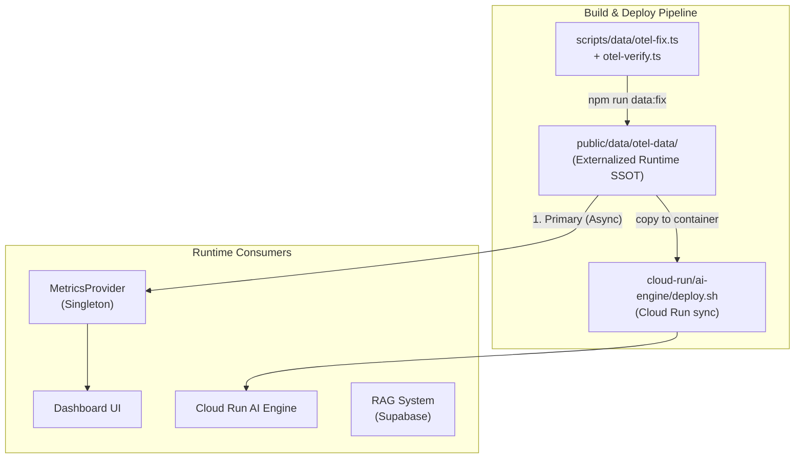

# 서버 데이터 아키텍처 가이드

> Owner: platform-data
> Status: Active Canonical
> Doc type: Explanation
> Last reviewed: 2026-02-17
> Canonical: docs/reference/architecture/data/data-architecture.md
> Tags: data,architecture,otel,prometheus

**최종 업데이트**: 2026-02-17
**프로젝트 버전**: v8.0.0

---

## 🎯 설계 의도: Zero-Internal-Traffic Strategy

### 왜 이 아키텍처인가?

AI/ML 서비스가 단순히 API를 호출하는 비효율적인 구조를 탈피하고, 각 서비스의 특성에 맞는 **최적의 데이터 접근 경로**를 구축했습니다.

- **Vercel API**: 오직 **외부 클라이언트(User Interface)**의 요청만 처리
- **Internal Services**: API를 거치지 않고 **Direct Access (File/DB/Memory)** 사용

### 🚀 Optimized Data Flow

| Service | Data Source | Access Method |
|---------|-------------|---------------|
| **OTel Dataset** | `public/data/otel-data/*` | Externalized SSOT |
| **Dashboard UI** | `MetricsProvider` → `public/data/otel-data/*` | **Async Fetch** (Bundle Opt) |
| **AI Engine** | `cloud-run/ai-engine/data/otel-data/*` | **Async FS Load** |
| **RAG System** | Supabase `server_logs` | DB Query |

---

## 🏛️ SSOT (Single Source of Truth) 아키텍처

### 데이터 흐름 (2-Tier Priority)

#### Mermaid Diagram



#### ASCII Fallback

```
┌────────────────────────────────────────────┐
│  public/data/otel-data/                    │  ← 1. Primary Runtime SSOT
│  (OTel-native hourly/resource/timeseries)  │
└───────────────────────┬────────────────────┘
                        │ async load (fetch/fs)
                        ▼
┌────────────────────────────────────────────┐
│  src/data/otel-data/index.ts              │  ← OTel loader (async)
└────────────────────────────────────────────┘
```

> **Note**: 이전 3-Tier의 `fixed-24h-metrics.ts` (Last Resort)는 v8.0.0에서 제거되었습니다. 현재는 `MetricsProvider.ensureDataLoaded()`를 통해 비동기 로딩을 선행하고, 실패 시 빈 값 반환 + 재시도를 수행합니다.

### 통합 기준 (2026-02-14)

기존 파이프라인 단독 문서의 운영 내용을 본 문서로 통합했습니다.
중복 보관본은 정리 정책에 따라 삭제하여, 본 문서를 단일 기준 문서로 유지합니다.

### 데이터 경계 (중요)

- `public/data/otel-data/*`는 **실서버 scrape 결과가 아닌 synthetic OTel 원본 데이터(SSOT)**입니다.
- `src/data/otel-data/index.ts`는 런타임 비동기 로더(fetch/fs)입니다.
- `cloud-run/ai-engine/data/otel-processed/*`는 Cloud Run 하위 호환 fallback 경로입니다.
- 런타임에서 외부 Prometheus/OTLP/Loki 수집 엔드포인트를 통해 적재하지 않습니다.

전환 관점의 상세 기준은 아래 문서를 참고합니다.

- [OTel Data Architecture](./otel-data-architecture.md)

### 동기화 명령어

```bash
# SSOT OTel 데이터 정합성 보정
npm run data:fix

# 구조/값 무결성 검증
npm run data:verify

# 런타임 로딩 기준 경로:
#   - public/data/otel-data/hourly/hour-XX.json (24개)
#   - public/data/otel-data/resource-catalog.json / timeseries.json
```

---

## 🖥️ 서버 구성 (15대 - OnPrem DC1)

### 서버 목록

| 유형 | ID | 이름 | 위치 |
|------|-----|------|------|
| **Web** | `web-nginx-dc1-01` | Nginx Web Server 01 | OnPrem-DC1-AZ1 |
| **Web** | `web-nginx-dc1-02` | Nginx Web Server 02 | OnPrem-DC1-AZ2 |
| **Web** | `web-nginx-dc1-03` | Nginx Web Server 03 | OnPrem-DC1-AZ3 |
| **API** | `api-was-dc1-01` | WAS API Server 01 | OnPrem-DC1-AZ1 |
| **API** | `api-was-dc1-02` | WAS API Server 02 | OnPrem-DC1-AZ2 |
| **API** | `api-was-dc1-03` | WAS API Server 03 | OnPrem-DC1-AZ3 |
| **DB** | `db-mysql-dc1-primary` | MySQL Primary | OnPrem-DC1-AZ1 |
| **DB** | `db-mysql-dc1-replica` | MySQL Replica | OnPrem-DC1-AZ2 |
| **DB** | `db-mysql-dc1-backup` | MySQL Backup | OnPrem-DC1-AZ3 |
| **Cache** | `cache-redis-dc1-01` | Redis Cache 01 | OnPrem-DC1-AZ1 |
| **Cache** | `cache-redis-dc1-02` | Redis Cache 02 | OnPrem-DC1-AZ2 |
| **Storage** | `storage-nfs-dc1-01` | NFS Storage | OnPrem-DC1-AZ1 |
| **Storage** | `storage-s3gw-dc1-01` | S3 Gateway Backup | OnPrem-DC1-AZ3 |
| **LB** | `lb-haproxy-dc1-01` | HAProxy LB 01 | OnPrem-DC1-AZ1 |
| **LB** | `lb-haproxy-dc1-02` | HAProxy LB 02 | OnPrem-DC1-AZ3 |

### 서버 ID 명명 규칙

```
{type}-{software}-{site}-{number}

예시:
  web-nginx-dc1-01
  │    │     │   └─ 서버 번호
  │    │     └───── 사이트 코드 (dc1=온프레미스 단일 사이트)
  │    └─────────── 소프트웨어 (nginx, mysql, redis 등)
  └──────────────── 타입 (web, api, db, cache, storage, lb)
```

---

## 🔴 장애 시나리오 (5개)

| 시간 | 시나리오 | 영향 서버 | 상태 |
|------|---------|----------|------|
| **02시** | DB 자동 백업 - 디스크 I/O 과부하 | `db-mysql-dc1-primary`, `storage-nfs-dc1-01` | Warning |
| **03시** | DB 슬로우 쿼리 누적 - 성능 저하 | `db-mysql-dc1-primary` | Critical |
| **07시** | 네트워크 패킷 손실 - LB 과부하 | `lb-haproxy-dc1-01`, `api-was-dc1-01/02` | Critical |
| **12시** | Redis 캐시 메모리 누수 - OOM 직전 | `cache-redis-dc1-01`, `cache-redis-dc1-02` | Critical |
| **21시** | API 요청 폭증 - CPU 과부하 | `api-was-dc1-01/02`, `web-nginx-dc1-01/02` | Critical |

---

## 📁 데이터 파일 구조

### Active Files (삭제 금지)

| 파일 경로 | 용도 | 수정 가능 |
|-----------|------|----------|
| `public/data/otel-data/*` | **Primary Runtime SSOT** | ❌ 데이터셋 직접 수정 지양 |
| `src/data/otel-data/index.ts` | OTel JSON 비동기 로더(fetch/fs) | ✅ 로딩 로직 |
| `src/services/metrics/MetricsProvider.ts` | **데이터 접근 Singleton** | ✅ 핵심 로직 |
| `scripts/data/otel-fix.ts` / `scripts/data/otel-verify.ts` | 데이터 보정/검증 스크립트 | ✅ 수정 가능 |
| `cloud-run/ai-engine/data/otel-data/*` | AI Engine용 OTel 데이터 | ❌ 배포 동기화 대상 |

### 파일 크기

```
public/data/otel-data/hourly/
├── hour-00.json ~ hour-23.json
├── 총 24개 파일
└── (timeseries/resource-catalog와 함께 SSOT 구성)
```

---

## 📝 새로운 기능 추가 시 체크리스트

### 서버 추가/수정 시

- [ ] **1단계**: `src/config/server-registry.ts` / `src/config/server-services-map.ts` 서버 메타데이터 수정
- [ ] **2단계**: `npm run data:fix` 실행
- [ ] **3단계**: `npm run data:verify` 실행
- [ ] **4단계**: `npm run data:precomputed:build` 후 Dashboard/AI Engine 조회 확인

### 장애 시나리오 추가/수정 시

- [ ] **1단계**: `src/__mocks__/data/data/scenarios/*` 또는 OTel 데이터셋 내 시나리오 값 수정
- [ ] **2단계**: `npm run data:verify` 실행
- [ ] **3단계**: `npm run data:precomputed:build` 실행 후 Git 커밋

---

## 🎯 핵심 원칙

### ❌ 금지 사항

```typescript
// ❌ 절대 금지: 실시간 랜덤 생성 (비결정론적)
const randomMetric = Math.random() * 100;

// ❌ 절대 금지: OTel JSON 직접 임의 수정
// 항상 데이터 파이프라인(npm run data:fix / npm run data:verify) 기준으로 관리
```

### ✅ 올바른 방법

```typescript
// ✅ Dashboard: MetricsProvider singleton 사용
import { MetricsProvider } from '@/services/metrics/MetricsProvider';
const provider = MetricsProvider.getInstance();
await provider.ensureDataLoaded();
const metrics = provider.getAllServerMetrics();

// ✅ AI Engine: JSON 파일 로드 (Tiered Access)
// otel-data (1순위) → otel-processed (호환 폴백)
const hourlyData = JSON.parse(
  await fs.readFile('data/otel-data/hourly/hour-12.json', 'utf-8')
);
```

---

## 📖 관련 문서

- **데이터 접근 SSOT**: `src/services/metrics/MetricsProvider.ts`
- **데이터 보정/검증 스크립트**: `scripts/data/otel-fix.ts`, `scripts/data/otel-verify.ts`
- **OTel 파이프라인**: `docs/reference/architecture/data/otel-data-architecture.md`
- **시뮬레이션 가이드**: `docs/guides/simulation.md`
