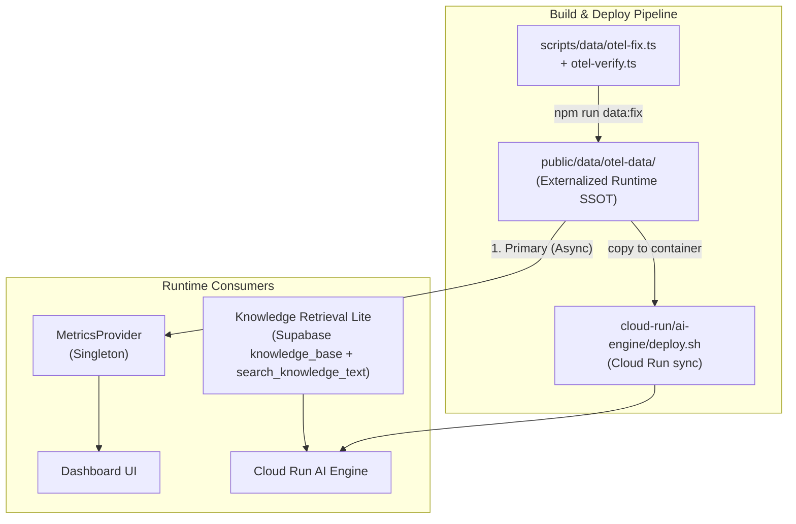

# 서버 데이터 아키텍처 가이드

> Owner: platform-data
> Status: Active Supporting
> Doc type: Explanation
> Last reviewed: 2026-05-16
> Canonical: docs/reference/architecture/data/otel-data-architecture.md
> Tags: data,architecture,otel,prometheus

**최종 업데이트**: 2026-05-16
**프로젝트 버전**: v8.11.156

> **현재 SSOT**: 서버 인벤토리, OTel 파일 구조, AI/Dashboard 소비 경계는 [OTel Data Architecture](./otel-data-architecture.md)를 기준으로 합니다. 이 문서는 zero-internal-traffic 전략과 데이터 접근 배경을 설명하는 supporting 문서입니다.

---

## 🎯 설계 의도: Zero-Internal-Traffic Strategy

### 왜 이 아키텍처인가?

AI/ML 서비스가 단순히 API를 호출하는 비효율적인 구조를 탈피하고, 각 서비스의 특성에 맞는 **최적의 데이터 접근 경로**를 구축했습니다.

- **Vercel API**: 오직 **외부 클라이언트(User Interface)**의 요청만 처리
- **Internal Services**: API를 거치지 않고 **Direct Access (File/DB/Memory)** 사용

### 🚀 Optimized Data Flow

| Service | Data Source | Access Method |
|---------|-------------|---------------|
| **OTel Dataset** | `public/data/otel-data/*` | Externalized SSOT |
| **Dashboard UI** | `MetricsProvider` → `public/data/otel-data/*` | **Async Fetch** (Bundle Opt) |
| **AI Engine** | `cloud-run/ai-engine/data/otel-data/*` | **Async FS Load** |
| **Knowledge Retrieval Lite** | Supabase `knowledge_base` + `search_knowledge_text` RPC | Postgres FTS + metadata boost |

---

## 🏛️ SSOT (Single Source of Truth) 아키텍처

### 데이터 흐름 (2-Tier Priority)

#### Mermaid Diagram


```mermaid
graph TD
    subgraph BuildTime["Build & Deploy Pipeline"]
        Script["scripts/data/otel-fix.ts<br/>+ otel-verify.ts"]
        OTelData["public/data/otel-data/<br/>(Externalized Runtime SSOT)"]
        Deploy["cloud-run/ai-engine/deploy.sh<br/>(Cloud Run sync)"]
        Script -->|"npm run data:fix"| OTelData
        OTelData -->|"copy to container"| Deploy
    end

    subgraph Runtime["Runtime Consumers"]
        MP["MetricsProvider<br/>(Singleton)"]
        Dashboard["Dashboard UI"]
        AIEngine["Cloud Run AI Engine"]
        KRL["Knowledge Retrieval Lite<br/>(Supabase knowledge_base + search_knowledge_text)"]
    end

    OTelData -->|"1. Primary (Async)"| MP
    MP --> Dashboard
    Deploy --> AIEngine
    KRL --> AIEngine
```

### 상태 판정 규칙 (Priority-based)

시스템은 `src/config/rules/system-rules.json`에 정의된 우선순위에 따라 서버 상태를 결정합니다:
1. **P0 (`offline`)**: CPU, Memory, Disk 메트릭이 모두 0인 경우
2. **P1 (`critical`)**: CPU와 Memory가 동시에 심각(critical) 수준인 경우
3. **P2 (`critical`)**: 어떤 지표라도 심각 수준에 도달한 경우
4. **P3 (`warning`)**: 2개 이상의 지표가 경고(warning) 수준인 경우
5. **P4 (`warning`)**: 어떤 지표라도 경고 수준인 경우
6. **P99 (`online`)**: 모든 지표가 경고 수준 미만인 경우

> **평균 계산 규칙**: `offline` 서버는 시스템 평균(CPU/Memory/Disk/Network) 계산에서 제외합니다.

#### ASCII Fallback

```
┌────────────────────────────────────────────┐
│  public/data/otel-data/                    │  ← 1. Primary Runtime SSOT
│  (OTel-native hourly/resource/timeseries)  │
└───────────────────────┬────────────────────┘
                        │ async load (fetch/fs)
                        ▼
┌────────────────────────────────────────────┐
│  src/data/otel-data/index.ts              │  ← OTel loader (async)
└────────────────────────────────────────────┘
```

> Source of truth (2026-04-25): `public/data/otel-data/*`, `src/data/otel-data/index.ts`, `src/services/metrics/MetricsProvider.ts`, `scripts/data/otel-fix.ts`, `scripts/data/otel-verify.ts`.

> **Note**: 이전 3-Tier의 `fixed-24h-metrics.ts` (Last Resort)는 v8.0.0에서 제거되었습니다. 현재는 `MetricsProvider.ensureDataLoaded()`를 통해 비동기 로딩을 선행하고, 실패 시 빈 값 반환 + 재시도를 수행합니다.

### 통합 기준 (2026-02-14)

기존 파이프라인 단독 문서의 운영 내용을 본 문서로 통합했습니다.
중복 보관본은 정리 정책에 따라 삭제하여, 본 문서를 단일 기준 문서로 유지합니다.

### 데이터 경계 (중요)

- `public/data/otel-data/*`는 **실서버 scrape 결과가 아닌 synthetic OTel 원본 데이터(SSOT)**입니다.
- `src/data/otel-data/index.ts`는 런타임 비동기 로더(fetch/fs)입니다.
- `cloud-run/ai-engine/data/otel-processed/*`는 Cloud Run 하위 호환 fallback 경로입니다.
- 런타임에서 외부 Prometheus/OTLP/Loki 수집 엔드포인트를 통해 적재하지 않습니다.

전환 관점의 상세 기준은 아래 문서를 참고합니다.

- [OTel Data Architecture](./otel-data-architecture.md)

### 동기화 명령어

```bash
# SSOT OTel 데이터 정합성 보정
npm run data:fix

# 구조/값 무결성 검증
npm run data:verify

# 런타임 로딩 기준 경로:
#   - public/data/otel-data/hourly/hour-XX.json (24개)
#   - public/data/otel-data/resource-catalog.json / timeseries.json
```

---

## 🖥️ Current Topology Note (18대 - OnPrem DC1)

현재 synthetic topology는 18대이며, 최신 서버 목록과 스펙은 [OTel Data Architecture §18대 서버 인벤토리](./otel-data-architecture.md#18대-서버-인벤토리)를 기준으로 합니다.

이 문서는 데이터 접근 전략을 설명하는 supporting 문서이므로 서버 인벤토리를 중복 관리하지 않습니다. 과거 15대 구성은 초기 설계 배경일 뿐이며, 현재 Dashboard/AI/Topology 기준으로 사용하지 않습니다.

### 현재 계층 요약

| Tier | Count | Notes |
|------|------:|------|
| Load Balancer | 3 | HAProxy, AZ1/AZ2/AZ3 분산 |
| Web | 3 | Nginx web tier |
| API | 3 | WAS/API application tier |
| DB | 3 | MySQL primary/replica/backup |
| Cache | 3 | Redis cache tier |
| Storage | 3 | NFS 2대 + S3 gateway 1대 |

15대에서 18대로 늘어난 핵심 차이는 AZ별 capacity node 보강입니다. 이 변경으로 Dashboard는 `18개 서버 중 1-15번째 표시`처럼 페이지 단위 렌더링을 수행하고, AI Engine은 18대 전체 snapshot을 기준으로 요약/분석합니다.

### 서버 ID 명명 규칙

```
{type}-{software}-{site}-{number}

예시:
  web-nginx-dc1-01
  │    │     │   └─ 서버 번호
  │    │     └───── 사이트 코드 (dc1=온프레미스 단일 사이트)
  │    └─────────── 소프트웨어 (nginx, mysql, redis 등)
  └──────────────── 타입 (web, api, db, cache, storage, lb)
```

---

## 🔴 장애 시나리오 (5개)

| 시간 | 시나리오 | 영향 서버 | 상태 |
|------|---------|----------|------|
| **02시** | DB 자동 백업 - 디스크 I/O 과부하 | `db-mysql-dc1-primary`, `storage-nfs-dc1-01` | warning |
| **03시** | DB 슬로우 쿼리 누적 - 성능 저하 | `db-mysql-dc1-primary` | critical |
| **07시** | 네트워크 패킷 손실 - LB 과부하 | `lb-haproxy-dc1-01`, `api-was-dc1-01/02` | critical |
| **12시** | Redis 캐시 메모리 누수 - OOM 직전 | `cache-redis-dc1-01`, `cache-redis-dc1-02` | critical |
| **21시** | API 요청 폭증 - CPU 과부하 | `api-was-dc1-01/02`, `web-nginx-dc1-01/02` | critical |

---

## 📁 데이터 파일 구조

### Active Files (삭제 금지)

| 파일 경로 | 용도 | 수정 가능 |
|-----------|------|----------|
| `public/data/otel-data/*` | **Primary Runtime SSOT** | ❌ 데이터셋 직접 수정 지양 |
| `src/data/otel-data/index.ts` | OTel JSON 비동기 로더(fetch/fs) | ✅ 로딩 로직 |
| `src/services/metrics/MetricsProvider.ts` | **데이터 접근 Singleton** | ✅ 핵심 로직 |
| `scripts/data/otel-fix.ts` / `scripts/data/otel-verify.ts` | 데이터 보정/검증 스크립트 | ✅ 수정 가능 |
| `cloud-run/ai-engine/data/otel-data/*` | AI Engine용 OTel 데이터 | ❌ 배포 동기화 대상 |

### 파일 크기

```
public/data/otel-data/hourly/
├── hour-00.json ~ hour-23.json
├── 총 24개 파일
└── (timeseries/resource-catalog와 함께 SSOT 구성)
```

---

## 📝 새로운 기능 추가 시 체크리스트

### 서버 추가/수정 시

- [ ] **1단계**: `src/config/server-registry.ts` / `src/config/server-services-map.ts` 서버 메타데이터 수정
- [ ] **2단계**: `npm run data:fix` 실행
- [ ] **3단계**: `npm run data:verify` 실행
- [ ] **4단계**: `npm run data:precomputed:build` 후 Dashboard/AI Engine 조회 확인

### 장애 시나리오 추가/수정 시

- [ ] **1단계**: `src/__mocks__/data/data/scenarios/*` 또는 OTel 데이터셋 내 시나리오 값 수정
- [ ] **2단계**: `npm run data:verify` 실행
- [ ] **3단계**: `npm run data:precomputed:build` 실행 후 Git 커밋

---

## 🎯 핵심 원칙

### ❌ 금지 사항

```typescript
// ❌ 절대 금지: 실시간 랜덤 생성 (비결정론적)
const randomMetric = Math.random() * 100;

// ❌ 절대 금지: OTel JSON 직접 임의 수정
// 항상 데이터 파이프라인(npm run data:fix / npm run data:verify) 기준으로 관리
```

### ✅ 올바른 방법

```typescript
// ✅ Dashboard: MetricsProvider singleton 사용
import { MetricsProvider } from '@/services/metrics/MetricsProvider';
const provider = MetricsProvider.getInstance();
await provider.ensureDataLoaded();
const metrics = provider.getAllServerMetrics();

// ✅ AI Engine: JSON 파일 로드 (Tiered Access)
// otel-data (1순위) → otel-processed (호환 폴백)
const hourlyData = JSON.parse(
  await fs.readFile('data/otel-data/hourly/hour-12.json', 'utf-8')
);
```

---

## 데이터 일관성 계약

Dashboard/AI 응답 간 데이터 일관성 보장을 위한 설계 원칙입니다. 현재 기준 SSOT는 [OTel Data Architecture](./otel-data-architecture.md)입니다.

### 현재 일관성 계약

| 계약 | 현재 기준 |
|---|---|
| Runtime data SSOT | `public/data/otel-data/*` |
| 데이터셋 | 18대 서버, 24시간, 10분 슬롯, 144 slots/day |
| Dashboard consumer | `src/services/metrics/MetricsProvider.ts` |
| Cloud Run consumer | `cloud-run/ai-engine/src/data/precomputed-state.ts` + `MonitoringDataSource` |
| AI fact boundary | `MonitoringFactPack` deterministic severity/evidence refs |
| 기본 source mode | `replay-json` |
| 비목표 | runtime live Prometheus/OTLP/Loki 수집을 기본 경로로 추가하지 않음 |

### 일관성 규칙

1. **같은 원본을 본다** — Dashboard와 AI Engine은 모두 `public/data/otel-data`에서 파생된 데이터를 봅니다.
2. **같은 시점을 본다** — AI 응답과 Dashboard는 10분 슬롯 기준의 `queryAsOf`/slot metadata를 유지해야 합니다.
3. **상태 판정은 deterministic rule이 맡는다** — LLM이 metric severity를 독자 판단하지 않습니다. OTel loader와 Cloud Run fact pack이 담당합니다.
4. **증거를 남긴다** — AI 응답은 server id, metric value, source mode, evidence refs, provider/model metadata를 남깁니다.
5. **fallback은 값 조작이 아니다** — 동일 snapshot을 다른 경로로 읽는 보정이어야 합니다. 서버 수/metric severity를 임의 생성하지 않습니다.

### 하면 안 되는 것

- Dashboard는 OTel을 보고 AI는 별도 랜덤/Mock 데이터를 보게 만들지 않습니다.
- 서버 수, topology, metric threshold를 UI copy와 AI prompt에 하드코딩하지 않습니다.
- LLM에게 metric severity 판단 권한을 넘기지 않습니다.
- live Prometheus/OTLP/Loki 수집을 비용/계약 검토 없이 기본 runtime path로 켜지 않습니다.

---

## 관련 문서

- **데이터 접근 SSOT**: `src/services/metrics/MetricsProvider.ts`
- **데이터 보정/검증 스크립트**: `scripts/data/otel-fix.ts`, `scripts/data/otel-verify.ts`
- **OTel 파이프라인**: [OTel Data Architecture](./otel-data-architecture.md)
- **데이터 흐름**: [Data Flow](../../../architecture/04-data-flow.md)
