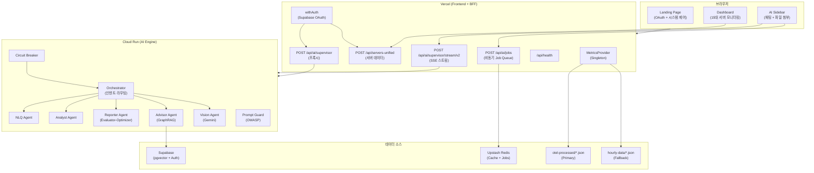

# OpenManager AI v8.0.0 - 통합 설계 요약

> Owner: platform-architecture
> Status: Active Canonical
> Doc type: Reference
> Last reviewed: 2026-02-14
> Canonical: docs/reference/architecture/design-summary.md
> Tags: architecture,design,summary,overview

---

## 시스템 전체 아키텍처

### Mermaid Diagram



### ASCII Fallback

```
┌─────────────────────────────────────────────────────────┐
│                    브라우저 (Client)                      │
│  Landing Page ─── Dashboard ─── AI Sidebar (채팅)        │
└───────────┬──────────┬──────────┬───────────────────────┘
            │          │          │
            ▼          ▼          ▼
┌─────────────────────────────────────────────────────────┐
│              Vercel (Frontend + BFF, 31 API Routes)      │
│                                                          │
│  /api/ai/supervisor ──────┐  /api/servers-unified        │
│  /api/ai/.../stream/v2 ───┤  /api/health                 │
│  /api/ai/jobs ────────────┤  /api/system                 │
│                            │                              │
│  MetricsProvider (Singleton) ◄── otel-processed (Primary) │
│  withAuth (Supabase OAuth)      hourly-data (Fallback)   │
└────────────────┬────────────────────────────────────────┘
                 │ Cloud Run Proxy
                 ▼
┌─────────────────────────────────────────────────────────┐
│              Cloud Run (AI Engine, 31K LOC)               │
│                                                          │
│  Prompt Guard ─► Orchestrator ─┬─► NLQ Agent             │
│  (OWASP)         (인텐트 분류)  ├─► Analyst Agent         │
│                                ├─► Reporter Agent         │
│  Circuit Breaker               │   (Evaluator-Optimizer)  │
│  (3-way Fallback)              ├─► Advisor Agent (RAG)    │
│                                └─► Vision Agent (Gemini)  │
│                                                          │
│  Models: Cerebras → Groq → Mistral (Fallback Chain)      │
└────────────────┬────────────────────────────────────────┘
                 │
                 ▼
┌─────────────────────────────────────────────────────────┐
│                    외부 서비스                             │
│  Supabase (PostgreSQL + pgvector + Auth)                  │
│  Upstash Redis (Cache + Job Queue + Stream State)        │
│  Langfuse (Observability, 10% 샘플링)                     │
│  Tavily (Web Search)                                     │
└─────────────────────────────────────────────────────────┘
```

---

## 핵심 설계 결정 6가지

| # | 결정 | 이유 | 참조 문서 |
|---|------|------|----------|
| 1 | **Hybrid Architecture** (Vercel + Cloud Run) | 경량 BFF(Vercel) + 무거운 AI(Cloud Run) 분리 | [system-architecture-current.md](system/system-architecture-current.md) |
| 2 | **Multi-Agent** (6 Agent + Orchestrator) | 단일 LLM 대비 역할 분리로 품질 향상 | [ai-engine-architecture.md](ai/ai-engine-architecture.md) |
| 3 | **2-Tier Data** (OTel Primary → hourly-data Fallback) | Synthetic 데이터의 결정론적 재현성 | [data-architecture.md](data/data-architecture.md) |
| 4 | **Quad-Provider** (Cerebras/Groq/Mistral/Gemini) | Rate Limit 분산 + 비용 $0 유지 | [ai-engine-architecture.md](ai/ai-engine-architecture.md) |
| 5 | **Evaluator-Optimizer** (Reporter Pipeline) | 보고서 품질 자동 검증 (0.75 임계값) | [monitoring-ml.md](ai/monitoring-ml.md) |
| 6 | **Hybrid RAG** (Vector 0.5 + BM25 0.3 + Graph 0.2) | 의미 + 키워드 + 관계 3중 검색 | [rag-knowledge-engine.md](ai/rag-knowledge-engine.md) |

---

## 기술 스택 요약

| 계층 | 기술 | 버전 |
|------|------|------|
| **Framework** | Next.js (App Router) | 16.1.3 |
| **UI** | React + Tailwind CSS + Radix UI | 19.2 / 4.1 |
| **State** | Zustand + React Query | 5.0 / 5.90 |
| **AI SDK** | Vercel AI SDK | 6.0 |
| **AI Runtime** | Hono (Cloud Run) | - |
| **DB** | Supabase PostgreSQL + pgvector | - |
| **Cache** | Upstash Redis | - |
| **Test** | Vitest + Playwright | 4.0 / 1.58 |
| **Lint** | Biome | 2.3 |
| **Deploy** | Vercel (Frontend) + Cloud Run (AI) | Pro / Free |

---

## 데이터 흐름 (요약)

```
[빌드 타임]
  scripts/data/sync-hourly-data.ts
    → src/data/hourly-data/*.json (24개, Prometheus)
    → src/data/otel-processed/*.json (24개, OTel)

[런타임 - Dashboard]
  MetricsProvider.getInstance()
    → otel-processed (1순위) → hourly-data (2순위)
    → API Routes → Dashboard UI

[런타임 - AI Chat]
  useHybridAIQuery (Streaming or Job Queue)
    → /api/ai/supervisor/stream/v2
    → Cloud Run (Orchestrator → Agent → Tools)
    → precomputed-state.ts (O(1) 조회)
    → SSE 응답 → AI Sidebar
```

---

## 관련 상세 문서

| 문서 | 내용 |
|------|------|
| [system-architecture-current.md](system/system-architecture-current.md) | 전체 시스템 아키텍처 |
| [ai-engine-architecture.md](ai/ai-engine-architecture.md) | AI Engine 상세 (에이전트, 도구, 모델) |
| [monitoring-ml.md](ai/monitoring-ml.md) | ML 파이프라인 (이상탐지, 트렌드) |
| [rag-knowledge-engine.md](ai/rag-knowledge-engine.md) | RAG 검색/재정렬/그래프 |
| [data-architecture.md](data/data-architecture.md) | 데이터 SSOT, 서버 구성, 파일 구조 |
| [frontend-backend-comparison.md](ai/frontend-backend-comparison.md) | Vercel ↔ Cloud Run 역할 분리 |
