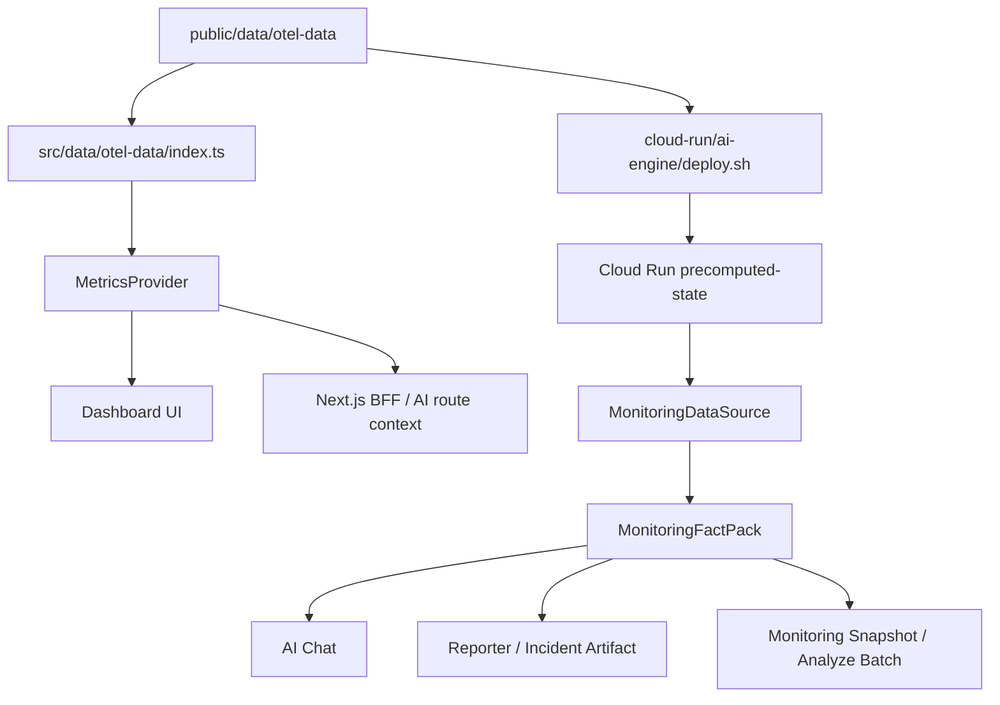

# Data Consistency Strategy

> 대시보드/AI 응답 간 데이터 일관성 보장을 위한 supporting 설계 전략
> Owner: platform-architecture
> Status: Active Supporting
> Doc type: Explanation
> Last reviewed: 2026-05-05
> Canonical: docs/reference/architecture/data/otel-data-architecture.md
> Tags: architecture,consistency,data,design,otel
>
> **프로젝트 버전**: v8.11.97 | **최종 업데이트**: 2026-05-05

## 목적

이 문서는 "대시보드가 보여주는 서버 상태"와 "AI가 답변하는 서버 상태"가 서로 다른 값으로 보이는 문제를 막기 위한 설계 원칙을 설명합니다.

현재 기준 SSOT는 [OTel Data Architecture](../data/otel-data-architecture.md)입니다. 이 문서는 과거 `/api/metrics/current` 중심 설계가 아니라, 현재 구현된 synthetic OTel dataset, `MetricsProvider`, Cloud Run `MonitoringDataSource`, `MonitoringFactPack` 경계를 기준으로 설명합니다.

## 현재 일관성 계약

| 계약 | 현재 기준 |
|---|---|
| Runtime data SSOT | `public/data/otel-data/*` |
| 데이터셋 | 18대 서버, 24시간, 10분 슬롯, 144 slots/day |
| Dashboard consumer | `src/services/metrics/MetricsProvider.ts` |
| Cloud Run consumer | `cloud-run/ai-engine/src/data/precomputed-state.ts` + `MonitoringDataSource` |
| AI fact boundary | `MonitoringFactPack` deterministic severity/evidence refs |
| 기본 source mode | `replay-json` |
| 비목표 | runtime live Prometheus/OTLP/Loki 수집을 기본 경로로 추가하지 않음 |

## 데이터 흐름

## 일관성 규칙

### 1. 같은 원본을 본다

Dashboard와 AI Engine은 모두 `public/data/otel-data`에서 파생된 데이터를 봅니다. Vercel은 비동기 loader/fetch 경로로 읽고, Cloud Run은 배포 시 복사된 `otel-data`를 우선 읽습니다.

### 2. 같은 시점을 본다

AI 응답과 Dashboard는 10분 슬롯 기준의 `queryAsOf`/slot metadata를 유지해야 합니다. "현재"라는 표현은 실행 시각의 랜덤 계산이 아니라, 현재 슬롯의 synthetic snapshot을 뜻합니다.

### 3. 상태 판정은 deterministic rule이 맡는다

LLM이 CPU/MEM/Disk 수치를 보고 독자적으로 `warning`/`critical`을 판단하지 않습니다. 상태 판정은 OTel loader와 Cloud Run fact pack의 deterministic rule이 담당하고, LLM은 설명과 표현만 담당합니다.

### 4. 증거를 남긴다

AI 응답은 가능하면 server id, metric value, source mode, evidence refs, provider/model metadata를 남깁니다. QA는 문장 품질보다 실제 근거가 Dashboard와 같은 데이터 슬롯에서 왔는지를 우선 확인합니다.

### 5. fallback은 값 조작이 아니다

fallback은 동일 snapshot을 다른 경로로 읽는 보정이어야 합니다. live backend 실패, Cloud Run cold-start, provider 실패가 발생해도 서버 수/metric severity를 임의 생성하지 않습니다.

## 검증 기준

| 변경 유형 | 확인 |
|---|---|
| OTel 데이터셋/서버 인벤토리 변경 | `npm run data:verify`, Dashboard/AI 18대 snapshot 확인 |
| Cloud Run precomputed state 변경 | `npm run data:precomputed:build`, AI Engine targeted tests |
| API/AI 계약 변경 | `npm run test:contract`, 관련 route tests |
| Dashboard/AI parity 이슈 | Vercel QA evidence에 Dashboard snapshot과 AI 응답을 함께 기록 |
| 문서 변경 | [OTel Data Architecture](../data/otel-data-architecture.md), [Data Flow](../../../architecture/04-data-flow.md), [API Endpoints](../../api/endpoints.md) 동시 확인 |

## 하면 안 되는 것

- Dashboard는 OTel을 보고 AI는 별도 랜덤/Mock 데이터를 보게 만들지 않습니다.
- 서버 수, topology, metric threshold를 UI copy와 AI prompt에 하드코딩하지 않습니다.
- LLM에게 metric severity 판단 권한을 넘기지 않습니다.
- live Prometheus/OTLP/Loki 수집을 비용/계약 검토 없이 기본 runtime path로 켜지 않습니다.
- `/api/metrics/current` 같은 과거 설계명을 현재 route처럼 문서화하지 않습니다.

## 관련 문서

- [OTel Data Architecture](../data/otel-data-architecture.md)
- [Data Architecture](../data/data-architecture.md)
- [Data Flow](../../../architecture/04-data-flow.md)
- [Monitoring Data Design](../../../design/03-monitoring-data-design.md)
- [API Endpoints](../../api/endpoints.md)
