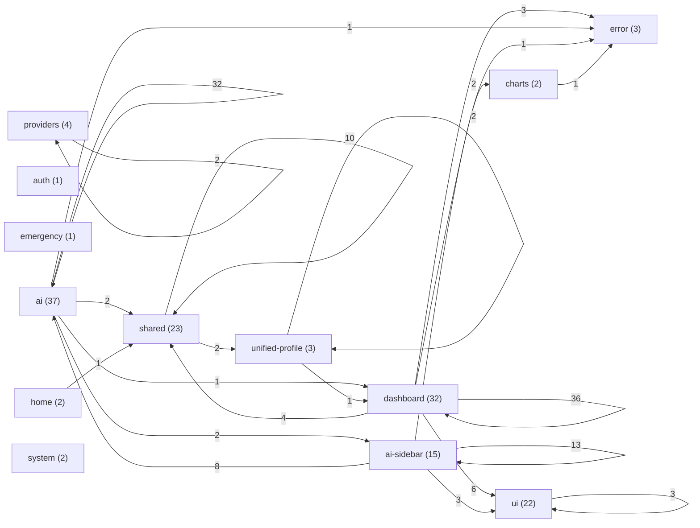

# Frontend Component Dependency Map

> src/components 중심의 정적 import 관계를 요약한 의존도 맵
> Owner: platform-architecture
> Status: Active
> Doc type: Reference
> Last reviewed: 2026-04-09
> Canonical: docs/reference/architecture/system/component-dependency-map.md
> Tags: architecture,frontend,components,dependency-map
>
> Auto-generated: 2026-04-09 (KST)
> Generation command: `npm run docs:components:map`

## Decision

- 문서 카테고리는 재편하지 않고 기존 `docs/reference/architecture/system`에 **추가**했습니다.
- 이유: 기존 IA를 보존하면서도 의존도 맵을 운영 문서로 바로 연결할 수 있기 때문입니다.

## Scope

- 대상 노드: `src/components/**/*.tsx` (단, `*.test.tsx`, `*.stories.tsx` 제외)
- 대상 엣지: 정적 `import`/`export ... from` 중 내부 컴포넌트로 해석되는 참조
- 제외: 런타임 동적 import, Next route(`src/app`) 전용 컴포넌트, 외부 패키지 의존성

## Inventory Coverage

| Inventory Slice | Count |
| --- | --- |
| Shared component graph scope (`src/components/**/*.tsx`) | 147 |
| Route-local components excluded from graph (`src/app/**/components/**/*.tsx`) | 7 |
| Total TSX component inventory | 154 |

## App Route-Local Component Distribution

| App Area | Node Count |
| --- | --- |
| main | 5 |
| system-boot | 2 |

Route-local component files:

- `main/components/DashboardSection`
- `main/components/GuestRestrictionModal`
- `main/components/LoginPrompt`
- `main/components/MainPageErrorBoundary`
- `main/components/SystemStartSection`
- `system-boot/components/BootProgressBar`
- `system-boot/components/SmoothLoadingSpinner`

## Snapshot Metrics

| Metric | Value |
| --- | --- |
| Component source lines | 29357 |
| Component nodes | 147 |
| Component edges | 136 |
| Graph density | 0.63% |
| Alias edges (`@/components/*`) | 38 |
| Relative edges (`./`, `../`) | 98 |
| Isolated components | 30 |
| SCC cycle groups | 0 |
| Largest cycle size | 0 |

## Domain-Level Mermaid



## Domain Node Distribution

| Domain | Node Count |
| --- | --- |
| ai | 37 |
| dashboard | 32 |
| shared | 23 |
| ui | 22 |
| ai-sidebar | 15 |
| providers | 4 |
| error | 3 |
| unified-profile | 3 |
| charts | 2 |
| home | 2 |
| system | 2 |
| auth | 1 |
| emergency | 1 |

## Top Domain Edges (Top 28)

| From | To | Edge Count |
| --- | --- | --- |
| dashboard | dashboard | 36 |
| ai | ai | 32 |
| ai-sidebar | ai-sidebar | 13 |
| shared | shared | 10 |
| ai-sidebar | ai | 8 |
| dashboard | ui | 6 |
| dashboard | shared | 4 |
| ai-sidebar | ui | 3 |
| dashboard | error | 3 |
| ui | ui | 3 |
| ai | ai-sidebar | 2 |
| ai | shared | 2 |
| dashboard | charts | 2 |
| providers | providers | 2 |
| shared | unified-profile | 2 |
| unified-profile | unified-profile | 2 |
| ai | dashboard | 1 |
| ai | error | 1 |
| ai-sidebar | error | 1 |
| charts | error | 1 |
| home | shared | 1 |
| unified-profile | dashboard | 1 |

## Top Component Hubs by In-Degree (Top 12)

| Component | In-Degree |
| --- | --- |
| ui/dialog | 5 |
| ai/analysis/constants | 4 |
| ai/AIAssistantIconPanel | 3 |
| dashboard/EnhancedServerModal.components | 3 |
| dashboard/shared/StatCell | 3 |
| error/ServerCardErrorBoundary | 3 |
| ai-sidebar/EnhancedAIChat | 2 |
| ai/AgentHandoffBadge | 2 |
| ai/AIContentArea | 2 |
| ai/AnalysisBasisBadge | 2 |
| ai/MarkdownRenderer | 2 |
| ai/MessageActions | 2 |

## Top Component Hubs by Out-Degree (Top 12)

| Component | Out-Degree |
| --- | --- |
| ai-sidebar/EnhancedAIChat | 9 |
| ai/AIWorkspace | 9 |
| ai-sidebar/AISidebarV4 | 7 |
| dashboard/EnhancedServerModal | 7 |
| dashboard/DashboardRoutedContent | 6 |
| dashboard/ServerDetailView | 6 |
| ai/AIWorkspaceMessage | 5 |
| shared/FeatureCardModal | 5 |
| ai-sidebar/SidebarMessage | 4 |
| ai/analysis/ServerResultCard | 4 |
| dashboard/DashboardHeader | 4 |
| ai/AnalysisBasisBadge | 3 |

## Cycle Risk (SCC Top 10)

- No strongly connected component cycle groups detected.

## ASCII Quick View

```text
[Top Outgoing Dependency Samples]
ai-sidebar/EnhancedAIChat -> ai/AgentHandoffBadge, ai/AgentStatusIndicator, ai-sidebar/ChatInputArea, ai-sidebar/ChatMessageList, ai-sidebar/ClarificationDialog, ai-sidebar/chat/ColdStartErrorBanner
ai/AIWorkspace -> ai-sidebar/EnhancedAIChat, error/AIErrorBoundary, dashboard/RealTimeDisplay, shared/OpenManagerLogo, shared/UnifiedProfileHeader, ai/AIAssistantIconPanel
ai-sidebar/AISidebarV4 -> ai/AIAssistantIconPanel, ai/AIContentArea, error/AIErrorBoundary, ai-sidebar/AISidebarHeader, ai-sidebar/EnhancedAIChat, ai-sidebar/ResizeHandle
dashboard/EnhancedServerModal -> dashboard/EnhancedServerModal.LogsTab, dashboard/EnhancedServerModal.MetricsTab, dashboard/EnhancedServerModal.NetworkTab, dashboard/EnhancedServerModal.OverviewTab, dashboard/EnhancedServerModal.ProcessesTab, dashboard/ServerModalHeader
dashboard/DashboardRoutedContent -> dashboard/ActiveAlertsModal, dashboard/alert-history/AlertHistoryModal, dashboard/log-explorer/LogExplorerModal, dashboard/ServerDashboard, dashboard/ServerDetailView, dashboard/TopologyModal
dashboard/ServerDetailView -> dashboard/EnhancedServerModal.LogsTab, dashboard/EnhancedServerModal.MetricsTab, dashboard/EnhancedServerModal.NetworkTab, dashboard/EnhancedServerModal.OverviewTab, dashboard/EnhancedServerModal.ProcessesTab, dashboard/ServerModalTabNav
ai/AIWorkspaceMessage -> ai/AnalysisBasisBadge, ai/MarkdownRenderer, ai/MessageActions, ai/ThinkingProcessVisualizer, ai/TypewriterMarkdown
shared/FeatureCardModal -> shared/FeatureCardModalHeader, shared/ReactFlowDiagram, shared/TechStackSection, shared/VibeCiCdSection, shared/VibeHistorySection
```

## Update Rule

1. 구조 변경 후 `npm run docs:components:map` 실행
2. 문서 변경과 코드 변경을 같은 PR에서 검토
3. 큰 구조 변경 시 `Top Domain Edges`와 `Hub` 변화를 릴리스 노트에 요약
