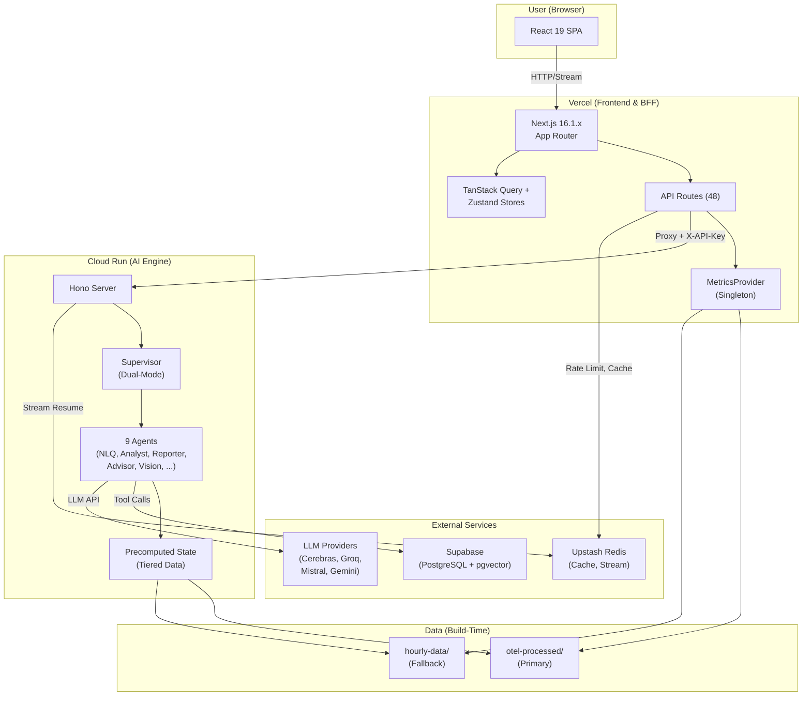

# System Architecture (Current v8)

> Last verified against code: 2026-02-13
> Status: Active Canonical
> Doc type: Explanation

---

## 1. Overview

**OpenManager AI v8.0.0**은 AI Native Server Monitoring Platform으로, Vercel(Frontend/BFF)과 Cloud Run(AI Engine)의 **Hybrid Architecture**로 운영됩니다.

| 항목 | 수치 |
|------|------|
| UI 컴포넌트 | ~100+ `.tsx` |
| Custom Hooks | ~35+ |
| API Routes | 48 (`src/app/api/**/route.ts`) |
| AI Agents | 9 (5 외부 라우팅 + 4 내부) |
| Zustand Stores | 4 |
| 모니터링 서버 | 15 (Korean DC, synthetic) |
| 데이터 소스 | 2-Tier (OTel Processed + hourly-data) |

---

## 2. System Topology

### Mermaid Diagram



### ASCII Fallback

```
┌──────────────────────────────────────────────────────────────────────┐
│  User (Browser)                                                       │
│  React 19 + TanStack Query + Zustand                                 │
└────────────────────────────┬─────────────────────────────────────────┘
                             │ HTTP / UIMessageStream
                             ▼
┌──────────────────────────────────────────────────────────────────────┐
│  Vercel (Next.js 16.1.x, App Router)                                 │
│  ┌─────────────┐  ┌──────────────────┐  ┌─────────────────────────┐ │
│  │ API Routes   │  │ MetricsProvider  │  │ Auth (NextAuth/Supabase)│ │
│  │ (48 routes)  │  │ (OTel→hourly)    │  │ Rate Limiter, CSRF     │ │
│  └──────┬──────┘  └──────────────────┘  └─────────────────────────┘ │
└─────────┼────────────────────────────────────────────────────────────┘
          │ Proxy (X-API-Key)
          ▼
┌──────────────────────────────────────────────────────────────────────┐
│  Cloud Run (AI Engine, Node.js 24 + Hono)                            │
│  ┌──────────────┐  ┌───────────────────┐  ┌───────────────────────┐ │
│  │ Supervisor    │  │ 9 Agents          │  │ Circuit Breaker       │ │
│  │ (Dual-Mode)   │  │ NLQ/Analyst/...   │  │ Quota Tracker         │ │
│  └──────────────┘  └───────────────────┘  └───────────────────────┘ │
└──────────────────────────────────┬───────────────────────────────────┘
                                   │
          ┌────────────────────────┼────────────────────────┐
          ▼                        ▼                        ▼
   ┌──────────────┐      ┌──────────────┐       ┌──────────────────┐
   │ Supabase     │      │ Upstash Redis│       │ LLM Providers    │
   │ PostgreSQL   │      │ Cache/Stream │       │ Cerebras/Groq/   │
   │ + pgvector   │      │ Rate Limit   │       │ Mistral/Gemini   │
   └──────────────┘      └──────────────┘       └──────────────────┘
```

---

## 3. Request Lifecycle

### Flow 1: Dashboard View

```
1. User → /dashboard
2. src/app/dashboard/page.tsx → DashboardClient.tsx
3. useServerDashboard() → useServerQuery() → fetch /api/servers-unified
4. /api/servers-unified/route.ts → MetricsProvider.getInstance()
5. MetricsProvider:
   a. getKSTMinuteOfDay() → 현재 KST 10분 슬롯 계산
   b. loadOTelData(hour) → otel-processed (Primary)
   c. fallback → getBundledHourlyData(hour) (Secondary)
   d. extractMetricsFromStandard() → ApiServerMetrics[] 변환
6. Response → TanStack Query 캐시 → React 렌더링
```

**핵심 파일 경로**:
- `src/app/dashboard/DashboardClient.tsx`
- `src/hooks/useServerDashboard.ts` → `src/hooks/useServerQuery.ts`
- `src/app/api/servers-unified/route.ts`
- `src/services/metrics/MetricsProvider.ts`

### Flow 2: AI Chat

```
1. User → AI Sidebar → 질의 입력
2. src/components/ai-sidebar/EnhancedAIChat.tsx
3. useAIChatCore() → POST /api/ai/supervisor
4. /api/ai/supervisor/route.ts:
   a. Auth 검증 (NextAuth session)
   b. Prompt injection guard
   c. CLOUD_RUN_ENABLED 확인
   d. Proxy → Cloud Run (X-API-Key header)
5. Cloud Run:
   a. cloud-run/ai-engine/src/routes/supervisor.ts → 수신
   b. Supervisor: 질의 복잡도 판단 (Single vs Multi-agent)
   c. Orchestrator: intent 분류 → Agent handoff
   d. 선택된 Agent 실행 (NLQ/Analyst/Reporter/Advisor/Vision)
   e. Verifier: 응답 검증
6. UIMessageStream → Vercel Proxy → Browser
7. 스트리밍 응답 렌더링 (TypewriterMarkdown)
```

**핵심 파일 경로**:
- `src/hooks/ai/useAIChatCore.ts`
- `src/app/api/ai/supervisor/route.ts`
- `cloud-run/ai-engine/src/routes/supervisor.ts`
- `cloud-run/ai-engine/src/services/ai-sdk/supervisor.ts`
- `cloud-run/ai-engine/src/services/ai-sdk/agents/orchestrator.ts`

---

## 4. Data Flow Architecture

### 2-Tier Priority System

```
┌─────────────────────────────────┐
│  src/data/otel-processed/       │  ← 1. Primary (OTel Semantic Conv.)
│  (Build-time derived)           │
└────────────────┬────────────────┘
                 │ fallback
                 ▼
┌─────────────────────────────────┐
│  src/data/hourly-data/          │  ← 2. Fallback (Prometheus Format)
│  (SSOT, Bundle-included JSON)   │
└─────────────────────────────────┘
```

### Data Boundary

- `hourly-data/*.json`: AI가 사전 생성한 **synthetic 원본 데이터** (Prometheus 네이밍)
- `otel-processed/*`: hourly-data를 빌드 타임에 OTel 시맨틱으로 변환한 **derived 데이터**
- 런타임에서 외부 Prometheus/OTLP/Loki 수집 없음 (zero external scrape)
- 24시간 순환, 15서버, 10분 슬롯 (144 data points/server/day)

### Consumer Entrypoints

| 소비자 | 진입점 파일 | 데이터 경로 |
|--------|------------|------------|
| **Dashboard** | `src/services/metrics/MetricsProvider.ts` | otel-processed → hourly-data |
| **AI Chat (Vercel)** | `src/services/monitoring/MonitoringContext.ts` | MetricsProvider 동일 체인 |
| **AI Engine (Cloud Run)** | `cloud-run/ai-engine/src/data/precomputed-state.ts` | otel-processed → hourly-data |
| **24h Chart** | `src/hooks/useFixed24hMetrics.ts` → MetricsProvider | MetricsProvider 동일 체인 |
| **Alert System** | `src/services/monitoring/AlertManager.ts` | MetricsProvider 동일 체인 |
| **RAG (Supabase)** | `supabase/` (server_logs, embeddings) | DB Query |

### Build-Time Pipeline

```bash
npm run data:otel      # hourly-data → otel-processed 변환
npm run data:sync      # SSOT 데이터 동기화
npm run data:all       # data:sync + data:otel
```

---

## 5. AI Engine Summary

### Agent Architecture (9 Agents)

| Agent | Provider (Primary) | Role | 라우팅 |
|-------|-------------------|------|--------|
| **Orchestrator** | Cerebras llama-3.3-70b | Intent 분류, Agent 핸드오프 | 진입점 |
| **NLQ** | Cerebras | 서버 메트릭 조회 (단순+복합) | 외부 |
| **Analyst** | Groq llama-3.3-70b | 이상 감지, 추세 예측 | 외부 |
| **Reporter** | Groq | 장애 보고서, 타임라인 | 외부 |
| **Advisor** | Mistral small | 트러블슈팅, GraphRAG 검색 | 외부 |
| **Vision** | Gemini 2.5-flash-lite | 스크린샷/로그 분석, 웹 검색 | 외부 |
| **Evaluator** | Cerebras | 보고서 품질 평가 (내부) | 내부 |
| **Optimizer** | Mistral | 보고서 품질 개선 (내부) | 내부 |
| **Verifier** | Mistral | 응답 검증 | 내부 |

**Dual-Mode Strategy**: 단순 질의 → Single-agent (저지연), 복합 질의 → Multi-agent (전문 처리).

**상세 문서**: [AI Engine Architecture](../ai/ai-engine-architecture.md)

---

## 6. Resilience Patterns

### Circuit Breaker

```
CLOSED (정상) ──5회 실패──► OPEN (차단) ──30초──► HALF_OPEN (시험)
    ▲                                                  │
    └──────────────────── 2회 성공 ────────────────────┘
```

| 파라미터 | 값 |
|---------|-----|
| Failure Threshold | 5회 |
| Success Threshold | 2회 |
| Reset Timeout | 30초 |

### LLM Provider Fallback Chain

```
Cerebras (Primary, ~200ms)
    ↓ 실패 또는 quota 80%
Groq (Secondary)
    ↓ 실패 또는 quota 80%
Mistral (Tertiary)
    ↓ 모두 실패
Static Fallback Response
```

### Quota Tracker

| Threshold | 동작 |
|-----------|------|
| **80% (Preemptive)** | 다음 Provider로 선제 전환 |
| **100% (Hard Limit)** | 요청 즉시 거부 |

### Vercel-Side Protections

| 메커니즘 | 설명 |
|---------|------|
| Rate Limiter | Upstash Redis 기반 요청 제한 |
| Prompt Injection Guard | AI 입력 사전 검증 |
| Response Cache | 동일 질의 캐시 |
| Fallback Handler | Cloud Run 장애 시 로컬 처리 |
| CSRF Protection | `CSRFTokenProvider` 적용 |

---

## 7. Cache Layers

| Layer | 기술 | 위치 | TTL | 용도 |
|-------|------|------|-----|------|
| **L1: In-Memory** | MetricsProvider cache | Vercel Runtime | 동일 hour/minute | 메트릭 변환 재계산 방지 |
| **L2: Redis** | Upstash Redis | External | 다양 (10s~10m) | AI 응답 캐시, Rate Limit, Stream Resume |
| **L3: Client** | TanStack Query | Browser | staleTime 기반 | API 응답 캐시, 중복 요청 방지 |
| **L4: AI Engine** | DataCacheLayer | Cloud Run Memory | metrics 1m, RAG 5m, analysis 10m | 에이전트 데이터 접근 캐시 |

---

## 8. Deployment Topology

| 컴포넌트 | 플랫폼 | 플랜 | 비용 |
|---------|--------|------|------|
| **Frontend/BFF** | Vercel | Pro | ~$20/mo |
| **AI Engine** | Cloud Run (gen2) | Free Tier | $0 |
| **Database** | Supabase | Free Tier | $0 |
| **Cache** | Upstash Redis | Free Tier | $0 |
| **Domain** | Vercel | 포함 | - |

### Cloud Run Constraints

| 항목 | 값 |
|------|-----|
| vCPU | 1 |
| Memory | 512Mi |
| CPU Throttling | ON |
| Min Instances | 0 (Scale-to-Zero) |
| Docker Image | Alpine 3.21, Node 24, ~693MB |

### Vercel Constraints

| 항목 | 값 |
|------|-----|
| Build Machine | Standard ($0.014/min) |
| `maxDuration` | 10~60초 (엔드포인트별) |
| Fluid Compute | 활성화 |
| Turbopack | 빌드 시 사용 |

---

## 9. State Management

### Server State (TanStack Query)

모든 서버 데이터는 TanStack Query로 관리됩니다.

| Query Key | 소스 API | staleTime |
|-----------|---------|-----------|
| `servers-unified` | `/api/servers-unified` | 30초 |
| `server-detail` | `/api/servers/[id]` | 30초 |
| `monitoring-report` | `/api/monitoring/report` | 60초 |

### Client State (Zustand 4 Stores)

| Store | 파일 | 용도 |
|-------|------|------|
| `useAISidebarStore` | `src/stores/useAISidebarStore.ts` | AI 사이드바 열림/닫힘, 모드 |
| `useDashboardToggleStore` | `src/stores/useDashboardToggleStore.ts` | 대시보드 패널 토글 |
| `useUnifiedAdminStore` | `src/stores/useUnifiedAdminStore.ts` | 관리자 통합 상태 |
| `auth-store` | `src/stores/auth-store.ts` | 인증 상태 |

### AI Chat State

- localStorage 기반 대화 이력 (`src/hooks/ai/utils/chat-history-storage.ts`)
- Resumable Stream v2: Upstash Redis로 스트림 복구 (네트워크 단절 시)

---

## 10. Key File Reference

### Entrypoints

| 용도 | 파일 |
|------|------|
| App Layout | `src/app/layout.tsx` |
| Dashboard Page | `src/app/dashboard/page.tsx` → `DashboardClient.tsx` |
| Client Providers | `src/components/providers/ClientProviders.tsx` |
| AI Supervisor API | `src/app/api/ai/supervisor/route.ts` |
| AI Engine Entry | `cloud-run/ai-engine/src/server.ts` |

### Data Layer

| 용도 | 파일 |
|------|------|
| Metrics SSOT | `src/services/metrics/MetricsProvider.ts` |
| OTel Data (Primary) | `src/data/otel-processed/hourly/hour-XX.json` |
| Hourly Data (Fallback) | `src/data/hourly-data/hour-XX.json` (24개) |
| OTel 변환 스크립트 | `scripts/data/otel-precompute.ts` |
| Cloud Run Data | `cloud-run/ai-engine/src/data/precomputed-state.ts` |

### AI Layer

| 용도 | 파일 |
|------|------|
| AI Chat Hook | `src/hooks/ai/useAIChatCore.ts` |
| Supervisor (Cloud Run) | `cloud-run/ai-engine/src/services/ai-sdk/supervisor.ts` |
| Orchestrator | `cloud-run/ai-engine/src/services/ai-sdk/agents/orchestrator.ts` |
| Agent Factory | `cloud-run/ai-engine/src/services/ai-sdk/agents/agent-factory.ts` |
| Base Agent | `cloud-run/ai-engine/src/services/ai-sdk/agents/base-agent.ts` |

### Configuration

| 용도 | 파일 |
|------|------|
| System Rules | `src/config/rules/system-rules.json` |
| AI Registry | `config/ai/registry-core.yaml` |
| Next.js Config | `next.config.mjs` |
| TypeScript Config | `tsconfig.json` |

### Resilience

| 용도 | 파일 |
|------|------|
| Circuit Breaker | `cloud-run/ai-engine/src/services/resilience/circuit-breaker.ts` |
| Quota Tracker | `cloud-run/ai-engine/src/services/resilience/quota-tracker.ts` |
| Rate Limiter | `src/lib/security/rate-limiter.ts` |
| Error Boundary | `src/components/error/AIErrorBoundary.tsx` |

---

## 11. Related Documents

### AI

- [AI Engine Architecture](../ai/ai-engine-architecture.md) - Agent 상세, Provider 설정, Lifecycle

### Data

- [Data Architecture](../data/data-architecture.md) - 2-Tier 데이터 구조, 서버 구성
- [OTel Pipeline Audit](../data/otel-pipeline-audit.md) - Prometheus→OTel 변환, 소비자 매핑
- [Data Consistency](../design/consistency.md) - Dashboard-AI 데이터 일관성

### Infrastructure

- [Hybrid Split](../infrastructure/hybrid-split.md) - Vercel/Cloud Run 역할 분리, Request Flow
- [Deployment Rules](../../../../.claude/rules/deployment.md) - 배포 절차, Free Tier 가드레일

### Decisions

- [Folder Structure](../folder-structure.md) - 디렉토리 구조 현황

---

## Architecture Constraints

- 실제 운영 서버 대신 시뮬레이션/사전 계산 데이터 중심 설계
- OTel 데이터는 런타임 수집이 아닌 synthetic Prometheus 데이터의 빌드 타임 파생(derived) 포맷
- 무료 티어 운영 비용을 고려한 캐시/프록시/폴백 전략 우선
- Cloud Run 장애 시에도 UI는 graceful degradation 유지

## Non-Goals

- 이 문서는 과거(v5~v7) 마이그레이션 내역을 다루지 않음
- 히스토리/회고는 `docs/analysis/`, `docs/reviews/`를 참고
