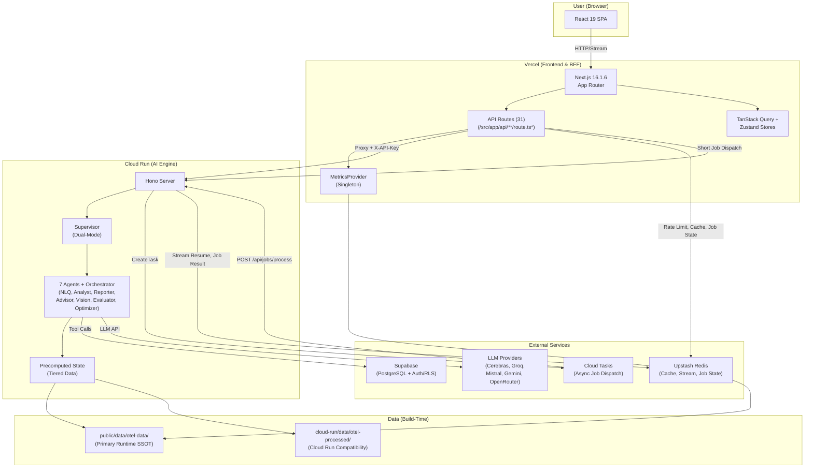

# System Architecture (Current v8)

> Vercel + Cloud Run 하이브리드 시스템 구조의 기준 문서
> Owner: platform-architecture
> Status: Active Canonical (hybrid-split.md 통합됨)
> Doc type: Explanation
> Last reviewed: 2026-05-02
> Canonical: docs/reference/architecture/system/system-architecture-current.md
> Tags: system,architecture,hybrid,cloud-run,vercel

---

## 1. Overview

**OpenManager AI v8.11.80 기준** AI Native Server Monitoring Platform으로, Vercel(Frontend/BFF)과 Cloud Run(AI Engine)의 **Hybrid Architecture**로 운영됩니다.

| 항목 | 수치 |
|------|------|
| React/TSX surface | 353 tracked `.tsx` files under `src/` |
| Custom Hooks | ~35+ |
| API Routes | 31 (`src/app/api/**/route.ts`, `route.tsx` 포함) |
| AI 실행 컴포넌트 | 8 (실행 에이전트 7 + Orchestrator 1) |
| Zustand Stores | 2 |
| 모니터링 서버 | 18 (role별 3대, AZ별 6대 synthetic topology) |
| 데이터 소스 | `public/data/otel-data` 비동기 로딩 우선 + Cloud Run 호환 폴백 (`otel-processed`) |

---

## 2. System Topology

### Mermaid Diagram


```mermaid
graph TB
    subgraph User["User (Browser)"]
        UI[React 19 SPA]
    end

    subgraph Vercel["Vercel (Frontend & BFF)"]
        NextJS["Next.js 16.1.6<br/>App Router"]
        API["API Routes (31)<br/>(/src/app/api/**/route.ts*)"]
        MP["MetricsProvider<br/>(Singleton)"]
        Providers["TanStack Query +<br/>Zustand Stores"]
    end

    subgraph CloudRun["Cloud Run (AI Engine)"]
        Hono["Hono Server"]
        Supervisor["Supervisor<br/>(Dual-Mode)"]
        Agents["7 Agents + Orchestrator<br/>(NLQ, Analyst, Reporter,<br/>Advisor, Vision, Evaluator, Optimizer)"]
        PreComp["Precomputed State<br/>(Tiered Data)"]
    end

    subgraph External["External Services"]
        Supabase["Supabase<br/>(PostgreSQL + Auth/RLS)"]
        Redis["Upstash Redis<br/>(Cache, Stream, Job State)"]
        CloudTasks["Cloud Tasks<br/>(Async Job Dispatch)"]
        LLM["LLM Providers<br/>(Cerebras, Groq,<br/>Mistral, Gemini, OpenRouter)"]
    end

    subgraph Data["Data (Build-Time)"]
        OTel["public/data/otel-data/<br/>(Primary Runtime SSOT)"]
        Compat["cloud-run/data/otel-processed/<br/>(Cloud Run Compatibility)"]
    end

    UI -->|HTTP/Stream| NextJS
    NextJS --> API
    API --> MP
    MP --> OTel
    API -->|Proxy + X-API-Key| Hono
    Hono --> Supervisor
    Supervisor --> Agents
    Agents --> PreComp
    PreComp --> OTel
    PreComp --> Compat
    Agents -->|Tool Calls| Supabase
    Agents -->|LLM API| LLM
    API -->|Rate Limit, Cache, Job State| Redis
    API -->|Short Job Dispatch| Hono
    Hono -->|CreateTask| CloudTasks
    CloudTasks -->|POST /api/jobs/process| Hono
    Hono -->|Stream Resume, Job Result| Redis
    NextJS --> Providers
```

### ASCII Fallback

```
┌──────────────────────────────────────────────────────────────────────┐
│  User (Browser)                                                       │
│  React 19 + TanStack Query + Zustand                                 │
└────────────────────────────┬─────────────────────────────────────────┘
                             │ HTTP / UIMessageStream
                             ▼
┌──────────────────────────────────────────────────────────────────────┐
│  Vercel (Next.js 16.1.6, App Router)                                  │
│  ┌─────────────┐  ┌──────────────────┐  ┌─────────────────────────┐ │
│  │ API Routes   │  │ MetricsProvider  │  │ Auth (NextAuth/Supabase)│ │
│  │ (29 routes)  │  │ (OTel→hourly)    │  │ Rate Limiter, CSRF     │ │
│  └──────┬──────┘  └──────────────────┘  └─────────────────────────┘ │
└─────────┼────────────────────────────────────────────────────────────┘
          │ Proxy (X-API-Key)
          ▼
┌──────────────────────────────────────────────────────────────────────┐
│  Cloud Run (AI Engine, Node.js 24 + Hono)                            │
│  ┌──────────────┐  ┌───────────────────┐  ┌───────────────────────┐ │
│  │ Supervisor    │  │ 7 Agents + Orch.  │  │ Circuit Breaker       │ │
│  │ (Dual-Mode)   │  │ NLQ/Analyst/...   │  │ Quota Tracker         │ │
│  └──────────────┘  └───────────────────┘  └───────────────────────┘ │
└──────────────────────────────────┬───────────────────────────────────┘
                                   │
          ┌────────────────────────┼────────────────────────┐
          ▼                        ▼                        ▼
   ┌──────────────┐      ┌──────────────┐       ┌──────────────────┐
   │ Supabase     │      │ Upstash Redis│       │ LLM Providers    │
   │ PostgreSQL   │      │ Cache/Stream │       │ Cerebras/Groq/   │
   │ + Auth/RLS   │      │ Job State    │       │ Mistral/Gemini   │
   └──────────────┘      └──────────────┘       └──────────────────┘
                                   ▲
                                   │ Cloud Tasks dispatches long jobs to
                                   │ Cloud Run /api/jobs/process
```

> Source of truth (2026-04-29): `src/app/api/**/route.ts(x)`, `src/app/api/ai/jobs/**`, `cloud-run/ai-engine/src/server.ts` `app.route('/api/...')`, `cloud-run/ai-engine/src/routes/jobs.ts`, `cloud-run/ai-engine/src/lib/cloud-tasks.ts`, `cloud-run/ai-engine/src/routes/*.ts`, `cloud-run/ai-engine/src/services/ai-sdk/agents/config/agent-configs.ts` (5 routing LLM agents + 2 internal deterministic Evaluator/Optimizer pipeline configs).

---

## 3. Request Lifecycle

### Flow 1: Dashboard View

```
1. User → /dashboard
2. src/app/dashboard/page.tsx → DashboardClient.tsx
3. useServerDashboard() → useServerQuery() → fetch /api/servers-unified
4. /api/servers-unified/route.ts → MetricsProvider.getInstance()
5. MetricsProvider:
   a. getKSTMinuteOfDay() → 현재 KST 10분 슬롯 계산
   b. ensureDataLoaded(hour) → public/data/otel-data 비동기 로딩(fetch/fs)
   c. 서버 메타/시계열 보조 조회 → resource-catalog, timeseries
   d. extractMetricsFromStandard() → ApiServerMetrics[] 변환
6. Response → TanStack Query 캐시 → React 렌더링
```

**핵심 파일 경로**:
- `src/app/dashboard/DashboardClient.tsx`
- `src/hooks/useServerDashboard.ts` → `src/hooks/useServerQuery.ts`
- `src/app/api/servers-unified/route.ts`
- `src/services/metrics/MetricsProvider.ts`

### Flow 2: AI Chat

```
1. User → AI Sidebar → 질의 입력
2. src/components/ai-sidebar/EnhancedAIChat.tsx
3. useHybridAIQuery() 기본 경로 → POST /api/ai/supervisor/stream/v2
4. /api/ai/supervisor/stream/v2/route.ts:
   a. Auth 검증 (NextAuth session)
   b. Prompt injection guard
   c. normalized message shaping + optional resumable stream 관리 (`AI_RESUMABLE_STREAMS_ENABLED=true`)
   d. Proxy → Cloud Run UIMessageStream v2 (X-API-Key header)
5. Cloud Run:
   a. cloud-run/ai-engine/src/routes/supervisor.ts → 수신
   b. Supervisor: 질의 복잡도 판단 (Single vs Multi-agent)
   c. Orchestrator: intent 분류 → Agent handoff
   d. 선택된 Agent 실행 (NLQ/Analyst/Reporter/Advisor/Vision)
   e. finalAnswer tool 종료 신호로 응답 완료
6. UIMessageStream → Vercel Proxy → Browser
7. 스트리밍 응답 렌더링 (TypewriterMarkdown)

> 참고: `/api/ai/supervisor`는 아직 삭제되지 않았지만, 현재는 local dev JSON fallback 및 plain/cache caller용 legacy proxy로 유지됩니다.
```

**핵심 파일 경로**:
- `src/hooks/ai/useHybridAIQuery.ts`
- `src/app/api/ai/supervisor/stream/v2/route.ts`
- `src/app/api/ai/supervisor/route.ts` (legacy fallback)
- `cloud-run/ai-engine/src/routes/supervisor.ts`
- `cloud-run/ai-engine/src/services/ai-sdk/supervisor.ts`
- `cloud-run/ai-engine/src/services/ai-sdk/agents/orchestrator.ts`

### Flow 2-A: Complex AI Job Queue

복합 질의나 `forceJobQueueKeywords`에 걸린 질의는 Vercel 함수가 AI 처리를 끝까지 기다리지 않고 Cloud Tasks dispatch 경로로 분리합니다.

```
1. User → AI Sidebar → 복합 질의 입력
2. useHybridAIQuery() → useAsyncAIQuery() → POST /api/ai/jobs
3. Vercel /api/ai/jobs:
   a. Redis에 job:{id}, job:progress:{id}, owner metadata 저장
   b. 즉시 201 + jobId 반환
   c. AI_JOB_TRIGGER_MODE=cloud-tasks이면 Cloud Run /api/jobs/dispatch를 짧게 호출
4. Cloud Run /api/jobs/dispatch:
   a. Cloud Tasks CreateTask 호출
   b. task target을 /api/jobs/process로 지정
5. Cloud Tasks → Cloud Run /api/jobs/process:
   a. 실제 장시간 AI 작업 실행
   b. 진행률과 최종 result/error를 Redis에 저장
6. Browser EventSource → Vercel /api/ai/jobs/{id}/stream:
   a. Vercel이 Redis job/result/progress를 폴링
   b. result/error SSE 이벤트로 브라우저에 전달
```

**역할 경계**:
- **Cloud Tasks**: worker HTTP 요청을 큐잉/전달/재시도/속도제어합니다. job 상태나 결과를 저장하지 않습니다.
- **Upstash Redis**: job 생성 상태, 진행률, 최종 답변, SSE polling 상태의 저장소입니다. 현재 async Job Queue에서 필수 의존성입니다.

**주기 실행 경계**:
- Cloud Tasks는 `/api/ai/jobs` 같은 사용자 요청에서 파생된 HTTP delivery 큐이며, Cloud Scheduler나 Cloud Run Jobs처럼 시간 기반으로 시작되는 Cron 실행기가 아닙니다.
- Vercel Cron은 `vercel.json`에 정의되어 있지 않고, frontend env는 `DISABLE_CRON_JOBS=true`, `DISABLE_BACKGROUND_JOBS=true`를 유지합니다.
- 2026-05-02 운영 점검 기준 Cloud Scheduler job, Cloud Run Job, Supabase `pg_cron`/`pg_net` 확장은 사용하지 않습니다.
- GitHub/GitLab에 schedule 정의나 rule은 남아 있지만 GitHub schedule은 `ENABLE_ACTIONS_SCHEDULES=true` opt-in guard가 필요하고, GitLab schedule은 Artifact Registry cleanup 상태 관측 job 외에 production write/backup 경로를 갖지 않습니다.

**핵심 파일 경로**:
- `src/app/api/ai/jobs/route.ts`
- `src/app/api/ai/jobs/[id]/stream/route.ts`
- `cloud-run/ai-engine/src/routes/jobs.ts`
- `cloud-run/ai-engine/src/lib/cloud-tasks.ts`
- `cloud-run/ai-engine/src/lib/job-notifier.ts`

---

## 4. Data Flow Architecture

### 2-Tier Priority System

```
┌─────────────────────────────────────────────────┐
│  public/data/otel-data/                        │  ← 1. Primary Runtime SSOT
│  (Vercel/Frontend async fetch/fs)              │
└──────────────────────────┬──────────────────────┘
                           │ compatibility fallback (Cloud Run only)
                           ▼
┌─────────────────────────────────────────────────┐
│  cloud-run/ai-engine/data/otel-processed/      │  ← 2. Legacy compatibility
│  (precomputed-state.ts fallback path)          │
└─────────────────────────────────────────────────┘
```

### Data Boundary

- `public/data/otel-data/*`: AI가 사전 생성한 **synthetic OTel-native 원본 데이터(SSOT)**
- `src/data/otel-data/index.ts`: 대시보드 런타임 비동기 로더(fetch/fs)
- `cloud-run/ai-engine/data/otel-processed/*`: Cloud Run 하위 호환 fallback 데이터
- 런타임에서 외부 Prometheus/OTLP/Loki 수집 없음 (zero external scrape)
- 24시간 순환, 15서버, 10분 슬롯 (144 data points/server/day)

### Consumer Entrypoints

| 소비자 | 진입점 파일 | 데이터 경로 |
|--------|------------|------------|
| **Dashboard** | `src/services/metrics/MetricsProvider.ts` | `public/data/otel-data` (Primary, async) |
| **AI Chat (Vercel)** | `src/services/monitoring/MonitoringContext.ts` | `otel-data` + MetricsProvider |
| **AI Engine (Cloud Run)** | `cloud-run/ai-engine/src/data/precomputed-state.ts` | `otel-data` → `otel-processed` fallback |
| **24h Chart** | `src/hooks/useServerMetrics.ts` → MetricsProvider | MetricsProvider 동일 체인 |
| **Alert System** | `src/services/monitoring/AlertManager.ts` | MetricsProvider 동일 체인 |
| **RAG (Supabase)** | `knowledge_base`, `search_knowledge_text` RPC | BM25 text query + metadata boost |

### Stateless Cloud Run 설계 원칙

Cloud Run AI Engine은 **Stateless** 설계를 따르며, 영속 데이터는 Supabase에 저장됩니다.
단, async Job Queue의 진행률/결과처럼 짧은 TTL의 실행 상태는 Redis에 저장하고, 운영 메트릭 스냅샷은 런타임에 컨테이너 번들 JSON(`otel-data` 우선, `otel-processed` 호환 폴백)을 사용합니다.

| 원칙 | 설명 |
|------|------|
| **Scale-to-Zero** | 컨테이너 종료 시 데이터 손실 없음 |
| **일관성** | 메트릭은 번들 JSON, 영속 데이터는 Supabase 기준으로 일관성 유지 |
| **비용 절감** | Cloud Run에 영속 스토리지 비용 없음 |

데이터 동기화: 런타임 SSOT는 `public/data/otel-data`이며, Cloud Run 배포 시 `deploy.sh`가 이를 컨테이너 `data/otel-data`로 복사합니다. Cloud Run은 `otel-processed` 호환 폴백도 유지합니다. 영속 데이터(RAG/피드백/히스토리)는 Supabase에서 조회합니다.

### Build-Time Pipeline

```bash
npm run data:fix               # OTel 데이터 정합성 보정
npm run data:verify            # OTel 데이터 무결성 검증
npm run data:precomputed:build # Cloud Run precomputed states 재생성
```

---

## 5. AI Engine Summary

### Agent Architecture (7 Agents + Orchestrator)

| Agent | Provider (Primary) | Role | 라우팅 |
|-------|-------------------|------|--------|
| **Orchestrator** | Groq primary (fallback: Cerebras `llama3.1-8b` → Mistral) | Intent 분류, Agent 핸드오프 | 진입점 |
| **NLQ** | Groq (`meta-llama/llama-4-scout-17b-16e-instruct`) | 서버 메트릭 조회 (단순+복합) | 외부 |
| **Analyst** | Cerebras `llama3.1-8b` when context permits (fallback: Groq → Mistral) | 이상 감지, 추세 예측 | 외부 |
| **Reporter** | Cerebras `llama3.1-8b` when context permits (fallback: Groq → Mistral) | 장애 보고서, 타임라인 | 외부 |
| **Advisor** | Groq primary (fallback: Cerebras → Mistral) | 트러블슈팅, 명령 추천, Knowledge Retrieval Lite 보강 | 외부 |
| **Vision** | Gemini 2.5 Flash-Lite (fallback: OpenRouter vision 모델) | 스크린샷/로그 분석, 웹 검색 | 외부 |
| **Evaluator** | Deterministic quality gate | 보고서 품질 평가 (내부) | 내부 |
| **Optimizer** | Deterministic rewrite stage | 보고서 품질 개선 (내부) | 내부 |

**Dual-Mode Strategy**: 단순 질의 → Single-agent (저지연), 복합 질의 → Multi-agent (전문 처리).

### TypeScript ML (AI Engine 내장)

AI Engine에 내장된 경량 ML 모듈로, LLM 호출 없이 수치 분석을 수행합니다.

| 기능 | 구현 | 설명 |
|------|------|------|
| **Anomaly Detection** | `SimpleAnomalyDetector.ts` | 6시간 이동 평균 + 2-sigma |
| **Trend Prediction** | `TrendPredictor.ts` | 선형 회귀 기반 추세 예측 |

> Note: Rust ML 서비스는 v5.84.0에서 제거되고, TypeScript 구현으로 대체됨.

**상세 문서**: [AI Engine Architecture](../ai/ai-engine-architecture.md)

---

## 6. Resilience Patterns

### Circuit Breaker

```
CLOSED (정상) ──5회 실패──► OPEN (차단) ──30초──► HALF_OPEN (시험)
    ▲                                                  │
    └──────────────────── 2회 성공 ────────────────────┘
```

| 파라미터 | 값 |
|---------|-----|
| Failure Threshold | 5회 |
| Success Threshold | 2회 |
| Reset Timeout | 30초 |

### LLM Provider Fallback Chain

```
Structured routing: Cerebras → Groq → Mistral
Group A tool loop (Supervisor/NLQ): Groq → Cerebras → Mistral
Group B tool loop (Analyst/Reporter/Advisor/Verifier): Cerebras → Groq → Mistral
Vision: Gemini Flash-Lite → OpenRouter
모두 실패 → Static Fallback Response
```

### Quota Tracker

| Threshold | 동작 | 비고 |
|-----------|------|------|
| **80% (Preemptive)** | 다음 Provider로 선제 전환 | 할당량 여유 확보 |
| **100% (Hard Limit)** | 요청 즉시 거부 | 과금 방지 |
| **Reset Period** | Daily/Monthly | 프로바이더별 상이 |

### Vercel-Side Protections

| 메커니즘 | 설명 |
|---------|------|
| Rate Limiter | Upstash Redis 기반 요청 제한 |
| Prompt Injection Guard | AI 입력 사전 검증 |
| Response Cache | 동일 질의 캐시 |
| Fallback Handler | Cloud Run 장애 시 로컬 처리 |
| CSRF Protection | `CSRFTokenProvider` 적용 |

---

## 7. Resumable Stream v2 (AI SDK v6)

네트워크 단절 시 스트림을 자동으로 복구하는 Upstash Redis 기반 Resumable Stream 패턴입니다.

### Flow

```
Client                     Vercel                     Cloud Run
  │  1. POST /stream/v2     │  2. Proxy + Redis Save    │
  │  ─────────────────────►  │  ──────────────────────►  │
  │                          │     + X-Stream-Id header  │
  │  [네트워크 단절]          │                          │
  │  ─────────────────────►  │                          │
  │                          │                          │
  │  3. GET /stream/v2?sessionId=xxx&skip=N             │
  │  ─────────────────────►  │  4. Redis에서 남은 chunk  │
  │                          │  ──────────────────────►  │
  │  5. 이어서 수신           │  ◄──────────────────────  │
  │  ◄───────────────────── │     (skip 이후 chunk)     │
```

### 주요 컴포넌트

| 컴포넌트 | 파일 | 역할 |
|---------|------|------|
| **POST Handler** | `stream/v2/route.ts` | 새 스트림 생성, Redis 저장 |
| **GET Handler** | `stream/v2/route.ts` | 스트림 재개 (skip 파라미터) |
| **Stream State** | `stream/v2/stream-state.ts` | Redis 세션-스트림 매핑 |
| **Upstash Context** | `stream/v2/upstash-resumable.ts` | Redis List 기반 chunk 저장 |

### Redis State 관리

| 항목 | 값 | 설명 |
|------|-----|------|
| **Stream TTL** | 10분 | Redis 자동 만료 |
| **Chunk Storage** | Redis List (RPUSH) | 순서 보장 |
| **Resume API** | GET + skip 파라미터 | 마지막 수신 chunk 이후부터 재개 |

---

## 8. Cache Layers

| Layer | 기술 | 위치 | TTL | 용도 |
|-------|------|------|-----|------|
| **L1: In-Memory** | MetricsProvider cache | Vercel Runtime | 동일 hour/minute | 메트릭 변환 재계산 방지 |
| **L2: Redis** | Upstash Redis | External | 다양 (10s~10m) | AI 응답 캐시, Rate Limit, Stream Resume |
| **L3: Client** | TanStack Query | Browser | staleTime 기반 | API 응답 캐시, 중복 요청 방지 |
| **L4: AI Engine** | DataCacheLayer | Cloud Run Memory | metrics 1m, RAG 5m, analysis 10m | 에이전트 데이터 접근 캐시 |

---

## 9. Deployment Topology

| 컴포넌트 | 플랫폼 | 플랜 | 비용 |
|---------|--------|------|------|
| **Frontend/BFF** | Vercel | Pro (허용된 유일한 유료 예외, Free 수준 사용량 유지) | $20/seat + usage |
| **AI Engine** | Cloud Run (gen2) | Free Tier | $0 |
| **Database** | Supabase | Free Tier | $0 |
| **Cache** | Upstash Redis | Free Tier | $0 |
| **Async Queue** | Cloud Tasks | Free Tier | $0 |
| **Domain** | Vercel | 포함 | - |

### Cloud Run Constraints

| 항목 | 값 |
|------|-----|
| vCPU | 1 |
| Memory | 512Mi |
| CPU Throttling | ON |
| Min Instances | 0 (Scale-to-Zero) |
| Docker Image | Alpine 3.21, Node 24, ~693MB |
| Warmup | `/warmup` 엔드포인트로 Cold Start 완화 |

### Vercel Constraints

| 항목 | 값 |
|------|-----|
| Build Machine | Standard ($0.014/min) |
| `maxDuration` | Legacy: Hobby 10s default/60s max, Pro 15s default/300s max |
| Fluid Compute | Hobby/Pro 기본 300s, Pro/Enterprise 최대 800s |
| Turbopack | 빌드 시 사용 |

Reference (checked: 2026-02-20):
- https://vercel.com/pricing
- https://vercel.com/docs/limits/overview

---

## 10. State Management

### Server State (TanStack Query)

모든 서버 데이터는 TanStack Query로 관리됩니다.

| Query Key | 소스 API | staleTime |
|-----------|---------|-----------|
| `servers-unified` | `/api/servers-unified` | 30초 |
| `server-detail` | `/api/servers/[id]` | 30초 |
| `monitoring-report` | `/api/monitoring/report` | 60초 |

### Client State (Zustand Stores)

| Store | 파일 | 용도 |
|-------|------|------|
| `useAISidebarStore` | `src/stores/useAISidebarStore.ts` | AI 사이드바 열림/닫힘, 모드 |
| `useUnifiedAdminStore` | `src/stores/useUnifiedAdminStore.ts` | 관리자 통합 상태 |

대시보드 토글과 인증 상태는 현재 별도 Zustand store 파일이 아니라 관련 hook/context와
서버 세션 경계에서 관리합니다. `src/stores/`에 OpenManager 전역 Zustand store로 남아
있는 파일은 위 2개가 기준입니다.

### AI Chat State

- localStorage 기반 대화 이력 (`src/hooks/ai/utils/chat-history-storage.ts`)
- Resumable Stream v2: Upstash Redis로 스트림 복구 (상세: [7. Resumable Stream v2](#7-resumable-stream-v2-ai-sdk-v6))

---

## 11. Key File Reference

### Entrypoints

| 용도 | 파일 |
|------|------|
| App Layout | `src/app/layout.tsx` |
| Dashboard Page | `src/app/dashboard/page.tsx` → `DashboardClient.tsx` |
| Client Providers | `src/components/providers/ClientProviders.tsx` |
| AI Supervisor API | `src/app/api/ai/supervisor/route.ts` |
| AI Engine Entry | `cloud-run/ai-engine/src/server.ts` |

### Data Layer

| 용도 | 파일 |
|------|------|
| Metrics SSOT | `src/services/metrics/MetricsProvider.ts` |
| OTel Data (Primary) | `public/data/otel-data/hourly/hour-XX.json` |
| OTel Resource/Timeseries | `public/data/otel-data/resource-catalog.json`, `public/data/otel-data/timeseries.json` |
| OTel Async Loader | `src/data/otel-data/index.ts` |
| Cloud Run Compatibility Fallback | `cloud-run/ai-engine/data/otel-processed/hourly/hour-XX.json` |
| OTel 품질/검증 스크립트 | `scripts/data/otel-fix.ts`, `scripts/data/otel-verify.ts` |
| Cloud Run Data | `cloud-run/ai-engine/src/data/precomputed-state.ts` |

### AI Layer

| 용도 | 파일 |
|------|------|
| AI Chat Hook | `src/hooks/ai/useAIChatCore.ts` |
| Supervisor (Cloud Run) | `cloud-run/ai-engine/src/services/ai-sdk/supervisor.ts` |
| Orchestrator | `cloud-run/ai-engine/src/services/ai-sdk/agents/orchestrator.ts` |
| Agent Factory | `cloud-run/ai-engine/src/services/ai-sdk/agents/agent-factory.ts` |
| Base Agent | `cloud-run/ai-engine/src/services/ai-sdk/agents/base-agent.ts` |

### Configuration

| 용도 | 파일 |
|------|------|
| System Rules | `src/config/rules/system-rules.json` |
| AI Registry | `config/ai/registry-core.yaml` |
| Next.js Config | `next.config.mjs` |
| TypeScript Config | `tsconfig.json` |

### Resilience

| 용도 | 파일 |
|------|------|
| Circuit Breaker | `cloud-run/ai-engine/src/services/resilience/circuit-breaker.ts` |
| Quota Tracker | `cloud-run/ai-engine/src/services/resilience/quota-tracker.ts` |
| Rate Limiter | `src/lib/security/rate-limiter.ts` |
| Error Boundary | `src/components/error/AIErrorBoundary.tsx` |

---

## 12. Related Documents

### AI

- [AI Engine Architecture](../ai/ai-engine-architecture.md) - Agent 상세, Provider 설정, Lifecycle

### Data

- [Data Architecture](../data/data-architecture.md) - 2-Tier 데이터 구조, 서버 구성
- [OTel Data Architecture](../data/otel-data-architecture.md) - Prometheus→OTel 변환, 소비자 매핑, 전환 준비
- [Data Consistency](../design/consistency.md) - Dashboard-AI 데이터 일관성

### Infrastructure

- [Deployment Rules](../../../../.claude/rules/deployment.md) - 배포 절차, Free Tier 가드레일

### Decisions

- [Folder Structure](../folder-structure.md) - 디렉토리 구조 현황

---

## Architecture Constraints

- 실제 운영 서버 대신 시뮬레이션/사전 계산 데이터 중심 설계
- OTel 데이터는 런타임 수집이 아닌 synthetic Prometheus 데이터의 빌드 타임 파생(derived) 포맷
- 무료 티어 운영 비용을 고려한 캐시/프록시/폴백 전략 우선
- Cloud Run 장애 시에도 UI는 graceful degradation 유지

## Non-Goals

- 이 문서는 과거(v5~v7) 마이그레이션 내역을 다루지 않음
- 히스토리/회고는 `docs/analysis/`, `docs/reviews/`를 참고
